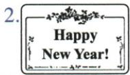
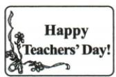
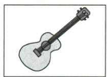
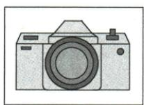
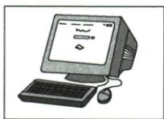

## 讲解

### 是什么

图像选项承载文字之外的地点、人物、行为或节日信息。先确认A/B/C各图实际内容及差别，再用题干和录音挑所问特征；图片标签、位置和字母须与原件逐一对应。

### 怎么来的

原句子图第1项分别是Post Office、Bookstore、Cinema，都是建筑但标牌功能不同；录音cinema只配C。第2项A新年、B教师节、C妇女节，都有祝福图案，真正差别为图中文字的节名，happy new year配A，不靠喜庆颜色选。

短对话图A吉他、B相机、C电脑。Henry想使用电脑，Lily在电脑画吉他；图像本身能区分物品，但需继续配动作关系，不能见guitar出现便选A。字母顺序与图像内容一起保持，处理扫描图时不能把先后图顺序调换而保留原答案。

有些图差别为形状、方向或人数，必须实际观察而非只信提取的文本占位符。本章所需14幅选项图均从实际载体取出、原尺寸保存、解码像素核对；二维码与装饰不是答案特征。学生条目可以看到必要选项，无须依赖忽略目录的原PDF链接。

### 什么时候能用

只有图像真正为题目提供信息时使用。图上小字要读清，不能看不清时猜节日；看图辨意思仍不是听辨证据，本书没有音频所以先用文字稿学习匹配方法。

## 例题

### 原例题 EN-LISTEN-E01

例 (2024 福建中考)

听句子,从每小题所给的 A、B、C 三幅图中选出与句子内容相关的选项。

(每个句子读两遍)

**1.**

  
A

  
B

  
C

**2.**

  
A

  
B

  
C

# 听力原文

1. We are going to the cinema tonight.   
2.I wish you a happy new year.

**原答案**：1.C；2.A。

**原解析（原文）**

1. 听前根据图片推测关键信息为不同的场所名称, 根据 cinema 可知, 提到的场所为电影

院,故选 C。

2. 听前根据图片推测关键信息为节日的祝福, 根据 a happy new year 可知选 A。

**完整解析（依据原解析展开）**

第1小题录音We are going to the cinema tonight，C电影院正确；A为Post Office邮局、B为Bookstore书店，虽都是场所但非cinema。第2小题a happy new year对应A新年祝福；B为Teachers’ Day教师节、C为Women’s Day妇女节，都是节日但对象与时点不符。先看图中建筑标签或节名，再由所听内容确认，不靠图案相似选。原今晚为计划参照，新年句为祝愿，两段不串成同一故事。

### 原例题 EN-LISTEN-E04

例 (2024 河北中考)

听对话和问题,选择正确答案。

What does Henry want to use?

  
听力录音

  
A

  
B

  
C

听力原文

M: Could I use your computer, Lily?

W: Wait a minute, Henry. I'm drawing a guitar for

my project on it.

M:OK. Thanks.

Q: What does Henry want to use?

**原答案**：C。

**原解析（原文）**

阅读题干后可明确题目问的是亨利想使用的东西,选项三幅图片分别是吉他、相机和电脑。根据听力原文中的 use your computer 可知,亨利想使用电脑,故选 C。

**完整解析（依据原解析展开）**

问Henry想用什么，Henry说Could I use your computer，所以C电脑。A吉他是Lily当前在电脑上画的对象，不是Henry想使用的物品；B相机无请求依据。Lily的on it回指电脑，她正在借电脑画吉他，不能把guitar出现便判所求。先圈题干Henry/want to use，再分别记录说话人的请求和回应。

## 易错

- 都是建筑就任意选：须分邮局书店电影院。
- 喜庆图一律新年：原教师节妇女节也喜庆。
- 只信OCR占位符猜图：需看实际图。
- 移图却不移标签：破坏原答案对应。

资料定位（题目自带的考试标签按原书保留，未独立核实其真题身份）：

- EN-LISTEN-K02：251-300/full.md 第3002—3005行；6a4ea2a3-bafa-48b3-86d2-957f22a16e66_origin.pdf实际PDF第43页。
- EN-LISTEN-K05：251-300/full.md 第3127—3130行；6a4ea2a3-bafa-48b3-86d2-957f22a16e66_origin.pdf实际PDF第44页。
- EN-LISTEN-E01：251-300/full.md 第3006—3041行；6a4ea2a3-bafa-48b3-86d2-957f22a16e66_origin.pdf实际PDF第43页。
- EN-LISTEN-E04：251-300/full.md 第3131—3161行；6a4ea2a3-bafa-48b3-86d2-957f22a16e66_origin.pdf实际PDF第44页。
