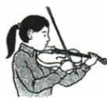
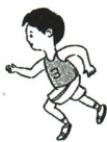
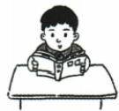
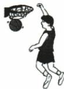
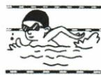

## 讲解

### 判据

要求按所听内容先后排列图片时，先认每图行为及字母，再记录各行为在材料中首次作为排序项目出现的顺序。图面排列与个人喜欢程度都不是顺序证据。

### 流程

1. 实看原图：A小提琴、B跑步、C阅读、D篮球、E游泳，保留原标签；没有实际图不能仅从答案倒推图画。
2. 听前把字母与活动配好，听中先捕捉项目名，再记顺序，避免长抄其好处时漏下一项。
3. 原短文reading先，写C；swimming次，写E；play violin第三，写A；running第四，写B；basketball最后，写D。
4. 原材料按介绍爱好先后展开，不是在讲一天先读书再游泳的日程；所求排序是提及先后，不另加事件时间。
5. 检C/E/A/B/D五图各一次，确认题规无复用；当前全五项分别出现。正确顺序不是原A—E可视排列。
6. 原只给答案，完整逐项映射据文字稿补写；无音频不声称已验证能在连续语流保持五项顺序。

## 例题

### 原例题 EN-LISTEN-E15

例 (2024 河南中考)

听下面一篇短文。按照你所听内容的先后顺序将下列图片排序。短文读两遍。

  
A

  
B

  
听力录音

  
C

  
D

  
E

1. \_\_\_\_ 2. \_\_\_\_ 3. \_\_\_\_ 4. \_\_\_\_ 5. \_\_\_\_

# 听力原文

Hello, everyone. It's my turn to make a speech today. As we know, hobbies play an important part in our daily life. So I'm going to talk about some hobbies that can help us to become better.

First of all, I think reading is a good hobby. Reading can help us learn more about the world around us. Swimming can be a good choice. There is nothing better than going for a swim on a hot summer day. If you love music, you can choose to play the violin. Sweet music can help you forget about worries and relax yourself. Most people like running. Running is good for both mind and body, but it's not easy to keep running every day. Also, basketball is popular. Through playing basketball, we can learn teamwork and make many new friends. That's all for my speech. Thanks for your listening.

**OCR恢复说明**：实际PDF第48页五个编号后均有答题空线，恢复原图字母填空；排序图按原A—E保留。

**原答案**：1.C 2.E 3.A 4.B 5.D。

原资料这一组只提供答案，未提供详解；下面保留原解答文字。

**原解析（原文）**

1.C 2.E 3.A 4.B 5.D

**补写完整解析（据原文字稿逐项核对）**

原图A拉小提琴，B跑步，C阅读，D打篮球，E游泳。短文依次谈reading→swimming→play the violin→running→basketball，逐次对应C→E→A→B→D。第1项C由reading建立，第2项E承接swimming，第3项A由violin确定，第4项B为running，第5项D为basketball。每幅图都出现，判断重点为出现顺序而非自己喜好；不能按原图A到E排列，也不把音乐泛化为篮球。提及顺序与实际当天活动时序不同，本题要求按短文介绍先后，不编先做哪项运动的时间表。

## 易错

- 按图从左到右直接答：视觉位置非所听顺序。
- 喜欢篮球所以篮球先：个人喜好非原信息。
- 介绍顺序变一天活动时序：添原无背景。
- 图片与字母错配：即使项目顺序对仍错。

资料定位（题目自带的考试标签按原书保留，未独立核实其真题身份）：

- EN-LISTEN-K13：251-300/full.md 第3491—3494行；6a4ea2a3-bafa-48b3-86d2-957f22a16e66_origin.pdf实际PDF第48页。
- EN-LISTEN-E15：251-300/full.md 第3495—3529行；6a4ea2a3-bafa-48b3-86d2-957f22a16e66_origin.pdf实际PDF第48页。
