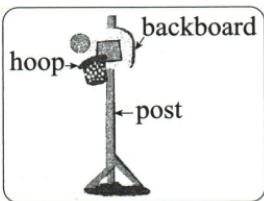

## 讲解

### 判据

整篇讲把废物变可用篮架，答案涉及破损原因、看到材料、加工次序与Kim态度变化。需分清已给事实和空内候选，局部确定与全篇主题各有作用。

### 流程

1. 首读已给内容，建“未修篮圈—回收制作—试投认可”草图，已给hasn’t fixed为证据，第一空未定不能当全文事实。
2. 近处判断broken与caught his eye，远处追Kim先useless后Wonderful，确定doubted到excitedly的变化；不要用终点开心覆盖起点怀疑。
3. 制作段按cut底、stick、dig hole、put post连行动，常识由题内顺序限定；逐项解释不合行为或对象，不能只写其余错。
4. 末段useful呼应再利用，依实际能投而非仅环保主题；old/dirty等现实可存在但不是当前修理原因最佳词。
5. 全文代回8空，重查When时间、原形和词组，确认主题及每项局部关系都成立；改答案必须指出新证据。
6. 原篮球部件图支持backboard/hoop/post词义定位，图与文字互证；不以制作题给实际施工指导。

## 例题

### 原例题 EN-CLOZE-E07

例1 (2024 山西中考)

# 试题

Marco and Kim left the school and walked towards home.

“I wish we could play basketball at our neighborhood park,” said Kim.

"But the basketball hoop at the park is \_1\_," said Marco. "It hasn't been fixed yet."

Marco and Kim walked past the town's recycling station. ____2____ Marco saw many recyclable plastic, paper and metal objects, he thought of an idea—Maybe we
could reuse something to make a basketball hoop. As he looked around the station, an old plastic laundry basket (洗衣篮) caught his \_3\_. "We can use this," he held it up and said to Kim.

Kim ____4____, “It looks useless.”

Marco smiled and said, "It won't look so bad. I could make a fine hoop with it."

At home, Marco made a post and a backboard with some waste wood. Then he \_5\_ the bottom of the basket, stuck the basket to the backboard, and the backboard to the post. After that, he went to the park, dug a hole, and put the post in the \_6\_.

The next day, Kim saw the recycled hoop. He tried and scored a goal. He said \_7\_, "I was wrong. It is a lot better than I thought."

"When we reuse things, we make waste ____8____ again."

"Wonderful! Now we can play basketball whenever we want!" Kim shouted and scored another goal.

1. A.old；B.dirty；C.broken

2. A.If；B.When；C.Though

3. A.eye；B.ear；C.nose

4. A.doubted；B.explained；C.suggested

5. A.cut off；B.played with；C.looked for

6. A.lake；B.street；C.ground

7. A.clearly；B.patiently；C.excitedly

8. A.tidy；B.useful；C.fresh

**OCR恢复说明**：实际第6—7页双栏分别复原为连续试题与连续原详解；2/4/8空号补回空线；保留必要部件图，删除解析栏装饰图与OCR图占位。选项依字母恢复排列，未更改文字条件。

**原答案**：1.C；2.B；3.A；4.A；5.A；6.C；7.C；8.B。

**原解析（原文）**

本文是一篇记叙文,讲述了马可成功利用废旧材料制作了一个篮球架的故事。

1. 语境推断。old 旧的；dirty 脏的；broken 坏的。根据后文“It hasn’t been fixed yet.” 可知，篮圈应该是坏了，还没有修好。故选 C。

2. 语境推断。if 如果; when 在……时候; though 尽管。根据语境可知,这里表示当看到这些可回收物品时,马可想到了一个主意。when 符合语境,故选 B。

3. 语境推断+固定搭配。eye 眼睛；ear 耳朵；nose 鼻子。根据前文可知，马可环顾回收站时，注意到了一个洗衣篮。catch one's eye “引起某人注意”，符合语境。故选 A。

4. 语境推断。doubt 怀疑; explain 解释; suggest 建议。根据金的话“It looks useless.” 可知，金对此表示怀疑。故选 A。

5. 语境推断+生活常识。cut off 切掉; play with 与……玩; look for 寻找。结合语境及生活常识可知, 制作篮圈要切掉洗衣篮的底部。故选 A。

6. 语境推断。lake 湖; street 街道; ground 土地; 地面。结合备选词和前文描述可知, 马可去公园挖了一个洞, 此处应是把杆插入土里。ground 符合语境, 故选 C。

7. 语境推断。clearly 清楚地; patiently 耐心地; excitedly 激动地。根据上文“He tried and scored a goal.”以及下文“I was wrong. It is a lot better than I thought.”可知,金在投篮后承认自己以前错了,这里应该是激动地说。故选 C。

8. 语境推断。tidy 整洁的; useful 有用的; fresh 新鲜的。根据前文中利用废旧物品制作篮球架的经历可知, 这里指的是使废物变得有用。故选 B。

**完整解析（依据原解析展开）**

先抓主线：公园旧篮圈未修→回收材料做新篮架→Kim由怀疑到试投认可→废物重新有用。已给事实为证据，未填的词先不当线索。

1.C.broken：hasn’t been fixed说明待修破损；A.old只是旧，不一定坏；B.dirty只是脏，不能最好解释修理。
2.B.When：实际看到回收物时产生主意，是时间关系；A.If改为假设不合已发生叙事；C.Though没有看到物与想到主意的对抗。
3.A.eye：looked around＋caught his eye为视觉注意；B.ear听觉、C.nose嗅觉与环顾对象不合，词组须整体核。
4.A.doubted：It looks useless表达怀疑可用性；B.explained应有解释内容，C.suggested应有方案，这句话没给。
5.A.cut off：需使篮圈能通过篮球，切去篮底后stick固定，A与底部处理合；B.played with不完成制作，C.looked for寻找不是已拿篮子的加工。只说明原制作情节，不当学生操作指导。
6.C.ground：dug a hole后插杆入地；A.lake没有水中洞，B.street不合公园所挖土洞的具体安装处。
7.C.excitedly：试进球、承认比预想好，又接Wonderful和再投，情绪是激动；A.clearly只评清晰，B.patiently只评耐心，均不最佳解释成功的态度变化。
8.B.useful：旧物实际成为能玩的篮架，末句呼应再利用；A.tidy整洁和C.fresh新鲜都非主要价值改变。回读末句主题帮助定结果，但不能仅凭环保主题就不核前七空。

## 易错

重复利用主题不能自动决定每空，Kim说话状态会改变，成功不意味此前已自信。

资料定位（题目自带的考试标签按原书保留，未独立核实其真题身份）：

- EN-CLOZE-E07：301-350/full.md 第480—584行；6659d931-51af-404a-81a1-a09f940e70c3_origin.pdf实际PDF第6、7页。
