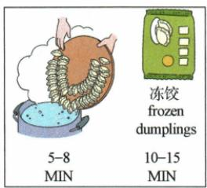
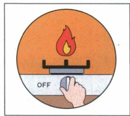
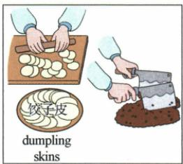
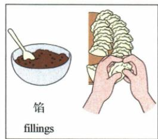

## 讲解

### 判据

四图配三步骤，末另有Don't forget关火。先核图的动作与阶段，再核标签数值，别以最后动作补最后空。

### 流程

1. 将三步动词prepare/mix、put/fold、boil/cook分准备、包制、烹煮，说明每步做什么而非只找dumpling一词。
2. C制皮切肉菜配第1，D放馅折元宝配第2，A沸锅和计时配第3；逐图比较其他动作为何不属于该阶段。
3. 核A鲜5—8与冻10—15两组分别对应，原单位分钟不换，数字不取单一10分钟概括两者。
4. B OFF对应题后提醒，不等第3已含的烹煮。原选C/D/A，B作为余图仍有真实提醒作用，不把余图说成错误操作。
5. 全流程回读，区分阅读对应与生活具体适用条件，不依据教材简图给个人操作保证。

## 例题

### 原例题 EN-TASK-E11

例 (2024 重庆中考 A)

阅读下列材料,从 A、B、C、D 四个选项中选出最佳答案。

Dumplings are traditional Chinese food. Jack is learning to make a dumpling meal for his family. Please help him choose three from the four pictures and match them with the steps below.

1. \_\_\_\_ Prepare dumpling skins. Mix different kinds of vegetables and meat.   
2. \_\_\_\_ Put fillings onto dumpling skins. Fold them into the shape of yuanbao.   
3. \_\_\_\_ Put dumplings into boiling water. Cook fresh dumplings for about 5–8 minutes, and frozen dumplings for about 10–15 minutes.

Don't forget to turn off the fire!

A

B

C

D

**原答案**：1.C；2.D；3.A。

**原解析（原文）**

【语篇解读】本文介绍了中国传统美食水饺的制作和烹饪过程。

1. 本题中的 dumpling skins 和“Mix different kinds of vegetables and meat.”与 C 图相对应。故选 C。  
2. 本题中的 fillings 和 “Fold them into the shape of yuanbao.” 与 D 项中的 fillings 和图片相对应。故选 D。  
3.本题中的5-8 minutes、frozen dumplings和10-15 minutes与A项中的5-8 MIN、frozen dumplings和10-15 MIN相对应。故选A。

**完整解析（依据原解析展开）**

1准备皮、混肉菜→C图有dumpling skins、擀皮和切馅；A下锅是后步，B关火非准备，D包馅不是先混，故C。2填馅折元宝→D图fillings与手包，C只是制皮切馅/A煮/B关火都不是包形，故D。3沸水煮并区分鲜5—8、冻10—15→A锅和两类计时；B只OFF对应原末提醒而非完整烹煮步骤，C/D准备包形无沸水或计时。最后C/D/A，B多余但不是错误生活行为：原另要求Don't forget...提醒关火，是第3完成后的动作，不能填取代煮饺子。只是图文任务，对现实操作时间是否适合各种大小食材不作保证。

## 易错

看见皮不能一律C，看见馅也不能一律D，两个阶段有共同对象而动作不同。图B未作为答案不意味着题后关火提醒应删除。

资料定位（题目自带的考试标签按原书保留，未独立核实其真题身份）：

- EN-TASK-K07：301-350/full.md 第2519—2528行；6659d931-51af-404a-81a1-a09f940e70c3_origin.pdf实际PDF第38页。
- EN-TASK-E11：301-350/full.md 第2529—2596行；6659d931-51af-404a-81a1-a09f940e70c3_origin.pdf实际PDF第38、39页。
