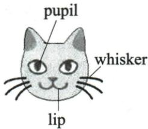
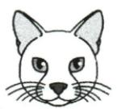
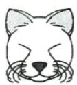
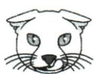

## 讲解

### 判据

题问angry expression，三部位条件要映射到选图；friendly原描述与数据是干扰背景，不能混状态。

### 流程

1. 用题干angry定位第三段后句，列耳贴头、瞳孔小、舔唇三点。
2. 借原标注图认pupil/whisker/lip，避免把眼白当瞳孔或须当舌。
3. C同时示三点；A竖耳开眼不合，B闭眼较friendly不合所问，按图实际形状解释。
4. 比例45%/37%不是这题选择规则，研究样本数量也不决定哪脸图对应。
5. 原图保留可供学生自己核，文字翻译不替看图；只学题内匹配，不做真实猫行为诊断。

## 例题

### 原例题 EN-READ-E22

例 (2024 四川成都中考)

Have you ever looked at a cat's face and wondered what it is thinking? Well, according to a new study, cats have many different facial expressions, which show how they are feeling.

The research was carried out by the scientists at the University of California, in the US. They visited a local cat café over

several months to record videos of 53 cats, collecting 194 minutes of videos. They found that the cats have 276 different expressions. “Each expression was a mixture of different facial movements, which included licking (舔) their nose, opening their mouth, or widening the pupils of their eyes,” said the scientists. They also found cats use 26 of these facial movements in total, which can be mixed to express how they are feeling. Dogs use 27 facial movements and humans use a total of 44.

Out of the expressions they recorded, 45% were friendly and 37% were angry. “A friendly cat moves its ears and whiskers forward and closes its eyes. However, an angry cat often flattens its ears to its head, makes its pupils smaller and licks its lips,” said the team.

Although the researchers aren't sure what the cats were trying to communicate with each other using their faces, they plan to study cats in other places to improve their understanding. They also hope that the research could help animal shelters (收容所) improve the way they look after the cats. Some pet owners even suggest the researchers develop an app for them to find out what their cats' facial expressions really mean.

Which picture shows a cat's angry expression?

  
A

  
B

  
C

**原答案**：C。

**原解析（原文）**

根据题干内容可定位至第三段最后一句中的“an angry cat often flattens its ears to its head, makes its pupils smaller and licks its lips”, 对比选项可知, 图片 C 显示的是一只猫愤怒的表情, 符合描述, 故选 C。

**完整解析（依据原解析展开）**

题问angry，不把friendly段当目标。原第三段具体条件：ears贴头、pupils较小、licks lips。C耳朵压平横贴、瞳孔狭窄并有舔唇动作，符合三条件；A耳竖且眼开，未示贴头舔唇，不合；B眼闭、耳较向前与friendly描述接近，非angry条件。猫脸标注图解释pupil瞳孔、whisker须、lip唇，帮助定位，但须与具体选项对照。

原45%friendly/37%angry是研究叙述中的比例，不能按比例最多反选friendly，题干只要愤怒。研究者仍不确定每种表情传何信息，本文只学题内描述与图像匹配，不拿单图作真实动物行为诊断。

## 易错

一个条件局部相像不能定答案，生成描述不能替必要原图。

资料定位（题目自带的考试标签按原书保留，未独立核实其真题身份）：

- EN-READ-K21：301-350/full.md 第1784—1794行；6659d931-51af-404a-81a1-a09f940e70c3_origin.pdf实际PDF第25页。
- EN-READ-E22：301-350/full.md 第1796—1829行；6659d931-51af-404a-81a1-a09f940e70c3_origin.pdf实际PDF第25、26页。
