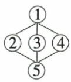
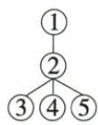
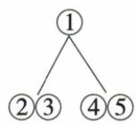
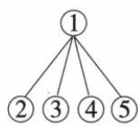

## 讲解

### 判据

四图同有五段圈号，区别在层级与分组；先给段功能再核图关系，不能从圈数直接选。

### 流程

1. 标1总命名来源、2嫦娥玉兔、3夸父、4墨子、5文化科技总结。
2. 2/3/4各给命名例，5回扣1，粗结构总—三例—总，图A吻合。
3. B把2统领3/4/5，C把5同4归并例组，D把5当普通分例，与总结功能冲突。
4. 读Besides可见2/3故事4古人细分类，但原图A按具体例粗层，不能据细分另造选项。
5. 圈号逐项回段验证，同主旨不必同功能；第一末段通常总但仍以实际内容为据。

## 例题

### 原例题 EN-READ-E19

# 例 (2024 湖北中考)

So far, China has successfully sent a large number of satellites (卫星) and spaceships into space. Space scientists have been greatly inspired (赋予灵感) by the old stories and ancient famous people when giving them names.

Since thousands of years ago, Chinese people have dreamed of going to the moon. Chang'e Flies to the Moon is one of the most popular stories. As you can see, China's first man-made satellite to circle around the moon was named Chang'e-1. More interestingly, the moon rover(月球车) was named after the Jade Rabbit, who is the partner of Chang'e in the story. These old stories carry people's best wishes and dreams. With the development of science and technology, our scientists have made them come true.

Kua Fu Runs After the Sun is another story to show how much ancient Chinese people wanted to know about the unknown world. Now, Kua Fu is going with the scientists to “visit” the sun, because we have a space project called KuaFu Mission.

Besides the ancient stories, space scientists also get ideas from ancient famous people. For example, Mozi, an ancient scientist, discovered that light travels in a straight line over 2,000 years ago. His discovery made space study take a big step at that time. So, China's first quantum (量子) science satellite was named Mozi, making China the first country in the world to achieve quantum communication between satellites and the ground.

From such simple things as giving names to the satellites, we can see how great our traditional culture is and what influence it has on our modern science and technology.

Which is the right structure of the passage?

(①=Paragraph 1 ②=Paragraph 2 ...)

  
A

  
B

  
C

  
D

**原答案**：A。

**原解析（原文）**

通读全文可知,文章首段引入话题,总说空间科学家给卫星和宇宙飞船命名受古老的故事和古代名人的启发;第二、三、四段分别通过嫦娥一号、“夸父”计划、墨子号的命名进行论证;第五段总结全文,与第一段相呼应。由此可知本文是“总—分—总”结构,故选 A。

**完整解析（依据原解析展开）**

第1段总说命名受古故事和古名人启发；第2段月亮相关嫦娥玉兔，第3夸父太阳，第4墨子古人，各给实例；第5总结传统文化与现代科技影响，回扣第1。先概括每段功能再比图，不能只数五圈。

A第1总领、中间2/3/4并列举例、第5回收，合总—分—总。B把第2当下一层统领3/4/5，但嫦娥段不统领其他例且第5应总结；C将2/3与4/5各分组并把第5归古人例，误合结论与例；D第1直接并列2/3/4/5，把总结段当与例同层，漏收束。第2/3都是故事，第4名人，若作更细内容分组可说明此区别，但原题A是按首尾总与中间三例的当前粗层结构，不宣称每个总分总都只一种画法。

## 易错

只背总分总不够比四图；段内部结构不等全文同层。

资料定位（题目自带的考试标签按原书保留，未独立核实其真题身份）：

- EN-READ-K18：301-350/full.md 第1670—1682行；6659d931-51af-404a-81a1-a09f940e70c3_origin.pdf实际PDF第23页。
- EN-READ-E19：301-350/full.md 第1684—1712行；6659d931-51af-404a-81a1-a09f940e70c3_origin.pdf实际PDF第23、24页。
