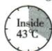
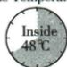
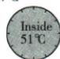
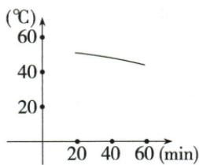
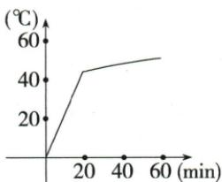
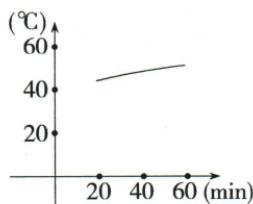
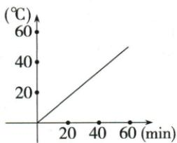

## 讲解

### 判据

英文给时间和车内外量，选择温度曲线，先取原读数而不是使用自动details表；横纵轴与区间要一致。

### 流程

1. outside27为室外背景，inside20/40/60分43/48/51为车内三点，逐一对原图抄量单位。
2. 同20分间隔前升5℃、后升3℃，两段上升且增幅减小；不据此补每分钟恒定变化。
3. C示已给20到60的40多至50多升温，A反降；D20分仅约20与43不合。
4. B多0分0度及陡升段未给测值支持，20分后虽近原方向仍不如C只对应有效区间，不能据它新增真实0分温度。
5. 原粗曲线只示趋势，自动读45/50/55不是精确测点，正文不用虚构表。
6. 回读所问in a car与min/℃，检查未以27代车内起点，亦不外推其他气温或防暑处置。

## 例题

### 原例题 EN-READ-E23

例（原书未标考试年份）

BEAT THE HEAT: Extreme Heat

Heat-related deaths can be prevented.

WHAT: Extreme heat or heat waves happen when the temperature reaches very high levels.

WHO: Children; Older adults; Outside workers; People with disabilities.

WHERE: Hot houses; Construction places; Cars.

HOW TO AVOID: Drink enough water. Stay cool inside. Wear lightweight or light-coloured clothes.

During extreme heat the temperature in your car could be dangerous.

Outside Temperature 27°C

Time Passed: 20 minutes

Time Passed: 40 minutes

Time Passed: 60 minutes

Which one can show the relationship between time and the temperature in a car?

Outside Temperature 27°C

A

B

C

D

**OCR恢复说明**：实际PDF第26页将信息海报完整转录为文字；保留车温读数3图和选项4曲线。自动图表转录的45/50/55等非原精确数据已移出正文；原件和原提取未改。

**原答案**：C。

**原解析（原文）**

根据 Outside Temperature 27℃ 下的内容可知,20 分钟时车内温度为 43℃, 温度随时间的增加而上升, 选项 C 与之相符。故选 C。

**完整解析（依据原解析展开）**

先分清outside27℃是室外条件，inside43/48/51℃分别是车内20/40/60分钟的原图读数。20到40温升48−43=5℃，40到60升51−48=3℃：两段都上升，后一段增幅较小；不能用室外27代车内起点，题内没有测0分钟车内值。

横轴Time(min)为过去分钟，纵轴℃是车内温度。C从约20分钟40多度随时间升到60分钟50多度，与原三点及方向相符，原答案C。A向下降，与43→48→51相反；D在20分仅约20℃，不合43℃；B在20分后局部也上升，但多画0分0℃和陡升一段，这一额外起点和段落无原测值支持，不如只对应已给区间的C。不得拿B额外起点推出真实车0分0℃，也不把图上粗刻度近读当精确45或55。

原详解只据20分43及上升判C，本文补足全部原测点和选项差异。曲线为示意，连接点不证明每分钟精确变化或恒速；这里只核题内关系，不将海报转成个人健康处置建议。

## 易错

室外与车内量不同，坐标原点不等测到零；示意线的像素位置不能当精确数据。

资料定位（题目自带的考试标签按原书保留，未独立核实其真题身份）：

- EN-READ-K22：301-350/full.md 第1831—1833行；6659d931-51af-404a-81a1-a09f940e70c3_origin.pdf实际PDF第26页。
- EN-READ-E23：301-350/full.md 第1835—1952行；6659d931-51af-404a-81a1-a09f940e70c3_origin.pdf实际PDF第26页。
