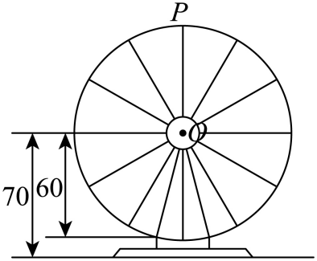

## 错法

看见圆周运动就套 $y=R\sin\omega t$，忽略圆心高度和初始位置。学生把“半径就是振幅”误当成完整模型，导致 $t=0$ 的高度不符合题干，最低点还可能被算到地面以下。

另一错法是解出全体周期区间后，直接把一个区间长度当成题目要求的时长。若计时恰从最高点开始，满足高度阈值的区间可能分别出现在第一圈的开头和结尾；只取一支会漏掉另一段。

还会把“转速减半”写成“周期减半”，混淆单位时间转过的角与转一整周需要的时间。二者互为反比，不是同向变化。

## 正解

先将模型与实际起点对齐：圆心高度是中线，半径是振幅，最高点起始可用余弦模型

$$h(t)=H+R\cos\left(\frac{2\pi}{T}t\right).$$

代入 $t=0$ 核对最高点 $H+R$，代入半圈核对最低点 $H-R$。若以正弦写，初相应取 $\pi/2$ 加整周，而不是 0。实际始终离地面的题，要检查最低高度不为负；参考面为水面且允许在水下的题，则要区分有符号高度与距离。

解阈值不等式时，先给出一般相位区间，再换算成时间，最后与本题指定的一圈、一天等实际范围取交集。交集可能含多段，分别算长度再相加；孤立端点对时长没有贡献，但是否包含仍由“达到”“不低于”等条件决定。

转速 $\omega$ 与周期满足 $\omega T=2\pi$，所以转速减半时周期加倍。两个不同时间高度相同，也不一定相差整数个周期：同一圈上升与下降的两点也可能有相同高度。

## 例题

### 最高点起始，一圈内阈值区间分两段

来源：`HSMA-B1-C5-D155a4884253a-P0121`，至 `P0145`。

#### 原题

【变式2-3】（24-25高一上·江苏徐州·期末）如图，摩天轮的半径为$60m$，点$O$距地面的距离为$70m$，摩天轮按逆时针方向匀速转动，每$18min$转一圈，若摩天轮上点$P$的起始位置在最高点处，则在摩天轮转动的过程中，（   ）

A．转动$9\min $后点$P$距离地面$8m$

B．第$16\min $和第$38\min $点$P$距离地面的高度相同.

C．转速减半时转动一圈所需的时间变为原来的$\frac{1}{2}$

D．转动一圈内，点$P$距离地面的高度不低于$100m$的时长为$5.5\min $

#### 原答案与原详解

【答案】B

【解题思路】设转动过程中，点$P$离地面距离的函数为$f\left( t\right)=A\sin \left( \omega t+\varphi \right)+h$，由题意求得解析式，然后逐项求解判断.

【解答过程】设转动过程中，点$P$离地面距离的函数为：$f\left( t\right)=A\sin \left( \omega t+\varphi \right)+h$，

由题意得：$A=60,h=70,T=18,\omega =\frac{2\pi }{18}=\frac{\pi }{9}$，又$f\left( 0\right)=60\sin \varphi +70=130$，

即$\sin \varphi =1$，故$\varphi =2k\pi +\frac{\pi }{2}$，$k\in Z$，

所以$f\left( t\right)=60\sin \left( \frac{\pi }{9}t+2k\pi +\frac{\pi }{2}\right)+70$

所以$f\left( t\right)=60\sin \left( \frac{\pi }{9}t+\frac{\pi }{2}\right)+70$，

选项A，转到$9\min $后，点$P$距离地面的高度为$f\left( 9\right)=60\sin\left( \frac{\pi }{9}\times 9+\frac{\pi }{2}\right)+70=10$，故A错误；

选项B，因为 $f\left( 16\right)=60\sin \left( \frac{\pi }{9}\times 16+\frac{\pi }{2}\right)+70=60\cos \frac{16\pi }{9}+70=60\cos \frac{2\pi }{9}+70$，

$f\left( 38\right)=60\sin \left( \frac{\pi }{9}\times 38+\frac{\pi }{2}\right)+70=60\cos \frac{38\pi }{9}+70=60\cos \frac{2\pi }{9}+70$，

所以$f\left( 16\right)=f\left( 38\right)$，

即第$16\min $和第$38\min $点$P$距离地面的高度相同，故B正确；

选项C，若摩天轮转速减半，则转动一圈所需的时间变为原来的2倍，故C不正确；

选项D，令$f\left( t\right)=60\sin \left( \frac{\pi }{9}t+\frac{\pi }{2}\right)+70\ge 100$，则$\cos \frac{\pi }{9}t\ge \frac{1}{2}$，

由$-\frac{\pi }{3}+2k\pi \le \frac{\pi }{9}t\le 2k\pi +\frac{\pi }{3},k\in Z$，解得$-3+18k\le t\le 18k+3,k\in Z$，

考虑第一圈时，点$P$距离地面的高度不低于$100m$的时长，可得

当$k=0$时，$0\le t\le 3$，当$k=1$时，$15\le t\le 18$，

即摩天轮转动一圈，点$P$距离地面的高度不低于$100$m的时间为$6\min $，故D错误；

故选：B.

#### 补充讲解

半径 60、中线 70、周期 18，因此 $h(t)=70+60\cos(\pi t/9)$。这个模型在起点高度为 130，在半圈 9 分钟时为 10，和几何上最高、最低点一致。

逐项核验：

- A：半圈后的最低高度是 $70-60=10$ 米，故不是 8 米。
- B：$16\pi/9=2\pi-2\pi/9$，$38\pi/9=4\pi+2\pi/9$；由整周与余弦偶性，两时刻的余弦都等于 $\cos(2\pi/9)$，高度相同，正确。不能仅因相差 22 分钟不是完整周期就否定。
- C：转速减半，转完同样一整周所需时间为两倍，即 36 分钟，选项反了。
- D：$h\ge100$ 等价于 $\cos(\pi t/9)\ge1/2$，通解为 $[-3+18k,3+18k]$。与第一圈 $[0,18]$ 相交：$k=0$ 得 $[0,3]$，$k=1$ 得 $[15,18]$，其他 $k$ 无交集。两段时长分别为 3 分钟，总计 6 分钟，而非 5.5 分钟。

最高点起始把第一圈的合格时间分在开头和结尾。完整记录两段后再相加，是处理实际范围的关键。

## 易错

- **“第一圈”只取 $k=0$。** 周期通解中的 $k$ 标记整周平移；从最高点计时的第一圈结尾，可能来自 $k=1$ 的区间，必须先交集后计时。
- **没有代初始时刻核验。** 高度模型最简单的自检是起点、半圈最低点和一圈回到起点，任一处不符就先纠正模型。
- **相同高度就按整周期比较。** 要同时考虑三角函数的对称性；例题中 16 分钟与 38 分钟相差 22 分钟，不是周期 18 分钟的整数倍，仍可同高。

## 来源与补讲边界

原题、原答案与原详解来自以上段落；判据、流程每步依据、定义域及易错成因是按数学规范补写的教学说明。原解的省略或疑点在补充讲解中指出，未用新造题替代来源。
