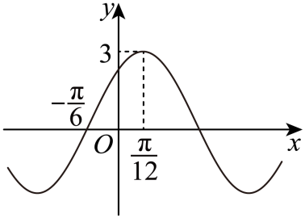

## 错法

从“曲线过峰点”列出 $\sin(\omega x_0+\varphi)=1$ 后，直接写 $\omega x_0+\varphi=\frac\pi2$，不写 $2k\pi$，也不使用题给初相范围。这样偶然得到正确代表值，仍没有证明参数为何唯一。

另一种错法是在 $A,\omega$ 尚未确定时，认为一个点足以定全部参数；或普通点只写反三角函数的一个主值，漏掉正弦方程的另一支。它们都把一个函数值条件误当成完整的相位与波形信息。

## 正解

先用图象的高度和间距确定 $A,\omega$，再用点坐标定相位。峰点的完整条件是 $\omega x_0+\varphi=\frac\pi2+2k\pi$；谷点为 $\frac{3\pi}2+2k\pi$。接着由题设的初相范围筛出 $k$，最后代回另一点检查相位和上升下降方向。

原例先由图得 $A=3,T=\pi,\omega=2$。峰点 $x_0=\frac\pi{12}$ 给出
$$\frac\pi6+\varphi=\frac\pi2+2k\pi\quad\Longrightarrow\quad\varphi=\frac\pi3+2k\pi.$$
题设 $|\varphi|<\frac\pi2$ 只允许 $k=0$，所以选出 $\varphi=\frac\pi3$。再代入图中的上升零点 $x=-\frac\pi6$，相位为 $0$，与该处从负到正的走势一致。

若普通点给 $\sin u=c$，先选一个满足条件的相位 $\alpha$，完整解族为 $u=\alpha+2k\pi$ 或 $u=\pi-\alpha+2k\pi$（峰谷时两族可能重合）。须由初相范围、走势或其他点继续筛选，不能在条件不足时宣称唯一。若题目未规定初相代表范围，同一函数可用相差 $2k\pi$ 的初相表示，应说明等价解族，而不是人为补一个约定。

## 例题

### 例 1：HSMA-B1-C5-De89f8ce12380-P0314

**原题、原答案与原详解**（来源段落 P0314—P0336；原资料的题名、地区和年份标注照录）

【变式4-2】（24-25高一下·黑龙江黑河·阶段练习）已知函数$f\left( x\right)=A\sin \left( \omega x+\varphi \right)\left( x\in R,A>0,\omega >0,\left| \varphi \right|<\frac{\pi }{2}\right)$的部分图象如图所示，则下列说法正确的是（    ）

A．$f\left( 0\right)=\frac{3}{2}$

B．将$f\left( x\right)$的图象向左平移$\frac{\pi }{6}$个单位长度后，得到函数$y=3\cos 2x$的图象

C．直线$x=\pi $是$f\left( x\right)$图象的一条对称轴

D．$f\left( x\right)$图象的对称中心为$\left( -\frac{\pi }{6}+\frac{k\pi }{2},0\right),k\in Z$

【答案】D

【解题思路】先根据图象确定$A$的值，再通过周期求出$\omega $，然后根据特殊点求出$\varphi $，得到函数表达式后，依次对各选项进行判断.

【解答过程】由函数图象可知，函数的最大值为$3$，因为$A>0$，所以$A=3$.

设函数的周期为$T$，则$\frac{T}{4}=\frac{\pi }{12}-(-\frac{\pi }{6})=\frac{\pi }{4}$，则$T=\pi $，所以$\omega =\frac{2\pi }{T}=\frac{2\pi }{\pi }=2$，

此时$f(x)=3\sin (2x+\varphi )$.

已知函数图象过点$(\frac{\pi }{12},3)$，则$f(\frac{\pi }{12})=3\sin (\frac{\pi }{6}+\varphi )=3$，

即$\sin (\frac{\pi }{6}+\varphi )=1$，所以$\frac{\pi }{6}+\varphi =\frac{\pi }{2}+2k\pi $，$k\in Z$，

因为$|\varphi |<\frac{\pi }{2}$，解得$\varphi =\frac{\pi }{2}-\frac{\pi }{6}=\frac{\pi }{3}$，那么$f(x)=3\sin (2x+\frac{\pi }{3})$.

对于A，$f(0)=3\sin \frac{\pi }{3}=3\times \frac{\sqrt{3}}{2}=\frac{3\sqrt{3}}{2}\ne \frac{3}{2}$，所以选项A错误；

对于B，将$f(x)=3\sin (2x+\frac{\pi }{3})$的图象向左平移$\frac{\pi }{6}$个单位长度，

得到$y=3\sin [2(x+\frac{\pi }{6})+\frac{\pi }{3}]=3\sin (2x+\frac{2\pi }{3})=3\sin (2x+\frac{\pi }{6}+\frac{\pi }{2})=3\cos (2x+\frac{\pi }{6})$，

所以选项B错误；

对于C，因$f(\pi )=3\sin (2\pi +\frac{\pi }{3})=3\sin \frac{\pi }{3}=\frac{3\sqrt{3}}{2}\ne \pm 3$，

所以直线$x=\pi $不是$f(x)$图象的一条对称轴，选项C错误；

对于D，令$2x+\frac{\pi }{3}=k\pi $，$k\in Z$，解得$x=-\frac{\pi }{6}+\frac{k\pi }{2}$，$k\in Z$，此时$f(x)=0$，

所以$f(x)$图象的对称中心为$(-\frac{\pi }{6}+\frac{k\pi }{2},0)$，$k\in Z$，选项D正确.

故选：D.

**展开解析（规范补讲）**

图上给出上升过零点 $(-\frac\pi6,0)$ 和紧邻的峰点 $(\frac\pi{12},3)$。它们之间只有四分之一周期，不能把任意两点间距都套成 $T/4$。

因为 $A>0$ 且中线是横轴，峰值 $3$ 给出 $A=3$。从上升零点到紧邻峰点，正弦相位增加 $\frac\pi2$：
$$\frac T4=\frac\pi{12}-\left(-\frac\pi6\right)=\frac\pi4,\qquad T=\pi,\qquad\omega=2.$$
把峰点代入得到 $\sin(\frac\pi6+\varphi)=1$。不能仅写一个解；完整相位条件是
$$\frac\pi6+\varphi=\frac\pi2+2k\pi,\qquad \varphi=\frac\pi3+2k\pi.$$
再用题设 $|\varphi|<\frac\pi2$ 选出 $k=0$，确定 $f(x)=3\sin(2x+\frac\pi3)$。上升零点代回相位是 $0$，与图象方向也相符。

- A：$f(0)=\frac{3\sqrt3}2$，不是 $\frac32$。
- B：左移 $\frac\pi6$ 后相位为 $2x+\frac{2\pi}3$，用诱导公式改写为 $3\cos(2x+\frac\pi6)$，仍有初相，不是 $3\cos2x$。
- C：正弦型函数的竖直对称轴位于峰、谷处。$x=\pi$ 的相位为 $2\pi+\frac\pi3$，函数值为 $\frac{3\sqrt3}2$，不是 $\pm3$，不构成对称轴。
- D：中心横坐标处相位为 $k\pi$。解 $2x+\frac\pi3=k\pi$ 得 $x=-\frac\pi6+\frac{k\pi}2$，所以 D 正确。

这里一个峰点用来确定初相，是在幅度和频率已经由图象其他信息确定之后。若幅度、频率也未知，只给“过一个点”，通常不足以确定整条函数；若给的是普通点，正弦方程还可能有两支解，必须继续利用上升或下降方向及其他条件。

## 来源与补讲边界

原例据 De89f8ce12380 P0314—P0336，必要 PNG image26 已实际核验。原题多选项判断完整保留；完整解族、参数约定与另一点反查为规范补讲。
