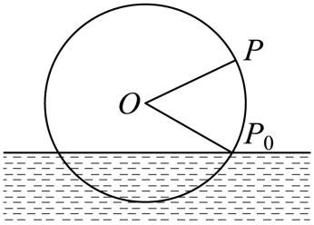

## 讲解

### 是什么

位移、圆周运动的高度、潮汐水深等量常随时间周期性变化。在原资料采用的理想化模型中，可以写成

$$y(t)=A\sin(\omega t+\varphi)+H,\qquad A>0,\quad\omega>0.$$

$t$ 是从规定起点开始计量的时间；$y$ 是所研究的量；$H$ 是中线值；$A$ 是相对中线的最大偏离；$\omega$ 是单位时间相位增加的弧度数；$\varphi$ 是 $t=0$ 时的相位。$A,H,y$ 使用相同单位，$\omega$ 的单位可写为弧度/秒或弧度/小时，必须与 $t$ 的时间单位配套。弧度视为无量纲角的计量，因此三角函数的输入是角，不能把长度直接放入括号。

相位增加一整周，模型的状态重现，于是

$$\omega T=2\pi,\qquad T=\frac{2\pi}{\omega},\qquad
f=\frac1T=\frac{\omega}{2\pi}.$$

$T$ 是最小正周期，单位为时间；$f$ 是频率，表示单位时间完成的周期数，秒作时间单位时频率单位为赫兹。振幅、周期、初相决定的内容不同：振幅决定离中线多远，周期决定多快重复，初相决定从哪里开始。

### 怎么来的

以半径 $R$ 的圆周运动为例，规定水平向右为横轴正方向，向上为纵轴正方向。圆心相对参考面的高度为 $H$，点的位置角为 $\theta$。按三角函数定义，点相对圆心的竖直坐标为 $R\sin\theta$，所以相对参考面的**有符号高度**是

$$h=H+R\sin\theta.$$

如果点逆时针匀速转动，相位随时间等量增加：$\theta=\theta_0+\omega t$，其中 $\omega=2\pi/T$。代入高度式得到 $h(t)=H+R\sin(\omega t+\theta_0)$。这里的每个参数分别来自半径、圆心位置、一圈所需时间和初始位置。顺时针可写成 $\theta=\theta_0-\omega t$，也可利用诱导公式换成等价正弦型函数，方向必须与起点共同核对。

若起点在最高处，采用 $h(t)=H+R\cos\omega t$ 也可以，因为余弦在 $t=0$ 时为 1。若从中线出发，还需判断开始向上还是向下，单凭起始高度只能求 $\sin\varphi$，通常不能唯一决定相位。

对给出的正弦振动表达式，周期来源同样是相位增加 $2\pi$；对实测潮汐数据，采用正弦模型则是资料指定的拟合假设，并不意味着实际数据在每个时刻都精确落在曲线上。

### 什么时候能用

圆周高度模型的依据是匀速、固定半径、固定参考面；弹簧模型按题目给出的运动规律使用；潮汐模型按题目指定的近似曲线使用。若速度、半径或中线随时间发生变化，原来的常参数模型就未必适用。

实际变量有范围，例如计时开始后 $t\ge0$、一天内 $0\le t\le24$、一圈内 $0\le t\le T$。解出的通用周期区间还须与实际范围取交集。某个高度通常在一圈内出现两次，找到一个时刻后不能直接加一个周期当作下一次。

尤其要区分“高度”和“距参考面的距离”：以水面为零点，水下的有符号高度为负，距离则是它的绝对值；以地面为参考面的摩天轮例中，高度始终为正，无须取绝对值。这两种表述不能混用。

## 例题

### 由振动表达式读取周期与单位

来源：`HSMA-B1-C5-D155a4884253a-P0031`，至 `P0036`。

#### 原题

【例1】（24-25高一下·江西上饶·阶段练习）某个弹簧振子在完成一次全振动的过程中的位移$y$（单位：$mm$）与时间$t$（单位：$s$）之间满足关系式$y=20\sin \left( \frac{10\pi }{3}t-\frac{\pi }{2}\right),t\in \left[ 0,+\infty \right)$，则该弹簧振子运动的最小正周期为（    ）

A．0.6$s$  B．0.5$s$  C．0.4$s$  D．0.3$s$

#### 原答案与原详解

【答案】A

【解题思路】根据正弦型函数的周期公式计算即可.

【解答过程】由已知可得该弹簧振子振动的最小正周期$T=\frac{2\pi }{\frac{10\pi }{3}}=0.6s$

故选：A.

#### 补充讲解

公式中的 20 是位移振幅，单位毫米；$10\pi/3$ 是角频率，单位弧度/秒；$-\pi/2$ 是初相。求周期，只要求相位增加一整周：$(10\pi/3)T=2\pi$，所以 $T=3/5=0.6$ 秒。

逐项核验：A 正确；若代 B、C、D，则相位分别只增加 $5\pi/3$、$4\pi/3$、$\pi$，均不是一整周。D 的 0.3 秒是半周期，位移通常变为相反数，不能称为一次全振动的周期。振幅 20 和初相不参与周期的计算。

### 筒车的起点、方向与反复到达

来源：`HSMA-B1-C5-D155a4884253a-P0081`，至 `P0095`。

#### 原题

【例2】（24-25高一下·山东枣庄·期末）筒车是我国古代发明的一种水利灌溉工具，因其经济又环保，至今仍在农业生产中发挥作用，明朝科学家徐光启在《农政全书》中用图画描绘了筒车的工作原理．一半径为2m的筒车水轮如图，水轮圆心O距离水面1m，已知水轮每30s逆时针匀速转动一圈，如果当水轮上的点P从水中浮现时（图中点${P}_{0}$）开始计时，则下列结论错误的是（   ）

A．点P再次进入水中用时20s

B．当水轮转动25s时，点P处于最低点

C．当水轮转动28.75s时，点P距离水面$\left( \sqrt{2}-1\right)m$

D．点P第三次到达距水面$\left( 1+\sqrt{3}\right)m$时用时42.5s

#### 原答案与原详解

【答案】D

【解题思路】由题意，利用角度除以角速度等于时间，再结合特殊角三角函数值逐项判断可得.

【解答过程】由题意，角速度$\omega =\frac{2\pi }{30}=\frac{\pi }{15}$弧度/秒，

又由水轮的半径为2米，且圆心O距离水面1米，可知半径$O{P}_{0}$与水面所成角为$\frac{\pi }{6}$，点P再次进入水中用时为$\frac{\pi +2\times \frac{\pi }{6}}{\frac{\pi }{15}}=20$秒，故A正确；

当水轮转动25秒时，半径$O{P}_{0}$转动了$25\times \frac{\pi }{15}=\frac{5\pi }{3}$弧度，而$\frac{5\pi }{3}-\frac{\pi }{6}=\frac{3\pi }{2}$，点P正好处于最低点，故B正确；

当水轮转动28.75秒时，由于$28.75=25+3.75$，又$\omega \times 3.75=\frac{\pi }{4}$，所以距水面高度为$2\sin \frac{\pi }{4}-1=\sqrt{2}-1$米，故C正确；

逆时针转动一周时，两次到达离水面高度为$\left( 1+\sqrt{3}\right)m$用时30秒，

所以第三次到达距水面高度为$\left( 1+\sqrt{3}\right)m$时需要转动一周后再逆时针转动$\frac{\pi }{6}+\frac{\pi }{3}=\frac{1}{2}\pi $弧度，此时用时为$\frac{\frac{\pi }{2}}{\frac{\pi }{15}}=7.5$秒，

所以点P第三次到达距水面$\left( 1+\sqrt{3}\right)$米时用时37.5秒，故D错误．

#### 补充讲解

按原图以水面为零点、向上为正。圆心高度为 1，半径为 2。浮出点 $P_0$ 在圆心右下方，位置角为 $-\pi/6$，不是 $\pi/6$；逆时针转动，所以

$$\theta(t)=\frac\pi{15}t-\frac\pi6,\qquad
h(t)=1+2\sin\left(\frac\pi{15}t-\frac\pi6\right).$$

逐项核验：

- A：下一次进入水面时 $\theta=7\pi/6$，从起点转过 $4\pi/3$，用时 $20$ 秒。刚好与原解一致。
- B：$t=25$ 时 $\theta=3\pi/2$，竖直坐标最小，位于最低点。
- C：$t=28.75$ 时 $\theta=7\pi/4$，有符号高度为 $1-\sqrt2<0$；题目问距水面的距离，取 $|1-\sqrt2|=\sqrt2-1$。原解的“距水面高度”应理解为距离，不能理解成向上的有符号高度。
- D：目标距离 $1+\sqrt3>1$ 大于最低点距水面的最大值 1，故只可能在水面上方。令 $h=1+\sqrt3$ 得 $\sin\theta=\sqrt3/2$，每圈有 $\theta=\pi/3,2\pi/3$ 两次。按时间排序是 $7.5,12.5,37.5,42.5,\ldots$ 秒，第三次为 $37.5$，$42.5$ 是第四次，所以本题“错误的是”选 D。

这题不能仅把第一次时刻加周期反复列下去，因为那样会漏掉每一圈的另一条到达分支。

## 易错

- **把周期看成两次经过同一位置数值的间隔。** 同一个高度或位移可能对应上升与下降两个状态；周期应使完整相位重复，或找连续的同类型峰值。
- **把初相任意设为 0。** $t=0$ 的位置和随后运动方向决定相位；不是所有计时方式都从平衡位置开始。
- **把有符号高度当成距离。** 筒车在水下时，模型高度为负，水面距离仍为正，应取绝对值。

## 来源与补讲边界

知识主线：`HSMA-B1-C5-D155a4884253a-P0012—P0029`；`HSMA-B1-C5-De89f8ce12380-P0451—P0455`。

定义、关系式及分类据本章原资料；连贯推导、符号与单位解释、公式定义域、模型假设为按数学规范补写的讲解。例题及原答案详解来自以上来源，新增解释单列于“补充讲解”，未自编题目。
