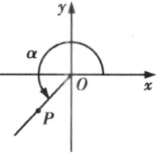

## 讲解

> 讲解依据：De870cbfcb1a3，P0016—P0039；定义公式已对照该DOCX的PDF第1—2页，尺度不变性的理由按数学规范展开。

### 是什么

把角的顶点放在原点，始边为x轴正向射线，取其终边上一点$P(x,y)$，点P不与原点重合。令$r=OP=\sqrt{x^2+y^2}>0$。任意角的正弦、余弦、正切定义为

$$\sin\alpha=\frac yr,\qquad\cos\alpha=\frac xr,\qquad\tan\alpha=\frac yx\quad(x\ne0).$$

角α是输入，三个比值是相应输出，均无长度单位。r是距离，总为正；x、y是带正负号的坐标。单位圆指以原点为圆心、半径1的圆，终边与它的交点坐标为$(\cos\alpha,\sin\alpha)$，其中先余弦、后正弦。

### 怎么来的

锐角在第一象限时，x、y可看成直角三角形的邻边和对边，r为斜边，定义便接上初中“对边/斜边、邻边/斜边、对边/邻边”。角转到其他象限后，几何长度始终非负，坐标却会变号；改用坐标就能保留角的方向信息。

为什么取终边上的不同点得到同一个值？同一射线上两个非原点对应正比例缩放：坐标变为$(tx,ty)$，t正，距离变为tr。三个比值分别为$ty/(tr)=y/r$、$tx/(tr)=x/r$、$ty/(tx)=y/x$，比例因子约掉。因此它们由终边决定，不由取点远近决定。把点缩放到单位圆，相当于t=1/r，所以单位圆坐标正是$(x/r,y/r)$。

### 什么时候能用

已知终边上的非原点坐标就可计算；已知单位圆交点则r=1，可以直接读出正弦和余弦。若只给一条过原点的直线，要分清终边是哪条射线：相反点的x、y同时变号，正弦和余弦会变号，正切可能相同。

正弦、余弦对任意实角都有定义，且值在$[-1,1]$；因为$|x|,|y|\le r$。正切的分母x不能为零，故在终边位于y轴时无定义，角的范围要排除$\pi/2+k\pi$。原点不能作定义点，它会使r=0并导致比值无意义。

## 例题

### 原题 P0050

> 来源ID HSMA-B1-C5-De870cbfcb1a3-P0050；原件 `专题5.2 三角函数的概念（举一反三讲义）数学人教A版必修第一册（解析版）.docx`；DOCX段落 P0050—P0056。年份、地区及试题标签沿原资料记载，未独立核实。

**原资料题干、选项或小问：**

【例1】（24-25高一下·山东威海·期末）已知角$\alpha $的终边经过点$P\left( -3,2\right)$，则$\sin \alpha =$（    ）

A．$\frac{2\sqrt{13}}{13}$  B．$-\frac{2\sqrt{13}}{13}$  C．$\frac{3\sqrt{13}}{13}$  D．$-\frac{3\sqrt{13}}{13}$

**原资料答案与详解（完整保留，公式规范转写）：**

【答案】A

【解题思路】根据任意角正弦函数的定义即可求解.

【解答过程】由题意有$r=\left| OP\right|=\sqrt{{\left( -3\right)}^{2}+{2}^{2}}=\sqrt{13}$，

所以$\sin \alpha =\frac{y}{r}=\frac{2}{\sqrt{13}}=\frac{2\sqrt{13}}{13}$.

故选：A.

**展开解析与核验（按数学规范补足）：**

P不是单位圆上的点，不能直接把纵坐标2当成正弦。先由距离公式得到$r=\sqrt{(-3)^2+2^2}=\sqrt{13}$，再由定义用纵坐标除以正距离，得$\sin\alpha=2/\sqrt{13}=2\sqrt{13}/13$，选A。

B把纵坐标正号改成负号；C使用了横坐标绝对值3，混淆正弦和余弦；D实际上是本角的余弦$x/r$。点在第二象限，正弦应正、余弦应负，这能同时核验符号。

## 易错

- 未确认单位圆就直接读坐标：一般点必须除r，只有r=1才能直接读。
- 距离r随象限带负号：距离始终正，符号来自x、y。
- 从正切“无定义”推出其他三角函数也无定义：y轴角正切分母为零，正弦余弦仍能计算。
