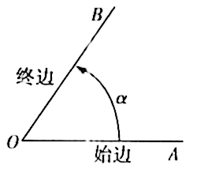

## 讲解

> 讲解依据：D320f81b4d41e，P0015—P0093、P0318—P0320；旋转量与整周关系的理由按数学规范展开。

### 是什么

任意角描述一条射线绕端点旋转的**方向和旋转量**。射线原来的位置叫始边，旋转后的位置叫终边，端点叫顶点。逆时针旋转得到正角，顺时针旋转得到负角；没有旋转得到零角。允许旋转超过一周，也允许负方向的多周旋转。

角度制中一周是$360^\circ$；弧度制中一周是$2\pi$。度数写度符号，弧度数可省略rad。两个角相等要求旋转方向和旋转量相同；仅最后停在同一条射线上，还不能判断角相等。

固定同一始边，若两个角的终边重合，就称它们终边相同。它们可相差整数周：

$$\beta=\alpha+360^\circ k\quad\text{或}\quad\beta=\alpha+2k\pi,\qquad k\in\mathbb Z.$$

两式分别使用角度制和弧度制，不能将$360$与$2\pi$无单位地混加。k允许零、正整数和负整数，分别对应原角、增加整周和减少整周。

### 怎么来的

旋转一整周会回到原位置。增加或减少整数周都不改变终边，所以式中的每个角都与原角终边相同。反过来，同一始边旋转到同一终边，两次旋转量的差只能是整数周，这就是公式的必要性。

角的加法也来自连续旋转：先转$\alpha$，再以它的终边为新起始位置转$\beta$，总旋转角为$\alpha+\beta$。方向相反、大小相同的两个角互为相反角，和为零；减去一个角就是增加它的相反角。因此正负角可以像有符号实数一样参与加减。

### 什么时候能用

这组关系用于判断两个已知角是否同终边，或者写出全部同终边角。可计算两角之差是否为整周；也可以把角减去整数周，化到$[0,360^\circ)$或$[0,2\pi)$中的代表角。

代表角只用于定位终边，不能替换题目问的真实转动量。特别是零角与一周角终边相同，但一周角确实转动了一周。终边在同一直线也可能是方向相反的两条射线，相差半周；这比“终边相同”范围更大。

## 例题

### 原题 P0095

> 来源ID HSMA-B1-C5-D320f81b4d41e-P0095；原件 `专题5.1 任意角和弧度制（举一反三讲义）数学人教A版必修第一册（解析版）.docx`；DOCX段落 P0095—P0106。年份、地区及试题标签沿原资料记载，未独立核实。

**原资料题干、选项或小问：**

【例1】（24-25高一上·全国·课后作业）已知角$\alpha $和角$\beta $，则下列说法正确的是（    ）

A．若角$\alpha $是第一象限角，则角$\alpha $是锐角

B．若角$\alpha $和角$\beta $的终边相同，则$\alpha =\beta $

C．若角$\alpha $和角$\beta $分别是角$0^{\circ}$的终边绕端点$O$按顺、逆时针方向旋转相同度数形成的角，则$\alpha +\beta =0$

D．若角$\beta $的终边在第二象限，则角$\beta $是钝角

**原资料答案与详解（完整保留，公式规范转写）：**

【答案】C

【解题思路】根据任意角的概念逐项判断.

【解答过程】A，角$\alpha =360^{\circ}+20^{\circ}=380^{\circ}$，是第一象限角，但不是锐角，A错误；

B，角$\alpha =90^{\circ}$，角$\beta =360^{\circ}+90^{\circ}=450^{\circ}$，则角$\alpha $和$\beta $的终边相同，但$\alpha \ne \beta $，B错误；

C，$0^{\circ}$的终边绕端点$O$按顺、逆时针方向旋转相同度数形成的两个角互为相反角，C正确；

D，角$\beta =120^{\circ}+360^{\circ}$的终边在第二象限，则角$\beta $不是钝角，D错误.

故选：C.

**展开解析与核验（按数学规范补足）：**

先分别核对“旋转量”和“终边位置”，不能把它们当成同一条件。

- A错：原详解中的$380^\circ=360^\circ+20^\circ$与$20^\circ$同终边，在第一象限，但锐角必须满足$0^\circ<\alpha<90^\circ$，380°不在这个数值区间。
- B错：90°与450°的差为360°，故同终边；两者旋转量不同，角不相等。
- C对：两角从同一始边出发，转动大小相同、方向相反，分别为某角与它的相反角，和为零。
- D错：480°与120°同终边，但钝角的角度数必须在90°与180°之间；480°不符合。

本题正确项为C。判断角的相等要保留整周数，判断象限才允许忽略整周数。

### 原题 P0116

> 来源ID HSMA-B1-C5-D320f81b4d41e-P0116；原件 `专题5.1 任意角和弧度制（举一反三讲义）数学人教A版必修第一册（解析版）.docx`；DOCX段落 P0116—P0121。年份、地区及试题标签沿原资料记载，未独立核实。

**原资料题干、选项或小问：**

【变式1-2】（24-25高一上·上海·期末）经过5分钟，分针的转动角为（     ）

A．$-{60}^{\circ}$  B．$-{30}^{\circ}$  C．${30}^{\circ}$  D．${60}^{\circ}$

**原资料答案与详解（完整保留，公式规范转写）：**

【答案】B

【解题思路】根据任意角的概念计算可得；

【解答过程】经过5分钟，则分针顺时针转过${30}^{\circ}$，则分针转动角为$-{30}^{\circ}$.

故选：B.

**展开解析与核验（按数学规范补足）：**

分针一小时走一周。5分钟占$5/60=1/12$周，旋转量的大小为$360^\circ/12=30^\circ$。分针顺时针旋转，按正负角约定必须加负号，得到$-30^\circ$，选B。

A把转动大小算成60°；C大小正确却漏顺时针的负号；D大小、方向都不符合。题目问转动角，不能用同终边的330°代替实际的−30°。

## 易错

- 把“最终位置相同”写成“旋转量相同”：相差整周的角同终边，数值仍可不同。
- 只看正负号猜象限：负角也可把终边转到任一象限，应先减加整周定位。
- 把相差180°的反向射线称为同终边：同终边要求射线方向也相同，需相差360°的整数倍。
