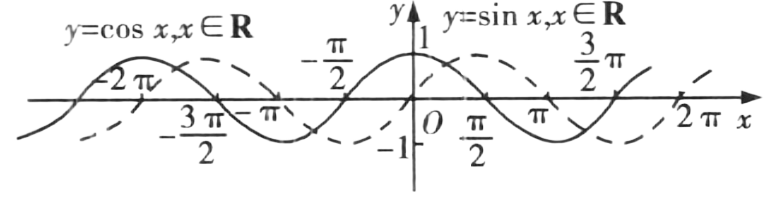

## 讲解

### 是什么：单位圆横坐标的变化

余弦函数 $y=\cos x$ 输入角的弧度数，输出终边与单位圆交点的横坐标。任意实数角都能定义，故定义域为 $\mathbb R$；横坐标的全部可能值为 $[-1,1]$，故值域为 $[-1,1]$。

一个周期中五个关键点为
$$ (0,1),\quad\left(\frac\pi2,0\right),\quad(\pi,-1),\quad\left(\frac{3\pi}2,0\right),\quad(2\pi,1). $$
正弦从零点起步，余弦在 $x=0$ 从最高点起步，不能仅看两者值域相同就把五点的纵坐标混用。

### 怎么来的：正弦的相位平移与单位圆解释

诱导公式给出 $\cos x=\sin(x+\frac\pi2)$。从函数图象看，这相当于把正弦曲线向左移动 $\frac\pi2$；当余弦输入为 $0$ 时，对应正弦的峰点相位 $\frac\pi2$，所以余弦从 $1$ 开始。

转一整圈横坐标不变，最小正周期为 $2\pi$。把角 $x$ 变为 $-x$，单位圆上两点关于横轴对称，横坐标不变，因此 $\cos(-x)=\cos x$，余弦是偶函数，图象关于纵轴对称。

在角从 $0$ 到 $\pi$ 转动时，单位圆横坐标从 $1$ 连续降到 $-1$；从 $-\pi$ 到 $0$ 转动时，由 $-1$ 升到 $1$。按整圈平移可得
$$\text{递增：}[-\pi+2k\pi,2k\pi],\qquad
\text{递减：}[2k\pi,\pi+2k\pi],\quad k\in\mathbb Z.$$
在 $x=2k\pi$ 达到最大值 $1$；在 $x=\pi+2k\pi$ 达到最小值 $-1$。峰、谷的位置都为竖直对称轴，所以对称轴是 $x=k\pi$。零点位于 $\frac\pi2+k\pi$，两侧余弦值变号，故横轴上的中心为 $(\frac\pi2+k\pi,0)$。

### 什么时候能用：平移或乘负数后重新追踪

余弦的对称中心和对称轴不能互换：中心在过零点处，竖直轴在峰、谷处。若函数是 $a\cos(\omega x+\varphi)+b$，须先求相位，再考虑外系数和中线 $y=b$；中线变了，对称中心的纵坐标也变为 $b$。

在 $2-\cos x$ 中，乘 $-1$ 先把峰、谷上下反射，再整体上移 $2$，所以 $x=0$ 给最低值 $1$，$x=\pi$ 给最高值 $3$。限定区间可能只覆盖一个峰、半个波段或不足半个波段，值域须结合实际相位区间计算。

## 例题

### 例 1：HSMA-B1-C5-Da2574407ea2b-P0115

**原题、原答案与原详解**（来源段落 P0115—P0120；原资料的题名、地区和年份标注照录）

【变式1-1】（25-26高一上·全国·课前预习）用“五点法”画函数$y=2-\cos x$在$\left[ -\pi ,\pi \right]$的图象时，下列选项中不是关键点的是（   ）

A．$\left( -\pi ,3\right)$  B．$\left( -\frac{\pi }{2},2\right)$  C．$\left( 0,1\right)$  D．$\left( \pi ,1\right)$

【答案】D

【解题思路】根据余弦函数的性质即可求解.

【解答过程】五个关键点分别为$\left( -\pi ,3\right)$，$\left( -\frac{\pi }{2},2\right)$，$\left( 0,1\right)$，$\left( \frac{\pi }{2},2\right),\left( \pi ,3\right)$，故D选项不在函数图象上．

故选：D.

**展开解析（规范补讲）**

给定区间 $[-\pi,\pi]$ 正好长一个余弦周期。此处五点从 $-\pi$ 开始，不能机械要求从 $0$ 开始。

对应余弦值依次是 $-1,0,1,0,-1$，用 $y=2-\cos x$ 计算，纵坐标依次是 $3,2,1,2,3$。所以 A、B、C 都是关键点；D 的横坐标 $\pi$ 虽然是关键横坐标，但纵坐标应为 $2-(-1)=3$，不是 $1$。

本题问“不是关键点”，因此选 D。它也提醒我们：$-\cos x$ 已把峰、谷倒过来，不能把余弦在 $x=\pi$ 的值误记成 $1$，或把原图的纵坐标直接搬给新函数。

## 易错

- 把 $\cos\pi$ 写成 $1$：$\pi$ 对应单位圆最左点，值应为 $-1$；$2\pi$ 才回到 $1$。
- 看到余弦就断言偶函数：平移后的函数未必关于原点保持偶性，必须检验定义域及 $f(-x)=f(x)$。
- 给 $-\cos x$ 沿用余弦的增减：乘负数反转纵坐标大小，原增区间变减区间，原减区间变增区间。

## 来源与补讲边界

原资料 Da2574407ea2b P0017—P0068 的余弦作图与性质；区间和对称公式对照知识 WMF image16、18、25、26。正弦平移解释、单位圆依据及原例逐项理由为规范补讲。
