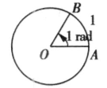

## 讲解

> 讲解依据：D320f81b4d41e，P0246—P0320；比例不随圆半径改变的理由按数学规范展开。

### 是什么

弧度制用圆弧长度与半径的比来度量角。**长度恰等于半径的圆弧所对的圆心角为1弧度**，记作1 rad。

若半径为r，转动所对应的弧长为l，则角的弧度数α满足

$$|\alpha|=\frac lr.$$

这里l、r用同一种长度单位，比值无长度量纲；α的正负仍由旋转方向决定，逆时针为正、顺时针为负。l是非负长度，不能直接把负角当成负弧长。弧度单位rad常省略，写$\alpha=\pi/3$默认弧度；写$60^\circ$则明确是度。

### 怎么来的

同一圆心角在不同大小的圆上截出的弧长随半径同比放大，所以l/r不随圆大小改变，可以度量角。一周的弧长为圆周长$2\pi r$，除以r得到$2\pi$弧度。因此一周和半周的两种单位关系为

$$360^\circ=2\pi\,\mathrm{rad},\qquad180^\circ=\pi\,\mathrm{rad}.$$

由半周关系，1°对应$\pi/180$弧度，1弧度对应$(180/\pi)^\circ$。换单位改变数值写法，不改变角本身。π在这些式子里是圆周率常数；π弧度对应180°，并不是把π解释成一个“度数”。

### 什么时候能用

角可按正负实数弧度统一计算，终边相同的角相差$2k\pi$。但求弧长时应使用实际扫过的角的大小，不能先去掉整周：同终边只保证最终位置相同，不保证走过的弧长相同。

用$l=\alpha r$这类简洁公式时，α必须是正的弧度数；带方向的任意角应写$l=|\alpha|r$来表示所走圆弧长度。求普通扇形的面积，还要使用该扇形实际对应的非负圆心角，不能把多周旋转直接当作一个普通扇形。

## 例题

### 原题 P0397

> 来源ID HSMA-B1-C5-D320f81b4d41e-P0397；原件 `专题5.1 任意角和弧度制（举一反三讲义）数学人教A版必修第一册（解析版）.docx`；DOCX段落 P0397—P0402。年份、地区及试题标签沿原资料记载，未独立核实。

**原资料题干、选项或小问：**

【例6】（24-25高一下·江西·阶段练习）把$\frac{11\pi }{12}$化成度的结果为（    ）

A．$85^{\circ}$  B．$105^{\circ}$  C．$165^{\circ}$  D．$215^{\circ}$

**原资料答案与详解（完整保留，公式规范转写）：**

【答案】C

【解题思路】根据弧度和角度的转化关系可得正确的选项.

【解答过程】$\frac{11\pi }{12}rad=\frac{11\pi }{12}\times \frac{180^{\circ}}{\pi }=165^{\circ}$.

故选：C.

**展开解析与核验（按数学规范补足）：**

题给$11\pi/12$未写度符号，按弧度读取。用$\pi$弧度对应180°，角度数为

$$\frac{11\pi}{12}\times\frac{180^\circ}{\pi}=\frac{11\times180^\circ}{12}=165^\circ.$$

π作为相同因子约掉，选C。A的85°、B的105°、D的215°分别换回弧度都不是$11\pi/12$；还可看$11\pi/12$在$\pi/2$与π之间，换出的角必须在90°与180°之间，先排A、D，但最终仍需计算来区分B、C。

## 易错

- 把π弧度写成π度：它们是不同角，换算依据为180°=π rad。
- 用$l/r$直接给负角的弧度数：比值只给大小，方向决定正负。
- 先去整周再求实际转动弧长：会丢掉转过的整周路程，只有定位终边时可去整周。
