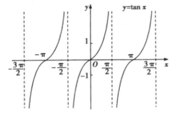

## 讲解

### 是什么：纵坐标与横坐标的比值

由单位圆三角函数定义，$\tan x=\frac{\sin x}{\cos x}$。余弦等于零时不能作分母，因此定义域为
$$D=\mathbb R\setminus\left\{\frac\pi2+k\pi:k\in\mathbb Z\right\}.$$
正切值可以取任意实数，所以值域为 $\mathbb R$，没有最高点或最低点。正弦、余弦被单位圆坐标限制在 $[-1,1]$，正切是两坐标的比值，分母接近零会使比值很大，故不能照搬它们的值域。

一条基本分支位于 $(-\frac\pi2,\frac\pi2)$ 内，经过 $(-\frac\pi4,-1),(0,0),(\frac\pi4,1)$。左右边界 $x=\pm\frac\pi2$ 是竖直渐近线，图象只能接近，不能在边界处取点。“三点两线”作图应先画渐近线，再描三点和光滑分支，不能把两条分支跨过无定义处连起来。

### 怎么来的：每条分支为什么上升

当角在 $(-\frac\pi2,\frac\pi2)$ 内转动时，终边斜率从很大的负值经过 $0$ 变到很大的正值。也可以只用三角恒等式验证：若 $-\frac\pi2<u<v<\frac\pi2$，则
$$\tan v-\tan u=\frac{\sin v\cos u-\sin u\cos v}{\cos u\cos v}
=\frac{\sin(v-u)}{\cos u\cos v}>0.$$
分子为正，因为 $0<v-u<\pi$；分母为正，因为这一分支内两个余弦都为正。因此一条分支严格递增。周期平移后每条分支都递增，区间为 $(-\frac\pi2+k\pi,\frac\pi2+k\pi)$。

角增加 $\pi$ 后正弦和余弦同时变号，比值保持，所以 $\tan(x+\pi)=\tan x$，最小正周期是 $\pi$。角取负时，分子变号、分母不变，得到 $\tan(-x)=-\tan x$，它是奇函数。

所有对称中心为 $(\frac{k\pi}2,0)$。偶数 $k$ 给分支的零点中心；奇数 $k$ 给渐近线与横轴的交点，中心本身虽不在图象上，相邻两支仍关于该点作半圈旋转后重合。对奇数 $k$ 可用 $\tan(\frac\pi2+h)=-\frac{\cos h}{\sin h}$ 与 $\tan(\frac\pi2-h)=\frac{\cos h}{\sin h}$（两边均有定义时） 验证中心两边函数值相反。

### 什么时候能用：单调性只谈一个连通分支

“每条分支递增”不等于“整个定义域递增”。跨过渐近线，右侧分支从负值重新开始，不能用一个增区间把两支合起来。基本分支两端均为无定义点，必须写开区间。

对 $\tan(\omega x+\varphi)$，先解 $\omega x+\varphi\ne\frac\pi2+k\pi$ 确定排除点，再反解分支区间；$\omega>0$ 时每支递增，$\omega<0$ 时相位方向反转，每支递减。最小正周期为 $\pi/|\omega|$，不是正弦、余弦的 $2\pi/|\omega|$。

## 例题

### 例 1：HSMA-B1-C5-Da2574407ea2b-P0412

**原题、原答案与原详解**（来源段落 P0412—P0424；原资料的题名、地区和年份标注照录）

【变式7-2】（24-25高一下·陕西渭南·期中）已知函数$f\left( x\right)=\tan \left( 2x+\frac{\pi }{3}\right)$，则下列说法正确的是（    ）

A．$f\left( x\right)$在定义域内是增函数  B．$f\left( x\right)$图象的对称中心是$\left( \frac{k\pi }{4}-\frac{\pi }{6},0\right)$，$k\in Z$

C．$f\left( x\right)$的最小正周期是$\pi $  D．$f\left( x\right)$是奇函数

【答案】B

【解题思路】求函数$f\left( x\right)$的定义域，和单调增函数即可判断A，令$2x+\frac{\pi }{3}=\frac{k\pi }{2},k\in Z$求出即可判断B，由周期公式$T=\frac{\pi }{\left| \omega \right|}$即可判断C，由奇偶性的定义即可判断D.

【解答过程】对于A：令$2x+\frac{\pi }{3}\ne \frac{\pi }{2}+k\pi ,k\in Z\Rightarrow x\ne \frac{\pi }{12}+\frac{k\pi }{2},k\in Z$，函数$f\left( x\right)$的定义域$\left\{ x\left| x\ne \frac{\pi }{12}+\frac{k\pi }{2},k\in Z\right.\right\}$，

由$k\pi -\frac{\pi }{2}<2x+\frac{\pi }{3}<\frac{\pi }{2}+k\pi ,k\in Z$有$\frac{k\pi }{2}-\frac{5\pi }{12}<x<\frac{\pi }{12}+\frac{k\pi }{2},k\in Z$，

所以函数$f\left( x\right)$的单调增区间为$\left( \frac{k\pi }{2}-\frac{5\pi }{12},\frac{\pi }{12}+\frac{k\pi }{2}\right)\left( k\in Z\right)$，

由单调性的定义可知，$f\left( x\right)$在定义域内不具有单调性，故A错误；

对于B：令$2x+\frac{\pi }{3}=\frac{k\pi }{2},k\in Z$有$x=\frac{k\pi }{4}-\frac{\pi }{6},k\in Z$，所以$f\left( x\right)$图象的对称中心是$\left( \frac{k\pi }{4}-\frac{\pi }{6},0\right)$ $\left( k\in Z\right)$，故B正确；

对于C：$T=\frac{\pi }{\left| \omega \right|}=\frac{\pi }{2}$，所以$f\left( x\right)$的最小正周期是$\frac{\pi }{2}$，故C错误；

对于D：$f\left( -x\right)=\tan \left( -2x+\frac{\pi }{3}\right)=-\tan \left( 2x-\frac{\pi }{3}\right)$，可知$f\left( x\right)$是非奇非偶函数，故D错误.

故选：B.

**展开解析（规范补讲）**

本题必须先排除正切无定义的相位，再谈单调、对称和周期。

- A：$2x+\frac\pi3\ne\frac\pi2+k\pi$，所以 $x\ne\frac\pi{12}+\frac{k\pi}2$。正切在每条分支上递增，但从一条分支的右端跨到下一条的左端，函数值从很大的正值回到很小的负值，不能说整个断开的定义域上递增。A 错。
- B：正切图象关于 $(\frac{k\pi}2,0)$ 成中心对称。令相位 $2x+\frac\pi3=\frac{k\pi}2$，得中心横坐标 $\frac{k\pi}4-\frac\pi6$，所以 B 对。奇数 $k$ 时中心位于两分支之间，中心本身不在图象上；“对称中心必须是函数上的点”并不成立。
- C：正切相位重复一遍只需增加 $\pi$，横坐标增加 $\frac\pi2$，所以最小正周期为 $\frac\pi2$，C 错。
- D：原点有定义，$f(0)=\tan\frac\pi3=\sqrt3\ne0$，已不符合奇函数必要条件。定义域的排除点也不关于原点对称，因此不能直接把原正切的奇性搬给平移后的函数。D 错。

只有 B 正确。判断平移后的奇偶性时，应检查定义域是否关于原点对称，再比较 $f(-x)$ 与 $\pm f(x)$；只看函数名“tan”不够。

## 易错

- 在无定义点写闭括号：渐近线不是图象的一部分，区间端点必须排除。
- 忘记正切中心可以不在图象上：中心对称比较的是整幅图象的旋转对应，不要求中心有函数值。
- 把一条分支的单调结论推广到整个定义域：跨渐近线后函数值重新从负侧开始，须按分支分别讨论。

## 来源与补讲边界

原资料 Da2574407ea2b P0081—P0105 的正切定义、性质和“三点两线”；知识 WMF image32—41 已实际对照。正切差值证明及中心不在图象上的说明为规范补讲，原例原解完整保留。
