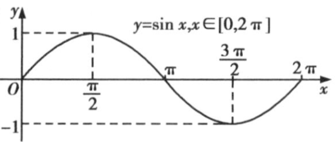

## 讲解

### 是什么：角的纵坐标随转动怎样变化

正弦函数 $y=\sin x$ 把实数 $x$ 作为角的弧度数，输出该角终边与单位圆交点的纵坐标。这里 $x$ 不是坐标点本身的纵坐标，而是转过的角；$y$ 是无量纲的正弦值。

任意实数角都有终边，所以定义域为 $\mathbb R$；单位圆纵坐标不超过 $1$、不低于 $-1$，而上下两点可以到达，所以值域为 $[-1,1]$。

在一周期内，五个关键点为
$$ (0,0),\quad\left(\frac\pi2,1\right),\quad(\pi,0),\quad\left(\frac{3\pi}2,-1\right),\quad(2\pi,0). $$
它们分别对应过横轴、最高点、再过横轴、最低点、回到起点值。曲线经过这些点光滑变化，不能用折线把五点连接成三角波。

### 怎么来的：用单位圆和诱导公式解释性质

转完一整圈，终边回到原处，纵坐标也相同，所以 $\sin(x+2\pi)=\sin x$。一周期内从上升零点到下一次同方向零点的距离为 $2\pi$，更短的正位移不能使整条曲线重复，因此最小正周期为 $2\pi$。

把终边关于横轴反射，横坐标不变、纵坐标变号，得到 $\sin(-x)=-\sin x$。定义域也关于原点对称，故正弦是奇函数，图象关于原点中心对称。再用 $\sin(k\pi+h)=(-1)^k\sin h$，可见所有横轴上的中心是 $(k\pi,0)$。

在单位圆右半圈，从底部转向顶部，纵坐标持续增加；左半圈从顶部转向底部，纵坐标持续减少。因此对任意 $k\in\mathbb Z$，
$$\text{递增：}\left[-\frac\pi2+2k\pi,\frac\pi2+2k\pi\right],\qquad
\text{递减：}\left[\frac\pi2+2k\pi,\frac{3\pi}2+2k\pi\right].$$
最高、最低点发生在 $x=\frac\pi2+2k\pi$、$x=\frac{3\pi}2+2k\pi$，值分别为 $1,-1$。峰、谷两边的角关于同一竖线等距时，纵坐标相同；也可用 $\sin(\frac\pi2+h)=\sin(\frac\pi2-h)=\cos h$ 验证。所以对称轴为 $x=\frac\pi2+k\pi$。

### 什么时候能用：先确认输入就是这个角

上述区间直接用于 $y=\sin x$，不能原样搬给 $\sin(\omega x+\varphi)$。后者须先把整个相位 $\omega x+\varphi$ 放入标准区间，再反解 $x$。外面再乘负数，增减和最高最低的身份还会交换。

正弦在全体实数上不断升降，因此不能说“正弦是增函数”。限定区间求值域时，须看区间有没有经过峰、谷；求复合函数定义域时，根号和分母可能另有限制。正弦不等式通常先在一个完整周期内找可取部分，再按周期平移取并集。

## 例题

### 例 1：HSMA-B1-C5-Da2574407ea2b-P0239

**原题、原答案与原详解**（来源段落 P0239—P0247；原资料的题名、地区和年份标注照录）

【例3】（24-25高一下·江西景德镇·期中）函数$f(x)=\sqrt{2\sin x+1}$的定义域为（    ）

A．$\left[ -\frac{\pi }{6}+2k\pi ,\frac{7\pi }{6}+2k\pi \right],k\in Z$  B．$\left[ -\frac{\pi }{4}+2k\pi ,\frac{\pi }{3}+2k\pi \right],k\in Z$

C．$\left[ -\frac{\pi }{2}+2k\pi ,\frac{\pi }{2}+2k\pi \right],k\in Z$  D．$\left[ -\frac{\pi }{3}+2k\pi ,\frac{\pi }{2}+2k\pi \right],k\in Z$

【答案】A

【解题思路】依题意可得$\sin x\ge -\frac{1}{2}$，根据正弦函数的性质计算可得.

【解答过程】对于函数$f(x)=\sqrt{2\sin x+1}$，

令$2\sin x+1\ge 0$，即$\sin x\ge -\frac{1}{2}$，解得$-\frac{\pi }{6}+2k\pi \le x\le \frac{7\pi }{6}+2k\pi ,k\in Z$，

所以函数的定义域为$\left[ -\frac{\pi }{6}+2k\pi ,\frac{7\pi }{6}+2k\pi \right],k\in Z$.

故选：A.

**展开解析（规范补讲）**

根号要求被开方数非负，这是本题进入三角图象的入口：
$$2\sin x+1\ge0\quad\Longleftrightarrow\quad\sin x\ge-\frac12.$$
在一个连续的相位区间 $[-\frac\pi6,\frac{11\pi}6]$ 中，正弦曲线与水平线 $y=-\frac12$ 相交于 $-\frac\pi6$ 和 $\frac{7\pi}6$。两点之间的曲线在水平线上方，所以保留闭区间 $[-\frac\pi6,\frac{7\pi}6]$。加上所有整数倍 $2\pi$，得到定义域
$$\bigcup_{k\in\mathbb Z}\left[-\frac\pi6+2k\pi,\frac{7\pi}6+2k\pi\right].$$
“$k\in\mathbb Z$”表示取这些区间的并集，不能只留 $k=0$。边界处根号内为零，仍有意义，所以两端取到。

- A 与这个并集一致，正确。
- B 包含 $x=-\frac\pi4$，其正弦小于 $-\frac12$，根号无意义；同时遗漏许多允许的点。
- C 包含 $x=-\frac\pi2$，被开方数为 $-1$，不允许。
- D 包含 $x=-\frac\pi3$，被开方数为 $1-\sqrt3<0$，也不允许。

## 易错

- 把任意一个周期误当作定义域：周期说明曲线重复，其他周期的点仍在定义域内。
- 把最大值位置 $\frac\pi2+2k\pi$ 与对称轴 $\frac\pi2+k\pi$ 混用：对称轴包含峰、谷，最大值位置只含峰。
- 判 $\sin x\ge c$ 时只解一个等号：等号给边界，保留边界之间还是之外，还须比较曲线与水平线的位置。

## 来源与补讲边界

原资料 Da2574407ea2b P0017—P0068 的单位圆作图、五点与正弦性质；单调和对称公式已对照原知识 WMF image15、17、23、24。例题据对应来源段落；单位圆解释、并集记号及逐项理由为规范补讲。
