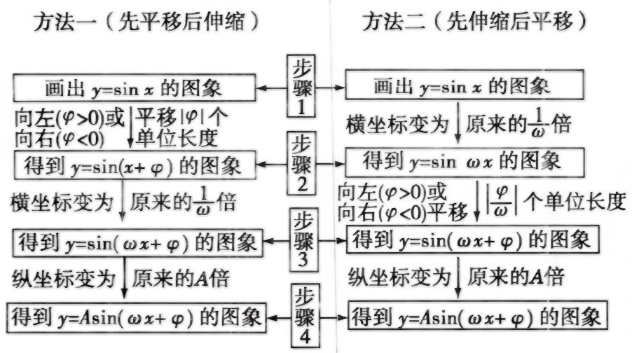

## 讲解

### 是什么：移动点与改写函数是同一件事的两种说法

平移和伸缩处理的是图象上每个点。设原函数为 $g$，原点横坐标为 $u$。右移 $h$ 后，新横坐标是 $x=u+h$，于是 $u=x-h$，新函数为 $g(x-h)$；左移 $h$ 则为 $g(x+h)$。括号中的减号来自“在新位置追溯旧点”，不是凭口诀猜方向。

若把每个横坐标伸长为原来的 $s$ 倍（$s>0$），新横坐标是 $x=su$，所以旧横坐标是 $u=x/s$，新函数是 $g(x/s)$。纵坐标不变，因而振幅不变；反之把横坐标缩短到原来的 $1/s$，新函数为 $g(sx)$。

若把纵坐标乘正数 $A$，新函数为 $Ag(x)$，横坐标和周期不变。负数倍还包含关于横轴的反射，要单独说明。

### 怎么来的：两条路线得到同一个正弦型函数

从 $y=\sin x$ 得到 $y=A\sin(\omega x+\varphi)$，约定 $A>0,\omega>0$。

第一条路线先平移：把 $\sin x$ 按带符号位移 $-\varphi$ 横移，得到 $\sin(x+\varphi)$；再把横坐标缩放为原来的 $1/\omega$，用 $x\mapsto\omega x$，得到 $\sin(\omega x+\varphi)$；最后纵坐标乘 $A$。

第二条路线先横向缩放：把横坐标变为原来的 $1/\omega$，得到 $\sin\omega x$；再按带符号位移 $-\varphi/\omega$ 横移，代入 $x+\varphi/\omega$，也得到 $\sin(\omega x+\varphi)$；最后纵坐标乘 $A$。

带符号位移为负表示向左，为正表示向右。两路线中的平移距离不同，是因为第一条路线的平移量随后也被横向伸缩了。

### 什么时候能用：按起点和顺序写每个中间式

若起点已经是 $\sin(\omega x+\varphi_0)$，再平移不是回到基础正弦重新套图。每次平移都应把整个原式中的 $x$ 替换为 $x\pm h$，新的初相增减 $\omega h$，不是仅增减 $h$。

横向伸缩与平移一般不能交换；要求原函数时应倒转操作顺序，并把每个操作取逆。求“至少怎样平移”或“最小正平移量”时，还应考虑相差整数个周期的移动会得到相同图象，再从允许的带符号位移中选择题目要求者。

## 例题

### 例 1：HSMA-B1-C5-De89f8ce12380-P0202

**原题、原答案与原详解**（来源段落 P0202—P0208；原资料的题名、地区和年份标注照录）

【例2】（24-25高一下·广东清远·期中）要得到函数$y=3\sin \left( 2x-\frac{\pi }{4}\right)$的图象，只需将$y=3\sin 2x$的图象（    ）

A．向左平移$\frac{\pi }{8}$个单位  B．向右平移$\frac{\pi }{8}$个单位

C．向左平移$\frac{\pi }{4}$个单位  D．向右平移$\frac{\pi }{4}$个单位

【答案】B

【解题思路】借助正弦型函数平移的特征计算即可得..

【解答过程】由题意可得$y=3\sin 2x$的图象向右平移$\frac{\pi }{8}$个单位可得$y=3\sin 2\left( x-\frac{\pi }{8}\right)=3\sin \left( 2x-\frac{\pi }{4}\right)$，故B正确.

故选：B.

**展开解析（规范补讲）**

把原函数记为 $g(x)=3\sin2x$。向右移动 $h$ 后，原来横坐标 $u$ 的点移到 $u+h$；要算新横坐标 $x$ 的纵坐标，须回到原来的 $x-h$，所以新式是 $g(x-h)$。

目标相位 $2x-\frac\pi4$ 应与 $2(x-h)$ 相同，比较常数项可得 $2h=\frac\pi4$，即 $h=\frac\pi8$，因此选 B。

- A 向左 $\frac\pi8$ 会得到 $3\sin(2x+\frac\pi4)$，方向相反。
- B 向右 $\frac\pi8$ 得到 $3\sin[2(x-\frac\pi8)]=3\sin(2x-\frac\pi4)$，正确。
- C 向左 $\frac\pi4$ 会得到相位 $2x+\frac\pi2$，方向和相位变化都不符。
- D 向右 $\frac\pi4$ 会得到相位 $2x-\frac\pi2$，把初相的变化误当成横坐标的变化，漏除相位系数 $2$。

## 易错

- 把横坐标伸长两倍写成 $g(2x)$：新点横坐标变大，要用新横坐标的一半找回旧点，正确是 $g(x/2)$。
- 左右移只改变括号的常数项而漏乘系数：始终代入整个 $x\pm h$，展开后再比较。
- 逆变换沿原顺序走：必须先撤销最后一步，再撤销倒数第二步，否则有平移和伸缩时通常不能回到原图。

## 来源与补讲边界

原资料 De89f8ce12380 P0014—P0037 的两条变换路线，image11 实际查看后按原图引用；相关 WMF image4—10 已核验。点坐标解释、逆序操作和周期等价位移为规范补讲。
