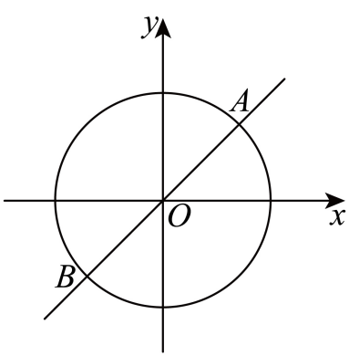

## 讲解

> 讲解依据：De870cbfcb1a3的定义段、P0110—P0121、P0158—P0163及D35bfd7dc671a的特殊角求值原例；直角三角形与单位圆推导按数学规范补讲。

### 是什么

特殊角的函数值是能精确写出的常用数值。先掌握0°到90°范围内的0°、30°、45°、60°、90°，其中0°、90°是轴线角，中间三个是第一象限角，再用终边位置和对称关系得到其他角。下面的角分别也写成弧度，不是两种不同角。

| 角度 | 弧度 | sin | cos | tan |
| --- | --- | --- | --- | --- |
| 0° | 0 | 0 | 1 | 0 |
| 30° | $\pi/6$ | $1/2$ | $\sqrt3/2$ | $\sqrt3/3$ |
| 45° | $\pi/4$ | $\sqrt2/2$ | $\sqrt2/2$ | 1 |
| 60° | $\pi/3$ | $\sqrt3/2$ | $1/2$ | $\sqrt3$ |
| 90° | $\pi/2$ | 1 | 0 | 无定义 |

函数名的位置要固定：单位圆点是$(\cos\alpha,\sin\alpha)$，正切为纵坐标除横坐标。不要把sin与cos列对调。

### 怎么来的

45°的单位圆点在直线y=x上，所以x=y且$x^2+y^2=1$，得$2x^2=1$。第一象限x、y均正，得到$x=y=\sqrt2/2$，正切为1。

30°、60°可从边长2的等边三角形作高。高将底边分成长度1的两段，由勾股定理高为$\sqrt{2^2-1^2}=\sqrt3$，每半个三角形的斜边为2。30°的对边为1、邻边为√3，所以正弦1/2、余弦√3/2；60°交换对边和邻边，两个值互换。正切分别用对边除邻边，得√3/3和√3。

0°与90°直接读单位圆点$(1,0)$、$(0,1)$，不再依靠退化直角三角形。90°的横坐标为零，所以正切不存在，不能写0或一个“无穷大的数”作函数值。

### 什么时候能用

题目给大角或负角时，先利用整周、关于坐标轴的对称关系，把函数值联系到表中角，再决定正负。只把某角化为“某个锐角”而忽略符号，容易得到相反数。

在180°处单位圆点为$(−1,0)$，正弦0、余弦−1、正切0；270°处为$(0,−1)$，正弦−1、余弦0、正切无定义。增加整周不改变点，但180°不是0°：两者余弦相反。保留根式和分数能给精确值，不必提前改小数。

## 例题

### 原题 P0110

> 来源ID HSMA-B1-C5-De870cbfcb1a3-P0110；原件 `专题5.2 三角函数的概念（举一反三讲义）数学人教A版必修第一册（解析版）.docx`；DOCX段落 P0110—P0121。年份、地区及试题标签沿原资料记载，未独立核实。

**原资料题干、选项或小问：**

【变式2-3】（24-25高一上·全国·课后作业）已知直线$y=x$与以原点为原心的单位圆交于$A,B$两点，点$A$在$x$轴的上方，$O$是坐标原点．

(1)求以射线$OA$为终边的角$\alpha $的正弦值和余弦值；

(2)求以射线$OB$为终边的角$\beta $的正切值．

**原资料答案与详解（完整保留，公式规范转写）：**

【答案】(1)$\sin \alpha =\frac{\sqrt{2}}{2}$，$\cos \alpha =\frac{\sqrt{2}}{2}$

(2)$\tan \beta =1$

【解题思路】（1）求出$A$点坐标，再根据三角函数的定义求值即可；

（2）求出$B$点坐标，再根据三角函数的定义求值即可；

【解答过程】（1）由题意可知$A$点坐标为$\left( \frac{\sqrt{2}}{2},\frac{\sqrt{2}}{2}\right)$，

所以$\sin \alpha =\frac{\frac{\sqrt{2}}{2}}{1}=\frac{\sqrt{2}}{2}$，$\cos \alpha =\frac{\frac{\sqrt{2}}{2}}{1}=\frac{\sqrt{2}}{2}$.

（2）由题意可得$B$点坐标为$\left( -\frac{\sqrt{2}}{2},-\frac{\sqrt{2}}{2}\right)$，

所以$\tan \beta =\frac{-\frac{\sqrt{2}}{2}}{-\frac{\sqrt{2}}{2}}=1$.

**展开解析与核验（按数学规范补足）：**

单位圆给$x^2+y^2=1$，直线y=x给两坐标相等。代入后$2x^2=1$，得到两个交点，分别为$(\sqrt2/2,\sqrt2/2)$和$(−\sqrt2/2,−\sqrt2/2)$。

（1）A在x轴上方，纵坐标正，因此A是前一个点。半径为1，$\sin\alpha=y=\sqrt2/2$、$\cos\alpha=x=\sqrt2/2$。

（2）B是另一个交点，横纵坐标都负，$\tan\beta=y/x=1$。不要把三象限的正切写成−1；符号来自两个负数的比值。直线给了两条相反的射线，需按A的位置区分，不能把A、B的正弦余弦都写成正数。

### 原题 P0158

> 来源ID HSMA-B1-C5-De870cbfcb1a3-P0158；原件 `专题5.2 三角函数的概念（举一反三讲义）数学人教A版必修第一册（解析版）.docx`；DOCX段落 P0158—P0163。年份、地区及试题标签沿原资料记载，未独立核实。

**原资料题干、选项或小问：**

【例4】（24-25高一上·湖北·期末）$\sin {2190}^{\circ}=$（    ）

A．$-\frac{\sqrt{3}}{2}$  B．$-\frac{1}{2}$  C．$\frac{1}{2}$  D．$\frac{\sqrt{3}}{2}$

**原资料答案与详解（完整保留，公式规范转写）：**

【答案】C

【解题思路】由诱导公式求解．

【解答过程】$\sin 2190^{\circ}=\sin (360^{\circ}\times 6+30^{\circ})=\sin 30^{\circ}=\frac{1}{2}$，

故选：C．

**展开解析与核验（按数学规范补足）：**

$2190^\circ=6\times360^\circ+30^\circ$，整周不改变终边，也不改变同一三角函数的值。因此$\sin2190^\circ=\sin30^\circ=1/2$，选C。

A是负的60°正弦数值，B符号负，D是60°的正弦或30°的余弦，都不符合本题。先把大角准确去整周，再用正确的函数列，比只记“有一个1/2”更可靠。

## 易错

- sin30°与cos30°颠倒：看单位圆纵横坐标，或回到30°直角三角形对邻边。
- 将tan90°记成0：正切分母为零，无定义；等于0的是sin0°、tan0°等。
- 只记大小不记象限符号：先确定终边位置，再给根式或分数加符号。
