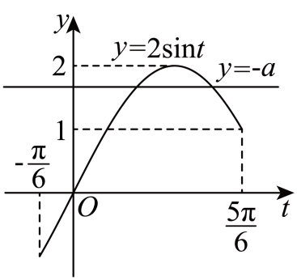

## 讲解

### 判据

题目要求指定区间内恰有几个零点，或方程 $f(x)+a=0$ 有几个不同实根，就把根的个数转成相位位置或曲线与水平线交点数。仅知道函数总值域，不足以判断每个值有几个原像。

### 流程

1. **把区间映到相位，并保留开闭端点。** 对 $u=\omega x+\varphi$，$\omega\ne0$，每个 $x$ 与一个 $u$ 一一对应，所以数相位根不会改变不同根的个数。若 $\omega<0$，重排相位两端并保留各端是否可取。
2. **零点问题先列相位序列。** 零中线且 $A\ne0$ 的正弦型函数，零点相位是 $k\pi$；余弦型为 $\frac\pi2+k\pi$。逐个判断哪些整数 $k$ 落在相位区间内，端点相等时按开闭决定计不计。不能只用“区间长度除以半周期”忽略开始位置和端点。
3. **恰有若干根，围住最后纳入与第一个排除者。** 开右端要包含某零点，端相位须严格超过它；开右端要排除下一个零点，端相位可以等于它。将这些关系转回参数不等式，端点的严格性有明确计数依据。
4. **非零水平线，分单调支数交点。** 方程 $A\sin u+b=c$ 转为曲线与水平线 $y=c$。把相位区间在峰、谷处切开，每支严格单调时同一水平线最多交一次；用每支实际达到的高度范围判断是否相交。
5. **合并时去掉重复峰谷。** 若相邻两支都包含同一个峰点，高度恰为峰值时交点只算一次，不能把两支各一次机械相加。区间端点允许取到则对应交点保留，开端点则排除。

若有竖直平移或绝对值，零点不再必定按半周期等距；先写实际方程，再数相位解族或图象各支。资料的作图应与函数系数一致，峰值标签可用于反查遗漏的振幅。

## 例题

### 例 1：HSMA-B1-C5-Da2574407ea2b-P0469

**原题、原答案与原详解**（来源段落 P0469—P0476；原资料的题名、地区和年份标注照录）

【例9】（24-25高一下·河南南阳·阶段练习）函数$f(x)=2\sin \left( \omega x+\frac{\pi }{3}\right)(\omega >0)$在区间$(0,2\pi )$上恰有$2$个零点，则$\omega $的取值范围为（    ）

A．$\left( \frac{5}{6},\frac{4}{3}\right)$  B．$\left[ \frac{5}{6},\frac{4}{3}\right)$  C．$\left( \frac{5}{6},\frac{4}{3}\right]$  D．$\left[ \frac{5}{6},\frac{4}{3}\right]$

【答案】C

【解题思路】根据$x$的取值范围求出$\omega x+\frac{\pi }{3}$的范围，再根据正弦函数的性质得到不等式组，解得即可.

【解答过程】因为$x\in (0,2\pi )$，$\omega >0$，所以$\omega x+\frac{\pi }{3}\in \left( \frac{\pi }{3},2\pi \omega +\frac{\pi }{3}\right)$，

又$f\left( x\right)$在区间$(0,2\pi )$上恰有$2$个零点，所以$2\pi <2\pi \omega +\frac{\pi }{3}\le 3\pi $，解得$\frac{5}{6}<\omega \le \frac{4}{3}$，

即$\omega $的取值范围为$\left( \frac{5}{6},\frac{4}{3}\right]$.

故选：C.

**展开解析（规范补讲）**

相位 $u=\omega x+\frac\pi3$ 随 $x$ 增加，因为 $\omega>0$。开区间 $(0,2\pi)$ 对应开相位区间 $(\frac\pi3,2\pi\omega+\frac\pi3)$，区间开闭必须保留。

正弦零点的相位是整数倍 $\pi$。左端位于 $0$ 与 $\pi$ 之间，所以前两个可能进入的零点是 $\pi,2\pi$，第三个是 $3\pi$。

要恰有两个零点，右端必须**超过** $2\pi$，保证第二个零点在开区间内；同时不能**超过** $3\pi$，保证第三个不进入。若右端恰为 $3\pi$，第三个位于被排除的端点，仍只算两个：
$$2\pi<2\pi\omega+\frac\pi3\le3\pi.$$
减去 $\frac\pi3$，再除以正数 $2\pi$，得到 $\frac56<\omega\le\frac43$。

- A 错误地排除了 $\omega=\frac43$；此时第三个零点只在右端，不计入。
- B 既误收下端又误排上端。
- C 开闭情况与上述计数一致，正确。
- D 误收 $\omega=\frac56$；此时第二个零点位于右端，区间内实际只有一个。

### 例 2：HSMA-B1-C5-Da2574407ea2b-P0553

**原题、原答案与原详解**（来源段落 P0553—P0574；原资料的题名、地区和年份标注照录）

【变式10-2】（2025高一下·全国·专题练习）已知函数$f\left( x\right)=2\sin \left( 2x-\frac{\pi }{6}\right)$．

(1)求$f\left( x\right)$的最小正周期以及单调递增区间；

(2)设函数$f\left( x\right)$在区间$\left[ \frac{\pi }{2},m\right]$上单调递减，求实数$m$的取值范围；

(3)当$x\in \left[ 0,\frac{\pi }{2}\right]$时，关于$x$的方程$f\left( x\right)+a=0$有两个不相等的实数根，求实数$a$的取值范围．

【答案】(1)$\pi $，$\left[ -\frac{\pi }{6}+k\pi ,\frac{\pi }{3}+k\pi \right],k\in Z$；

(2)$\frac{\pi }{2}<m\le \frac{5\pi }{6}$

(3)$-2<a\le -1$.

【解题思路】（1）运用正弦函数周期公式求出最小正周期，用整体代入法求单调区间；

（2）由$x\in \left[ 0,\frac{\pi }{2}\right]$ 时，得$2x-\frac{\pi }{6}\in \left[ \frac{5\pi }{6},2m-\frac{\pi }{6}\right]$，结合函数单调性列出m的不等式即可求出；

（3）方程$f\left( x\right)+a=0$有两个不相等的实数根，转化为函数$y=-a$与函数$y=\sin t$的图象有两个交点，结合图象求解即可.

【解答过程】（1）$f\left( x\right)=2\sin \left( 2x-\frac{\pi }{6}\right)$，所以函数的最小正周期为$T=\frac{2\pi }{2}=\pi $.

令$-\frac{\pi }{2}+2k\pi \le 2x-\frac{\pi }{6}\le \frac{\pi }{2}+2k\pi $，解得$-\frac{\pi }{6}+k\pi \le x\le \frac{\pi }{3}+k\pi $，

所以函数$f\left( x\right)$的单调递增区间为$\left[ -\frac{\pi }{6}+k\pi ,\frac{\pi }{3}+k\pi \right],k\in Z$.

（2）当$x\in \left[ \frac{\pi }{2},m\right]$时，$2x-\frac{\pi }{6}\in \left[ \frac{5\pi }{6},2m-\frac{\pi }{6}\right]$，

因为$f\left( x\right)$在区间$\left[ \frac{\pi }{2},m\right]$上单调递减，所以$\frac{5\pi }{6}<2m-\frac{\pi }{6}\le \frac{3\pi }{2}$，解得$\frac{\pi }{2}<m\le \frac{5\pi }{6}$.

所以实数$m$的取值范围是$\frac{\pi }{2}<m\le \frac{5\pi }{6}$.

（3）令$t=2x-\frac{\pi }{6}$，∵$x\in \left[ 0,\frac{\pi }{2}\right]$，∴$t=2x-\frac{\pi }{6}\in \left[ -\frac{\pi }{6},\frac{5\pi }{6}\right]$，

因为方程$f\left( x\right)+a=0$有两个不相等的实数根，

所以函数$y=-a$与函数$y=\sin t,t\in \left[ -\frac{\pi }{6},\frac{5\pi }{6}\right]$的图象有两个交点.

结合图象得，$1\le -a<2$，解得，$-2<a\le -1$.

所以实数$a$的取值范围是$-2<a\le -1$.

**展开解析（规范补讲）**

**原解勘误：** P0561 开头把第（2）问的 $x\in[\frac\pi2,m]$ 误写成 $x\in[0,\frac\pi2]$；P0562、P0571 写成 $y=\sin t$，应为 $y=2\sin t$。原图纵轴峰值为 $2$，原题、原图和最终范围均对应带系数 $2$ 的函数。原文如上保留，下面按原题说明。

（1）相位是 $2x-\frac\pi6$。相位增加 $2\pi$ 要求 $x$ 增加 $\pi$，所以 $T=\pi$。外系数为正、相位递增，令相位落在正弦的递增段：
$$-\frac\pi2+2k\pi\le2x-\frac\pi6\le\frac\pi2+2k\pi.$$
先加 $\frac\pi6$，再除以 $2$，得到 $[-\frac\pi6+k\pi,\frac\pi3+k\pi]$。

（2）原解按有长度的区间处理，即 $m>\frac\pi2$。左端相位为 $\frac{5\pi}6$，已在递减段 $[\frac\pi2,\frac{3\pi}2]$ 内；右端相位不能越过谷点 $\frac{3\pi}2$，否则后面开始上升。因此
$$\frac{5\pi}6<2m-\frac\pi6\le\frac{3\pi}2\quad\Longrightarrow\quad\frac\pi2<m\le\frac{5\pi}6.$$
题干未单独规定单点区间是否算单调区间，故保留原解的非退化区间口径，不把这一约定当成题干已明确给出的条件。

（3）令 $t=2x-\frac\pi6$。由于相位与 $x$ 一一对应，数 $x$ 的不同根等价于数 $t$ 的不同根；相位范围是 $[-\frac\pi6,\frac{5\pi}6]$。方程成为 $2\sin t=-a$，即曲线与水平线 $y=-a$ 的交点问题。

曲线在 $[-\frac\pi6,\frac\pi2]$ 上递增，函数值从 $-1$ 到 $2$；在 $[\frac\pi2,\frac{5\pi}6]$ 上递减，函数值从 $2$ 到 $1$。两支都能相交要求水平线高度 $-a$ 位于 $[1,2]$；高度 $2$ 时两支交于同一个峰点，只能算一个根，所以须排除 $2$。高度 $1$ 时两个交点不同，其中一个在右端，而右端允许取到，所以保留 $1$。

因此 $1\le-a<2$。乘 $-1$ 时不等号反向，得到 $-2<a\le-1$，与原答案一致。高度低于 $1$ 时只有上升支能相交；高于 $2$ 时不能相交，这也说明不能仅检查“在总值域内”就断定有两个根。

## 易错

- 只按区间长度估零点数：起始相位和端点是否开口会改变计数，必须列实际零点序列。
- 峰值处按“两支各交一次”算两根：两次落在同一个相位，只是一个不同实根。
- 方程改成水平线时漏振幅：$2\sin u=-a$ 应画 $y=2\sin u$，不能拿 $y=\sin u$ 的高度直接求参数。

## 来源与补讲边界

原资料 Da2574407ea2b P0468 起零点、P0538 起综合性质，选 P0469 与完整三小问 P0553。后一例的区间笔误、系数遗漏及非退化区间口径单独标明。交点分支和端点计数依据为规范补讲。
