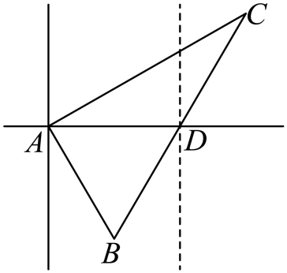

## 错法

航船从A沿正东到B，再从B向北偏东30°到C，就把30°或航向改变的60°当成 $\angle ABC$。原因是没有区分到达B时的前进方向AB与三角形从B出发的反向射线BA。

## 正解

内角必须取“从当前顶点出发、指向另两个顶点”的两射线。先画B当地北线及东西线，BA是正西，BC是北偏东30°；BA与BC夹角为90°+30°=120°。若先算前进航向AB与BC的60°，则三角形内角需取补角180°−60°。

有两灯塔或两个观测点时，各个“北偏东”都属于所在观测点。利用北线平行、反向射线与角和，把它们转成内角后才用正余弦定理。最后求新的方向，还要从三角形角回到当地北线，不能把算出的120°直接答成“北偏东120°”。

## 例题

### 原例：转向航线的直达距离

来源：`HSMA-B2-C6-D3cf589432aec-P0076-P0086`；原件《专题6.7 余弦定理、正弦定理应用举例（举一反三讲义）高一数学人教A版必修第二册（解析版）.docx》。括号中的地区、学年为讲义原标注，未另行核验。

以下保留原题、原答案与原详解（只统一公式排版）：

【变式1-1】（24-25高一下·北京顺义·期末）一艘海轮从港口A出发，沿着正东方向航行50n mile后到达海岛B，然后从海岛B出发，沿着北偏东30°方向航行70n mile后到达海岛C.如果下次航行直接从A出发到达C，那么这艘海轮需要航行的距离大约是（   ）

A．62.4n mile  B．85.0n mile  C．104.4n mile  D．116.0n mile

【答案】C

【解题思路】结合已知条件应用余弦定理计算求解.

【解答过程】

因为$\angle ABC=90^{\circ}+30^{\circ}=120^{\circ}$，且$AB=50n mile$.$BC=70n mile$.

在$\triangle ABC$中，由余弦定理得$A{C}^{2}=A{B}^{2}+B{C}^{2}-2\times AB\times BC\times \cos 120^{\circ}=2500+4900+3500=10900$，

即$AC=10\sqrt{109}n mile$.

所以$AC\approx 104.4n mile$；

故选：C.

#### 补充讲解

本题正确内角120°使交叉项为正3500，距离约104.4海里，C正确。错误内角60°使交叉项负3500，平方成3900，距离约62.4海里，正好落入A；这说明选项A反映的就是补角遗漏。B85.0、D116.0也不满足原方向对应的余弦式。

### 原例：航行后灯塔的新方向

来源：`HSMA-B2-C6-D3cf589432aec-P0171-P0184`；原件《专题6.7 余弦定理、正弦定理应用举例（举一反三讲义）高一数学人教A版必修第二册（解析版）.docx》。括号中的地区、学年为讲义原标注，未另行核验。

以下保留原题、原答案与原详解（只统一公式排版）：

【例3】（24-25高一下·浙江温州·期中）一艘渔船航行到$A$处时看灯塔$B$在$A$的南偏东30°，距离为6海里，灯塔$C$在$A$的北偏东60°，距离为$6\sqrt{3}$海里，该渔船由$A$沿正东方向继续航行到$D$处时再看灯塔$B$在其南偏西30°方向，则此时灯塔$C$位于渔船的（   ）

A．北偏东60°方向                      B．北偏西30°方向

C．北偏西60°方向                      D．北偏东30°方向

【答案】D

【解题思路】由正弦定理可得$AD=6$，由余弦定理得$CD=6$，由正弦定理得$\angle CDA$，即可求.

【解答过程】如图，

由题意，在$\triangle ABD$中，$\angle DAB=60^{\circ}$，$AB=6$，$\angle ADB=60^{\circ}$，

则$\triangle ABD$为正三角形，则$AD=6$，

在$\triangle ACD$中，因为$AC=6\sqrt{3}$，$\angle CAD=30^{\circ}$，

由余弦定理得$C{D}^{2}=A{C}^{2}+A{D}^{2}-2AC\times AD\times \cos 30^{\circ}={\left( 6\sqrt{3}\right)}^{2}+{6}^{2}-2\times 6\sqrt{3}\times 6\times \frac{\sqrt{3}}{2}=36$，

所以$CD=6$，故$\angle CDA=120^{\circ}$，

此时灯塔C位于渔船的北偏东$30^{\circ}$方向.

故选：D.

#### 补充讲解

从A看B南偏东30°，相对正东AD为60°；从D看B南偏西30°，相对正西DA也为60°，故ABD等边，AD=6。灯塔C从A看北偏东60°，相对正东为30°，所以ACD中A角30°。

余弦定理给CD=6，角D对最长边AC=6√3，$\cos D=(6^2+6^2-(6\sqrt3)^2)/(2\times6\times6)=-1/2$，故D内角120°。DA朝正西，DC位于其上方转120°，相对正东是60°，相对正北才是东偏30°，即北偏东30°，D正确。A、B、C分别偏角或象限不合。原解直接从CD=6跳到D=120°，本条补上这一步余弦判据，避免按图目测。
