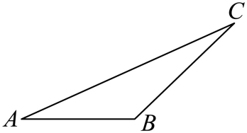
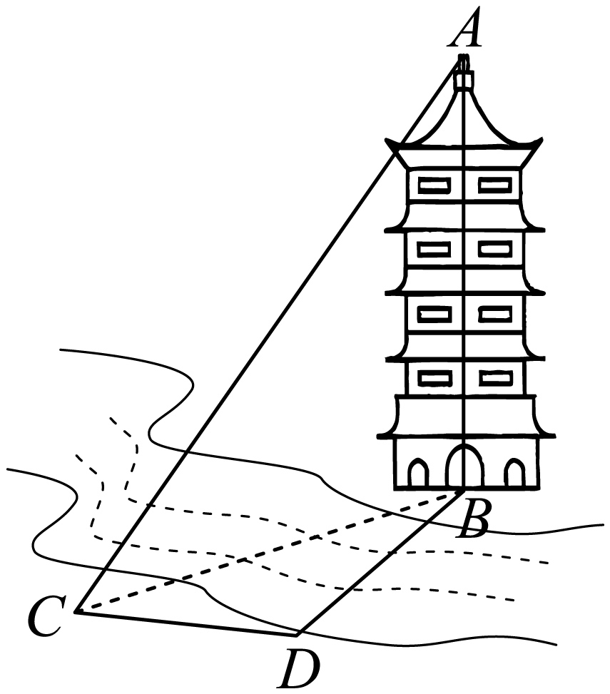

## 讲解

### 是什么

方位角从观测点的正北射线起，顺时针转到目标射线。为唯一表示方向，规范用 $0^\circ\le\theta<360^\circ$；正北、正东、正南、正西依次为0°、90°、180°、270°。来源 D3cf589432aec-P0018 的 image5 原载体写 $0^\circ\le\theta\le360^\circ$，允许北向重复写0°与360°；这里区分原文约定与唯一表示约定。

方向角“北偏东α”从北朝东转α；“南偏西α”从南朝西转α。$0<\alpha<90^\circ$ 时，四种方向角对应方位角为：北偏东α为α，南偏东α为180°−α，南偏西α为180°+α，北偏西α为360°−α。正东等轴向直接说明，不硬写成“偏”角。

仰角和俯角均在观测点视线与该点水平线所在的同一铅垂平面内量取：目标在水平线上方为仰角，下方为俯角；它们不是目标视线与竖直方向的角。基线是选来可直接测长的线段，用它连接可测角与未知长度。

### 怎么来的

两射线在同一观测点的夹角由它们相对于同一北向线的转角求出。设方位角为 $\theta_1,\theta_2$，先求差的绝对值 $d$，较小的非优角为 $\min(d,360^\circ-d)$。换成反向射线时方位角再加180°并按360°归一；三角形内角要用从该顶点指向另两顶点的射线，因此航向角差可能需取补角。

观测点与目标处水平线平行，俯视与反向仰视的角相等，来自平行线内错角。若目标比观测点高 $h$、水平距离 $d>0$、仰角α，则直角三角形给 $h=d\tan\alpha$。观测仪高出地面 $h_0$ 时，$h$ 是相对仪器的高度差，目标离地总高还要加 $h_0$。

### 什么时候能用

方位角用于水平面方向；仰俯角用于铅垂平面，不把两类角直接拼成一个平面三角形。若题目说三个测量基点在同一“平面”，测塔高还须按图确认是水平面、塔竖直、观测点在地面；斜面不满足 $h=d\tan\alpha$ 的直接模型。

## 易错

不能把“北偏东30°”中的30°直接当航线与正东的角，它是60°；俯角不是峰顶的三角形内角。基线长短与精度还受测角误差、几何布局影响，原资料“一般越长越精确”是常见布设经验，非无条件定理。

## 例题

### 原例：转向航线的直达距离

来源：`HSMA-B2-C6-D3cf589432aec-P0076-P0086`；原件《专题6.7 余弦定理、正弦定理应用举例（举一反三讲义）高一数学人教A版必修第二册（解析版）.docx》。括号中的地区、学年为讲义原标注，未另行核验。

以下保留原题、原答案与原详解（只统一公式排版）：

【变式1-1】（24-25高一下·北京顺义·期末）一艘海轮从港口A出发，沿着正东方向航行50n mile后到达海岛B，然后从海岛B出发，沿着北偏东30°方向航行70n mile后到达海岛C.如果下次航行直接从A出发到达C，那么这艘海轮需要航行的距离大约是（   ）

A．62.4n mile  B．85.0n mile  C．104.4n mile  D．116.0n mile

【答案】C

【解题思路】结合已知条件应用余弦定理计算求解.

【解答过程】

因为$\angle ABC=90^{\circ}+30^{\circ}=120^{\circ}$，且$AB=50n mile$.$BC=70n mile$.

在$\triangle ABC$中，由余弦定理得$A{C}^{2}=A{B}^{2}+B{C}^{2}-2\times AB\times BC\times \cos 120^{\circ}=2500+4900+3500=10900$，

即$AC=10\sqrt{109}n mile$.

所以$AC\approx 104.4n mile$；

故选：C.

#### 补充讲解

从B看A是正西，不是原航行的正东。北偏东30°相当于从正东逆时针60°，和正西BA之间的三角形内角为120°。代余弦定理得 $AC^2=10900$，$AC=10\sqrt{109}\approx104.4$ n mile，C正确。A、B、D数值都不同于此正平方根；其中把航向差60°当内角会错误减去3500，产生约62.4的A。

### 原例：水平基线转为塔高

来源：`HSMA-B2-C6-D3cf589432aec-P0125-P0134`；原件《专题6.7 余弦定理、正弦定理应用举例（举一反三讲义）高一数学人教A版必修第二册（解析版）.docx》。括号中的地区、学年为讲义原标注，未另行核验。

以下保留原题、原答案与原详解（只统一公式排版）：

【变式2-1】（24-25高一下·贵州黔南·期末）如图，某数学建模活动小组为了测量河对岸的塔高$AB$，选取与塔底B在同一平面的两个测量基点C与D．现测量得$\angle BCD=30^{\circ},\angle BDC=120^{\circ},CD=10m$，在点C处测得塔顶A的仰角为60°，则塔高$AB=$（   ）

A．20m  B．$20\sqrt{3}m$  C．30m  D．$30\sqrt{3}m$

【答案】C

【解题思路】在$\triangle BCD$中，由正弦定理求得$BC=10\sqrt{3}$，在$Rt\triangle ABC$中，解直角三角形得解.

【解答过程】在$\triangle BCD$中，由三角形内角和定理，

得$\angle CBD=180^{\circ}-\angle BDC-\angle BCD=180^{\circ}-120^{\circ}-30^{\circ}=30^{\circ}$.

由正弦定理，得$\frac{BC}{\sin \angle BDC}=\frac{CD}{\sin \angle CBD}$，即$\frac{BC}{\sin 120^{\circ}}=\frac{10}{\sin 30^{\circ}}$，解得$BC=10\sqrt{3}$．

在$Rt\triangle ABC$中，$AB=BC\tan 60^{\circ}=10\sqrt{3}\times \sqrt{3}=30$，即塔高$AB=30m$．

故选：C.

#### 补充讲解

这题先在水平面三角形BCD求水平距离BC，再在铅垂直角三角形ABC求塔高。$\angle CBD=30^\circ$，所以 $BC=10\sin120^\circ/\sin30^\circ=10\sqrt3$ m。仰角在C，$AB=BC\tan60^\circ=30$ m，C正确。A、B、D未等于这两段相连计算的30。

原题文字说“同一平面”，配图按水平地面、塔垂直解释；若仅给任意斜平面，就不能推 $AB\perp BC$。这是模型条件的说明，原题文字未被悄悄改写。
