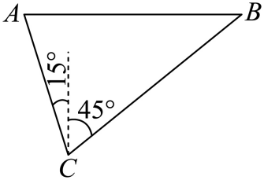
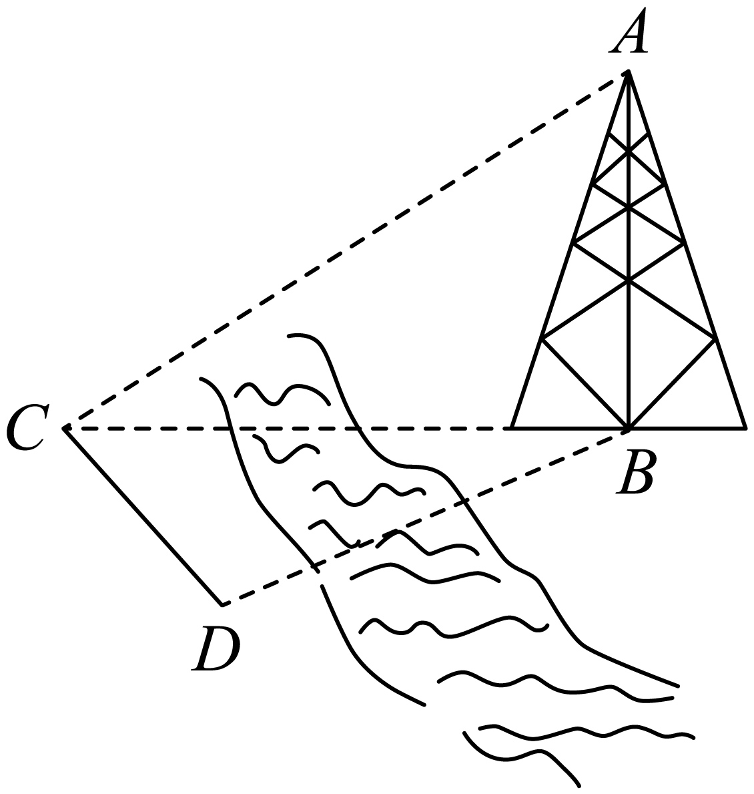

## 讲解

### 判据

未知线段不可直接测量时，选可达基线与可测方向角，用三角形把未知边接到已知边。测高通常需先求水平距离，再在另一个铅垂直角三角形中求高度。

### 流程与依据

1. 给每个观测点画当地北向或水平线，标清目标射线；利用平行方向线、反向射线补角，确定真实三角形内角。
2. 标可直接测长的基线，找与其连接的三角形。两角一边优先正弦定理，两边夹角优先余弦定理；不把几个不同平面的角强行画到同一平面三角形。
3. 一次仅求通向目标的必要长度。例如塔高先在水平面BCD求BC，再在铅垂面ABC用 $AB=BC\tan\angle ACB$。
4. 观测点离地高度、目标底部与观测点地面高差必须最后恢复；同高地面可直接用高度差，异高则按上下关系加减。
5. 全程统一长度单位，最后按要求近似，先保留精确三角函数或根式避免重复舍入。

## 易错

“同一水平面”是测塔直角模型的条件；塔斜、地面坡度或仪器高度不能忽略。基线的边—对角必须配对；题给一条边再给与它不对应的角，不能直接跨三角形组成比例。

## 例题

### 原例：两方位观测求距离

来源：`HSMA-B2-C6-D3cf589432aec-P0087-P0100`；原件《专题6.7 余弦定理、正弦定理应用举例（举一反三讲义）高一数学人教A版必修第二册（解析版）.docx》。括号中的地区、学年为讲义原标注，未另行核验。

以下保留原题、原答案与原详解（只统一公式排版）：

【变式1-2】（24-25高一下·辽宁辽阳·期末）已知点$A$在点$B$的正西方向，为了测量$A, B$两点之间的距离，在观测点$C$处测得$A$在$C$的北偏西$15^{\circ}$方向，$B$在$C$的北偏东$45^{\circ}$方向，且$B, C$两点之间的距离为20米，则$A,B$两点之间的距离为（    ）

A．$\left( 30\sqrt{2}-10\sqrt{6}\right)$米  B．$\left( 30\sqrt{2}+10\sqrt{6}\right)$米

C．$\left( 30-10\sqrt{3}\right)$米  D．$\left( 30+10\sqrt{3}\right)$米

【答案】A

【解题思路】根据题意作图，利用正弦定理求得$AB=\frac{10\sqrt{3}}{\sin {75}^\circ}$，根据两角和的正弦公式计算得$\sin {75}^\circ=\frac{\sqrt{2}+\sqrt{6}}{4}$，代入计算即可得解.

【解答过程】根据题意作图，

则$BC=20$，$\angle ACB={15}^\circ+{45}^\circ={60}^\circ$,$\angle BAC={90}^\circ-{15}^\circ={75}^\circ$，

在$\triangle ABC$中，根据正弦定理，$\frac{AB}{\sin \angle ACB}=\frac{BC}{\sin \angle BAC}$，

即$\frac{AB}{\sin {60}^\circ}=\frac{20}{\sin {75}^\circ}$，则$AB=\frac{10\sqrt{3}}{\sin {75}^\circ}$，

因为$\sin {75}^\circ=\sin \left( {30}^\circ+{45}^\circ\right)=\frac{1}{2}\times \frac{\sqrt{2}}{2}+\frac{\sqrt{3}}{2}\times \frac{\sqrt{2}}{2}=\frac{\sqrt{2}+\sqrt{6}}{4}$，

所以，$AB=10\sqrt{3}\times \frac{4}{\sqrt{2}+\sqrt{6}}=30\sqrt{2}-10\sqrt{6}$.

即$A,B$两点之间的距离为$\left( 30\sqrt{2}-10\sqrt{6}\right)$米.

故选：A.

#### 补充讲解

从C看A北偏西15°、B北偏东45°，夹角跨过北向为60°；A在B正西，则从A看B正东。从A看C是C看A的反向——南偏东15°，与正东形成75°，这说明为何A角不是15°。

比例 $AB/\sin60^\circ=20/\sin75^\circ$。用 $\sin75^\circ=(\sqrt6+\sqrt2)/4$ 后有 $AB=40\sqrt3/(\sqrt6+\sqrt2)$，乘共轭并除以6−2=4，得 $10\sqrt3(\sqrt6-\sqrt2)=30\sqrt2-10\sqrt6$ m，A正确。B把有理化时的减号写成加号，C、D丢失根号2对应尺度，均不满足原比例。

### 原例：两个基点求距离与塔高

来源：`HSMA-B2-C6-D3cf589432aec-P0135-P0150`；原件《专题6.7 余弦定理、正弦定理应用举例（举一反三讲义）高一数学人教A版必修第二册（解析版）.docx》。括号中的地区、学年为讲义原标注，未另行核验。

以下保留原题、原答案与原详解（只统一公式排版）：

【变式2-2】（24-25高一下·吉林·期末）如图，测量河对岸的塔高$AB$时，可以选取与塔底B在同一水平面内的两个测量基点C与D．现测得$\angle BCD=60^{\circ}$，$\angle BDC=75^{\circ}$，$CD=60m$，并在点C处测得塔顶A的仰角$\angle ACB=30^{\circ}$.

(1)求B与D两点间的距离；

(2)求塔高$AB$.

【答案】(1)$30\sqrt{6}(m)$

(2)$30+10\sqrt{3}(m)$

【解题思路】（1）根据正弦定理即可得到答案；

（2）首先根据正弦定理求出$BC$，再根据三角函数定义即可得到答案.

【解答过程】（1）在$\triangle BCD$中，$\because \angle BCD={60}^\circ,\angle BDC={75}^\circ,\therefore \angle CBD={45}^\circ$.

由正弦定理得$\frac{BD}{\sin \angle BCD}=\frac{CD}{\sin \angle CBD}$，

$BD=\frac{CD\sin \angle BCD}{\sin \angle CBD}=\frac{60\times \frac{\sqrt{3}}{2}}{\frac{\sqrt{2}}{2}}=30\sqrt{6}(m)$，

（2）$\sin {75}^\circ=\sin \left( {45}^\circ+{30}^\circ\right)=\sin {45}^\circ\cos {30}^\circ+\cos {45}^\circ\sin {30}^\circ=\frac{\sqrt{2}}{2}\times \frac{\sqrt{3}}{2}+\frac{\sqrt{2}}{2}\times \frac{1}{2}=\frac{\sqrt{6}+\sqrt{2}}{4}$.

在$\triangle BCD$中，由正弦定理得

$\frac{BC}{\sin \angle BDC}=\frac{CD}{\sin \angle CBD}$，

$BC=\frac{CD\sin \angle BDC}{\sin \angle CBD}=\frac{60\times \frac{\sqrt{6}+\sqrt{2}}{4}}{\frac{\sqrt{2}}{2}}=30+30\sqrt{3}(m)$，

在$Rt\triangle ABC$中，$AB=BC\tan \angle ACB=BC\tan {30}^\circ=\frac{\sqrt{3}}{3}\times 30(\sqrt{3}+1)=30+10\sqrt{3}(m)$.

#### 补充讲解

两小问都在同一水平三角形BCD开始，第三角B=45°。BD对60°，BC对75°，CD对45°：因此BD=30√6 m，BC=30+30√3 m。千万别把第一问BD直接当第二问的塔到C水平距离，仰角是在C，所需距离是BC。

铅垂三角形ABC中 $AB=BC\tan30^\circ=(30+30\sqrt3)/\sqrt3=30+10\sqrt3$ m。原答案两个长度均保留。该计算依赖塔垂直于水平面、C与塔底同高，题干已明确基点与塔底同一水平面。
