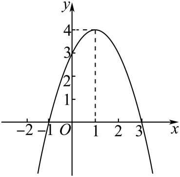

## 讲解

### 是什么

二次函数形如 $f(x)=ax^2+bx+c$，其中 $a,b,c$ 是给定实常数，$a\ne0$，$x$ 是自变量，$f(x)$ 是对应函数值。$a$ 是二次项系数；若 $a=0$，最高次数下降，应按一次函数或常数函数处理，不能继续称作二次函数。

单独给这个多项式时，所有实数都可以代入；若题设给指定区间或实际变量范围，函数的定义域要按题设限制。图象是允许的点 $(x,f(x))$ 组成的曲线：全实数定义域对应整条抛物线，限制定义域后只保留其中相应部分。

抛物线 $a>0$ 时开口向上，$a<0$ 时向下。对称轴是直线 $x=h$，顶点是点 $(h,k)$；若定义域允许顶点，开口向上时的最小值或向下时的最大值才是纵坐标 $k$。这三个对象不能混写。零点是使 $f(x)=0$ 的实数 $x$，对应横轴交点 $(x,0)$；纵截距是 $f(0)=c$，但若定义域不含 $0$，这只是多项式在 $0$ 的值，并不是当前图象实际包含的交点。

“在区间 $I$ 上递增”要求任意 $u<v$ 且 $u,v\in I$ 时都有 $f(u)<f(v)$，递减则要求 $f(u)>f(v)$。本条按严格单调定义讨论，不能只挑两个点上升就宣称整段递增。顶点可以作为单调区间端点收入，因为比较的是两个不同点。

### 怎么来的

用完全平方公式，把式子写成“平方距离＋常数”。先提出非零的二次系数：

$$f(x)=a\left(x^2+\frac ba x\right)+c.$$

为了让括号中的一次项成为平方展开中的 $2tx$，选 $t=b/(2a)$。在括号中补 $b^2/(4a^2)$，外面要减去它乘 $a$ 后的量，才能保持原值：

$$
f(x)=a\left(x^2+\frac ba x+\frac{b^2}{4a^2}\right)+c-\frac{b^2}{4a}
=a\left(x+\frac b{2a}\right)^2+\frac{4ac-b^2}{4a}.
$$

令 $h=-b/(2a),k=(4ac-b^2)/(4a)$，得到 $f(x)=a(x-h)^2+k$。这里 $x-h$ 是到轴的有向差，平方只看距离。$h-d$ 与 $h+d$ 的平方距离相同，因此函数值相同，轴为 $x=h$；平方最小为零，$a>0$ 时顶点最低，$a<0$ 时顶点最高。

单调性也从平方距离证明，无需导数。对 $u<v$，两函数值相减，先消去同一个 $k$，再用平方差公式：

$$
f(v)-f(u)
=a[(v-h)^2-(u-h)^2]
=a[(v-h)-(u-h)][(v-h)+(u-h)]
=a(v-u)(u+v-2h).
$$

第一因子 $v-u$ 正。在轴左侧 $u<v\le h$，有 $u+v<2h$，最后因子负；在右侧 $h\le u<v$，最后因子正。于是：$a>0$ 时左减右增，$a<0$ 时左增右减。即使其中一点是顶点，另一点不同，严格符号仍成立。

两实零点 $\alpha,\beta$ 的中点也给对称轴。因式式展开为 $a[x^2-(\alpha+\beta)x+\alpha\beta]$，一次项系数满足 $b=-a(\alpha+\beta)$，所以 $h=(\alpha+\beta)/2$。它要求确有实零点，不能把无实根的代数符号当作图象交点。

### 什么时候能用

配方、轴和上述单调结论均要求真正的二次函数。含参数时先查二次项是否可能为零。两点在轴不同侧，不能直接按自变量大小判断函数值；应比较到轴的距离，或先利用对称性把一个点移到同侧。$a>0$ 时距离越大函数值越大，$a<0$ 时相反。

求指定区间最值，先查顶点是否属于定义域。属于时能取得相应顶点最值；不属于时看允许点到轴的距离范围。另一方向的界通常由更远的一端决定，但开端点处的函数值可能不能取得。两个端点等距时，闭端点可以同时达到同一极值。

端点横坐标不允许，不代表这个纵坐标一定不能取：还可能有另一个对称的允许点。下方原题定义域 $(-1,2)$ 中，右端 $2$ 不收入，它的函数值却在另一个允许点取得；值域应检查函数值真正能否出现。

在指定区间递增，只要求整段落在递增一侧，不要求这个区间就是最大递增区间。下方 $(3,+\infty)$ 原题允许轴恰为 $3$，因为每个允许点都在右侧；开端点不自动使参数边界变成严格不等号。

> 原知识定位：专题2.3（D8127d1363b97）知识点“二次函数的图象与性质”及题型8、9。配方、平方差证明、定义域与最值边界按数学规范补讲；原题原图与原解在下方保留。

## 例题

### 原题 9-1

> 来源ID HSMA-B1-C2-D8127d1363b97-P0477；原件 `专题2.3 二次函数与一元二次方程、不等式（举一反三讲义）数学人教A版2019必修第一册（解析版）.docx`；DOCX正文段落 P0477—P0479；答案与详解 P0480—P0486。年份、地区和试题标签沿原资料记载，未独立核实。

**原资料题干与选项：**

【变式9-1】（24-25高二下·山东潍坊·期末）已知二次函数$f(x)=a{x}^{2}+bx+c(a>0)$的图像与x轴交点的横坐标为$-5$和3，则二次函数的单调递减区间为（    ）

A．$(-\infty ,-1]$  B．$[-1,+\infty )$

C．$(-\infty ,2]$  D．$[2,+\infty )$

**原资料答案与详解（完整保留，公式转写为LaTeX）：**

【答案】A

【解题思路】由题意求得对称轴，再由开口方向求解.

【解答过程】解：因为二次函数$f(x)=a{x}^{2}+bx+c(a>0)$的图像与x轴交点的横坐标为$-5$和3，

所以其对称轴方程为：$x=\frac{-5+3}{2}=-1$，

又$a>0$，

所以二次函数的单调递减区间为$(-\infty ,-1]$，

故选：A.

**展开解析与核验（依据原详解补足，勘误另标）：**

两根为$-5,3$，二次函数轴在两根中点$h=(-5+3)/2=-1$。$a>0$，轴左侧距离顶点越近平方越小，函数递减，所以最大单调递减区间是$(-\infty,-1]$，A正确。

B是递增区间；C跨过顶点到2，跨轴后已递增，整段不递减；D也在递增侧且错误轴为2。包含顶点不妨碍严格单调：两个不同左侧点中右者的平方距离严格更小。不是因为顶点导数为0就必须删掉顶点，本节不用导数。

### 原题 9-2

> 来源ID HSMA-B1-C2-D8127d1363b97-P0487；原件 `专题2.3 二次函数与一元二次方程、不等式（举一反三讲义）数学人教A版2019必修第一册（解析版）.docx`；DOCX正文段落 P0487—P0488；答案与详解 P0489—P0497。年份、地区和试题标签沿原资料记载，未独立核实。

**原资料题干与选项：**

【变式9-2】（24-25高一上·陕西渭南·期末）已知函数$f(x)=a{x}^{2}+2ax-3(a>0)$，则（    ）

A．$f(0)>f(1)$  B．$f(-2)>f(4)$  C．$f(-3)>f(1)$  D．$f(-4)>f(1)$

**原资料答案与详解（完整保留，公式转写为LaTeX）：**

【答案】D

【解题思路】求出对称轴，确定单调性，然后判断各选项即可．

【解答过程】$f(x)=a{x}^{2}+2ax-3(a>0)$对称轴为$x=-1$，

则$f(x)$在$(-\infty ,-1]$上单调递减，在$[-1,+\infty )$上是单调递增，

A：$f(0)<f(1)$，故A错误；

B：$f\left( -2\right)=f(0)<f\left( 4\right)$，故B错误；

C：$f\left( 1\right)=f(-3)$，故C错误；

D：$f\left( 1\right)=f\left( -3\right)<f(-4)$，故D正确.

故选：D.

**展开解析与核验（依据原详解补足，勘误另标）：**

配方$f(x)=a(x+1)^2-a-3$，$a>0$。比较函数值等价于比较到轴$-1$的距离平方。

A：0、1距离1、2，故$f(0)<f(1)$；B：$-2,4$距离1、5，故$f(-2)<f(4)$；C：$-3,1$距离均2，故相等；D：$-4,1$距离3、2，故$f(-4)>f(1)$。选D。这种比较允许两个点位于轴两侧，不能跨轴直接套“x越大函数越大”。常数项同减不影响比较。

### 原题 9-3

> 来源ID HSMA-B1-C2-D8127d1363b97-P0498；原件 `专题2.3 二次函数与一元二次方程、不等式（举一反三讲义）数学人教A版2019必修第一册（解析版）.docx`；DOCX正文段落 P0498—P0499；答案与详解 P0500—P0504。年份、地区和试题标签沿原资料记载，未独立核实。

**原资料题干与选项：**

【变式9-3】（24-25高一上·海南·阶段练习）若函数$f\left( x\right)={x}^{2}+\left( 1+a\right)x+2$在区间$\left( 3,+\infty \right)$上单调递增，则实数$a$的取值范围是（   ）

A．$\left( -\infty ,7\right]$  B．$\left[ 7,+\infty \right)$  C．$\left[ -7,+\infty \right)$  D．$\left( -\infty ,-7\right]$

**原资料答案与详解（完整保留，公式转写为LaTeX）：**

【答案】C

【解题思路】依题意，只需使$\left( 3,+\infty \right)$为已知函数的递增区间的子集，列不等式，解之即得.

【解答过程】函数$f\left( x\right)={x}^{2}+\left( 1+a\right)x+2$的图象开口向上，对称轴为直线$x=-\frac{1+a}{2}$，

由函数$f\left( x\right)$在区间$\left( 3,+\infty \right)$上单调递增，可得$-\frac{1+a}{2}\le 3$，解得$a\ge -7$.

故选:C.

**展开解析与核验（依据原详解补足，勘误另标）：**

轴为$h=-(1+a)/2$，开口向上，轴右侧递增。整段$(3,+\infty)$递增要求$h\le3$，得到$a\ge-7$，C正确。

即使3不是区间成员，也允许$h=3$，因为所有允许x都严格在轴右侧。若$h>3$，可在$(3,h)$中选两个不同点，该段函数递减，否定整段递增，所以必要性也成立。A、D方向错误，B错把边界写7而漏合法的$[-7,7)$。$a=-7$时$f=(x-3)^2-7$在$x>3$确实递增。

### 原题 P0462

> 来源ID HSMA-B1-C2-De3e177f3ec4c-P0462；原件 `第二章 一元二次函数、方程和不等式（举一反三讲义·基础篇）数学人教A版2019必修第一册（解析版）.docx`；DOCX正文段落 P0462—P0464；答案与详解 P0465—P0476。年份、地区和试题标签沿原资料记载，未独立核实。

**原资料题干与选项：**

4．（24-25高一上·广东佛山·阶段练习）已知二次函数$f\left( x\right)=-{x}^{2}+2x+3$．

(1)画出函数$f\left( x\right)$图像，并比较$f\left( 0\right)$，$f\left( 1\right)$，$f\left( 3\right)$的大小（不需要写画图过程）；

(2)求不等式$xf\left( x\right)<0$的解集．

**原资料答案与详解（完整保留，公式转写为LaTeX）：**

【答案】(1)图像见解析，$f\left( 1\right)>f\left( 0\right)>f\left( 3\right)$

(2)$\left( -1,0\right)\cup \left( 3,+\infty \right)$

【解题思路】（1）利用二次函数的画法画出$f\left( x\right)=-{x}^{2}+2x+3$图像即可

（2）结合图像解不等式.

【解答过程】（1）由二次函数$f\left( x\right)=-{x}^{2}+2x+3$，即$f\left( x\right)=-{\left( x-1\right)}^{2}+4$的图像如图所示：

由图像，可知$f\left( 1\right)>f\left( 0\right)>f\left( 3\right)$．

注意：图像应体现关键点$\left( -1,0\right)$，$\left( 0,3\right)$，$\left( 1,4\right)$，$\left( 3,0\right)$．

（2）∵不等式$xf\left( x\right)<0$，

∴当$x>0$时，$f\left( x\right)<0$，由图像可知，$x>3$；

当$x<0$时，$f\left( x\right)>0$，由图像可，$-1<x<0$；

∴不等式$xf\left( x\right)<0$的解集为$\left( -1,0\right)\cup \left( 3,+\infty \right)$．

**展开解析与核验（依据原详解补足，勘误另标）：**

（1）配方$f(x)=-(x-1)^2+4$，开口向下，顶点(1,4)，轴$x=1$。分解$f(x)=-(x+1)(x-3)$得到横轴交点(-1,0)、(3,0)，直接代入得纵截距(0,3)；这些点构成原图必要特征。数值$f(0)=3,f(1)=4,f(3)=0$，所以$f(1)>f(0)>f(3)$。

（2）$xf(x)=-x(x+1)(x-3)<0$等价于$x(x+1)(x-3)>0$。根-1、0、3把数轴分四段，正积位于$(-1,0)$及$(3,+\infty)$，三根都为零不收。也可把$x>0,f(x)<0$与$x<0,f(x)>0$两情况分别取交集，得到同一解集。

### 原题 P0477

> 来源ID HSMA-B1-C2-De3e177f3ec4c-P0477；原件 `第二章 一元二次函数、方程和不等式（举一反三讲义·基础篇）数学人教A版2019必修第一册（解析版）.docx`；DOCX正文段落 P0477—P0479；答案与详解 P0480—P0489。年份、地区和试题标签沿原资料记载，未独立核实。

**原资料题干与选项：**

5．（24-25高一上·新疆喀什·期中）已知二次函数$f(x)=m{x}^{2}+4x+1$且满足$f(-1)=f(3)$．

(1)求函数$f(x)$的解析式；

(2)若函数$f(x)$的定义域为$\left( -1,2\right)$，作出函数$f(x)$图象并求其值域．

**原资料答案与详解（完整保留，公式转写为LaTeX）：**

【答案】(1)$f(x)=-2{x}^{2}+4x+1$；

(2)作图见解析，$(-5,3]$．

【解题思路】（1）由$f(-1)=f(3)$，列方程求出$m$，可得函数$f(x)$的解析式；

（2）由二次函数的图象特征，作出函数$f(x)$图象，根据图象求值域．

【解答过程】（1）二次函数$f(x)=m{x}^{2}+4x+1$满足$f(-1)=f(3)$，

则有$m-4+1=9m+12+1$，解得$m=-2$，

所以$f(x)=-2{x}^{2}+4x+1$.

（2）函数$f(x)$的定义域为$\left( -1,2\right)$，函数图象如图所示，

  

由函数图象可知，函数$f(x)$的值域为$\left( -5,3\right]$.

**展开解析与核验（依据原详解补足，勘误另标）：**

（1）$f(-1)=m-3$，$f(3)=9m+13$，同值条件$m-3=9m+13$给$-8m=16$、$m=-2$。回代$f(x)=-2(x-1)^2+3$。

（2）定义域$(-1,2)$先按轴1分开。左段$(-1,1]$递增，距离轴的量$1-x$恰好遍历$[0,2)$，所以$t=(x-1)^2$恰好遍历$[0,4)$：每个这样的$t$都可由$x=1-\sqrt t\in(-1,1]$实现。由$f=3-2t$，同乘负数$-2$反向再加3，得到$-5<f\le3$，这一段已覆盖$(-5,3]$。在右段$(1,2)$，距离$x-1$在$(0,1)$，其平方在$(0,1)$，所以函数值在$(1,3)$，并入左段不增加值。故值域为$(-5,3]$，最大值3在$x=1$取得，下界-5不能取得。右端2虽不取，但值1在$x=0$实际取得；定义域的开端点不自动使同一纵坐标被排除，必须检查有无另一个允许点。

## 易错

- 把轴、顶点和最值写成同一个对象：轴是直线，顶点是点，最值是函数值。
- 参数使二次项为零仍配方除以它：先分类退化，不允许除零。
- 跨轴按自变量大小比较函数：先比较到轴的距离，并检查开口方向。
- 顶点被当作不能收入单调区间的点：严格单调比较两个不同点，顶点可作为端点。
- 定义域开端点就直接删去对应纵坐标：先查另一个允许点能否取得同值。
- 指定区间递增就令轴等于区间端点：轴也可以在整段左边；应判断区间包含关系。
