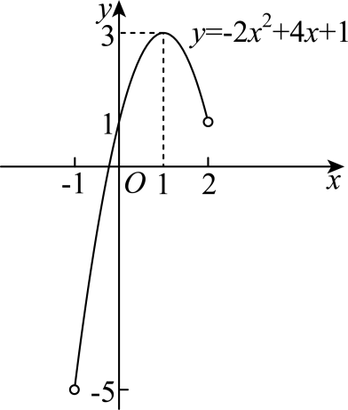

## 讲解

### 判据

给出二次函数和自变量区间 I，要求全部可能函数值，入口是“允许点离对称轴多远”。值域由实际取得的纵坐标组成：上、下界是否能取到，要找允许的自变量证明；不能机械复制 I 的开闭括号，也不能只报全实数定义域时的顶点最值。

本条处理 a≠0 且 I 为非空区间的二次函数。若实际定义域被分母禁值等切成几段，先按真实允许段分别求值域再取并集；若 a=0，改按一次或常数函数处理。若区间无界，函数值可能无上界或无下界，“∞”不是能取得的函数值。

### 流程

1. **写清允许区间并配方。** f(x)=a(x-h)²+k，记录 a 的符号、轴 h 和每个有限端点是否允许。目的在于把函数值与非负距离联系起来。
2. **判断轴的位置。** h 在 I 内时允许顶点，距离最小为零；轴在区间外时，距离随 x 沿整段单向变化；轴等于未取端点时，距离可以趋近零但未必取零。
3. **按轴分段求函数值范围。** 各段是单调段，计算允许端点的值；未允许的端点只给趋近的界。先列距离范围，再平方、乘 a、加 k；a<0 时上下方向对换。
4. **证明中间值都能取得。** 非负距离 d 在该段覆盖一个区间，d² 的中间值 w 用 d=√w 恢复，再选该段合法的 x=h±d。这样说明是一整段值域，不能只列几个端点值。
5. **合并后重新查界值可达性。** 任何允许段出现的纵坐标都属于总值域，所以取并集。一个端点不取并不自动排除其函数值，还须检查是否有另一个允许点取同值。
6. **写最终集合并回代。** 每个闭端点给出一个允许 x；每个开端点说明全部原像都不合法，或仅能逼近。若区间或轴含参数，分类位置后各自完成这一步。

### 开端点的纵坐标能否在别处取得

对一个界值 v，解 a(x-h)²+k=v。在 a≠0 下先求 (v-k)/a；为负就没有实原像，为零只有轴 h，为正有两个对称原像

$$
x=h\pm\sqrt{\frac{v-k}{a}}.
$$

只要至少一个原像在 I 内，v 就在值域中。对于有限区间端点 r 的函数值，这两个原像为 r 与 2h-r；r 不允许时，另一点仍可能允许。这个判断来自平方等式，不能凭图上“看起来能达到”断定。

正首项的顶点值 k 是最小值，负首项是最大值，但只有 h∈I 才取得。区间内离轴最远的距离决定另一个方向的界；若最远端点不允许，还要检查对称端点是否允许。同距两端中只要一端可取，对应界值就可取。

下面原题两问完整保留。值域的可达性还可直接核对：在允许左段取得的每个 y，选择负向平方根构造原像；这是规范补足原解析“由图可知”的依据，不另编题。

## 例题

### 原题 P0477

> 来源ID HSMA-B1-C2-De3e177f3ec4c-P0477；原件 `第二章 一元二次函数、方程和不等式（举一反三讲义·基础篇）数学人教A版2019必修第一册（解析版）.docx`；DOCX正文段落 P0477—P0479；答案与详解 P0480—P0489。年份、地区和试题标签沿原资料记载，未独立核实。

**原资料题干与选项：**

5．（24-25高一上·新疆喀什·期中）已知二次函数$f(x)=m{x}^{2}+4x+1$且满足$f(-1)=f(3)$．

(1)求函数$f(x)$的解析式；

(2)若函数$f(x)$的定义域为$\left( -1,2\right)$，作出函数$f(x)$图象并求其值域．

**原资料答案与详解（完整保留，公式转写为LaTeX）：**

【答案】(1)$f(x)=-2{x}^{2}+4x+1$；

(2)作图见解析，$(-5,3]$．

【解题思路】（1）由$f(-1)=f(3)$，列方程求出$m$，可得函数$f(x)$的解析式；

（2）由二次函数的图象特征，作出函数$f(x)$图象，根据图象求值域．

【解答过程】（1）二次函数$f(x)=m{x}^{2}+4x+1$满足$f(-1)=f(3)$，

则有$m-4+1=9m+12+1$，解得$m=-2$，

所以$f(x)=-2{x}^{2}+4x+1$.

（2）函数$f(x)$的定义域为$\left( -1,2\right)$，函数图象如图所示，

  

由函数图象可知，函数$f(x)$的值域为$\left( -5,3\right]$.

**展开解析与核验（依据原详解补足，勘误另标）：**

（1）$f(-1)=m-3$，$f(3)=9m+13$，同值条件$m-3=9m+13$给$-8m=16$、$m=-2$。回代$f(x)=-2(x-1)^2+3$。

（2）定义域$(-1,2)$先按轴1分开：在$(-1,1]$递增，逼近左端-1时函数趋于-5而不取-5，在$x=1$取3，已覆盖$(-5,3]$；在$(1,2)$递减，函数落在$(1,3)$，并入前段不增加值。故值域$(-5,3]$。右端2虽不取，但值1在$x=0$实际取得；定义域的开端点不自动使同一纵坐标被排除，必须检查有无另一个允许点。

**补足值域的全部取得与两个边界：** 对任意 y∈(-5,3]，由 0≤(3-y)/2<4，选择

$$
x=1-\sqrt{\frac{3-y}{2}}.
$$

正根满足 0≤√((3-y)/2)<2，所以 -1<x≤1，确在原定义域内；代回 f(x)=-2(x-1)²+3=y，证明这段所有 y 都取得，不只是端点值。对 y=-5，两原像 -1、3 都不属于 (-1,2)，所以不取得；对 y=3，原像 x=1 合法，取得。对 y=1，原像 0、2 中虽 2 不允许，0 允许，因此纵坐标 1 仍在值域里。

## 易错

- 顶点不在限制区间却仍把$k$写成最值：检查$h$是否为允许自变量，必要时由单调性确定边界。
- 区间开端点就排除其函数值：还需查对称点或直接解方程验证是否有别的允许点。
- 左右段求出的范围取交集：值域包含任一允许自变量产生的值，应取并集。
- 只报上、下界没有可达性：分别说明哪个允许点取到，或为什么只有趋近而不取。
