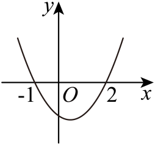
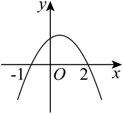
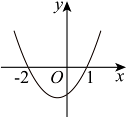
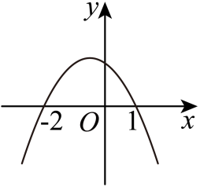
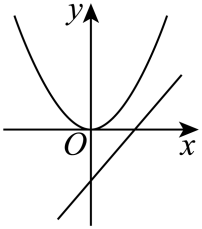
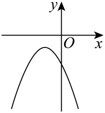
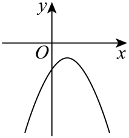
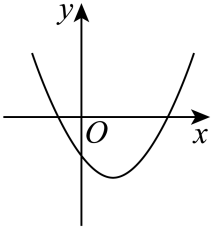
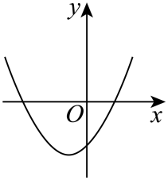

## 讲解

### 判据

题目给完整二次不等式解集、两个已知函数图象或明确系数关系，要求判断另一个二次函数的图象时，入口是把题设翻译成代数约束。开口、纵截距、轴、实根共同约束图象；只看一个特征可能留下多个选项。

图上明确的坐标标记、直线增长方向、抛物线开口及点在坐标轴哪侧，是题设提供的信息。不能凭示意尺寸求未标系数的具体数值，也不能从图上量出一个未给的横坐标。下面保留原选项图，不用重绘图替代题设。

### 流程

1. **辨明给的是哪个表达式。** 原式的二次项、一次项、常数分别是什么？若是完整实数解集，有限两边界可按三二次关系恢复零点与首项符号；若只是限制区间的一部分解，不可直接这样反求。
2. **逐条翻译题设。** 原抛物线开口给实际二次项符号，直线向右增或减给斜率符号，纵轴交点给常数符号；实根 r₁、r₂ 给根和与根积关系。每条关系注明来自哪个题设。
3. **重认目标函数的实际系数。** 统一写成 Y=Ax²+Bx+C，再代刚得到的关系。原式为 cx²+ax+b 时，目标可能为 ax²+bx-c，不能照搬原首项 c、原轴或原零点。
4. **算足可确定特征。** 开口由 A，纵截距是 C，轴为 -B/(2A)；可分解就找根，否则用 Δ=B²-4AC 与根和积判断根数、左右位置。A=0 时实际为直线或常数，应单独处理。
5. **逐图核对并给出矛盾。** 每个错误选项至少指出一个决定性冲突；正确图也须兼容全部已知特征。题问“可能”时，只需符合这些约束，不能额外规定未给的系数大小。
6. **核对原图与原解析。** 对图上真正标注的零点和轴位置核对代数；若原解与图或题设冲突，保留原说法另标勘误。不能静默改图或换题。

### 系数关系怎样变成几何特征

若实际二次项 A≠0，将平方配齐：

$$
Ax^2+Bx+C
=A\left(x+\frac{B}{2A}\right)^2
+C-\frac{B^2}{4A}.
$$

平方项说明开口与轴；代 x=0 得纵截距 C。有两根时，因式 A(x-r₁)(x-r₂) 展开为 Ax²-A(r₁+r₂)x+Ar₁r₂，比较系数得到根和 -B/A、根积 C/A。根的位置必须有实根前提；不能先说“根积负”却不交代根是否存在。

特别地，A 与 C 异号时 AC<0，于是 Δ=B²-4AC>B²≥0，确有两个不同实根；再由 C/A<0 判断它们一正一负。这给出“纵截距负、开口向上时跨 x 轴两侧”的代数依据，并不是从未按比例绘制的图猜结论。

选例 8-0要把原系数位置换到新函数，选例 8-2把已给两图读成符号再判断目标。两题所有原图与选项完整保留，具体关系与排项放在例题中。其他重复选图题由旧稿保全，不把题目数量作为知识库深度。

## 例题

### 原题 8-0

> 来源ID HSMA-B1-C2-D8127d1363b97-P0431；原件 `专题2.3 二次函数与一元二次方程、不等式（举一反三讲义）数学人教A版2019必修第一册（解析版）.docx`；DOCX正文段落 P0431—P0433；答案与详解 P0434—P0439。年份、地区和试题标签沿原资料记载，未独立核实。

**原资料题干与选项：**

【例8】（24-25高一上·福建福州·阶段练习）不等式$c{x}^{2}+ax+b>0$的解集为$\left\{ x\left| -1<x<\frac{1}{2}\right.\right\}$，则函数$y=a{x}^{2}+bx-c$的图象大致为（   ）

A．      B．  

C．    D．  

**原资料答案与详解（完整保留，公式转写为LaTeX）：**

【答案】B

【解题思路】根据不等式的解集得到$c<0$，$-1,\frac{1}{2}$为$c{x}^{2}+ax+b=0$的两个根，由韦达定理得到$a=\frac{1}{2}c<0,b=-\frac{1}{2}c>0$，从而根据二次函数的对称轴，开口方向及与$y$轴交点纵坐标的正负得到答案.

【解答过程】由题意得$c<0$，$-1,\frac{1}{2}$为$c{x}^{2}+ax+b=0$的两个根，

故$-1+\frac{1}{2}=-\frac{a}{c},-1\times \frac{1}{2}=\frac{b}{c}$，即$a=\frac{1}{2}c<0,b=-\frac{1}{2}c>0$，

$y=a{x}^{2}+bx-c$开口向下，对称轴为$x=-\frac{b}{2a}>0$，与$y$轴交点纵坐标为$-c>0$

故选：B.

**展开解析与核验（依据原详解补足，勘误另标）：**

原不等式正值区间为$(-1,1/2)$，是有界中间，说明$c<0$，且两个端点为零点。于是$c x^2+a x+b=c(x+1)(x-1/2)$，展开得$a=c/2<0,b=-c/2>0$。

新函数为$y=(c/2)x^2-(c/2)x-c=(c/2)(x+1)(x-2)$，开口向下、根$-1,2$、轴$x=1/2$、纵截距$-c>0$。A虽根相同却开口向上；B全部符合；C开口向上且根为$-2,1$；D开口向下但根为$-2,1$，不符，所以选B。依据的是原图的坐标标记、开口与轴位置，不从示意尺寸估测参数绝对值。

### 原题 8-2

> 来源ID HSMA-B1-C2-D8127d1363b97-P0448；原件 `专题2.3 二次函数与一元二次方程、不等式（举一反三讲义）数学人教A版2019必修第一册（解析版）.docx`；DOCX正文段落 P0448—P0451；答案与详解 P0452—P0455。年份、地区和试题标签沿原资料记载，未独立核实。

**原资料题干与选项：**

【变式8-2】（24-25高一上·江西南昌·开学考试）在同一平面直角坐标系中，二次函数$y=a{x}^{2}$与一次函数$y=bx+c$的图象如图所示，则二次函数$y=a{x}^{2}+bx+c$的图象可能是（    ）

A．  B．

C．  D．

**原资料答案与详解（完整保留，公式转写为LaTeX）：**

【答案】D

【解题思路】根据一次函数$y=bx+c$与二次函数$y=a{x}^{2}$在同一平面直角坐标系中的图象可判断出$a>0,b>0,c<0$，由此可判断二次函数$y=a{x}^{2}+bx+c$的图象可能的位置，即得答案.

【解答过程】根据一次函数$y=bx+c$与二次函数$y=a{x}^{2}$在同一平面直角坐标系中的图象可判断出$a>0,b>0,c<0$，则$y=a{x}^{2}+bx+c$图像，开口向上，对称轴为$x=-\frac{b}{2a}<0$；D正确.

故选：D.

**展开解析与核验（依据原详解补足，勘误另标）：**

已给图象中$y=ax^2$开口向上，确定$a>0$；直线向右上方增长，确定$b>0$；与y轴交于原点下方，确定$c<0$。于是新函数向上，轴$x=-b/(2a)<0$，纵截距负。

A、B均开口向下，先排除；C虽向上且纵截距负，但轴在y轴右侧，不符；D向上、轴在左、纵截距负，符合，故选D。此外$c/a<0$说明两根异号，与D跨越x轴两侧也一致。原图只给符号及相对位置，不能自行指定$a,b,c$的数值。

**补足实根存在依据：** a>0、c<0 使 ac<0，Δ=b²-4ac>b²≥0，确有两个不同实根；根积 c/a<0 再说明两根异号。只知道图上相对位置，不能指定根的具体数值。

## 易错

- 实际二次项是c却凭a正负看开口：先按目标式识别。
- 一次项为$-bx$却把b直接代轴公式：轴用实际系数$-b$。
- 根正确就选图：开口可能反向，轴、纵截距也须兼容。
