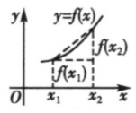
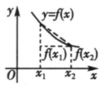

## 讲解

### 是什么

单调性描述的是**输入先后顺序与输出大小顺序的关系**。在函数定义域内取一个非退化区间 I，即其中至少有两个不同的输入。任取 $x_1,x_2\in I$ 且 $x_1<x_2$：

- 如果总有 $f(x_1)<f(x_2)$，称 f 在 I 上严格单调递增，简称递增。
- 如果总有 $f(x_1)>f(x_2)$，称 f 在 I 上严格单调递减，简称递减。

I 是相应的单调区间。若这个比较在整个定义域内成立，才称 f 是增函数或减函数。本章采用上述严格口径；“非减”允许两输出相等，常函数属于非减、非增，却不属于这里的严格增、减。

“任取”“总有”缺一不可：不是挑出一对适合的输入，而是区间内每一对有序的不同输入都必须符合方向。算出几对函数值可以发现规律；要否定某方向，一对反例便足够；要证明它成立，则需要覆盖任意一对。函数值为正或为负与增减是不同问题，负值也可以随输入增大而增大。

### 怎么来的

单调性是一个定义，不编造它的证明。**作差法**来自实数的大小比较：要知道两个输出的大小，可以比较它们的差与 0。若选择 $f(x_2)-f(x_1)$，正差表示递增，负差表示递减；若选择相反的差，结论的方向也要相反。

为什么常提取 $x_2-x_1$？输入顺序已经给出 $x_2-x_1>0$。把输出差中这个已知正量分离出来，就能集中检查其余因子的符号。例如对一次式 $f(x)=kx+b$：

$$
f(x_2)-f(x_1)=(kx_2+b)-(kx_1+b)
=k(x_2-x_1).
$$

两常数 b 相消。因此 k 正则差正，k 负则差负，k 为 0 则差为 0；最后一种是常值，不能混入严格方向。

二次式也可以由定义判断。对 $q(x)=a(x-h)^2+c$，平方差公式给出：

$$
q(x_2)-q(x_1)
=a\big[(x_2-h)^2-(x_1-h)^2\big]
=a(x_2-x_1)(x_1+x_2-2h).
$$

当 $a>0$ 且 $x_1<x_2\le h$，最后一个因子严格负，故左侧递减；当 $h\le x_1<x_2$，最后一个因子严格正，故右侧递增。a 负时反向。这个证明还说明转向点 h 可以包括在左右各自的单调区间中：输入虽有一个可能等于 h，但两输入不同，最后因子仍保持严格符号。

原资料 P0025、P0030 的两幅示意图把上述输入和输出的顺序画出来。它们解释定义；别的几何或函数题仍应使用自己的题设信息。

### 什么时候能用

证明增减、比较函数值、解函数不等式、用端点求最值时，都先检查输入是否属于同一个适用区间。两个互不相接的区间各自递增，不能自动称其并集递增；还缺少跨区间的比较。分母的零点也不能被单调区间跨过去。

严格单调还能在同一适用区间内**由输出反推输入**。f 递增时，$x_1<x_2$ 当且仅当 $f(x_1)<f(x_2)$。反向理由是：若输入相等，输出相等；若 $x_1>x_2$，递增性质又会使输出大于，两种都与输出小于冲突。递减时不等号反向。跨不同单调段时，这个等价关系没有保证。

“一个单调区间”可以是较大单调区间的一部分；求完整单调区间时，应检查是否还能扩到合法边界或转向点。严格单调也不等于连续，不能仅凭单调便宣称取遍两个输出之间的所有数。

## 例题

### 原题 1-0

> 来源ID HSMA-B1-C3-Df09644ec0c27-P0101；原件 `专题3.2 单调性与最大（小）值（举一反三讲义）数学人教A版必修第一册（解析版）.docx`；DOCX正文段落 P0101—P0103；答案与详解 P0104—P0109。年份、地区和试题标签沿原资料记载，未独立核实。

**原资料题干与选项：**

【例1】（24-25高一上·北京丰台·期中）下列函数中，在区间$(-\infty ,0)$上单调递减的是（    ）

A．$f(x)=x$  B．$f(x)=-\frac{1}{x}$

C．$f(x)={x}^{2}+2x$  D．$f(x)=|x|$

**原资料答案与详解（完整保留，公式转写为LaTeX）：**

【答案】D

【解题思路】根据一次函数，二次函数，反比例函数，绝对值函数及单调性定义判断．

【解答过程】在$(-\infty ,0)$上，$f(x)=x$是增函数，$f(x)=-\frac{1}{x}$是增函数，

$f(x)={x}^{2}+2x$在$(-\infty ,-1)$上是减函数，在$(-1,0)$上是增函数，

$x<0$时，$f(x)=\left| x\right|=-x$是减函数，

故选：D．

**展开解析与核验（依据原详解补足，勘误另标）：**

看到题目指定整个 $(-\infty,0)$，需要逐项检查“任意两个负输入”，而不是只在某个子区间递减。

- **A 错：** 任取 $x_1<x_2<0$，$f(x_2)-f(x_1)=x_2-x_1>0$，实际递增。
- **B 错：** 同样两负输入乘积 $x_1x_2>0$。通分得 $-\frac1{x_2}+\frac1{x_1}=\frac{x_2-x_1}{x_1x_2}>0$，实际递增；不能因分子有负号便猜递减。
- **C 错：** 配方 $x^2+2x=(x+1)^2-1$，转向点 −1 位于所考察区间内部。差为 $(x_2-x_1)(x_1+x_2+2)$；两输入在 −1 左侧时后因子负，在右侧时正，因而整个负半轴不是递减。转向点本身可包括在两侧各自的单调区间。
- **D 对：** 负输入时 $|x|=-x$。输出差 $-x_2-(-x_1)=-(x_2-x_1)<0$，覆盖任意一对，所以递减。

检验得到 D。可迁移的判断是：**题目给多大的范围，就要在多大的范围检查方向**；一个子段满足并不够。

### 原题 1-2

> 来源ID HSMA-B1-C3-Df09644ec0c27-P0123；原件 `专题3.2 单调性与最大（小）值（举一反三讲义）数学人教A版必修第一册（解析版）.docx`；DOCX正文段落 P0123—P0125；答案与详解 P0126—P0139。年份、地区和试题标签沿原资料记载，未独立核实。

**原资料题干与选项：**

【变式1-2】（24-25高一上·内蒙古赤峰·阶段练习）已知函数$f\left( x\right)=\frac{ax+b}{{x}^{2}+4}\left( a,b\in R\right)$，且$f\left( 1\right)=\frac{1}{5}$，$f\left( 2\right)=\frac{1}{4}$.

(1)求a和b的值；

(2)判断$f\left( x\right)$在$\left[ 2,+\infty \right)$上的单调性，并根据定义证明.

**原资料答案与详解（完整保留，公式转写为LaTeX）：**

【答案】(1)$a=1,b=0$

(2)$f\left( x\right)$在$\left[ 2,+\infty \right)$上的单调递减，证明见解析

【解题思路】（1）由$f\left( 1\right)=\frac{1}{5},f\left( 2\right)=\frac{1}{4}$，代入直接可求；

（2）根据函数单调性的定义证明单调性.

【解答过程】（1）因为$f\left( 1\right)=\frac{1}{5},f\left( 2\right)=\frac{1}{4}$，

所以

$$\left\{ \begin{aligned}\frac{a+b}{5}=\frac{1}{5}\\\frac{2a+b}{8}=\frac{1}{4}\end{aligned}\right.$$

，解得$a=1,b=0$.

（2）由（1）知：$f\left( x\right)=\frac{x}{{x}^{2}+4}$，$f\left( x\right)$在$\left[ 2,+\infty \right)$上的单调递减，

证明如下：

在$\left[ 2,+\infty \right)$上任取${x}_{1},{x}_{2}$，且$2\le {x}_{1}<{x}_{2}$，

$$f\left( {x}_{1}\right)-f\left( {x}_{2}\right)=\frac{{x}_{1}}{{x}_{1}^{2}+4}-\frac{{x}_{2}}{{x}_{2}^{2}+4}=\frac{{x}_{1}\left( {x}_{2}^{2}+4\right)-{x}_{2}\left( {x}_{1}^{2}+4\right)}{\left( {x}_{1}^{2}+4\right)\left( {x}_{2}^{2}+4\right)}=\frac{\left( {x}_{2}-{x}_{1}\right)\left( {x}_{1}{x}_{2}-4\right)}{\left( {x}_{1}^{2}+4\right)\left( {x}_{2}^{2}+4\right)}$$

，

∵$2\le {x}_{1}<{x}_{2}$，

∴${x}_{2}-{x}_{1}>0$，${x}_{1}{x}_{2}-4>0$，$\left( {x}_{1}^{2}+4\right)\left( {x}_{2}^{2}+4\right)>0$，

∴$f\left( {x}_{1}\right)-f\left( {x}_{2}\right)>0$，

∴$f\left( {x}_{1}\right)>f\left( {x}_{2}\right)$，$f\left( x\right)$在$\left[ 2,+\infty \right)$上的单调递减.

**展开解析与核验（依据原详解补足，勘误另标）：**

**第(1)问：把两个已知输出代回原式。** 分母在所有实数输入处均正，特别在 1、2 处为 5、8，因此：

$$
\frac{a+b}{5}=\frac15\ \Longrightarrow\ a+b=1,
\qquad
\frac{2a+b}{8}=\frac14\ \Longrightarrow\ 2a+b=2.
$$

第二式减第一式得 $a=1$，再代回第一式得 $b=0$。回代输出分别为 $1/(1+4)=1/5$、$2/(4+4)=1/4$，两条件都满足。

**第(2)问：已知两点不能当作单调性证明。** 现在 $f(x)=x/(x^2+4)$。任取 $2\le x_1<x_2$，选择比较 $f(x_1)-f(x_2)$；若这个差正，就表示较小输入有较大输出。

通分后的分子不能只写“整理”：

$$
\begin{aligned}
x_1(x_2^2+4)-x_2(x_1^2+4)
&=x_1x_2^2-x_2x_1^2+4x_1-4x_2\\
&=x_1x_2(x_2-x_1)-4(x_2-x_1)\\
&=(x_2-x_1)(x_1x_2-4).
\end{aligned}
$$

分母为 $(x_1^2+4)(x_2^2+4)>0$，第一因子 $x_2-x_1>0$。第二因子为什么也是**严格**正？由于 $x_1\ge2$ 且 $x_2>x_1\ge2$，有 $x_1x_2\ge2x_2>4$。即使 $x_1=2$，仍然严格大于 4。

于是 $f(x_1)-f(x_2)>0$，覆盖任意一对，f 在 $[2,+\infty)$ 上递减。检验保留端点 2 合法；“严格”要求两输入不同，不要求删掉转向端点。

## 易错

- 只算两值便写“证明”：两值只能否定某方向或提供猜想，成立要覆盖任意两输入。
- 两段各自递增就说整体递增：还须检查跨段顺序。
- 看到严格单调就删去所有端点：合法端点是否能包括由比较性质决定，不由“严格”二字决定。
