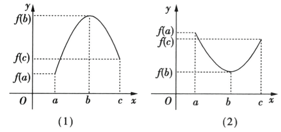
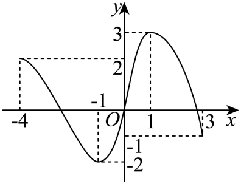

## 讲解

### 是什么

函数在指定的非空输入范围 D 上，最大值 M 必须同时满足两件事：

$$
\text{对每个 }x\in D,\quad f(x)\le M;
\qquad
\text{存在 }x_0\in D,\quad f(x_0)=M.
$$

最小值 m 则把第一个不等号换成 $\ge$，第二个条件仍要求存在合法输入取等。第一个条件管住**所有输出**，第二个条件说明这个界**确实是一个输出**。只给出界而没有取得，不能称最值。

最大值、最小值是输出；取等的 $x_0$ 是输入，不能把二者混写。若同一个最大值在多个输入取得，最大值这个数仍只有一个。这里的最值针对整个指定范围，不是只与附近的值比较的局部高点或低点。

### 怎么来的

最值是定义，不编造证明；求最值的规则要从这两个条件推出。

f 在闭区间 $[a,b]$ 上递增时，任意输入都满足 $a\le x\le b$。端点相等时输出相等，中间输入则由严格递增得到：

$$
f(a)\le f(x)\le f(b).
$$

这给出了全体输出的界；a、b 都是合法输入，又实际取得两个界，所以最小值为 $f(a)$，最大值为 $f(b)$。递减时顺序反过来，最小在 b，最大在 a。**闭端点允许取得**是这段推理中的必要检查。

如果 f 在 $[a,b]$ 上递增、在 $[b,c]$ 上递减，则左侧每个值和右侧每个值都不大于 $f(b)$，b 又允许取到，故 $f(b)$ 为整个 $[a,c]$ 上的最大值。先减后增则在 b 取最小值。原资料 P0380 的两图说明的正是相接闭段：

不等式也可以给最值。先证明对所有合法输入都有 $f(x)\le M$ 或 $f(x)\ge m$；再解出等号条件，并回查每项前提和定义域。若等号所需的输入被范围排除，界仍可能正确，但“最值为该界”没有成立。

### 什么时候能用

先明确求最值的实际输入范围。改成开区间、删去一个点或缩小区间，都可能删去取等输入；原来的最值不能直接照搬。开区间仍可能在内部取到最值；严格递增函数在有合法左端点的区间上可以取得最小值，即使右边没有最大值。

用图象时找的是范围内**实际包含的最高、最低点的纵坐标**。题设已标出的坐标、实心/空心点和完整图线是信息；示意图的视觉比例不能代替未知坐标。分段函数要比较各段候选和接合点，并核对接合点由哪一段定义。

原讲义 P0367、P0368、P0373、P0374 的输入集合写成数字“1”，前句却定义为 I；原页和 DOCX XML 文本都如此。本条按前句解释为 $x\in I$，明确记录原资料排字错误，不将它当作“属于数字1”。

## 例题

### 原题 6-2

> 来源ID HSMA-B1-C3-Df09644ec0c27-P0407；原件 `专题3.2 单调性与最大（小）值（举一反三讲义）数学人教A版必修第一册（解析版）.docx`；DOCX正文段落 P0407—P0409；答案与详解 P0410—P0421。年份、地区和试题标签沿原资料记载，未独立核实。

**原资料题干与选项：**

【变式6-2】（24-25高一上·广东汕头·期中）已知函数$f\left( x\right)=\frac{2x-3}{x+1}$.

(1)函数单调性的定义证明：函数$f\left( x\right)$在$\left( -1,+\infty \right)$上单调递增；

(2)求函数$f\left( x\right)$在区间$\left[ 1,4\right]$上的最大值和最小值.

**原资料答案与详解（完整保留，公式转写为LaTeX）：**

【答案】(1)证明见解析

(2)最大值为1，最小值为$-\frac{1}{2}$.

【解题思路】（1）任取${x}_{1},{x}_{2}\in \left( -1,+\infty \right)$，且${x}_{1}<{x}_{2}$，然后化简变形$f\left( {x}_{1}\right)-f\left( {x}_{2}\right)$，判断符号，从而可得结论；

（2）由（1）知$f\left( x\right)$在区间$\left[ 1,4\right]$上单调递增，从而利用其单调性可求出其最值.

【解答过程】（1）证明：任取${x}_{1},{x}_{2}\in \left( -1,+\infty \right)$，且${x}_{1}<{x}_{2}$，

则$f\left( {x}_{1}\right)-f\left( {x}_{2}\right)=\frac{2{x}_{1}-3}{{x}_{1}+1}-\frac{2{x}_{2}-3}{{x}_{2}+1}$ $=\frac{5\left( {x}_{1}-{x}_{2}\right)}{\left( {x}_{1}+1\right)\left( {x}_{2}+1\right)}$

因为${x}_{1},{x}_{2}\in \left( -1,+\infty \right)$，${x}_{1}<{x}_{2}$，所以${x}_{1}-{x}_{2}<0$，${x}_{1}+1>0$，${x}_{2}+1>0$，

所以$f\left( {x}_{1}\right)-f\left( {x}_{2}\right)<0$，即$f\left( {x}_{1}\right)<f\left( {x}_{2}\right)$，

所以$f\left( x\right)$在$\left( -1,+\infty \right)$上单调递增.

（2）由（1）知$f\left( x\right)$在区间$\left[ 1,4\right]$上单调递增，

所以$f{\left( x\right)}_{\min }=f\left( 1\right)=-\frac{1}{2}$，$f{\left( x\right)}_{\max }=f\left( 4\right)=1$，

所以函数$f\left( x\right)$在区间$\left[ 1,4\right]$上的最大值为1，最小值为$-\frac{1}{2}$.

**展开解析与核验（依据原详解补足，勘误另标）：**

**第(1)问：先明确范围在禁值同一侧。** 原分母要求 $x\ne-1$；题目要证明的 $(-1,+\infty)$ 完整位于右侧。

任取 $-1<x_1<x_2$。按原解比较 $f(x_1)-f(x_2)$，通分分子逐项展开：

$$
\begin{aligned}
&(2x_1-3)(x_2+1)-(2x_2-3)(x_1+1)\\
&=2x_1x_2+2x_1-3x_2-3
 -(2x_1x_2+2x_2-3x_1-3)\\
&=5x_1-5x_2=5(x_1-x_2).
\end{aligned}
$$

因此差为 $5(x_1-x_2)/[(x_1+1)(x_2+1)]$。分子负，两分母因子都正，故差负，即 $f(x_1)<f(x_2)$，递增得到证明。

也可分离常数：$2x-3=2(x+1)-5$，所以 $f(x)=2-5/(x+1)$。余常数 −5 为负，与刚才的递增方向一致；此检验不能替代题目要求的定义法证明。

**第(2)问：检查闭端点并给出“界+取到”。** $[1,4]$ 包含在第(1)问的递增范围中，任意合法输入满足：

$$
f(1)\le f(x)\le f(4),\qquad
f(1)=\frac{2-3}{1+1}=-\frac12,\quad
f(4)=\frac{8-3}{4+1}=1.
$$

输入 1、4 都在题设区间且分母非零，两界实际取得。故最小值 $-1/2$，最大值 1；不能只写端点数值而漏掉为什么所有中间输出被夹住。

### 原题 8-0

> 来源ID HSMA-B1-C3-Df09644ec0c27-P0506；原件 `专题3.2 单调性与最大（小）值（举一反三讲义）数学人教A版必修第一册（解析版）.docx`；DOCX正文段落 P0506—P0511；答案与详解 P0512—P0518。年份、地区和试题标签沿原资料记载，未独立核实。

**原资料题干与选项：**

【例8】（24-25高一上·安徽马鞍山·阶段练习）如图是函数$y=f\left( x\right),x\in \left[ -4,3\right]$的图象，则下列说法正确的是（    ）

A．$f\left( x\right)$在$\left[ -4,-1\right]$和$\left[ 1,3\right]$上单调递减

B．$f\left( x\right)$在区间$\left( -1,3\right)$上的最大值为3，最小值为-2

C．$f\left( x\right)$在$\left[ -4,1\right]$上有最大值2，有最小值-1

D．当直线$y=m$与函数$y=f\left( x\right),x\in \left[ -4,3\right]$图象有交点时$-2<m<3$

**原资料答案与详解（完整保留，公式转写为LaTeX）：**

【答案】A

【解题思路】根据函数图象，结合函数的基本性质，逐项判断，即可得出结果.

【解答过程】A选项，由函数$f(x)$图象可得，在$[-4,-1]$上单调递减，在$[-1,1]$上单调递增，在$[1,3]$上单调递减，故A正确；

B选项，由图象可得，函数$f(x)$在区间$(-1,3)$上的最大值为$3$，无最小值，故B错；

C选项，由图象可得，函数$f(x)$在$[-4,1]$上有最大值$3$，有最小值$-2$，故C错；

D选项，由图象可得，为使直线$y=m$与函数$f(x)$的图象有交点，只需$-2\le m\le 3$，故D错.

故选：A.

**展开解析与核验（依据原详解补足，勘误另标）：**

依据原图的标注坐标和题设给出的完整图线，关键点是 $(-4,2)$、$(-1,-2)$、$(1,3)$、$(3,-1)$。没有从图的比例推算未知点。

- **A 对：** 图线从 −4 到 −1 持续下降，从 1 到 3 也持续下降；两区间分别递减。−1、1 是合法转向点，可以作为各自单调区间的端点。
- **B 错：** 输入范围为 $(-1,3)$，内部的 1 仍合法，所以最大值 3 取得。最低点输入 −1 被排除，其他输出都高于 −2，而沿 −1 右侧原图的连续上升支可以接近 −2。因此 −2 是下界而非取得的最小值；没有别的最小值。
- **C 错：** 范围 $[-4,1]$ 同时包含输入 −1、1，实际最小值为 −2，最大值为 3。左端点输出 2 不能压住内部的 3，题给的 −1 也不是最低输出。
- **D 错：** 水平线 $y=m$ 有交点，等价于 m 是一个实际输出。全图值域是 $[-2,3]$，两个边界分别在输入 −1、1 取得，所以正确条件应为 $-2\le m\le3$。原选项的严格不等号遗漏这两条有交点的水平线。

故选 A。换范围时要重新核对取等点，不能把“原图上有最高、最低点”直接搬到每个开子区间。

### 原题 P0156

> 来源ID HSMA-B1-C3-Dbe2509562877-P0156；原件 `专题03 函数性质的灵活运用必考八类问题（举一反三专项训练）数学人教A版必修第一册（解析版）.docx`；DOCX正文段落 P0156—P0157；答案与详解 P0158—P0166。年份、地区和试题标签沿原资料记载，未独立核实。

**原资料题干与选项：**

7．（24-25高一上·北京·期末）若$x>0$，则$f\left( x\right)=2-x-\frac{4}{x}$（    ）

A．最大值为6  B．最小值为$-6$  C．最大值为$-2$  D．最小值为2

**原资料答案与详解（完整保留，公式转写为LaTeX）：**

【答案】C

【解题思路】利用函数的单调性求解.

【解答过程】任取$0<{x}_{1}<{x}_{2}<2$，

则

$$f\left( {x}_{1}\right)-f\left( {x}_{2}\right)=\left( 2-{x}_{1}-\frac{4}{{x}_{1}}\right)-\left( 2-{x}_{2}-\frac{4}{{x}_{2}}\right)=\left( {x}_{2}-{x}_{1}\right)+\left( \frac{4}{{x}_{2}}-\frac{4}{{x}_{1}}\right)$$

 $=\left( {x}_{2}-{x}_{1}\right)\left( \frac{{x}_{2}{x}_{1}-4}{{x}_{2}{x}_{1}}\right)$，

因为$0<{x}_{1}<{x}_{2}<2$，所以${x}_{2}-{x}_{1}>0$，$0<{x}_{2}{x}_{1}<4$，故$\frac{{x}_{2}{x}_{1}-4}{{x}_{2}{x}_{1}}<0$，

所以$f\left( {x}_{1}\right)-f\left( {x}_{2}\right)<0$即$f\left( {x}_{1}\right)<f\left( {x}_{2}\right)$，

所以$f\left( x\right)$在$\left( 0,2\right)$单调递增；同理可证$f\left( x\right)$在$\left( 2,+\infty \right)$单调递减，

所以$f{\left( x\right)}_{\max }=f\left( 2\right)=-2$.

故选：C.

**展开解析与核验（依据原详解补足，勘误另标）：**

看到 $x>0$，先检查 $x+4/x$ 的两个加数均正，且乘积固定为 4。按基本不等式：

$$
x+\frac4x\ge2\sqrt{x\cdot\frac4x}=4.
$$

从常数 2 中减去这个量会反向：

$$
f(x)=2-\left(x+\frac4x\right)\le2-4=-2.
$$

等号要求 $x=4/x$；因 x 正，乘以 x 得 $x^2=4$，唯一合法取等输入为 2。它在定义域内，故最大值确为 −2。

原解的单调性理由也可补齐端点：$0<x_1<x_2\le2$ 时 $x_1x_2<4$，故原输出差负；$2\le x_1<x_2$ 时乘积大于4，差正。于是先增后减，两侧均可接到合法输入 2，而不是只在两个开段证明后便无依据地添加端点。

逐项检查：A 的 6 超过全部输出的上界，错；B 的 −6 不能作为最小值，例如合法输入 8 的输出为 $2-8-4/8=-13/2<-6$；C 的 −2 是已取得的最大值，对；D 的 2 连一个输出都不是，错。进一步，$f(x)<2-x$，任意候选有限下界都可以被足够大的正输入突破，所以函数没有有限下界，也没有最小值。

故选 C。这里不仅证明“不超过”，还检查了等号的正值、原域和唯一合法根。

## 易错

- 从开端点趋近某值就称取到：要给合法输入。
- 将取等x写成目标最值，或只证界不查等号。
- 缩小输入区间后照搬全域最值。
