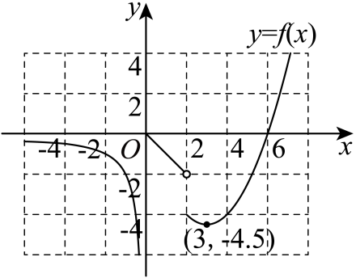
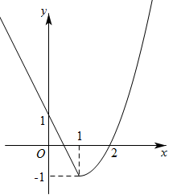
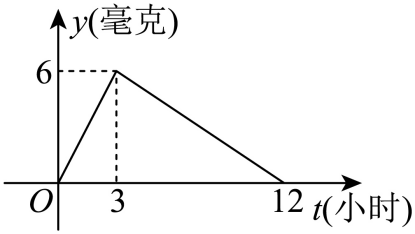

## 讲解

### 是什么

分段函数按输入满足的条件选择不同对应式。每段是“式子＋适用条件”，全部分段共同定义一个函数。输入确定后，先判断它属于哪一段，再使用本段式子；没有条件的式子延长部分不自动属于图象。

整体定义域是各段合法输入的并集。不同段常写成互不重叠且覆盖允许范围的区间，等号放在哪一段，就由哪一段定义边界值。若条件重叠，重叠输入必须给相同输出才能满足唯一性；若声称允许某输入而任何段都未定义它，就有定义缺口。

### 怎么来的

函数定义只要求每个允许输入有唯一输出，没有要求全体输入都用同一形状的式子。因此，把允许输入分成若干部分，在每部分规定唯一输出，且分支之间无冲突，仍满足函数定义。这是分段函数表示成立的依据，不是另一个函数公理。

分段通常来自规则在阈值前后改变。代数中的绝对值要按内部量的符号决定写成它本身还是它的相反数；应用中收费、速度、药量等也可随阶段变换规则。段数由实际条件决定，不能为了计算方便给原题增加阈值。

求$f(x)=k$时，输入x未知，不能先挑一段后就宣称求完。假定x在某段，才得到该段方程；求出的代数根还必须落回该段范围，才满足原函数关系。对所有段分别这样做，最后取合格解的并集。这里每段“方程条件与本段条件”取交，段与段之间取并，来源不同。

求$f(f(x))$时，第一次输出成为第二次输入。分支由当前输入决定，所以每调用一次都重新判段；原来x在哪段不代表f(x)也在哪段。下面原题中第一次输入为−3，所得7跨到另一段，正能说明这项判断。

### 什么时候能用

求单个值：先判当前输入范围，再代本段式子。解方程或不等式：各段解出候选、按本段范围筛选，再取并集。求值域：求每段在其实际输入范围内的输出，再取并集。作图：只画各段适用的部分，并说明端点由哪段收入、空心点为何不属于整体图象。

分段应用题应回到题设的量与单位。满足条件的时间集合与“持续多久”不同，后者要在连续有效区间上算末时刻减始时刻；若有效区间不连通，还要按题目区分累计时长和连续持续时长。

递归分支如果还要调用函数自身，就逐次记录当前输入和分支。某次调用能终止不代表所有输入都能确定；只有循环关系而没有足够定值条件时，应检查定义是否唯一，而不是凭式子形式补答案。

## 例题

### 原题 10-2

> 来源ID HSMA-B1-C3-Db1a16c452494-P0493；原件 `专题3.1 函数的概念及其表示（举一反三讲义）数学人教A版2019必修第一册（解析版）.docx`；DOCX正文段落 P0493—P0497；答案与详解 P0498—P0514。年份、地区和试题标签沿原资料记载，未独立核实。

**原资料题干与选项：**

【变式10-2】（25-26高一上·全国·单元测试）已知函数

$$f\left( x\right)=\left\{ \begin{aligned}\frac{2}{x},x<0,\\-x,0\le x<2,\\\frac{1}{2}{x}^{2}-3x,x\ge 2.\end{aligned}\right.$$

  

(1)求$f\left( 0\right)$，$f\left( 2\right)$的值；

(2)若$f\left( m\right)=-1$，求$m$的值；

(3)作出函数$f\left( x\right)$的大致图象，并求$f\left( x\right)\le 8$的解集．

**原资料答案与详解（完整保留，公式转写为LaTeX）：**

【答案】(1)$f\left( 0\right)=0$，$f\left( 2\right)=-4$

(2)$-2$或1或$3+\sqrt{7}$

(3)作图见解析，$\left( -\infty ,8\right]$

【解题思路】（1）根据分段函数解析式计算可得；

（2）根据分段函数解析式，分类讨论，分别计算可得；

（3）根据函数解析式，可作出函数图象，根据函数解析式分类讨论可求得不等式的解集.

【解答过程】（1）因为

$$f\left( x\right)=\left\{ \begin{aligned}\frac{2}{x},x<0\\-x,0\le x<2\\\frac{1}{2}{x}^{2}-3x,x\ge 2\end{aligned}\right.$$

，

所以$f\left( 0\right)=0$，$f\left( 2\right)=\frac{1}{2}\times {2}^{2}-3\times 2$ $=-4$．

（2）当$m<0$时，$f\left( m\right)=\frac{2}{m}=-1$，解得$m=-2$；

当$0\le m<2$时，$f\left( m\right)=-m=-1$，解得$m=1$；

当$m\ge 2$时，$f\left( m\right)=\frac{1}{2}{m}^{2}-3m=-1$，解得$m=3+\sqrt{7}$或$3-\sqrt{7}$（舍去）．

综上所述，$m$的值为$-2$或1或$3+\sqrt{7}$．

（3）作出函数$f\left( x\right)$的图象如图所示： 

  

当$x\in \left( -\infty ,0\right)$时，$f\left( x\right)=\frac{2}{x}\le 8$恒成立；当$x\in \left[ 0,2\right)$时，$f\left( x\right)=-x\le 8$恒成立；

当$x\in \left[ 2,+\infty \right)$时，$f\left( x\right)=\frac{1}{2}{x}^{2}-3x\le 8$，即${x}^{2}-6x-16\le 0$，得$2\le x\le 8$．

综上所述，$f\left( x\right)\le 8$的解集为$\left( -\infty ,8\right]$．

**展开解析与核验（依据原详解补足，勘误另标）：**

（1）输入0属于$0\le x<2$，用−x得到0；输入2属于$x\ge2$，不能继续用中段，得到$2^2/2-3\cdot2=2-6=-4$。

（2）输入m未知，三段都要尝试并筛选。m<0时，$2/m=-1$，乘非零m得到$m=-2$，符合负段。$0\le m<2$时，$-m=-1$得到m=1，符合中段。$m\ge2$时，$m^2/2-3m=-1$；两边乘正2、移项、配方得
$$m^2-6m+2=0\iff(m-3)^2=7\iff m=3\pm\sqrt7.$$
因为$1<\sqrt7<3$，$3-\sqrt7<2$不在本段，排除；$3+\sqrt7>2$符合。留下−2、1、$3+\sqrt7$，每个按所属分支回代均输出−1。

（3）负段画$2/x$在x<0的部分；中段画−x在$[0,2)$的线段，(0,0)实心、(2,−2)空心；右段配为$(x-3)^2/2-9/2$，只画x≥2的部分，(2,−4)实心、顶点$(3,-9/2)$在本段，右段零点6也在本段。原解析图保留这些标记，不把坐标辅助网格当函数图象。

求$f(x)\le8$时，负段函数值负，中段函数值不正，两段全部满足。右段乘正2并移项：
$$x^2-6x-16\le0\iff(x+2)(x-8)\le0.$$
正二次式在两根之间非正，得到−2≤x≤8，再与本段x≥2取交，得到[2,8]。三段取并，$(-\infty,0)\cup[0,2)\cup[2,8]=(-\infty,8]$。8代入右式等于8，端点应收入；不能把右段候选中的负数当作整体在该处的右式函数值。

### 原题 10-3

> 来源ID HSMA-B1-C3-Db1a16c452494-P0515；原件 `专题3.1 函数的概念及其表示（举一反三讲义）数学人教A版2019必修第一册（解析版）.docx`；DOCX正文段落 P0515—P0519；答案与详解 P0520—P0535。年份、地区和试题标签沿原资料记载，未独立核实。

**原资料题干与选项：**

【变式10-3】（24-25高一上·山东济南·阶段练习）已知函数

$$f\left( x\right)=\left\{ \begin{aligned}-2x+1,x<1\\{x}^{2}-2x,x\ge 1\end{aligned}\right.$$

.

(1)求$f\left( f\left( -3\right)\right)$；

(2)画出函数的图象；

(3)若$f\left( x\right)=3$，求$x$的值.

**原资料答案与详解（完整保留，公式转写为LaTeX）：**

【答案】(1)35

(2)图象见解析

(3)-1或3

【解题思路】（1）代入求解，先求出$f\left( -3\right)=7$，从而得到$f\left[ f\left( -3\right)\right]=f\left( 7\right)=35$；

（2）描点，连线，画出函数图象；

（3）分$x\in \left( -\infty ,1\right)$和$x\in \left[ 1,+\infty \right)$两种情况，得到方程，求出答案.

【解答过程】（1）∵$-3<1$，∴$f\left( -3\right)=-2\times \left( -3\right)+1=7$，

又∵$7>1$，∴$f\left[ f\left( -3\right)\right]=f\left( 7\right)={7}^{2}-2\times 7=35$，

（2）当$x<1$时，函数图象为射线，其中$f\left( 0\right)=1,f\left( 1\right)=-1$，

当$x\ge 1$时，$f\left( x\right)={x}^{2}-2x$，图象为抛物线的一部分，其中$f\left( 2\right)=0$，

图象如图所示：

（3）当$x\in \left( -\infty ,1\right)$时，有$f\left( x\right)=-2x+1=3$，解得$x=-1$，符合；

当$x\in \left[ 1,+\infty \right)$时，有$f\left( x\right)={x}^{2}-2x=3$，解得$x=3$或$x=-1$，

但$x=-1\notin \left[ 1,+\infty \right)$，故舍去，所以$x$的值为3，

综上所述：$x$的值为$-1$或3．

**展开解析与核验（依据原详解补足，勘误另标）：**

（1）第一次输入−3<1，用线性段：$f(-3)=-2(-3)+1=7$。第二次输入已经是7≥1，要改用二次段：$f(7)=7^2-2\cdot7=49-14=35$，不是沿原分支再算一次。

（2）x<1的直线为y=−2x+1，经过(0,1)，趋向(1,−1)但这个端点不属于该段；x≥1的二次段为$y=(x-1)^2-1$，从顶点(1,−1)开始且包括该点，经过(2,0)。整体在接合点有唯一实心点(1,−1)，由第二段定义。原详解在射线说明处写f(1)=−1，数值恰与整体第二段相同，但不能据此把1收入第一段。

（3）线性段：$-2x+1=3$，减1得−2x=2，除−2得x=−1，符合x<1。二次段：$x^2-2x=3$，移项并分解得$(x-3)(x+1)=0$，候选为3、−1；只留符合x≥1的3，排除该段候选−1。两段合格输入取并为{−1,3}。检验$f(-1)=3$由线性段给出，$f(3)=3$由二次段给出；同一数在某段被排除，不妨碍它在另一合法段成为解。

### 原题 4-0

> 来源ID HSMA-B1-C3-D9d1c86634e46-P0184；原件 `专题3.5 函数的应用（一）（举一反三讲义）数学人教A版必修第一册（解析版）.docx`；DOCX正文段落 P0184—P0186；答案与详解 P0187—P0196。年份、地区和试题标签沿原资料记载，未独立核实。

**原资料题干与选项：**

【例4】（24-25高二下·北京朝阳·期末）某研究所开发一种新药，据监测，一次性服药$t\left( 0\le t\le 12\right)$小时后每毫升血液中的含药量$y$（毫克）与时间$t$（小时）之间近似满足图中所示的曲线关系.据测定，每毫升血液中含药量不少于4毫克时治疗疾病有效，则12小时内药物在体内对治疗疾病一直有效所持续的时长为（    ）

A．4小时  B．5小时  C．6小时  D．7小时

**原资料答案与详解（完整保留，公式转写为LaTeX）：**

【答案】A

【解题思路】首先求出函数解析式，再令$y\ge 4$求出相应的$t$的取值范围，即可得解．

【解答过程】当$0\le t\le 3$时，则$y=\frac{6}{3}t=2t$，

当$3<t\le 12$时，设函数为$y=kt+b$，

将$(3,6)$，$(12,0)$代入可得

$$\left\{ \begin{aligned}6=3k+b\\0=12k+b\end{aligned}\right.$$

，解得

$$\left\{ \begin{aligned}k=-\frac{2}{3}\\b=8\end{aligned}\right.$$

，所以$y=-\frac{2}{3}t+8$，

所以

$$y=\left\{ \begin{aligned}2t,0\le t\le 3\\-\frac{2}{3}t+8,3<t\le 12\end{aligned}\right.$$

，

要使$y\ge 4$，则

$$\left\{ \begin{aligned}2t\ge 4\\0\le t\le 3\end{aligned}\right.$$

或

$$\left\{ \begin{aligned}-\frac{2}{3}t+8\ge 4\\3<t\le 12\end{aligned}\right.$$

，解得$2\le t\le 3$或$3<t\le 6$，

综上所述：$2\le t\le 6$，

所以有效所持续的时长为$6-2=4$个小时．

故选：A．

**展开解析与核验（依据原详解补足，勘误另标）：**

本题按原资料给定的近似模型作数学判断。图中折线及明确标注的(0,0)、(3,6)、(12,0)是建式依据，不能靠量图猜坐标。

第一段0≤t≤3经过原点且斜率为6/3=2，故y=2t。第二段令y=kt+b，用两标点列式；第二式减第一式得到$0-6=(12-3)k$，所以$9k=-6$、$k=-2/3$。代入$6=3k+b$得$6=-2+b$，所以b=8。两段在t=3都给6；按原解将等号归第一段，得到无冲突的一个分段函数。

有效条件是“不少于4”，即y≥4。第一段$2t\ge4$得到t≥2，与[0,3]取交为[2,3]。第二段$-2t/3+8\ge4$，减8得$-2t/3\ge-4$，乘负3/2反向得到t≤6，与$(3,12]$取交为$(3,6]$。并集为[2,6]，两段之间没有缺口，连续有效时长为6−2=4小时。

A为4小时，正确；B的5、C的6、D的7小时都超过本模型从第2小时到第6小时的持续长度。开始有效时刻2小时、结束时刻6小时与持续时长4小时是三个不同的量，答案A。端点含入由“不少于”决定，在t=2、6回代都等于4。

## 易错

- 将每段方程根直接并起来：先排除不属于本段输入区间的根。
- 输入是$m+1$却按$m$正负分段：必须按整个实际输入判断。
- 左段不含端点，却用左段延长值当边界函数值：应查看真正包含端点的段。
