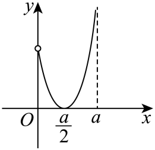
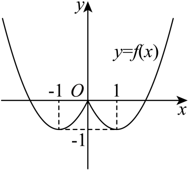

## 讲解

### 是什么：把一个区间反射到另一边

设 f 的定义域 D 关于原点对称。对一个非退化区间 I⊂D，记 −I={−x:x∈I}。它是把 I 中全部输入换成相反数的区间，例如正侧 [a,b] 的对应区间为 [−b,−a]。开端点反射后仍开，闭端点反射后仍闭。

奇偶性把对应输入的输出联系起来，单调性把同一区间内任意两输入的输出联系起来。结合二者，可以迁移另一边的单调性，而不能把两个分开的区间自动并成一个大区间。

### 怎么来的：先反转输入顺序，再用函数关系

假设 f 在 I 上递增，取 −I 中任意 x₁<x₂。换号后 −x₂<−x₁，且这两个数都属于 I，所以

$$
f(-x_2)<f(-x_1).
$$

若 f 奇，代入 f(−x₂)=−f(x₂)、f(−x₁)=−f(x₁)，得到 −f(x₂)<−f(x₁)。两边乘 −1，不等号反向，得 f(x₁)<f(x₂)。所以 f 在 −I 上也递增。原区间递减时，把第一行不等号反过来，最后得到对应区间也递减。

若 f 偶，上式成为 f(x₂)<f(x₁)，即 f(x₁)>f(x₂)，所以对应区间递减；原区间递减时，对应区间递增。

| 原区间 I 的性质 | 奇函数在 −I 上 | 偶函数在 −I 上 |
|---|---|---|
| 递增 | 递增 | 递减 |
| 递减 | 递减 | 递增 |

每个不等号都来自任意两输入的定义、输入换号或乘负数。这解释了“奇同偶反”，而不只是记一句口诀。

### 最值如何迁移：输出反号会交换最大与最小

假设 f 在 I 上有最大值 M，在合法输入 t₀∈I 处取得。对每个 x∈−I，−x∈I，所以 f(−x)≤M。

f 为偶函数时，f(x)=f(−x)≤M，且 f(−t₀)=M。因此 −I 上也有最大值 M，取得输入为 −t₀。最小值同理保持。

f 为奇函数时，f(x)=−f(−x)≥−M，且 f(−t₀)=−M。因此 I 的最大值 M 对应 −I 的最小值 −M。I 的最小值 m 则对应 −I 的最大值 −m。必须同时写明界和取得；只有一个上界，不能冒充最大值。

如果某端点不属于 I，它也不属于 −I。在原区间仅能趋近、不能取到的极限输出，反射后仍不能当作取得的最值。相关证明只使用定义，不假定函数连续。

### 什么时候能用：0和两个分支之间还要另查

两边各递增，只能证明各自区间内部的比较。要说并集或跨过0的大区间递增，还须比较一边取 x₁、另一边取 x₂ 的情况；若0合法，还要与 f(0)比较。奇函数满足 f(0)=0，但这不保证0附近连续，也不保证正侧全部输出为正。

所选原图题正侧的最低点在 a/2，反射后另一侧也有一个转向点。图中 x=0 的正侧曲线端点为空心，不能读成实际 f(0)；实际 f(0)由奇性和0在定义域内确定。两个分开的递增区间不能把中间部分一起合并。

求全域最值时，先得到对应两段的界与取得，再与其他合法输入（尤其0）比较。只迁移一段的最值，不足以说明全定义域的最值。

### 用于补解析式：让未知输入回到已知一边

需要求某个未知侧 x 的值，先说明 −x 位于已知公式的适用区间，再算 f(−x)，最后用奇偶关系还原 f(x)。代入的是 −x，平方项变为 x²，线性项会换号；若是奇函数，还要对整个 f(−x)再取负号，不能只改某一项。

例题中的偶函数负侧已知，正侧公式、完整单调区间和值域均按这条路线推导，原题三个小问全部保留。

## 例题

### 原题 7-1

> 来源ID HSMA-B1-C3-D29552845b9f5-P0320；原件 `专题3.3 奇偶性（举一反三讲义）数学人教A版必修第一册（解析版）.docx`；DOCX正文段落 P0320—P0322；答案与详解 P0323—P0330。年份、地区和试题标签沿原资料记载，未独立核实。

**原资料题干与选项：**

【变式7-1】（24-25高一上·全国·课后作业）已知函数$f\left( x\right)$是定义在区间$\left[ {a}^{2}-6,a\right]$内的奇函数，且$f\left( x\right)$在区间$\left( 0,a\right]$内的图象如图所示，则$f\left( x\right)$的单调递增区间为（    ）

A．$\left[ -2,-1\right]$  B．$\left[ -1,1\right]$  C．$\left[ -2,-1\right]$和$\left[ 1,2\right]$  D．$\left[ 1,2\right]$

**原资料答案与详解（完整保留，公式转写为LaTeX）：**

【答案】C

【解题思路】根据奇函数的定义求出$a$的值，由图象可得函数在$\left[ 1,2\right]$内单调递增，根据奇函数的对称性，求出函数在$\left[ -2,-1\right]$内单调递增，即可得解.

【解答过程】因为函数$f\left( x\right)$是定义在区间$\left[ {a}^{2}-6,a\right]$内的奇函数，

所以

$$\left\{ \begin{aligned}{a}^{2}-6+a=0\\{a}^{2}-6<a\end{aligned}\right.$$

，解得$a=2$，

所以函数$f\left( x\right)$是定义在区间$\left[ -2,2\right]$内的奇函数，

由图可知，函数在$\left[ 1,2\right]$内单调递增，由奇函数的性质可知函数在$\left[ -2,-1\right]$内单调递增，

因此$f\left( x\right)$的单调递增区间为$\left[ -2,-1\right]$和$\left[ 1,2\right]$．

故选：A.

**展开解析与核验（依据原详解补足，勘误另标）：**

**看到什么、想到什么：** 奇函数的完整定义域是 [a²−6,a]，正输入段图象给出转向位置 a/2。先从定义域求合法 a，再读明确的转向位置，最后把正侧递增区间反射到负侧。

**先核验参数。** 闭区间关于0对称要求左右端点互为相反数，即

$$
a^2-6=-a
\ \Longleftrightarrow\ a^2+a-6=0
\ \Longleftrightarrow\ (a+3)(a-2)=0.
$$

候选 a=−3或 a=2。a=−3时左端 a²−6=3，大于右端−3，且正输入段 (0,a]为空，与题设原图不合；因此只剩 a=2，D=[−2,2]，转向输入 a/2=1。

**正侧与负侧。** 根据原题给出的曲线变化，(0,1]递减，[1,2]递增。奇函数在对应区间保持单调方向，所以 [−2,−1]递增，[−1,0)递减。0属于 D，实际 f(0)=0；原图 x=0处正侧端点为空心，不能把空心处的正输出读成 f(0)。

**逐项核验：**

- A只列 [−2,−1]，这是一个正确递增区间，却漏掉另一侧 [1,2]，不是全部递增区间的答案。
- B的 [−1,1]包含正侧 (0,1]的递减部分；选取该部分中任意两个不同正输入，输出顺序违反递增要求，故不能成立。
- C同时列出 [−2,−1]和[1,2]，覆盖两侧递增段。
- D只列 [1,2]，遗漏负侧递增段。

**原书勘误：** 原答案栏写 C，解析也求出了 C 的两个区间，却在最后写“故选A”。对照原页确认这是原书末字错误，正确选项为 C；原说法保留在上方，不静默修改。

**如何检验：** 不把两个递减半段合并为 [−1,1]，也不据示意图给空心端点补值。题目只问递增段，完整答案的“和”表示分别列举两个区间，不表示跨过中间部分一起递增。

### 原题 P0011

> 来源ID HSMA-B1-C3-D14f71bc1a28d-P0011；原件 `专题01 函数性质及其应用大题（36题）（举一反三专项训练）数学人教A版必修第一册（解析版）.docx`；DOCX正文段落 P0011—P0014；答案与详解 P0015—P0030。年份、地区和试题标签沿原资料记载，未独立核实。

**原资料题干与选项：**

1．（24-25高一上·吉林·阶段练习）已知定义在$R$上的偶函数$f\left( x\right)$，当$x\le 0$时，$f\left( x\right)={x}^{2}+2x$．

(1)求$f\left( x\right)$的解析式；

(2)写出$f\left( x\right)$的单调区间；

(3)求出$f\left( x\right)$的值域．

**原资料答案与详解（完整保留，公式转写为LaTeX）：**

【答案】(1)

$$f\left( x\right)=\left\{ \begin{aligned}{x}^{2}+2x,x\le 0\\{x}^{2}-2x,x>0\end{aligned}\right.$$

(2)单增区间为$\left( -1,0\right)$，$\left( 1,+\infty \right)$，单减区间为$\left( 0,1\right)$，$\left( -\infty ,-1\right)$.

(3)$\left[ -1,+\infty \right)$

【解题思路】（1）令$x>0$求出$f\left( -x\right)$，再根据偶函数的定义即可；

（2）根据二次函数的性质得出$f\left( x\right)$在$\left( -\infty ,0\right)$上的单调性，再结合偶函数的性质即可；

（3）根据二次函数的单调性以及偶函数的性质可得.

【解答过程】（1）若$x>0$，则$-x<0$，则$f\left( -x\right)={\left( -x\right)}^{2}+2\left( -x\right)={x}^{2}-2x$，

因$f\left( x\right)$是偶函数，则$f\left( x\right)=f\left( -x\right)={x}^{2}-2x$，

则

$$f\left( x\right)=\left\{ \begin{aligned}{x}^{2}+2x,x\le 0\\{x}^{2}-2x,x>0\end{aligned}\right.$$

.

（2）$x\le 0$时，$f\left( x\right)$的图象开口朝上且对称轴为$x=-1$，

则$f\left( x\right)$的单增区间为$\left( -1,0\right)$，单减区间为$\left( -\infty ,-1\right)$，

因$f\left( x\right)$是偶函数，则$f\left( x\right)$的单增区间为$\left( -1,0\right)$，$\left( 1,+\infty \right)$，

单减区间为$\left( 0,1\right)$，$\left( -\infty ,-1\right)$.

（3）由$f\left( x\right)$的单调性以及偶函数的性质可知，$f{\left( x\right)}_{\min }=f\left( 1\right)=f\left( -1\right)=-1$，

故$f\left( x\right)$的值域为$\left[ -1,+\infty \right)$

**展开解析与核验（依据原详解补足，勘误另标）：**

**看到什么、想到什么：** 偶函数定义在 R，公式只给 x≤0一侧。先把正输入换为合法负输入，再依据两段二次式完成三个小问；不能直接把负侧公式用于正侧。

**(1) 完整解析式。** 当 x>0，−x<0，所以已知公式可用于 −x，得到

$$
f(-x)=(-x)^2+2(-x)=x^2-2x.
$$

偶性给 f(x)=f(−x)，所以正侧 f(x)=x²−2x。负侧保持题设 x²+2x，0归在原来的 x≤0一支，输出0；正侧公式若算0也同为0，不发生冲突。完整分段式与原答案一致。

**(2) 单调区间及端点。** 负侧公式是 (x+1)²−1，转向输入−1；正侧公式是 (x−1)²−1，转向输入1。任取同侧 x₁<x₂，先代入对应公式，再用平方差公式、提取共同因子：

$$
\begin{aligned}
f(x_2)-f(x_1)
&=(x_2^2+2x_2)-(x_1^2+2x_1)\\
&=(x_2^2-x_1^2)+2(x_2-x_1)\\
&=(x_2-x_1)(x_2+x_1)+2(x_2-x_1)\\
&=(x_2-x_1)(x_1+x_2+2)\qquad(x_1,x_2\le0).
\end{aligned}
$$

$$
\begin{aligned}
f(x_2)-f(x_1)
&=(x_2^2-2x_2)-(x_1^2-2x_1)\\
&=(x_2^2-x_1^2)-2(x_2-x_1)\\
&=(x_2-x_1)(x_2+x_1)-2(x_2-x_1)\\
&=(x_2-x_1)(x_1+x_2-2)\qquad(0\le x_1<x_2).
\end{aligned}
$$

第二式涉及0时仍成立，因为正侧公式在0处与原分支一致。第一式在两输入≤−1时，x₁+x₂+2<0，故递减；两输入在[−1,0]时该因子>0，故递增。第二式在[0,1]内该因子<0，故递减；两输入≥1时该因子>0，故递增。转向输入的等号不破坏严格性，因为 x₁<x₂，两个输入不可能同时等于转向点。

原答案列的是去掉端点的正确单调子区间。若列完整最大单调区间，可以写：递增 [−1,0]及[1,+∞)，递减 (−∞,−1]及[0,1]。偶函数两侧对应方向相反，四段互相核验。不能把两段跨过转向点合并。

**(3) 值域。** 两侧可统一写为

$$
f(x)=(|x|-1)^2-1.
$$

因平方非负，所有输出≥−1；当 x=±1时取到−1。还需证明每个 y≥−1都可达：取合法输入 x=1+√(y+1)>0，代入正侧公式 (x−1)²−1=y。下界、取得和全体输出覆盖都已证，所以值域确为 [−1,+∞)，与原答案一致。

**如何检验：** 三问均保留原答与原解；分支0、两个转向点、对称方向和取到最小值分别检查。原图中横坐标±1、最小输出−1与代数证明相符，不凭示意图比例另添数据。

## 易错

- 把奇函数正侧递增迁移成负侧递减：输入换号使顺序反转，奇性又使输出反号，两次反转抵消。
- 偶函数的两个半边区间同向单调：偶性保持输出，只有输入顺序反转，对应方向相反。
- 两段递增就合成跨0递增：跨段输入尚未比较；原图在0处还有空心端点，不能拿它当实际函数值。
- 奇函数两侧“最大值相反”：原侧最大值对应另一侧最小值，且取得输入必须属于反射后的区间。
