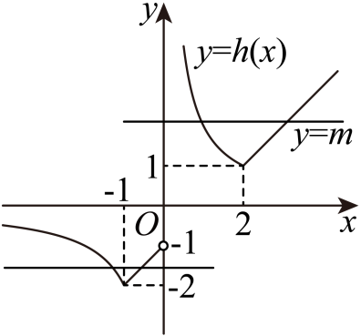
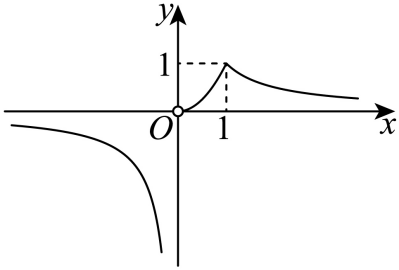

## 讲解

### 判据

看到$\max\{F(x),G(x)\}$或$\min\{F(x),G(x)\}$，它每次都比较同一输入的两个输出，不是在求某个函数全域最大值。max选当前较大输出，min选当前较小输出；两函数原定义域的交才是组合函数可用范围。若比较根式、分式含禁值，不能先画连续图把禁值补入。

### 流程

1. 列出每层表达式的定义域并取交，保留原输入限制。嵌套$max/min$时先处理内层，再处理外层。
2. 求$F-G$的符号。先记录分母、根号等条件；乘未知符号量时分类，不能直接保留原不等号。相等点是换支候选，非法点不能当相等点。
3. 每个合法区间按大小选择实际表达式，等值点任选一支登记一次。列出完整分段式，检查它对每个合法输入只选一个输出。
4. 求值域、单调或水平交点时按实际分支处理。反解出的输入还须落在这一分支，连接点虽然出现于两式，几何上只算一个点。
5. 将各段结果合并；核查开端、禁值和峰点是否取得。图可以检查结构，但不能代替符号条件与不同根计数。

### 比较两个输出，怎样得到实际分支

max{F(x),G(x)}在同一个输入x处选较大值。因此F(x)−G(x)≥0时选F，否则选G；min的选择相反。两式相等时，选哪式都给同一输出，应把这个输入登记一次。先得到“在哪些输入选哪式”，才能讨论组合函数的单调性、值域和交点。

若有嵌套，外层比较的是内层已选出的结果。不能把原来两条完整图象与第三条图象一起数交点；许多曲线段根本不属于最终函数。每个候选交点必须同时满足所选表达式与这段的输入条件，两个表达式的交接点即使两式都能写出，也只是一个几何点。

## 例题

### 原题 P0434

> 来源ID HSMA-B1-C3-Dbe2509562877-P0434；原件 `专题03 函数性质的灵活运用必考八类问题（举一反三专项训练）数学人教A版必修第一册（解析版）.docx`；DOCX正文段落 P0434—P0434；答案与详解 P0435—P0444。年份、地区和试题标签沿原资料记载，未独立核实。

**原资料题干与选项：**

28．（24-25高一上·福建三明·阶段练习）已知函数$f\left( x\right)=x-1,g\left( x\right)=\frac{2}{x}$，记

$$\max \left\{ a,b\right\}=\left\{ \begin{aligned}a,a\ge b\\b,a<b\end{aligned}\right.$$

，若$y=m$与$y=\max \left\{ f\left( x\right),g\left( x\right)\right\}\left( x\ne 0\right)$的图象恰有两个不同的交点则实数$m$的取值范围是           .

**原资料答案与详解（完整保留，公式转写为LaTeX）：**

【答案】$\left( -2,-1\right)\cup \left( 1,+\infty \right)$

【解题思路】根据给定条件，求出函数$y=\max \{f(x),g(x)\}(x\ne 0)$，作出函数的图象，结合图象求出$m$的范围.

【解答过程】由$x-1-\frac{2}{x}\ge 0$，即$\frac{\left( x+1\right)\left( x-2\right)}{x}\ge 0$，则

$$\left\{ \begin{aligned}x<0\\(x+1)(x-2)\le 0\end{aligned}\right.$$

或

$$\left\{ \begin{aligned}x>0\\(x+1)(x-2)\ge 0\end{aligned}\right.$$

，

解得$-1\le x<0$或$x\ge 2$，由$x-1-\frac{2}{x}<0$，解得$x<-1$或$0<x<2$，

令$ℎ(x)=\max \{f(x),g(x)\}$ $(x\ne 0)$，则

$$ℎ(x)=\left\{ \begin{aligned}x-1,x\in [-1,0)\cup [2,+\infty )\\\frac{2}{x},x\in (-\infty ,-1)\cup (0,2)\end{aligned}\right.$$

，

在同一坐标系内作出直线$y=m$与函数$y=ℎ(x)$的图象，如图，

  

观察图象知，当$-2<m<-1$或$m>1$时，直线$y=m$与函数$y=ℎ(x)$的图象有2个交点，

所以实数$m$的取值范围是$-2<m<-1$或$m>1$.

故答案为：$\left( -2,-1\right)\cup \left( 1,+\infty \right)$.

**展开解析与核验（依据原详解补足，勘误另标）：**

先比较哪个较大：$f-g=(x+1)(x-2)/x$，原$x\ne 0$，分母正负分开。较大的直线用于$[-1,0)$与$[2,+\infty )$，较大的双曲线用于$(-\infty ,-1)$与$(0,2)$。等值输入−1、2任选一支表示，但交点只计一次。

负侧双曲线支值域$(-2,0)$，直线支值域$[-2,-1)$，两者同时覆盖的水平高度为$(-2,-1)$：$m=-2$只有连接点−1一处，$m=-1$只有双曲线一处，两个端点都不算两交点。正侧双曲线支值域$(1,+\infty )$，直线支$[1,+\infty )$，$m>1$两处，$m=1$只有连接点2。负值与正值互不混计，$m=0$无交点。因此所求$(-2,-1)\cup (1,+\infty )$。这是逐段反解和计数，原示意图用于辅助核对，不能只估计图的最低位置。

### 原题 P0733

> 来源ID HSMA-B1-C3-Dbe2509562877-P0733；原件 `专题03 函数性质的灵活运用必考八类问题（举一反三专项训练）数学人教A版必修第一册（解析版）.docx`；DOCX正文段落 P0733—P0735；答案与详解 P0736—P0743。年份、地区和试题标签沿原资料记载，未独立核实。

**原资料题干与选项：**

44．（24-25高一上·山东青岛·期中）用$\max \left\{ f\left( x\right),g\left( x\right)\right\}$表示$f\left( x\right)$，$g\left( x\right)$中的最大者，用$\min \left\{ f\left( x\right),g\left( x\right)\right\}$表示$f\left( x\right)$，$g\left( x\right)$中的最小者，若函数$ℎ\left( x\right)=\min \left\{ \max \left\{ {x}^{2},{x}^{3}\right\},\frac{1}{x}\right\}$在$\left( 0,a\right)$上有最大值，则（   ）

A．$ℎ\left( x\right)$是奇函数  B．$ℎ\left( x\right)$在$\left( 0,a\right)$上最大值是2

C．$ℎ\left( x\right)$的值域是$\left( -\infty ,-1\right)\cup \left[ 0,1\right]$  D．$a$的取值范围是$\left( 1,+\infty \right)$

**原资料答案与详解（完整保留，公式转写为LaTeX）：**

【答案】D

【解题思路】在同一坐标系中作出函数$y={x}^{2},y={x}^{3},y=\frac{1}{x}$的图象，进而得到函数$ℎ\left( x\right)$的图象，利用图象分别判断四个选项即可.

【解答过程】$ℎ\left( x\right)$定义域$(-\infty ,0)\cup (0,+\infty )$，

在同一坐标系中分别作出函数$y={x}^{2},y={x}^{3},y=\frac{1}{x}$的图象，取$y={x}^{2}$与$y={x}^{3}$的图象中较高的曲线段，再与$y=\frac{1}{x}$的图象对比取较低的曲线段，得到函数$ℎ\left( x\right)$的图象，如图所示，

因为图象不关于坐标原点对称，所以$ℎ\left( x\right)$不是奇函数，故A错误；

因为$ℎ\left( x\right)$在$\left( 0,a\right)$上有最大值，所以$a>1$，故D正确，且$ℎ\left( x\right)$在$\left( 0,a\right)$上最大值是1，故B错误；由图象知$ℎ\left( x\right)$的值域是$\left( -\infty ,0\right)\cup (0,1]$，故C错误；

故选：D.

**展开解析与核验（依据原详解补足，勘误另标）：**

原自然域排0。$x<0$时$x^{2}\ge x^{3}$，max为$x^{2}$，再与负$1/x$取min，得到$h=1/x$。$0<x\le 1$时$x^{2}\ge x^{3}$且$x^{2}\le 1/x$，$h=x^{2}$；$x\ge 1$时$x^{3}\ge x^{2}$且$1/x\le x^{3}$，$h=1/x$，两段在1给同值1。

A用$h(2)=1/2$、$h(-2)=-1/2$看似吻合，但$h(1/2)=1/4$、$h(-1/2)=-2$并非相反数，故非奇，A错。B正侧整体最大1，不能2，错。C负侧范围$(-\infty ,0)$，正侧$(0,1]$，完整值域$(-\infty ,0)\cup (0,1]$，0不取，C错。D若$0<a\le 1$，$(0,a)$上$h=x^{2}$严格增且右端未含，只有上界无最大；$a>1$时内部1合法，最大1取到，故$a\in (1,+\infty )$，D对。原“h的值域”按自然域读；若限定$(0,a)$则范围另为$(0,1]$，也不支持C。

## 易错

- **max固定选第一式。**大小关系随输入改变；选支必须由F−G的符号决定。先求交点和符号区间，再写实际分段，不能按式子排列顺序选。

- **沿完整原图数交点。**组合函数只保留被选中的曲线段。候选根必须属于该段范围；相等的交接点只算一个输入，计两次会误收参数边界。

- **开区间一概没有最大值。**排除的是输入端点，内部峰点若仍在区间可取得最大值。先定位实际峰点，再判断参数是否使它进入区间。
