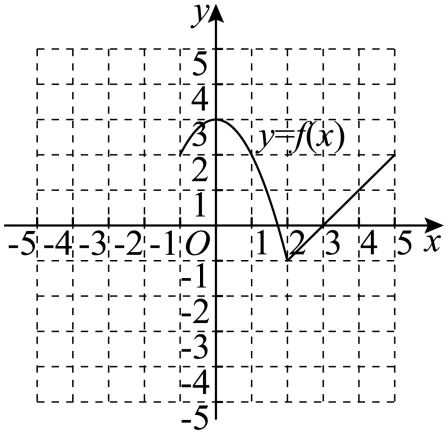

## 讲解

### 判据

题目用明确刻度、标点、实空端点和连续曲线给函数图象，问定义域、值域、单调区间或水平线交点。依据图上明确数学信息阅读；不量示意图未标注比例。输入范围若另外限制，应先裁定只使用哪部分实际曲线。

### 流程

1. 按实际曲线横坐标范围写定义域，空档不能补齐，空心或渐近线不能纳入；再按真实纵坐标写值域。图上明确无界趋势需结合题设“无限趋近”的说明，不只凭曲线没画完猜无界。
2. 以转向点、分段边界和定义域缺口分段，由左到右比较纵坐标升降。若要整体单调，另检查跨段输入顺序；求最大单调区间时保留可加入的合法转向端点。
3. 在限定范围内检查最高、最低纵坐标是否有实际点取得。原完整图最低点被限制删掉时，可能只有下界无最小值，不把延长点补回。
4. 水平线$y=m$有交点等价于m在实际值域；一个输出有几个来源，要数实际图象与该水平线交点，不能用函数唯一输出要求来倒推唯一输入。
5. 逐项用明确点、界或反例说明；需作图的原解析式题，先核对分支区间与端点再读方向，不能凭自己画歪的图证明数值。

### 图象上的三种信息不要混用

定义域问“哪些横坐标有实际点”，值域问“哪些纵坐标有实际点”，最值问“最高或最低纵坐标是否由实际点取得”。把图象向两轴投影是定位办法，但某一空心点的纵坐标可能被另一处实心点取得，不能看到一个空心标记就从值域删去这个高度。

单调性固定从左向右读：比较的是横坐标较小的实际点与横坐标较大的实际点。求各段区间时以转向点与缺口分开；声称全定义域单调时，定义域即使断开，仍须比较两段之间的合法输入。真实转向点可以作为某条单调区间的端点，因为该区间并没有越过它。

水平线与图象交点的个数表示一个输出有多少个输入来源。函数只要求一个输入对应一个输出，并不要求一个输出只能有一个输入。因此两个不同交点本身不否定函数，但会否定题目另外声称的“唯一输入”。

## 例题

### 原题 8-1

> 来源ID HSMA-B1-C3-Df09644ec0c27-P0519；原件 `专题3.2 单调性与最大（小）值（举一反三讲义）数学人教A版必修第一册（解析版）.docx`；DOCX正文段落 P0519—P0524；答案与详解 P0525—P0534。年份、地区和试题标签沿原资料记载，未独立核实。

**原资料题干与选项：**

【变式8-1】（24-25高一上·内蒙古呼和浩特·期中）如图所示是函数$y=f\left( x\right)$的图象，图中x正半轴曲线与虚线无限接近但是永不相交，则以下描述正确的是（    ）

  

A．函数$f\left( x\right)$的定义域为$\left[ -4,4\right)$

B．函数$f\left( x\right)$的值域为$\left[ 0,+\infty \right)$

C．此函数在定义域内是增函数

D．对于任意$y\in \left[ 5,+\infty \right)$的，都有唯一的自变量x与之对应

**原资料答案与详解（完整保留，公式转写为LaTeX）：**

【答案】B

【解题思路】根据$x\text{、}y$的取值范围可以得到函数的定义域和值域，判断AB两个选项；对于分段函数来讲，在每一段上都是增函数，在定义域内不一定是增函数，根据图象可以判断C；在$\left[ 5,+\infty \right)$范围内取$y=5$，可以排除D.

【解答过程】A选项，函数在$\left( 0,1\right)$上没有定义，定义域应为$\left[ -4,0\right]\cup \left[ 1,4\right)$，故A错误；

B选项，值域是$y$的取值范围，由图象可以看出值域为$\left[ 0,+\infty \right)$，故B正确；

C选项，在定义域内取0和1，$0<1$，而$f\left( 0\right)=5>f\left( 1\right)=0$，

应该是在$\left[ -4,0\right]$和$\left[ 1,4\right)$上是增函数，故C错误；

D选项，当$y=5$时，$x=0$，且由图象可知存在${x}_{0}\in \left[ 1,4\right)$使得$f\left( {x}_{0}\right)=5$，

所以有两个自变量$x$与$y=5$对应，

正确的说法是“对于任意$y\in \left( 5,+\infty \right)$的，都有唯一的自变量x与之对应”，故D错误.

故选：B.

**展开解析与核验（依据原详解补足，勘误另标）：**

图上两段合法输入分别$[-4,0]$和$[1,4)$，中间$(0,1)$没有曲线点，右端4是永不触及的渐近线。A把空档填进定义域，错误。右段从实心点$(1,0)$起严格升高且在4前无界，由图给出的曲线取得一切非负高度；左段没有增加负高度，整体值域$[0,+\infty)$，B正确。

C虽然各段各自递增，跨段输入$0<1$却有$f(0)=5>f(1)=0$，故整个定义域并非递增。D在$y=5$处有左段输入0和右段一个输入，两来源，不唯一；若y严格大于5，左段没有那么高的输出，右段严格递增只给一个输入。选B。一个输出有两个来源仍然是函数，但与D额外声称的唯一来源不符；定义域渐近边界开，不意味着输出的有限边界都开。

### 原题 8-2

> 来源ID HSMA-B1-C3-Df09644ec0c27-P0535；原件 `专题3.2 单调性与最大（小）值（举一反三讲义）数学人教A版必修第一册（解析版）.docx`；DOCX正文段落 P0535—P0538；答案与详解 P0539—P0550。年份、地区和试题标签沿原资料记载，未独立核实。

**原资料题干与选项：**

【变式8-2】（24-25高一上·四川德阳·期中）已知函数

$$f\left( x\right)=\left\{ \begin{aligned}3-{x}^{2},x\in \left[ -1,2\right]\\x-3,x\in \left( 2,5\right]\end{aligned}\right.$$

.

(1)在如图给定的直角坐标系内画出$f\left( x\right)$的图象；

(2)根据图象写出$f\left( x\right)$的单调区间，并指出相应的单调性.

**原资料答案与详解（完整保留，公式转写为LaTeX）：**

【答案】(1)图象见解析

(2)答案见解析

【解题思路】（1）分析得到$x\in \left[ -1,2\right]$时，$y=3-{x}^{2}$，为二次函数，开口向下，$x\in \left( 2,5\right]$时，$y=x-3$为一次函数，结合特殊点函数值，画出图象；

（2）数形结合得到函数单调区间和函数单调性.

【解答过程】（1）当$x\in \left[ -1,2\right]$时，$y=3-{x}^{2}$，为二次函数，开口向下，顶点坐标为$\left( 0,3\right)$，

当$x=-1$时，$y=3-{\left( -1\right)}^{2}=2$，当$x=2$时，$y=3-{2}^{2}=-1$，

当$x\in \left( 2,5\right]$时，$y=x-3$，为一次函数，当$x=5$时，$y=2$，

当$x=2$时，$y=2-3=-1$，

画出图象如下：

（2）由图象可知，$f\left( x\right)$的单调递增区间为$\left[ -1,0\right],\left[ 2,5\right]$，单调递减区间为$\left( 0,2\right)$，

故$f\left( x\right)$在$\left[ -1,0\right],\left[ 2,5\right]$上单调递增，在$\left( 0,2\right)$上单调递减.

**展开解析与核验（依据原详解补足，勘误另标）：**

（1）先画$y=3-x^2$的$[-1,2]$部分：三个明确点$(-1,2),(0,3),(2,-1)$都实心。再画$y=x-3$的$(2,5]$部分，延长到2为-1但该段不含2；真实$(2,-1)$由前段给出，所以合并图在此点实心，末端$(5,2)$实心。原答案图完整保留，空白作图网格无需重复保留。

（2）左抛物线在$[-1,0]$递增，在$[0,2]$递减。右直线在$(2,5]$递增，且它的边界延长值与真实$f(2)=-1$一致，因此整体可写递增区间$[2,5]$。完整的最大单调区间为递增$[-1,0],[2,5]$，递减$[0,2]$。

**原解端点补足：** 原解递减区间$(0,2)$是正确子区间，但可以包含两个合法转向点0、2。严格单调比较不同输入，转向点作为该段端点不会破坏严格顺序；应区分正确的较小区间与完整最大区间。

## 易错

- **横坐标缺口补成整个区间。**没有实际曲线点的横坐标不在定义域。先列每段真实范围，再取并；图中两段在视觉上相邻不等于所有中间输入都有定义。

- **一个输出对应两输入就说不是函数。**函数的唯一性约束每一个输入的输出，允许不同输入输出相同。水平线两交点与竖直线两交点的意义不同，须按题目所问方向判断。

- **用空心输入点决定输出端点开闭。**先检查该高度是否由其他合法输入取得。空心点只排除这一点，另一处同高度实心点仍能让该输出属于值域或成为最值。
