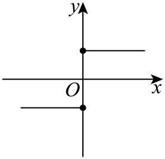
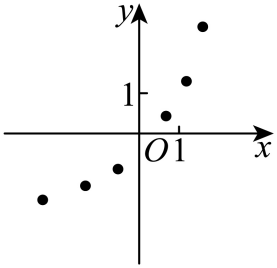
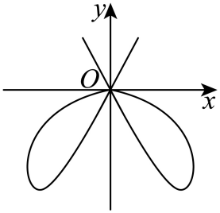
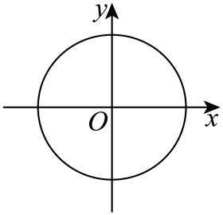

## 讲解

### 判据

题目给集合A、B及对应规则，问能否建立从A到B的函数，检查对象是**A的每一个输入**：有结果、只一个结果、结果在B中。三条缺一都失败。多对一、分段、不连续或有限点图都可以是函数，不能用“像不像熟悉曲线”替代定义。

题目只给图象时，实际点的横坐标组成定义域；若另规定输入A，还要检查A中有无未画出的输入。图象断开不自动否定函数：它可能只是定义域不包含某些横坐标。

### 流程

1. **先固定题目指定的方向和集合。** 把“从A到B”读成x∈A、输出须在B中。若交换方向，原来一个输出来自多个输入会变成同一新输入多输出，已经是另一个问题，不能混用判据。
2. **检查每个输入能算出结果。** 分母非零、根式有意义等须对全部A成立。有一个合法输入使运算无意义便失败；有限集合逐个算，区间用运算条件证明，不用几次代入代替全称检查。
3. **固定一个输入检查唯一性。** 算术平方根表示一个非负数，±符号允许两个不同结果时才违反唯一性。不同输入共享结果不违反这条，也不要求结果反过来唯一确定输入。
4. **检查全部输出是否落在B。** 输出范围包含于B即可，无须等于B。证明成立要覆盖所有输入；否定只需一个合法输入的越界结果。有限输入先列全部输出再去重，区间输入可用单调性或反解核验范围。
5. **图象改用竖线检查同一横坐标。** 只数实际曲线或散点，坐标轴、辅助虚线不属于函数。实心点收入，空心点排除。某竖线交两个实际点便不合格；零交点是否失败取决于题目是否要求该横坐标属于A。
6. **最后对照提问和选项。** “能”选全部成立者，“不能”选失败者；每项记一个完整成立依据或一个明确反例，不把值域未取遍B、多输入同值当失败。

有限集合可以穷举所有输入；无穷集合必须使用覆盖全域的理由。一个反例足以否定，与少量例子足以肯定是两件不同的事。

## 例题

### 原题 1-0

> 来源ID HSMA-B1-C3-Db1a16c452494-P0039；原件 `专题3.1 函数的概念及其表示（举一反三讲义）数学人教A版2019必修第一册（解析版）.docx`；DOCX正文段落 P0039—P0041；答案与详解 P0042—P0051。年份、地区和试题标签沿原资料记载，未独立核实。

**原资料题干与选项：**

【例1】（24-25高一上·湖北武汉·阶段练习）集合$A=\left\{ x|0\le x\le 4\right\},B=\left\{ y|0\le y\le 2\right\}$，下列不能表示从A到B的函数的是（   ）

A．$f:x\to y=\frac{1}{2}x$  B．$f:x\to y=\frac{1}{3}x$

C．$f:x\to y=\frac{2}{3}x$  D．$f:x\to y=\sqrt{x}$

**原资料答案与详解（完整保留，公式转写为LaTeX）：**

【答案】C

【解题思路】ABD选项，求出值域均为集合$B$的子集，且对每一个$x$，有唯一确定的$y$与其对应；C选项，求出值域不是集合$B$的子集，故C不能表示从A到B的函数.

【解答过程】A选项，$y=\frac{1}{2}x$，当$0\le x\le 4$时，$0\le y\le 2$，

且对每一个$x$，有唯一确定的$y$与其对应，故A能表示从A到B的函数；

B选项，$y=\frac{1}{3}x$，当$0\le x\le 4$时，$y\in \left[ 0,\frac{4}{3}\right]\subseteq \left[ 0,2\right]$，

且对每一个$x$，有唯一确定的$y$与其对应，故B能表示从A到B的函数；

C选项，$y=\frac{2}{3}x$，当$0\le x\le 4$时，$y\in \left[ 0,\frac{8}{3}\right]\supseteq \left[ 0,2\right]$，故C不能表示从A到B的函数；

D选项，$y=\sqrt{x}$，当$0\le x\le 4$时，$y\in \left[ 0,2\right]$，

且对每一个$x$，有唯一确定的$y$与其对应，故D能表示从A到B的函数；

故选：C.

**展开解析与核验（依据原详解补足，勘误另标）：**

题目给的是从A到B的对应，先用A限制输入，再检查所得值是否在B中；不要求取遍B。每项都给确定的单值式子，主要差别在输出范围。

A项：正数1/2乘$0\le x\le4$，不等号方向不变，得到$0\le x/2\le2$，每个输入都有唯一且合格的输出，成立。B项同理得到$0\le x/3\le4/3$，虽未取遍$[0,2]$，仍全在B中，成立。

C项取合法输入x=4，输出$8/3>2$，已超出B；一个反例足够否定，不必再检查其余输入。D项中x非负，算术平方根唯一且非负；由$x\le4$得到$\sqrt x\le2$，输出合格，成立。因此问“不能”的答案是C。

检验：A与D的值域都是B，B项值域更小但仍成立，直接说明“输出属于B”与“输出取遍B”的区别。

### 原题 1-2

> 来源ID HSMA-B1-C3-Db1a16c452494-P0059；原件 `专题3.1 函数的概念及其表示（举一反三讲义）数学人教A版2019必修第一册（解析版）.docx`；DOCX正文段落 P0059—P0060；答案与详解 P0061—P0068。年份、地区和试题标签沿原资料记载，未独立核实。

**原资料题干与选项：**

【变式1-2】（25-26高一上·全国·课前预习）已知集合$M=\left\{ -1,1,2,4\right\}$，$N=\left\{ 1,2,4\right\}$，给出下列四个对应关系，其中能构成从M到N的函数的是（    ）

A．$y={x}^{2}$  B．$y=x+1$  C．$y=x-1$  D．$y=|x|$

**原资料答案与详解（完整保留，公式转写为LaTeX）：**

【答案】D

【解题思路】根据函数定义判断.

【解答过程】对应关系若能构成从M到N的函数，则应满足：对M中的任意一个数$x$，通过对应关系在N中都有唯一的数$y$与之对应.

A选项中，当$x=4$时，$y={4}^{2}=16\notin N$，故A不能构成函数；

B选项中，当$x=-1$时，$y=-1+1=0\notin N$，故B不能构成函数；

C选项中，当$x=-1$时，$y=-1-1=-2\notin N$，故C不能构成函数；

D选项中，当$x=\pm 1$时，$y=\left| x\right|=1\in N$，当$x=2$时，$y=\left| x\right|=2\in N$，当$x=4$时， $y=\left| x\right|=4\in N$，故D能构成函数.

故选：D.

**展开解析与核验（依据原详解补足，勘误另标）：**

这是有限输入集合，判断可逐个代入；否定时找到一个反例就足够，肯定时必须覆盖全部输入。

A项输入4得到16，不属于N，失败。B项输入−1得到0，不属于N，失败。C项输入−1得到−2，不属于N，失败。D项逐个得到$|-1|=1$、$|1|=1$、$|2|=2$、$|4|=4$，四项都属于N且每个输入输出唯一，故选D。

−1与1共享输出1没有违背定义。若把这项多对一关系倒过来，以1作输入就会有−1与1两种输出，反向不是同样的函数判断；原题只判断从M到N的正向关系。

### 原题 1-1

> 来源ID HSMA-B1-C3-Db1a16c452494-P0052；原件 `专题3.1 函数的概念及其表示（举一反三讲义）数学人教A版2019必修第一册（解析版）.docx`；DOCX正文段落 P0052—P0054；答案与详解 P0055—P0058。年份、地区和试题标签沿原资料记载，未独立核实。

**原资料题干与选项：**

【变式1-1】（24-25高一上·陕西·期末）下列图象中，可以表示函数的为（    ）

A．  B．  

C．  D．

**原资料答案与详解（完整保留，公式转写为LaTeX）：**

【答案】B

【解题思路】根据函数的定义判断.

【解答过程】选项A，C，D的函数图象中存在$x$，对应多个不同的函数值，故不可以表示函数，故B正确.

故选：B.

**展开解析与核验（依据原详解补足，勘误另标）：**

**看到什么、想到什么：** 原题给的是图象，输入由实际曲线或散点的横坐标确定。用竖线固定一个横坐标，检查能否对应两个不同纵坐标；不把坐标轴或辅助线数作函数点。

**逐项核验：** A在横坐标0有上下两个实心点，两个纵坐标不同，违反唯一性。B的各散点横坐标互不相同，任一属于定义域的横坐标只对应其中一个点，符合；点与点之间没有画曲线，不擅自连线或补值。C在原点附近取适当的正横坐标，竖线分别遇到上方射线和下方曲线，对应至少两个不同纵坐标，失败。D在横坐标0处与圆的上、下两个实际点相交，失败。故只有B，选B。

**如何检验：** 没有用“不连续”否定B，没有用横线检验输入唯一性。A的两端标记都实心，不能把其中一个当空心删去；C的否定依靠原图实际分支的相交结构，没有量图猜具体坐标。

## 易错

- 以“两个输入得到同一数”否定函数：把唯一对应的方向倒置。
- 将图上空心端点纳入函数：先辨别标记再数交点。
- 有限集合只代最小最大值：中间成员也可能使分母为0或结果越界，须完整检查。
