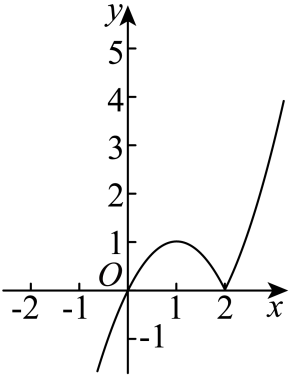
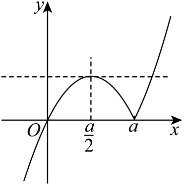
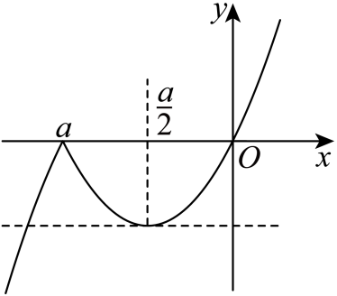

## 讲解

### 判据

一个明确分段的非恒定函数，要求在未知开区间$(m,n)$内同时取得最大和最小。不能一律以“开区间不取端点”否定最值，应找内部转向点，同时防止向两端延伸后出现超出已有界的值。本方法适用于本资料连续、各段严格变化且有限个转向点的结构；常值段或不连续函数需另分析。

### 流程

1. 由原解析式与分段条件求各段方向，定位所有可能取得内部极值的转向输入及其输出。参数改变点的次序时先分正、负等分支。
2. 开区间若有真实最大、最小，取等输入必须在内部；在本题每个非转向内部点附近都有沿单调方向更大或更小的值，故不能在那里取得相应极值。由此写m、n必须夹住哪些转向点。
3. 将其余各段与已取得的高低两界比较，求使区间内所有值仍在两界之间的延伸边界。用等值方程找边界，并检查根属于哪一分段、参数符号是否改变根次序。
4. 边界输入本身被开区间排除，但等值可已由内部转向点取得，因此m或n恰等于延伸界可能允许。是否允许取等依真实取等来源决定，不照抄区间圆括号。
5. 证明必要后还要证明充分：规定范围下两取等点确在区间里，左右延伸各段均不越界，故两个最值确实同时存在。明确$m<n$及参数退化情形。

### 两个不同的端点问题

开区间排除的是输入m、n，不是某个固定输出。一个输出若由内部顶点取得，就算区间边界的曲线也到达相同高度，最值仍能取得。反之，只找到一个内部最高点还不够；若某一端延伸后的值更高，原最高点就失去最大值资格。

先由分段公式证明变化方向，再列内部取等点与允许延伸界，图象用于核对这些结论。示意图的宽度、比例与斜率不是推导依据。参数符号会交换a、a/2和0的次序，应逐支排序，不能把正参数结果直接抄给负参数。

## 例题

### 原题 8-3

> 来源ID HSMA-B1-C3-Df09644ec0c27-P0551；原件 `专题3.2 单调性与最大（小）值（举一反三讲义）数学人教A版必修第一册（解析版）.docx`；DOCX正文段落 P0551—P0554；答案与详解 P0555—P0577。年份、地区和试题标签沿原资料记载，未独立核实。

**原资料题干与选项：**

【变式8-3】（24-25高三上·宁夏固原·阶段练习）已知$a\in R$，函数$f\left( x\right)=x\left| x-a\right|$.

  

(1)当$a=2$时，画出$f\left( x\right)$的图象，并写出其单调增区间；

(2)设$a\ne 0$，函数$f\left( x\right)$在$\left( m,n\right)$既有最大值又有最小值，分别求出实数m，n的取值范围（用a表示）.

**原资料答案与详解（完整保留，公式转写为LaTeX）：**

【答案】(1)图象见解析；单调增区间为$(-\infty ,1],[2,+\infty )$

(2)答案见解析

【解题思路】（1）画出图象，由图象即可得到增区间；

（2）

$$f(x)=\left\{ \begin{aligned}x(x-a),x\ge a\\x(a-x),x<a\end{aligned}\right.$$

，分$a>0$和$a<0$两种情况，分别画出函数$f\left( x\right)$的图象，结合图象，根据题中要求，分别求出m，n的取值范围.

【解答过程】（1）当$a=2$时，

$$f(x)=x|x-2|=\left\{ \begin{aligned}{x}^{2}-2x,x\ge 2\\-{x}^{2}+2x,x<2\end{aligned}\right.$$

，

作出图象，如图所示，

  

由图可知，函数$y=f(x)$的单调递增区间为$(-\infty ,1],[2,+\infty )$；

（2）因为$a\ne 0$，所以

$$f(x)=\left\{ \begin{aligned}x(x-a),x\ge a\\x(a-x),x<a\end{aligned}\right.$$

，

当$a>0$时，图象如下所示：

  

由图象可知，$f\left( x\right)$在$\left( -\infty ,a\right)$上的最大值为$f\left( \frac{a}{2}\right)=\frac{{a}^{2}}{4}$，

由

$$\left\{ \begin{aligned}y=\frac{{a}^{2}}{4}\\y=x(x-a)\end{aligned}\right.$$

， 又$x>a$，得$x=\frac{(\sqrt{2}+1)a}{2}$，

$\therefore $为使函数$f\left( x\right)$在$\left( m,n\right)$既有最大值又有最小值，

必须$0\le m<\frac{a}{2},a<n\le \frac{\sqrt{2}+1}{2}a$；

当$a<0$时，图象如下所示：

  

由图象可知，$f\left( x\right)$在$\left( a,+\infty \right)$上的最小值为$f\left( \frac{a}{2}\right)=-\frac{{a}^{2}}{4}$，

由

$$\left\{ \begin{aligned}y=-\frac{{a}^{2}}{4}\\y=x(a-x)\end{aligned}\right.$$

，又$x<a$，得$x=\frac{(\sqrt{2}+1)a}{2}$，

$\therefore $为使函数$f\left( x\right)$在$\left( m,n\right)$既有最大值又有最小值，

必须$\frac{\sqrt{2}+1}{2}a\le m<a,\frac{a}{2}<n\le 0$.

综上所述，当$a>0$时，$m$的取值范围是$\left[ 0,\frac{a}{2}\right),n$的取值范围是$\left( a,\frac{\sqrt{2}+1}{2}a\right]$；

当$a<0$时，$m$的取值范围是$\left[ \frac{\sqrt{2}+1}{2}a,a\right),n$的取值范围是$\left( \frac{a}{2},0\right]$.

**展开解析与核验（依据原详解补足，勘误另标）：**

图是原资料的图；下面从公式推导方向和边界，再对照图中的标记，不凭图的宽度或比例推断。

**（1）a=2的分段与图象。** x≥2时|x−2|=x−2，f=x²−2x=(x−1)²−1；x<2时|x−2|=2−x，f=−x²+2x=−(x−1)²+1。左段顶点(1,1)归本段，曲线先增至1再减到(2,0)；右段限制x≥2，在顶点1的右侧严格增，x=2处也为0。故两段在(2,0)接齐，增区间(−∞,1]与[2,+∞)。它们不能并成一个区间，因为1至2递减。原题给的空坐标轴是作图载体，解析中的曲线和坐标已完整保留。

**（2）先证明取等点位置。** 一般分段为
$$f(x)=
\begin{cases}
-x^2+ax=-(x-a/2)^2+a^2/4,&x<a,\\
x^2-ax=(x-a/2)^2-a^2/4,&x\ge a.
\end{cases}$$
对同一分支的任意u<v，二次式作差是$(v-u)(u+v-a)$或其相反数，依据输入在a/2哪一侧确定增减，故每个非转向内部点附近都有更大或更小输出，不能成为所求取等点。

**a>0。** 次序0<a/2<a；第一段先增后减，a/2是唯一内部峰点，高a²/4；在a处左右分别减、增，低0。要在开区间同时取得高低值，必须m<a/2、n>a。

若m<0，区间内含负x，f=x(a−x)<0，低于0；该左段严格增，负值的下界只能从排除的m处趋近，没有内部最低点。故m≥0。右侧x>a严格增，要不超过峰高，应
$$x(x-a)\le a^2/4
\iff (x-a/2)^2\le a^2/2.$$
在x>a这一支，上边界是$c=(1+\sqrt2)a/2$。因此n≤c；若n>c，区间内部有高于a²/4的输出，且右段严格增，无法在内部再取最高值。

必要范围是$0\le m<a/2$、$a<n\le c$。在此范围内部两点a/2与a确实存在；x∈(m,a)均在[0,a)内，输出在[0,a²/4]，x∈[a,n)也在[0,a²/4]。所以充分，最大a²/4和最小0均由内部点取得。m=0和n=c可以允许，因为这两边界输入虽被排除，相同低高输出已有内部来源。

**a<0。** 次序a<a/2<0；在左段x<a，位于向下二次式顶点a/2左侧，严格增至f(a)=0；右段x≥a先减至a/2，再增。于是a是内部峰点0，a/2是内部谷点−a²/4。必须m<a、n>a/2。

若n>0，内部含正x，f=x(x−a)>0，右段严格增，内部没有最高点，故n≤0。左侧要不低于谷值，要求
$$x(a-x)\ge-a^2/4
\iff (x-a/2)^2\le a^2/2.$$
因为a<0，在x<a这一支的左边界为$c=(1+\sqrt2)a/2<a$，必须m≥c；不能把两个根按正a时的顺序抄过来。若m<c，左侧内部输出低于谷值，且该段严格增，低界只能从排除边界趋近。

因此$c\le m<a$、$a/2<n\le0$。反向检查：左侧(m,a)不低于−a²/4且不高于0，右侧[a,n)也在这两界之间，内部a与a/2分别取得0、−a²/4。充分成立。m=c、n=0允许，理由仍是内部已有取等点。两参数分支与原答案一致。

原第2问排除a=0；若检查该退化情形，f=x|x|在R严格递增，在任何非空有限开区间都无最大最小值，不能把上述含a的范围直接套进去。

## 易错

- **开区间直接否定最大最小值。**开区间只删两个输入端点，内部转向点仍能取到极值。先找合法内部取等点，不套闭区间才有最值的错误结论。

- **只夹住峰谷不限制延伸范围。**区间延伸后的曲线可能超过内部峰谷高度，且沿外侧严格变化，真正上界或下界又落在被排除端点。还要解与峰谷等高的界并筛分支。

- **负参数沿用正参数点的顺序。**参数变号使a、a/2及等值根的次序改变。分别排序、选择所属分支，不能只把正参数公式中的a换成负数就结束。
