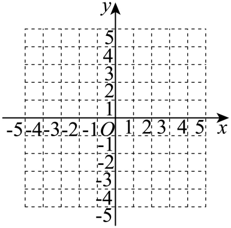
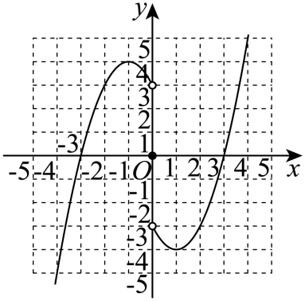

## 讲解

### 判据

题目给一侧的规则或函数值，目标输入在另一侧，又知道函数奇或偶时，用相反输入走回已知侧。关键是“先用局部规则算反射后的输出，再由奇偶关系恢复目标”，不能直接把域外输入代进局部公式。

### 流程

**1. 先写目标与反射后的范围。**要求负侧$x<0$，就写$-x>0$；如果已知的范围不是整个半轴，还须确认$-x$落在它实际给出的区间。域本身成对并不意味着每一侧都已给公式。

**2. 将反射输入完整代进已知规则。**若正侧$f(t)=A(t)$，已知段只能推出$f(-x)=A(-x)$。每一个$t$都要替换，括号、平方、分母及常数保持正确。下面原例$t^2-2t$变为$x^2+2x$，这一结果仍是$f(-x)$。

**3. 恢复目标输出。**偶性保持输出，奇性反转整个输出：

$$f(x)=A(-x)\quad(\text{偶});\qquad f(x)=-A(-x)\quad(\text{奇}).$$

因此原奇函数负侧为$-x^2-2x$，而不是原式$x^2-2x$或只改其中一项。求一个指定值时按同样两步走，不必先求全域解析式。

**4. 单独处理0与分段端点。**0若在域内，奇性给$f(0)=0$；但如果已知公式只声明$x>0$，不能把它直接延长到0。原综合例正侧$x^2-2x-3$在趋近0处接近$-3$，全域奇函数仍单独取$f(0)=0$，题目没有承诺连续。这一步能避免把不适用的常数项带到零点。

**5. 合并后验证所有分段。**保留原已知段与反射段的范围；若压成绝对值统一式，分别在$x\ge0$、$x<0$展开恢复。再核原指定值与全域奇偶恒等。图象反射还需传递实点、空点与禁值，不能只反射曲线形状。

## 例题

### 原题 2-0

> 来源ID HSMA-B1-C3-D29552845b9f5-P0089；原件 `专题3.3 奇偶性（举一反三讲义）数学人教A版必修第一册（解析版）.docx`；DOCX正文段落 P0089—P0090；答案与详解 P0091—P0095。年份、地区和试题标签沿原资料记载，未独立核实。

**原资料题干与选项：**

【例2】（24-25高一上·甘肃兰州·期末）已知函数$f\left( x\right)$是奇函数，当$x>0$时，$f\left( x\right)={x}^{2}-3$，那么$f\left( -2\right)$的值是（   ）

A．$-3$  B．$-1$  C．1  D．3

**原资料答案与详解（完整保留，公式转写为LaTeX）：**

【答案】B

【解题思路】根据奇函数的性质即可求解.

【解答过程】因为函数$f(x)$为奇函数，当$x>0$时，$f(x)={x}^{2}-3$,

则$f(-2)=-f(2)=-(4-3)=-1$.

故选：B.

**展开解析与核验（依据原详解补足，勘误另标）：**

原式只在$x>0$给出，不能直接把-2代入$x^2-3$。由奇函数定义，把-2反射到合法已知输入2，$f(-2)=-f(2)=-(2^2-3)=-1$。B对应；A的-3、D的3均与核验的-1不符；C的1是已知正侧$f(2)$的输出，漏了奇函数的输出负号。反射时输入变号、输出也变号，两次动作都写清。

### 原题 2-1

> 来源ID HSMA-B1-C3-D29552845b9f5-P0096；原件 `专题3.3 奇偶性（举一反三讲义）数学人教A版必修第一册（解析版）.docx`；DOCX正文段落 P0096—P0097；答案与详解 P0098—P0106。年份、地区和试题标签沿原资料记载，未独立核实。

**原资料题干与选项：**

【变式2-1】（24-25高一上·陕西西安·阶段练习）已知$y=f\left( x\right)$是定义在$R$上的奇函数，当$x\ge 0$时，$f\left( x\right)={x}^{2}-2x$，则在$R$上$f\left( x\right)$的表达式为（    ）

A．$-x\left( x-2\right)$  B．$\left| x\right|\left( x-2\right)$  C．$x\left( \left| x\right|-2\right)$  D．$\left| x\right|\left( \left| x\right|-2\right)$

**原资料答案与详解（完整保留，公式转写为LaTeX）：**

【答案】C

【解题思路】利用函数奇偶性求对称区域解析式，再利用绝对值的意义，把分段函数又写成含绝对值的函数即可.

【解答过程】当$x<0$时，$-x>0$，即有$f\left( -x\right)={\left( -x\right)}^{2}-2\left( -x\right)={x}^{2}+2x$，

再由$y=f\left( x\right)$是定义在$R$上的奇函数，所以$f\left( -x\right)=-f\left( x\right)$，

即有$f\left( x\right)=-f\left( -x\right)=-\left( {x}^{2}+2x\right)=-{x}^{2}-2x$，

所以当$x<0$时，$f\left( x\right)=-{x}^{2}-2x=x\left( -x-2\right)$，

当$x\ge 0$时，$f\left( x\right)={x}^{2}-2x=x\left( x-2\right)$，

综上可得：$f\left( x\right)=x\left( \left| x\right|-2\right)$，

故选：C.

**展开解析与核验（依据原详解补足，勘误另标）：**

先处理$x<0$，因为此时$-x>0$可用已知公式：$f(-x)=(-x)^2-2(-x)=x^2+2x$，奇性再给$f(x)=-x^2-2x$。$x\ge 0$仍是$x^2-2x$，$x=0$原式给0，与奇性要求一致。两段可统一为$x(|x|-2)$：正输入$|x|=x$，负输入$|x|=-x$，分别还原两式。C正确。

A在正输入一般就成原式的相反数；B在负输入成为$-x^2+2x$，与正确负段一次项符号不符；D的两因子都依|x|，整体偶，且在$x=-1$给-1而正确值为1。压成绝对值形式后仍要分别展开检查两段，不凭外形猜。

### 原题 2-3

> 来源ID HSMA-B1-C3-D29552845b9f5-P0114；原件 `专题3.3 奇偶性（举一反三讲义）数学人教A版必修第一册（解析版）.docx`；DOCX正文段落 P0114—P0116；答案与详解 P0117—P0122。年份、地区和试题标签沿原资料记载，未独立核实。

**原资料题干与选项：**

【变式2-3】（24-25高一上·辽宁盘锦·阶段练习）已知函数$f\left( x\right)$是定义域为$R$的偶函数，且当$x\ge 0$时，$f\left( x\right)={x}^{2}-x-1$，则当$x<0$时，（   ）

A．$f\left( x\right)={x}^{2}+x-1$  B．$f\left( x\right)={x}^{2}-x-1$

C．$f\left( x\right)={x}^{2}+x+1$  D．$f\left( x\right)={x}^{2}-x+1$

**原资料答案与详解（完整保留，公式转写为LaTeX）：**

【答案】A

【解题思路】利用偶函数的性质求函数解析式即得.

【解答过程】当$x<0$时，$-x>0$，则$f\left( -x\right)={\left( -x\right)}^{2}+x-1={x}^{2}+x-1$，

∵函数$f\left( x\right)$是定义域为$R$的偶函数，∴$f\left( -x\right)=f\left( x\right)$，

∴$f\left( x\right)={x}^{2}+x-1,x<0$.

故选：A.

**展开解析与核验（依据原详解补足，勘误另标）：**

$x<0$使$-x>0$，先送入已知非负段，$f(-x)=(-x)^2-(-x)-1=x^2+x-1$。偶性保持输出，即$f(x)=f(-x)$，所以A正确。B未把一次项的输入变号，C改了常数，D既未改一次项又改常数，均不恒等。偶性不是“原正段公式对所有x都照用”，它要求用反射后的实际输入代公式。

### 原题 P0445

> 来源ID HSMA-B1-C3-Dbe2509562877-P0445；原件 `专题03 函数性质的灵活运用必考八类问题（举一反三专项训练）数学人教A版必修第一册（解析版）.docx`；DOCX正文段落 P0445—P0449；答案与详解 P0450—P0462。年份、地区和试题标签沿原资料记载，未独立核实。

**原资料题干与选项：**

29．（24-25高一上·天津·期中）定义在$R$上的函数$f\left( x\right)$为奇函数，且当$x>0$时，$f\left( x\right)={x}^{2}-2x-3$.

(1)求$f\left( 2\right)$和$f\left( -1\right)$的值；

(2)求函数$f\left( x\right)$的解析式；

(3)作$f\left( x\right)$的图象，并写出单调区间和值域（直接写出单调区间和值域）.

**原资料答案与详解（完整保留，公式转写为LaTeX）：**

【答案】(1)$f\left( 2\right)=-3$，$f\left( -1\right)=4$；

(2)

$$f(x)=\left\{ \begin{aligned}-{x}^{2}-2x+3,x<0\\0,x=0\\{x}^{2}-2x-3,x>0\end{aligned}\right.$$

；

(3)作图见解析，答案见解析.

【解题思路】（1）根据解析式及奇函数性质，将自变量代入求值即可；

（2）利用奇函数的性质求解析式即可；

（3）根据解析式画出图象，数形结合确定单调区间和值域.

【解答过程】（1）由题设$f\left( 2\right)={2}^{2}-2\times 2-3=-3$，$f\left( -1\right)=-f(1)=-({1}^{2}-2\times 1-3)=4$；

（2）若$x<0$，则$-x>0$，故$f(x)=-f(-x)=-[{(-x)}^{2}-2\cdot (-x)-3]=-{x}^{2}-2x+3$，

由在$R$上的函数$f\left( x\right)$为奇函数，则$f(0)=0$，且$x>0$时，$f\left( x\right)={x}^{2}-2x-3$，

所以

$$f(x)=\left\{ \begin{aligned}-{x}^{2}-2x+3,x<0\\0,x=0\\{x}^{2}-2x-3,x>0\end{aligned}\right.$$

；

（3）

由图知，$f\left( x\right)$的单调增区间为$(-\infty ,-1),(1,+\infty )$，单调减区间为$(-1,1)$，且值域为R.

**展开解析与核验（依据原详解补足，勘误另标）：**

（1）正侧式给$f(2)=4-4-3=-3$；奇性$f(-1)=-f(1)=-(1-2-3)=4$。

（2）$x<0$时$-x>0$，$f(x)=-f(-x)=-[x^{2}+2x-3]=-x^{2}-2x+3$；0在R域，奇性强制$f(0)=0$；$x>0$保留原式。不能在0把左右分支外推的±3当函数值。

（3）负侧式$=4-(x+1)^{2}$，增到−1、再减向0；正侧式$=(x-1)^{2}-4$，先减到1、再增。过0时所有$-1\le x<0$输出$\ge 3$，0输出0，$0<x\le 1$输出$\le -3$，所以两侧减段连同零点仍严格减。原开区间答案成立；最大单调区间可包含顶点：增$(-\infty ,-1]$与$[1,+\infty )$，减$[-1,1]$。正侧输出$[-4,+\infty )$，负侧输出$(-\infty ,4]$，并上0得到R。原解图保留，须画两侧在(0,±3)空点、$(0,0)$实点，不能用连续连接代替题设跳跃。

## 易错

- 用目标负数直接调用正侧公式，没有经过反射输入。
- 奇性只变输入或只变一次项，漏掉整个输出负号。
- $x>0$的公式自动延长到0，添加题目没有给出的连续性。
- 统一绝对值式只试一个数就结束，未分别核两侧。
