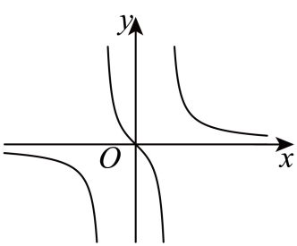
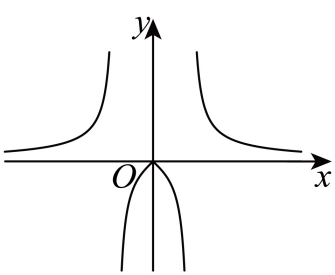
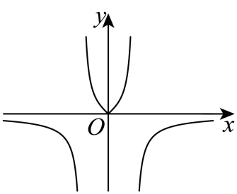
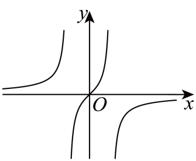
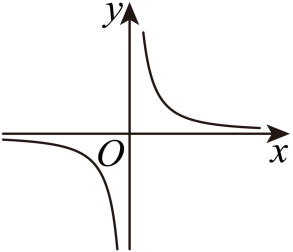
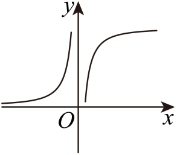
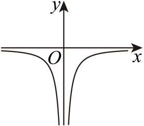
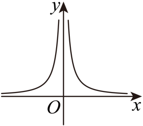

## 讲解

### 判据

从解析式选大致图象，或从标明条件的图象辨认解析式时，使用可以严格核对的特征逐条筛选：定义域、对称、零点、分段正负和关键合法点。示意图的长度比例、未经标注的角度不能当作精确数值条件。

### 流程

**1. 先找不会因图形细节改变的限制。**由解析式列分母禁值、根号条件和限定范围；由图读明确的刻度、实空点、题设说明。原图若明确在$\pm1$出现禁值，就要与候选分母的实际零点比对，不能只看曲线“两边都有缺口”。

**2. 检查对称性质。**对称域上计算$f(-x)$，决定图象需关于$y$轴还是原点对称。不同解析式可能同为奇函数，因此通过这一项只保留候选，不能马上选定。原函数非零时才可用奇偶互斥排除。

**3. 用分段符号排除错误位置。**在分子、分母符号不变的区间判断输出正负。例如$f(x)=x/(x^2-1)$在$0<x<1$分子正、分母负，输出负；$x>1$输出正。候选图若内段画在$x$轴上方，就违背已证符号。绝对值式先按该段展开，不能凭整体外形判断。

**4. 核关键点与趋势，补足剩余区别。**求合法的$f(0)$或其他标注输入，核零点是否实际在域内。对$f(x)=1/(x^2+|x|)$，域排0、输出总正、整体偶；正侧分母随$x$增大而严格增，倒数严格减。输入趋近0时分母任意小正，输出任意大；正输入任意大时分母任意大，输出靠近0。按这些定性依据判断曲线，而非量图。

**5. 让全部信息取交，再解释选项。**原例中两个候选同为奇且过原点，仍因禁值分别为$\pm1$与$\pm2$而区分。对每个错误选项指出具体违反哪条特征；对正确项说明已知特征同时吻合。全部原选项图仍保留，学生可以逐图核对。

如果题目只是给大致图象，证明与筛选只使用它明确承诺的特征，不从画得近似的位置补造条件。

## 例题

### 原题 6-0

> 来源ID HSMA-B1-C3-D29552845b9f5-P0267；原件 `专题3.3 奇偶性（举一反三讲义）数学人教A版必修第一册（解析版）.docx`；DOCX正文段落 P0267—P0269；答案与详解 P0270—P0275。年份、地区和试题标签沿原资料记载，未独立核实。

**原资料题干与选项：**

【例6】（24-25高一上·四川成都·阶段练习）函数$y=\frac{\left| x\right|}{{x}^{2}-1}$的图象大致为（    ）

A．  B．

C．  D．

**原资料答案与详解（完整保留，公式转写为LaTeX）：**

【答案】B

【解题思路】利用函数的奇偶性排除两个选项，再利用$0<x<1$时函数值的正负即可判断得解.

【解答过程】函数$y=\frac{\left| x\right|}{{x}^{2}-1}$中，${x}^{2}-1\ne 0$，解得$x\ne \pm 1$，函数的定义域为$\{x\in R|x\ne \pm 1\}$，

由$\frac{|-x|}{{(-x)}^{2}-1}=\frac{|x|}{{x}^{2}-1}$，得函数$y=\frac{\left| x\right|}{{x}^{2}-1}$是偶函数，其图象关于$y$轴对称，排除AD；

当$0<x<1$时，$\frac{|x|}{{x}^{2}-1}<0$，排除选项C，选项B符合要求.

故选：B.

**展开解析与核验（依据原详解补足，勘误另标）：**

原域R去±1对称，$|-x|=|x|$和平方给f偶，图必须关于y轴，A、D的原图是原点中心对称而非y轴对称，排除。$0<|x|<1$时分子正、分母负，输出负，C画成中间正，排除；B满足中间负、外侧正，$x=0$时分子0且分母-1，实点$(0,0)$也符合。选B。

四幅原选项完整保留。判图依据是明确的对称、禁值±1、符号区间和0点，不按曲线绘制高度比例量值。

### 原题 6-2

> 来源ID HSMA-B1-C3-D29552845b9f5-P0285；原件 `专题3.3 奇偶性（举一反三讲义）数学人教A版必修第一册（解析版）.docx`；DOCX正文段落 P0285—P0288；答案与详解 P0289—P0296。年份、地区和试题标签沿原资料记载，未独立核实。

**原资料题干与选项：**

【变式6-2】（24-25高一上·四川南充·期中）函数$f\left( x\right)$的大致图象如图所示，则$f\left( x\right)$可能是（    ）

  

A．$f\left( x\right)=\frac{1}{{x}^{2}-1}$  B．$f\left( x\right)=\frac{{x}^{2}}{x-1}$

C．$f\left( x\right)=\frac{x}{{x}^{2}-1}$  D．$f\left( x\right)=\frac{x}{{x}^{2}-4}$

**原资料答案与详解（完整保留，公式转写为LaTeX）：**

【答案】C

【解题思路】根据图象分析$f\left( x\right)$的奇偶性以及定义域，然后逐项判断即可.

【解答过程】由图象可知，$f\left( x\right)$为奇函数且定义域为$\left\{ x\left| x\ne \pm 1\right.\right\}$，

对于A：定义域为$\left\{ x\left| x\ne \pm 1\right.\right\}$关于原点对称，$f\left( -x\right)=\frac{1}{{\left( -x\right)}^{2}-1}=\frac{1}{{x}^{2}-1}=f\left( x\right)$，是偶函数，不符合；

对于B：定义域为$\left\{ x\left| x\ne 1\right.\right\}$，不符合；

对于C：定义域为$\left\{ x\left| x\ne \pm 1\right.\right\}$关于原点对称，$f\left( -x\right)=\frac{-x}{{\left( -x\right)}^{2}-1}=-\frac{x}{{x}^{2}-1}=-f\left( x\right)$，是奇函数，符合；

对于D：定义域为$\left\{ x\left| x\ne \pm 2\right.\right\}$，不符合；

故选：C.

**展开解析与核验（依据原详解补足，勘误另标）：**

原图标出竖直缺口±1、过原点并成原点中心对称。A虽然禁值正确，但分子常数、分母偶，整体偶且$f(0)=-1$，与原点信息冲突。B只有禁值1，不是图上成对的±1，也在对称域前提失败。C两禁值正确且$f(-x)=-f(x)$，$f(0)=0$；在$0<x<1$分母负而分子正，内段负，外段正，与原图对应，正确。D虽奇且过原点，禁值却±2，与明确刻度不符。选C。只检奇性不足，需与图上所有明确条件相交。

### 原题 6-3

> 来源ID HSMA-B1-C3-D29552845b9f5-P0297；原件 `专题3.3 奇偶性（举一反三讲义）数学人教A版必修第一册（解析版）.docx`；DOCX正文段落 P0297—P0299；答案与详解 P0300—P0305。年份、地区和试题标签沿原资料记载，未独立核实。

**原资料题干与选项：**

【变式6-3】（24-25高一上·贵州六盘水·期中）函数$f\left( x\right)=\frac{1}{{x}^{2}+\left| x\right|}$的图象为（    ）

A．    B．  

C．    D．  

**原资料答案与详解（完整保留，公式转写为LaTeX）：**

【答案】D

【解题思路】判定函数的奇偶性和正负即可得解.

【解答过程】$f\left( x\right)=\frac{1}{{x}^{2}+\left| x\right|}$的定义域为$\left( -\infty ,0\right)\cup \left( 0,+\infty \right)$，它关于原点对称，且$f\left( -x\right)=f\left( x\right)$，

所以$f\left( x\right)$是偶函数，排除AB，

当$x\ne 0$时，$f\left( x\right)=\frac{1}{{x}^{2}+\left| x\right|}>0$，排除C，经检验，D符合题意.

故选：D.

**展开解析与核验（依据原详解补足，勘误另标）：**

$x^2+|x|=|x|(|x|+1)$，因第二因子正，分母只有在$x=0$为0，定义域R去0；其成对对称且$f(-x)=f(x)$，整体偶，排除不关于y轴对称的A、B。合法输入分母严格正，输出恒正，C原图负，排除。D两侧正、对称且0处无定义，符合。

在正半轴分母$x^2+x$严格增，倒数减；趋近0时分母趋0正，输出增大无界，向外则输出趋0正；负侧按偶性反射，这些定性趋势与D一致。选D，不把渐近0当已取得的值。

## 易错

- 只核奇偶就选图，漏掉禁值、符号或具体刻度。
- 把0代进本来无定义的式子，误判是否过原点。
- 把绝对值中的负侧也按正侧展开，反射后的符号错误。
- 用示意图比例推算精确输入，超出图中给定信息。
