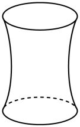
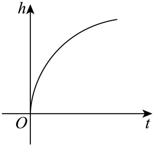
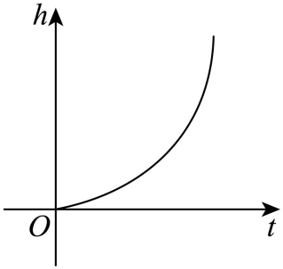
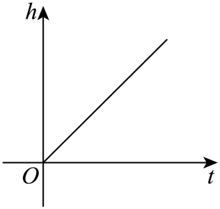
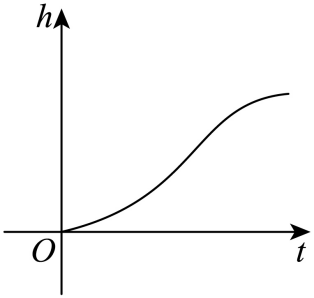

## 讲解

### 判据

容器形状明确，注水体积速率恒定，问水面高度随时间的图象。应比较同样时间输入的体积与该高度处水平截面积，不将匀速注水直接等同于水面匀速上升。容器漏水、倾斜或流速不恒定时，先改模型条件。

### 流程

1. 确认输入是时间、输出是水面高度，明确开始水位及图示有效到装满以前。恒定体积速率意味着等时间段流入相同体积。
2. 根据原图几何结构按高度判横截面积怎样变化。很薄一层水体积约为截面积乘高度增量，因此同体积下，截面积大则高度增量小，面积小则增量大。
3. 从下往上逐段翻译为水位上升速度变慢或变快；先确定高度是否一直增加，再比较斜率趋势。这里只作定性判定，不从示意图虚构精确半径或比例。
4. 把各选项的增减和快慢次序与所得阶段一一比较，逐项说明矛盾。若容器截面积变化信息不足，不能强选某条精确曲线。

### 等时间、等体积与图象陡缓的联系

固定体积流量意味着等长时间注入等体积。容器某段较宽时，同样的新增体积要铺在更大的水平面积上，水位增加较少；某段较窄时，新增体积集中在较小面积上，水位增加较多。因此高度图象仍然上升，但同一段时间的高度增量可能由小变大，也可能由大变小。

“图象更陡”在这里表示相同横向时间增量对应更大的纵向高度增量。先按水位实际从下向上的顺序找截面积变化，再读快慢，不能仅凭容器外轮廓像哪种曲线就选择。对很薄的水层，可用“体积约等于截面积×高度”解释定性关系；这里不把近似关系当作整段变截面容器的精确体积公式。

## 例题

### 原题 8-0

> 来源ID HSMA-B1-C3-Db1a16c452494-P0356；原件 `专题3.1 函数的概念及其表示（举一反三讲义）数学人教A版2019必修第一册（解析版）.docx`；DOCX正文段落 P0356—P0359；答案与详解 P0360—P0365。年份、地区和试题标签沿原资料记载，未独立核实。

**原资料题干与选项：**

【例8】（24-25高一上·全国·课后作业）水以恒速注入下图所示容器中，则水的高度$ℎ$与时间$t$满足的函数图象是（    ）

A．  B．  

C．  D．

**原资料答案与详解（完整保留，公式转写为LaTeX）：**

【答案】D

【解题思路】根据容器的特征，结合几何体的结构和题意知，容器的底面积越大水的高度变化慢、反之变化得快，再由图象越平缓就是变化越慢、图象陡就是变化快来判断．结合函数图象分析判别可得结论.

【解答过程】此容器从下往上口径先由大变小，再由小变大，故等速注入液体其高度增加变化率先由慢变快，再由快变慢，

A、B、C选项中：函数图象中高度变化率分别是先快后慢、先慢后快、匀速的增加，与题干不符，故排除；

D选项：当注水开始时，函数图象中高度变化率是先由慢变快，再由快变慢，符合题意；

故选：D.

**展开解析与核验（依据原详解补足，勘误另标）：**

原图容器从下到中间横截面积逐渐变小，再向上逐渐变大；这是形状信息。匀速注水指等长时间进入同样体积，不表示水面匀速上升。

在一层很薄的水平水层中，体积约为横截面积乘高度。相同体积流入时，面积越大，上升高度越小；面积越小，上升高度越大。因此水位随时间始终升高，且先慢、再快、再慢，到容器装满以前符合D。A先快后慢的总体趋势不符下部收窄过程；B只呈由慢到快而没有上部再变慢；C直线表示各时段上升速率相同，不符截面积变化。这里用等时段体积的解释即可，不需要把示意图量成精确尺寸或用导数。

## 易错

- **匀速注水当成高度匀速。**恒定的是体积增量，截面积变化使高度增量变化。逐段比较等时间进入等体积需要抬升的高度，而不是直接选直线。

- **只按上部外形看快慢。**水位先经过容器底部再到上部，图象阶段必须按这个顺序匹配。遗漏下部变窄或上部变宽都会选错曲线。

- **从示意图断言精确时间比例。**形状只能支撑定性升降与快慢；具体拐点时刻、装满时间须有容积、流量和尺寸数据，不从未标注比例的图量数。
