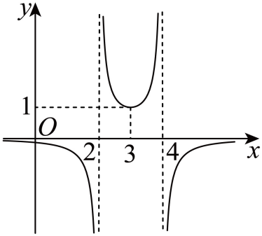
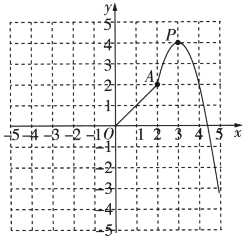
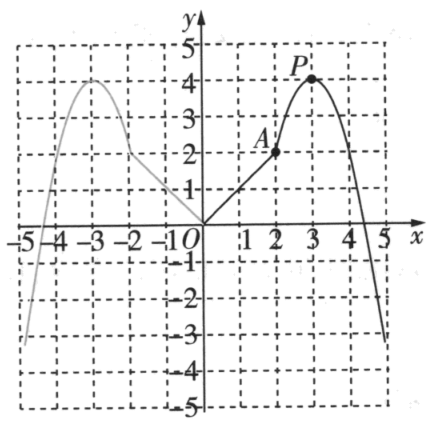

## 讲解

### 判据

题目已规定函数类型，图上明确标出点、顶点或虚线位置，可把标记转换成参数条件。先有类型，再用精确数据定系数；少数点落在同一式子上，不能证明未知曲线必属于该类型。

扫描图的比例、角度、未标曲线点的精确坐标不作条件。图象仅给一部分而题设有奇偶性时，先恢复已知半侧，再按恒等式反射；不能只凭画面像对称便推另一半。

### 流程

1. **分清题设与画面分别提供什么。** 列函数类型和各段输入范围，再抄明确标记的坐标、顶点、界线。坐标轴与辅助线是读取信息的工具，不作为函数的一部分。
2. **按结构选形式并说明参数条件。** 一次段用kx+b，过原点可令b=0；二次段有顶点(h,k)用a(x−h)²+k，a≠0。把点代入前查它属于该段，接合点由哪个分支收入按题设区间判定。
3. **倒数式谨慎处理竖直界线。** 若题给1/(ax²+bx+c)，分子恒非零，图中明确表示沿两条不同竖线x=r、s无界（r≠s），则这两数使分母为0，是分母二次式的两根，可写a(x−r)(x−s)。一般分式可能约去因子或有其他禁值，不能把每个未定义点都当这类极点。
4. **代入独立已知点确定余参。** 每条方程写其来源，解时保留非零条件。数据不够应报告未唯一确定；过所有给定点但不符合原类型或范围的式子也不合格。
5. **需要反射时同时变输入和输出。** 偶函数用f(−x)=f(x)，奇函数用f(−x)=−f(x)，先核对域对称及0点。原图与恢复后的式子可以互检，但不能用原图未精确标明的尺度覆盖推导结论。
6. **核查全部问题和端点。** 解析式检查所有已给点；目标求值先排禁值；单调和最值按式子与各段范围证明，跨段需检查接合处，不能只照示意图升降报区间。作图保留原资料的必要图，补讲说清空实点及反射依据。

“渐近线”在这里表示曲线靠近某条竖线时纵坐标无界的图象信息，不要求先用极限计算；只按原题明确的竖线和对应结构使用，不由看起来空一列就猜分母根。

## 例题

### 原题 8-2

> 来源ID HSMA-B1-C3-Db1a16c452494-P0377；原件 `专题3.1 函数的概念及其表示（举一反三讲义）数学人教A版2019必修第一册（解析版）.docx`；DOCX正文段落 P0377—P0379；答案与详解 P0380—P0386。年份、地区和试题标签沿原资料记载，未独立核实。

**原资料题干与选项：**

【变式8-2】（24-25高一上·浙江杭州·期中）若函数$f\left( x\right)=\frac{1}{a{x}^{2}+bx+c}$的部分图象如图所示，则$f\left( 5\right)=$（    ）

A．$-\frac{2}{3}$  B．$-\frac{1}{12}$  C．$-\frac{1}{6}$  D．$-\frac{1}{3}$

**原资料答案与详解（完整保留，公式转写为LaTeX）：**

【答案】D

【解题思路】利用函数图象求得函数定义域，利用函数值可得出其解析式，代入计算即求得函数值.

【解答过程】根据函数图象可知$x=2$和$x=4$不在函数$f\left( x\right)$的定义域内，

因此$x=2$和$x=4$是方程$a{x}^{2}+bx+c=0$的两根，可得$f\left( x\right)=\frac{1}{a\left( x-2\right)\left( x-4\right)}$，

又易知$f\left( 3\right)=1$，可得$a=-1$，

即$f\left( x\right)=-\frac{1}{\left( x-2\right)\left( x-4\right)}$，所以$f\left( 5\right)=-\frac{1}{3}$.

故选：D.

**展开解析与核验（依据原详解补足，勘误另标）：**

**看到什么、想到什么：** 题设已经给1/(ax²+bx+c)的结构。原图x=2、4的竖直虚线与靠近竖线的无界曲线，按原详解表示这两处为分母零点；水平1、竖直3的辅助线交在曲线上，提供明确点(3,1)。不是靠量图猜位置，也不是只因某个横坐标没有画点便判分母根。

分子恒为1，不存在约掉零因子的情形。二次分母有两个不同根2、4，故a≠0，分母写成a(x−2)(x−4)。用合法点3代入：

$$
1=f(3)=\frac1{a(3-2)(3-4)}=-\frac1a,
$$

乘非零a得到a=−1，因此f(x)=−1/[(x−2)(x−4)]，原域排除2、4。目标5合法，代入得到f(5)=−1/[(5−2)(5−4)]=−1/3。

**逐项核验：** A的−2/3、B的−1/12、C的−1/6均与这个同一式子的回算值不同；D的−1/3一致，选D。各分数分母非零，没有再筛根问题。

**如何检验：** 展开分母−(x−2)(x−4)=−x²+6x−8，仍符合题设结构；x=2、4使分母为0，x=3给1。反查全部明确标记，不把图的左右高低或缩放尺度作为额外系数条件。

### 原题 P0554

> 来源ID HSMA-B1-C3-D66415d5a16cf-P0554；原件 `第三章 函数的概念与性质（举一反三讲义·基础篇）数学人教A版必修第一册（解析版）.docx`；DOCX正文段落 P0554—P0558；答案与详解 P0559—P0574。年份、地区和试题标签沿原资料记载，未独立核实。

**原资料题干与选项：**

5．（25-26高一上·全国·单元测试）设$f\left( x\right)$为定义在$R$上的偶函数，如图是函数图象的一部分，当$0\le x<2$时，是线段$OA$；当$x\ge 2$时，图象是顶点为$P\left( 3,4\right)$，且过点$\left( 2,2\right)$的二次函数图象的一部分．

(1)在图中的直角坐标系中补充完整函数$f\left( x\right)$的图象；

(2)求函数$f\left( x\right)$在$\left[ 0,+\infty \right)$上的解析式；

(3)求函数$f\left( x\right)$的单调区间和最大值．

**原资料答案与详解（完整保留，公式转写为LaTeX）：**

【答案】(1)作图见解析；

(2)

$$f\left( x\right)=\left\{ \begin{aligned}x,0\le x<2\\-2{x}^{2}+12x-14,x\ge 2\end{aligned}\right.$$

；

(3)答案见解析.

【解题思路】（1）根据偶函数的对称性画出函数图象；

（2）根据已知写出解析式，结合点在函数图象上求参数，再用分段函数形式写出解析式；

（3）由图象确定函数的单调区间和最大值.

【解答过程】（1）如图，根据函数为偶函数，函数的图象关于$y$轴对称，补充完整其图象如下：

（2）当$0\le x<2$时，$f\left( x\right)=x$；

当$x\ge 2$时，依题设$f\left( x\right)=a{\left( x-3\right)}^{2}+4$，

将点$\left( 2,2\right)$代入，得$a+4=2$，解得$a=-2$，

故$f\left( x\right)=-2{\left( x-3\right)}^{2}+4=-2{x}^{2}+12x-14$．

即函数$f\left( x\right)$在$\left[ 0,+\infty \right)$上的解析式为

$$f\left( x\right)=\left\{ \begin{aligned}x,0\le x<2\\-2{x}^{2}+12x-14,x\ge 2\end{aligned}\right.$$

；

（3）由图知，函数$f\left( x\right)$单调递增区间为$\left( -\infty ,-3\right]$和$\left[ 0,3\right]$，单调递减区间为$\left[ -3,0\right]$和$\left[ 3,+\infty \right)$，

函数$f\left( x\right)$在$x=-3$和$x=3$处取得最大值，且$f\left( 3\right)=f\left( -3\right)=4$，

所以函数$f\left( x\right)$的最大值为4．

**展开解析与核验（依据原详解补足，勘误另标）：**

**看到什么、想到什么：** 题目规定偶函数、两段类型和范围，顶点(3,4)与点(2,2)都精确给出。先恢复非负半侧，再按偶函数反射；三问依次要求补图、确定非负侧解析式、判断完整单调区间与最大值。

**（1）补全图象。** 定义域R关于0对称，且f(−x)=f(x)，每个原图点(x,y)反射成(−x,y)。原解析的完整图保留；这来自题设偶性，不是从画面看着对称猜出的条件。原点保持唯一点，点(2,2)、(3,4)分别对应(−2,2)、(−3,4)。

**（2）确定非负侧解析式。** OA的端点坐标为原点与A(2,2)，一次式y=kx+b先由原点得b=0，再由2=2k得k=1。区间0≤x<2用f(x)=x，边界2不属这段。右段顶点式f(x)=a(x−3)²+4，a≠0；合法点2代入2=a·1+4，减4得a=−2。展开每一步：

$$
\begin{aligned}
-2(x-3)^2+4
&=-2(x^2-6x+9)+4\\
&=-2x^2+12x-18+4\\
&=-2x^2+12x-14.
\end{aligned}
$$

故非负侧为原答案两段式；在x=2右式给2，与左段的边界趋向值相同，但2实际由右段定义，不重复收进左段。全部反射后的式子也可统一写为：|x|<2用|x|，|x|≥2用−2(|x|−3)²+4。

**（3）证明完整单调段并求最大值。** 在[0,2)一次式严格增；在[2,3]二次顶点左侧严格增，在[3,+∞)右侧严格减。跨前两段时，任意0≤u<2≤v≤3，有f(u)=u<2≤f(v)，所以能合成[0,3]严格增；不是因“各段都增”便直接合并。通过偶函数反射，正侧[0,3]的次序反向给[−3,0]严格减，正侧[3,+∞)给(−∞,−3]严格增。四个最大严格单调区间正与原解一致，转向点可作为相邻单调段的端点。

一次段输出小于2，二次段−2(|x|−3)²+4≤4，当且仅当|x|=3取等，两合法输入为±3，最大值4。**如何检验：** 分段接合、偶性、全部精确点、三问、转向点收入及两个并列取等输入均已检查；图象只辅助呈现，结论由式子和题设推出。

## 易错

- 把未标坐标的点按画面像素比例读成整数。
- 分母有可约零点，却当成竖直渐近线。
- 忘记求目标值前排除极点输入。
