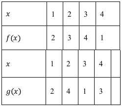

## 讲解

### 判据

求f(c)、f(g(c))或f(f(c))时，关键是**括号内当前送入函数的量**。已知f(u(x))=v(x)，外面的x只是用于形成输入的变量，不一定等于目标c。查表、分段或嵌套时，每次调用都需按新输入重判。

抽象恒等式另要求代入参数合法；这里先处理从目标找到输入、逐层调用的共性。复杂性质推导可按相应考点展开，不能只凭符号长就机械反复代入。

### 流程

1. **把目标与已知括号对齐。** 已知f(u(x))=v(x)而要f(c)，先解u(x)=c，并检查参数x在原等式允许范围。若无解，给定关系不能决定这个目标；若有多解，v(x)须一致，否则题设自身有冲突。
2. **画出调用顺序并从内层算。** f(g(c))先检查c∈Dg，再求t=g(c)，再检查t∈Df，最后求f(t)。这两项条件都须满足，不能因两个函数各自存在便认为任何复合都可算。
3. **每层重新读规则。** 列表先找输入t对应的列；分段先找t满足哪一段；解析式代整个t，负数和和式用括号。前一次的分支属于前一次输入，不能传给输出。
4. **遇到递归分支继续写当前输入。** 先将它展开到有明确非递归式的一层，再由内到外返回。只有已核实这条调用链有值，才能得到本目标；不据某个目标成功便声称全域递归一定终止或唯一。
5. **解参时保留原等式方向。** 目标函数值与已知值相等后才列参数方程；除某值前查非零。求完参数，用制造目标的参数输入代回，不把目标c又当原参数x。
6. **用原规则反检每层。** 标明中间量是否在表或分支内、是否都用相同函数；若问多项或多小问逐项完成，不只验证最终正确选项。

f(g(c))与g(f(c))调用顺序不同，通常没有交换性。只有原题另给两者相等的条件或逐层回算一致，才能说这个目标处相等。

## 例题

### 原题 6-1

> 来源ID HSMA-B1-C3-Db1a16c452494-P0246；原件 `专题3.1 函数的概念及其表示（举一反三讲义）数学人教A版2019必修第一册（解析版）.docx`；DOCX正文段落 P0246—P0247；答案与详解 P0248—P0252。年份、地区和试题标签沿原资料记载，未独立核实。

**原资料题干与选项：**

【变式6-1】（24-25高一上·辽宁辽阳·期中）已知函数$f(2x+3)={x}^{2}-x+a$，且$f(5)=3$，则$a=$（   ）

A．$-3$  B．3  C．$-17$  D．17

**原资料答案与详解（完整保留，公式转写为LaTeX）：**

【答案】B

【解题思路】根据给定条件，利用赋值法代入计算得解.

【解答过程】函数$f(2x+3)={x}^{2}-x+a$，令$x=1$，则$f(5)={1}^{2}-1+a=a$，而$f(5)=3$，

所以$a=3$.

故选：B.

**展开解析与核验（依据原详解补足，勘误另标）：**

**看到什么、想到什么：** 所求f(5)中的实际输入5，应等于已给括号2x+3。先解2x+3=5，减3得2x=2，除2得x=1；不能把原参数直接取5。

代这个参数，f(5)=1²−1+a=a；题给f(5)=3，故a=3。**逐项核验：** A令a=−3会给f(5)=−3；C令a=−17会给−17；D令a=17会给17；只有B的3满足已知等式，选B。若误代x=5会制造输入13而非5，不是本目标。

**如何检验：** 参数代1制造输入5，输出代回3；这个一次内层对目标5有唯一解，没有多对一输入不一致问题。

### 原题 8-3

> 来源ID HSMA-B1-C3-Db1a16c452494-P0387；原件 `专题3.1 函数的概念及其表示（举一反三讲义）数学人教A版2019必修第一册（解析版）.docx`；DOCX正文段落 P0387—P0411；答案与详解 P0412—P0418。年份、地区和试题标签沿原资料记载，未独立核实。

**原资料题干与选项：**

【变式8-3】（24-25高一上·广东佛山·期中）已知函数$f\left( x\right)\text{、}g\left( x\right)$列表法表示如下，则下列说法正确的是（    ）

A．$f\left( f\left( 1\right)\right)=4$  B．$g\left( g\left( 1\right)\right)=1$

C．$f\left( g\left( 1\right)\right)=3$  D．$g\left( f\left( 1\right)\right)=2$

**原资料答案与详解（完整保留，公式转写为LaTeX）：**

【答案】C

【解题思路】结合表格中的数据，代入即可得到正确答案.

【解答过程】由表格得$f\left( 1\right)=2$，$f\left( 2\right)=3$，$g\left( 1\right)=2$，$g\left( 2\right)=4$，

则$f\left( f\left( 1\right)\right)=f\left( 2\right)=3$，$g\left( f\left( 1\right)\right)=g\left( 2\right)=4$，

$f\left( g\left( 1\right)\right)=f\left( 2\right)=3$，$g\left( g\left( 1\right)\right)=g\left( 2\right)=4$，

因此，只有C选项正确.

故选：C.

**展开解析与核验（依据原详解补足，勘误另标）：**

两表的合法输入均为1、2、3、4。先读原表：f依次输出2、3、4、1，g依次输出2、4、1、3；它们都允许不同规则作用于同一输入，不可交换查表次序。

A：先$f(1)=2$，再$f(2)=3$，所以$f(f(1))=3\ne4$，错误。B：先$g(1)=2$，再$g(2)=4$，所以$g(g(1))=4\ne1$，错误。C：先$g(1)=2$，再$f(2)=3$，所述等号成立。D：先$f(1)=2$，再$g(2)=4$，不是2，错误。每次所得中间输入2都在第二张表内，因此四次复合都有定义，只有C正确。

检验重点是同一列的输入与输出配对，而不是看到括号里1就两次都读第1列。列表给出的输入是有限集合，不补造其他实数处的函数值。

### 原题 10-3

> 来源ID HSMA-B1-C3-Db1a16c452494-P0515；原件 `专题3.1 函数的概念及其表示（举一反三讲义）数学人教A版2019必修第一册（解析版）.docx`；DOCX正文段落 P0515—P0519；答案与详解 P0520—P0535。年份、地区和试题标签沿原资料记载，未独立核实。

**原资料题干与选项：**

【变式10-3】（24-25高一上·山东济南·阶段练习）已知函数

$$f\left( x\right)=\left\{ \begin{aligned}-2x+1,x<1\\{x}^{2}-2x,x\ge 1\end{aligned}\right.$$

.

(1)求$f\left( f\left( -3\right)\right)$；

(2)画出函数的图象；

(3)若$f\left( x\right)=3$，求$x$的值.

**原资料答案与详解（完整保留，公式转写为LaTeX）：**

【答案】(1)35

(2)图象见解析

(3)-1或3

【解题思路】（1）代入求解，先求出$f\left( -3\right)=7$，从而得到$f\left[ f\left( -3\right)\right]=f\left( 7\right)=35$；

（2）描点，连线，画出函数图象；

（3）分$x\in \left( -\infty ,1\right)$和$x\in \left[ 1,+\infty \right)$两种情况，得到方程，求出答案.

【解答过程】（1）∵$-3<1$，∴$f\left( -3\right)=-2\times \left( -3\right)+1=7$，

又∵$7>1$，∴$f\left[ f\left( -3\right)\right]=f\left( 7\right)={7}^{2}-2\times 7=35$，

（2）当$x<1$时，函数图象为射线，其中$f\left( 0\right)=1,f\left( 1\right)=-1$，

当$x\ge 1$时，$f\left( x\right)={x}^{2}-2x$，图象为抛物线的一部分，其中$f\left( 2\right)=0$，

图象如图所示：

（3）当$x\in \left( -\infty ,1\right)$时，有$f\left( x\right)=-2x+1=3$，解得$x=-1$，符合；

当$x\in \left[ 1,+\infty \right)$时，有$f\left( x\right)={x}^{2}-2x=3$，解得$x=3$或$x=-1$，

但$x=-1\notin \left[ 1,+\infty \right)$，故舍去，所以$x$的值为3，

综上所述：$x$的值为$-1$或3．

**展开解析与核验（依据原详解补足，勘误另标）：**

（1）第一次输入−3<1，用线性段：$f(-3)=-2(-3)+1=7$。第二次输入已经是7≥1，要改用二次段：$f(7)=7^2-2\cdot7=49-14=35$，不是沿原分支再算一次。

（2）x<1的直线为y=−2x+1，经过(0,1)，趋向(1,−1)但这个端点不属于该段；x≥1的二次段为$y=(x-1)^2-1$，从顶点(1,−1)开始且包括该点，经过(2,0)。整体在接合点有唯一实心点(1,−1)，由第二段定义。原详解在射线说明处写f(1)=−1，数值恰与整体第二段相同，但不能据此把1收入第一段。

（3）线性段：$-2x+1=3$，减1得−2x=2，除−2得x=−1，符合x<1。二次段：$x^2-2x=3$，移项并分解得$(x-3)(x+1)=0$，候选为3、−1；只留符合x≥1的3，排除该段候选−1。两段合格输入取并为{−1,3}。检验$f(-1)=3$由线性段给出，$f(3)=3$由二次段给出；同一数在某段被排除，不妨碍它在另一合法段成为解。

## 易错

- 把$f(2x+3)$中$x=5$当成求$f(5)$：应先令$2x+3=5$。
- 外层沿用原输入所属分支：输出已经换成新输入，需要重判。
- 内层有输出便省略外层合法性：先确认中间量属于外函数的定义域，再调用。
