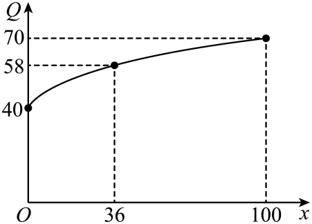

## 错法

甲、乙的模型都使用参数$a,b$，先从甲的数据算出一组$a,b$，接着又从乙的数据算出另一组，并把两组答案一起使用。学生容易认为“甲乙是两个对象，所以参数自然可以不同”，却没有检查题目是否允许这样解释。

错在第二次给同一个符号赋予了新值：同一组联立条件中，同一个参数表示同一个固定数。模型名称不同，不会自动使参数相互独立。

## 正解

**先明确参数关系，再拟合。**如果题目说明两对象各自拟合，应分别写成$a_{\text{甲}},b_{\text{甲}}$与$a_{\text{乙}},b_{\text{乙}}$。下标的作用是标明不同参数，而非为了算出答案就暗中改题。

如果题设要求共用参数，则两个对象的数据必须同时满足这些参数。做法是：由一组独立数据求出候选值，再代入另一对象的全部条件；只要有一个条件矛盾，就不能把两套结果拼成“共同模型”。

本条原题中，甲表给出$a=3/20,b=30$，乙图却在零投入时给出利润40。按原解所用正幂模型，乙的零输入截距应为$b=40$，因此与甲的$b=30$冲突。原答案能够成立，需要把两对象的参数解释成分别独立的一组。

下面保留原题、原答案及原详解，再明确展示两种读法。这里要学会的判断是“先检查模型条件是否相容”，原书符号歧义没有因能算出一个分配方案而消失。

## 例题

### 原题 7-2

> 来源ID HSMA-B1-C3-D9d1c86634e46-P0463；原件 `专题3.5 函数的应用（一）（举一反三讲义）数学人教A版必修第一册（解析版）.docx`；DOCX正文段落 P0463—P0476；答案与详解 P0477—P0496。年份、地区和试题标签沿原资料记载，未独立核实。

**原资料题干与选项：**

【变式7-2】（24-25高一上·广东佛山·期中）某工厂生产甲、乙两种产品所得的利润分别为$P$和$Q$（万元），事先根据相关资料得出它们与投入资金$x$（万元）的数据分别如下表和图所示：其中已知甲的利润模型为$P=ax+b$，乙的利润模型为$Q=b+a{x}^{\alpha }$．（$a,b,\alpha $为参数，且$a\ne 0$）.

| $x$ | 20 | 40 | 60 | 80 |
| --- | --- | --- | --- | --- |
| $P$ | 33 | 36 | 39 | 42 |

（1）请根据下表与图中数据，分别求出甲、乙两种产品所得的利润与投入资金$x$（万元）的函数模型

（2）今将$300$万资金投入生产甲、乙两种产品，并要求对甲、乙两种产品的投入资金都不低于$75$万元．设对乙种产品投入资金$m$（万元），并设总利润为$y$（万元），如何分配投入资金，才能使总利润最大？并求出最大总利润．

**原资料答案与详解（完整保留，公式转写为LaTeX）：**

【答案】（1）$P=\frac{3}{20}x+30,x\ge 0$；$Q=40+3\sqrt{x},x\ge 0$；

（2）当甲产品投入$200$万元，乙产品投入$100$万元时，总利润最大为$130$万元

【解题思路】（1）根据题意,将数据分别代入甲、乙两种产品所得的利润与投入资金$x$（万元）的函数模型中,解方程组,即可求出函数表达式.

（2）根据题意,设对乙种产品投资$m$,对甲种产品投资$(300-m)$,代入两个利润公式,利用换元法求出函数的值域,然后求最大值即可.

【解答过程】解：（1）由甲的数据表结合模型$P=ax+b$代入两点可得$(20,33)$ $(40,36)$

代入有

$$\{\begin{aligned}20a+b=33\\40a+b=36\end{aligned}$$

得$a=\frac{3}{20}$,$b=30$

即$P=\frac{3}{20}x+30,x\ge 0$

由乙的数据图结合模型$Q=b+a{x}^{\alpha }$代入三个点可得$(0,40)$,$(36,58)$,$(100,70)$可得

$$\{\begin{aligned}b+0=40\\b+a{36}^{\alpha }=58\\b+a100\alpha =70\end{aligned}$$

,

得$a=3$,$b=40$,$\alpha =\frac{1}{2}$

即$Q=40+3\sqrt{x},x\ge 0$

（2）根据题意,对乙种产品投资$m$（万元）,对甲种产品投资$(300-m)$（万元）,

那么总利润$y=\frac{3}{20}(300-m)+30+40+3\sqrt{m}$ $=-\frac{3}{20}m+3\sqrt{m}+115$,

由

$$\{\begin{aligned}m\ge 75\\300-m\ge 75\end{aligned}$$

,解得$75\le m\le 225$,

所以$y=-\frac{3}{20}m+3\sqrt{m}+115$,

令$t=\sqrt{m}$,$m\in [75,225]$,故$t\in [5\sqrt{3},15]$,

则$y=-\frac{3}{20}{t}^{2}+3t+115$ $=-\frac{3}{20}{(t-10)}^{2}+130$,

所以当$t=10$时,即$x=100$时,${y}_{\max }=130$,

答：当甲产品投入$200$万元,乙产品投入$100$万元时,总利润最大为$130$万元.

**展开解析与核验（依据原详解补足，勘误另标）：**

**原题符号冲突与两种读法：** 若甲P与乙Q严格共用题写的a、b，甲表两点已给$a=3/20$、$b=30$；乙原图有合法零输入点$(0,40)$，要求幂项在0有意义并输出0，故$\alpha >0$且$b=40$，与30冲突。因此按共用参数读法无合法模型，不能同时得到原答案。

（1）以下按原详解意图，将两对象参数视为各自独立并标下标。甲由$20a_{\text{甲}}+b_{\text{甲}}=33,40a_{\text{甲}}+b_{\text{甲}}=36$相减得a甲$=3/20$，b甲$=30$；60、80点也给39、42。乙由零点先求b乙$=40$，再由36、100点减常数得$a_{\text{乙}}36^\alpha=18,a_{\text{乙}}100^\alpha=30$。相除得$(25/9)^\alpha=5/3$，因$25/9=(5/3)^{2}$，故$\alpha =1/2$，a乙$=3$，得到$Q=40+3\sqrt{x}$。**原书排字：** 方程组第三行把$100^\alpha $写成100α；前后模型应为幂，保留原说法另纠正。

（2）乙投入m、甲投入$300-m$，最低各75给$75\le m\le225$。总利润
$$y=\frac3{20}(300-m)+30+40+3\sqrt m=115-\frac3{20}m+3\sqrt m.$$
令$t=\sqrt{m}$，实际t范围$[5\sqrt3,15]$，不能改成全部实数。配方$y=-3(t-10)^2/20+130$，10在范围，故$t=10$、$m=100$；甲200，二者都$\ge 75$且总额300，利润130万元。原解将回换m处写$x=100$，规范补讲改明确为m。这个最优结论以两套独立参数为前提，原符号是否应修订仍待老师确认。
