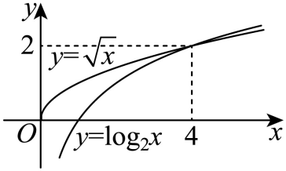

## 错法

看到$\log_2x$与$\sqrt x$都递增，再说“对数增长慢”，就据示意图认定只能有两个交点。两个递增函数的差不一定单调，笼统增长快慢也没有给出严格交点数量上界。

## 正解

直接代入可证明已有两个交点，但排除其他交点须另证明。原题补讲用$t=\sqrt x$化成$2\log_2t-t$，再明确使用后续高中导数判断一个增段与一个减段，每段至多一个根。图是原图，不能把重绘或观察图形当成完成证明。

问题出在把“各自上升”误读成“相差越来越大或越来越小”。若 u<v，两个增函数 g、h 都有正增量，但
$$[g(v)-h(v)]-[g(u)-h(u)]
=[g(v)-g(u)]-[h(v)-h(u)].$$
右边是两个正数相减，结果的正负尚未确定，所以不能据此说差函数单调，也不能给交点个数上界。笼统的“增长慢”如果没有说明在哪个范围、怎样比较，同样缺少这一步依据。

数量证明须接齐两部分：代入找到两个不同合法根，得到“至少两个”；分析差函数的分段单调性，得到“至多两个”。下面保留原图与原解，并在展开解析中用后续高中导数补上后半部分。该拓展只用于补足原题的证明缺口，不把图形直觉当作高一已经掌握的证明。

## 例题

### 原题 3-2

> 来源ID HSMA-B1-C4-Dd89ccae7c4aa-P0128；原件 `专题4.5 函数的应用（二）（举一反三讲义）数学人教A版必修第一册（解析版）.docx`；DOCX正文段落 P0128—P0129；答案与详解 P0130—P0140。年份、地区和试题标签沿原资料记载，未独立核实。

**原资料题干与选项：**

【变式3-2】（24-25高一上·云南昆明·期末）函数$f\left( x\right)={\log }_{2}x-\sqrt{x}$的零点个数是（    ）

A．0  B．1  C．2  D．3

**原资料答案与详解（完整保留，公式转写为LaTeX）：**

【答案】C

【解题思路】先将问题转化为$y={\log }_{2}x$与$y=\sqrt{x}$的图象的交点问题，再由两函数的单调性分析得$f\left( x\right)$至多只有两个零点，又由$f\left( 4\right)=0$，$f\left( 16\right)=0$得到$f\left( x\right)$的零点个数，从而得解.

【解答过程】要求$f\left( x\right)={\log }_{2}x-\sqrt{x}$的零点，即求$y={\log }_{2}x$与$y=\sqrt{x}$的图象的交点，

在同一坐标系中作出$y={\log }_{2}x$与$y=\sqrt{x}$的大致图象，

因为$y={\log }_{2}x$与$y=\sqrt{x}$在各自的定义域上都是单调递增，

且$y={\log }_{2}x$的增长速度相比$y=\sqrt{x}$的较慢，

所以两函数的图象至多只有两个交点，即$f\left( x\right)$至多只有两个零点，

又$f\left( 4\right)={\log }_{2}4-\sqrt{4}=0$，$f\left( 16\right)={\log }_{2}16-\sqrt{16}=0$，

所以$f\left( x\right)$有且只有两个零点.

故选：C.

**展开解析与核验（依据原详解补足，勘误另标）：**

先限定$x>0$。$x=4$时$\log_24=2=\sqrt4$；$x=16$时$\log_216=4=\sqrt{16}$，所以已找到两个零点。但“两个函数都递增”或“一个增长慢”均不能直接证明交点至多两个，原详解的这一步存在缺口；示意图也不足以排除其他交点。

**补足排除其他根的证明（拓展：使用后续高中导数知识）：** 令$t=\sqrt x>0$，原方程等价于$h(t)=2\log_2t-t=0$。以下借用后续高中结论：一个区间内导数始终正，则函数严格递增；始终负则严格递减。由$\log_2t=\ln t/\ln2$及$(\ln t)'=1/t$，逐项求导得
$$h'(t)=\frac{2}{t\ln2}-1.$$
因此$h$在$(0,2/\ln2]$严格递增，在$[2/\ln2,+\infty)$严格递减。由$e>2$得$\ln2<1$；由$e<4$得$\sqrt e<2$，取递增的自然对数得到$1/2<\ln2$，所以$2<2/\ln2<4$。两段各至多一个零点，且$t=2$、$t=4$分别已给出各一根；峰点处值大于$h(2)=0$，不另成为零点。因此无其他根；对应$x=4,16$。A、B低估，C正确，D高估。未学导数时，应知道原图只提供线索，不能把原解析中缺失的排除论证当作已经证明。

## 易错

- “两个都递增”只给两个正增量，不能确定它们差的符号。
- 找到两根只证明至少两根；要排除其他根，须另给差函数单调分段等上界依据。
- 原示意图没有精确比例，不能据其可见交点数代替排除证明。
