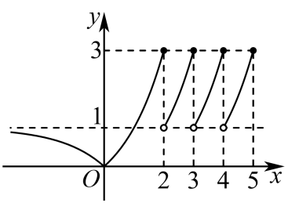

## 错法

题中部分区间写$f(x)=f(x-1)$，就把整幅图按周期1无限复制；或者减1时落入任何看起来像“基本周期”的区间。

## 正解

递推只能在条件指定的输入上使用。原例4中$x>2$且$x\le5$时才可减1，直到进入基础式的$x\le2$，实际归入$(1,2]$；基础式在整个$x\le2$另有变化，并不全域周期。复制段端点继承左开右闭，高度1在复制段不取。

每次减 1 都要先检验当前输入是否仍在递归支 2<x≤5 中；到 x≤2 就必须使用基础式，不能继续借递归式减。对原来处于 (2,5] 的输入，停止时落在 (1,2]：最后一步之前大于 2，减 1 后大于 1 且不超过 2。

因此复制的是基础式在 (1,2] 的这一段。其左端 1 未收进来，右端 2 收进来，复制后的各段也保持左开右闭；基础负半轴和 0 附近的图形不会自动复制。原函数还没有给 x>5 的定义，不能向右继续延伸。统计水平线交点时，先列每段真正取到的高度，再计合法输入，不能把趋近的端点高度当作已取得。

## 例题

### 原题 4-0

> 来源ID HSMA-B1-C4-Dd89ccae7c4aa-P0151；原件 `专题4.5 函数的应用（二）（举一反三讲义）数学人教A版必修第一册（解析版）.docx`；DOCX正文段落 P0151—P0152；答案与详解 P0153—P0160。年份、地区和试题标签沿原资料记载，未独立核实。

**原资料题干与选项：**

【例4】（25-26高三上·安徽·阶段练习）函数

$$f\left( x\right)=\left\{ \begin{aligned}f\left( x-1\right),2<x\le 5\\\left| {2}^{x}-1\right|,x\le 2\end{aligned}\right.$$

，若$f\left( x\right)+a=0$有2个零点，则实数$a$的取值范围为（    ）

A．$\left( -1,0\right)$  B．$\left[ -1,0\right)$  C．$\left( 0,1\right)$  D．$\left( 0,1\right]$

**原资料答案与详解（完整保留，公式转写为LaTeX）：**

【答案】A

【解题思路】将$f\left( x\right)+a=0$有2个零点转化为函数$y=-a$与$y=f\left( x\right)$有2个交点的问题，再数形结合即可求解.

【解答过程】

$$\because f\left( x\right)=\left\{ \begin{aligned}f\left( x-1\right),2<x\le 5\\\left| {2}^{x}-1\right|,x\le 2\end{aligned}\right.$$

，$\therefore y=f\left( x\right)$图象如下：

  

又$f\left( x\right)+a=0$有2个零点相当于$y=-a$与$y=f\left( x\right)$有2个交点，

根据图象可得$0<-a<1$，故$-1<a<0$，

则实数$a$的取值范围为$\left( -1,0\right)$.

故选：A.

**展开解析与核验（依据原详解补足，勘误另标）：**

把$f(x)+a=0$转成水平线$f(x)=r$，其中$r=-a$。基础段$x\le2$上$f(x)=|2^x-1|$：负半轴值域$(0,1)$、0处值0、正段$(0,2]$值域$(0,3]$。递归段$2<x\le5$须反复减1，直到落回$(1,2]$，所以三个复制段$(2,3],(3,4],(4,5]$的值域都是$(1,3]$，不是从0开始复制。

按高度计数：$r<0$无根；$r=0$仅0；$0<r<1$有$x=\log_2(1-r)<0$及$x=\log_2(1+r)\in(0,1)$两根，复制段没有根；$r=1$仅基础段$x=1$（负侧趋近1却不取到，复制段左端不收）；$1<r\le3$基础段一根加三个复制根共4根；$r>3$无根。故恰好两根等价于$0<-a<1$，即$-1<a<0$。

A正确；B加上$a=-1$时只有1根；C、D给$a>0$使水平线在负高度，无根。原图用于看复制结构，端点必须由分段条件核实。

## 易错

- 在未允许的输入上继续递推或把 x>5 纳入，扩大了原定义域。
- 错把整个基础式复制，忽略递推停止时仅归入 (1,2]。
- 把左开端点补成闭端点，误将复制段不取得的高度 1 收进来。
