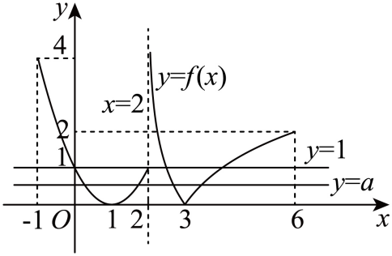

## 错法

把$P(f(x))=0$分成$f(x)=u$与$f(x)=v$，无论u、v是否相等，都将两条水平线对应根数相加。参数让二次式出现重根时，同一组输入被数了两遍。

## 正解

先列不同目标值。如果u≠v，同一输入不可能有两个输出，因此原像集合不交，可以相加；若u=v，两条件相同，只数一次。再核各分支端点，零点个数按不同输入而不是代数重数。

计数对象是满足方程的不同输入集合。因式分解得到两个目标值后，逻辑连接词是“或”：只要满足其中一个条件即可。两个目标不同，输入集合互不相交；两个目标相同，实际上只剩一个条件，重复写一次不会产生新的输入。

下面原题固定高度为 1，另一高度为 a。a=1 时方程变成 [f(x)−1]²=0，外层关于 z=f(x) 的方程出现重根，但不同输入数仍为 4。不能算成 4+4；a=0 及分段端点也需按实际原像数另查。

## 例题

### 原题 4-3

> 来源ID HSMA-B1-C4-Dd89ccae7c4aa-P0188；原件 `专题4.5 函数的应用（二）（举一反三讲义）数学人教A版必修第一册（解析版）.docx`；DOCX正文段落 P0188—P0189；答案与详解 P0190—P0199。年份、地区和试题标签沿原资料记载，未独立核实。

**原资料题干与选项：**

【变式4-3】（24-25高一上·陕西西安·期末）定义在$[-1,6]$上的

$$f(x)=\left\{ \begin{aligned}|{\log }_{2}(x-2)|,2<x\le 6\\{(x-1)}^{2},-1\le x\le 2\end{aligned}\right.$$

，$f(x)$满足对关于x的方程${[f(x)]}^{2}-(a+1)f(x)+a=0$有8个不同的实数根，则实数a的取值范围是（    ）

A．$(0,1)$  B．$[0,1]$  C．$(1,2)$  D．$\left[ 1,2\right]$

**原资料答案与详解（完整保留，公式转写为LaTeX）：**

【答案】A

【解题思路】作出函数$f(x)$的图象，再变形给定方程得$f(x)=1$或$f(x)=a$，数形结合求出范围.

【解答过程】作出函数$y=f(x)$的图象，如图，

方程${[f(x)]}^{2}-(a+1)f(x)+a=0\Leftrightarrow [f(x)-1][f(x)-a]=0$，解得$f(x)=1$或$f(x)=a$，

关于x的方程${[f(x)]}^{2}-(a+1)f(x)+a=0$有8个不同的实数根，

而直线$y=1$与函数$y=f(x)$的图象有4个交点，即方程$f(x)=1$有4个不同的实根，

因此直线$y=a$与函数$y=f(x)$的图象有4个交点，由图象得$0<a<1$，

所以实数a的取值范围是$(0,1)$.

故选：A.

**展开解析与核验（依据原详解补足，勘误另标）：**

令$z=f(x)$，$z^2-(a+1)z+a=(z-1)(z-a)=0$。先数固定高度1：二次支$x\in[-1,2]$给$x=0,2$，对数绝对值支$x\in(2,6]$给$x=2+1/2,2+2$，合计4根。

在二次支，$f=(x-1)^2$：高度0有1点；$0<r\le1$有2点；$1<r\le4$只有左侧1点（右侧越过2）；$r>4$无点。对数支令$t=x-2\in(0,4]$：高度0有$t=1$一根；$0<r\le2$有$t=2^{-r},2^r$两根；$r>2$仅$t=2^{-r}$一根。合计原像数分别为：负高度0；高度0有2；$0<r\le1$有4；$1<r\le2$有3；$2<r\le4$有2；$r>4$有1。

八个不同根要求$a\ne1$且高度$a$提供4根，所以$0<a<1$，A正确。B的$[0,1]$误收0与1：a=0总共6根，a=1两目标相同仅4根；C的$(1,2)$只有7根；D的$[1,2]$在a=1有4根、在1<a≤2有7根。分段连接处$x=2$只属于二次支，不能重复计数。

## 易错

- u=v 时把相同原像集合再加一次，混淆因子重数与不同输入数。
- 只查参数的开档不查重合值、顶点和分段端点，容易误收边界。
