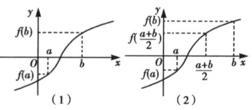

## 讲解

### 是什么

对连续f，已知$a<b$且$f(a)f(b)<0$，二分法反复取中点，并保留仍然异号的半个区间，逐次缩短括根区间。始终保留的事实是：当前闭区间上函数连续、两端异号，因而里面至少有一个零点。方法不要求预先证明唯一；若要称近似的是某个特定根，通常还需隔离该根或证明区间内唯一。

这里 a、b、m、r、q 都是自变量的数值：a、b 是区间端点，m 是用于判断保留侧的中点，r 是当前括区间内的真实根，q 是最后报告的近似值。L 表示区间长度，ε 表示允许的输入误差，它们与自变量用同一单位；f(a)、f(b) 是输出，其正负用于保留区间。

### 怎么来的

中点$m=(a+b)/2$把长度L=b−a分成两个L/2。若$f(m)=0$，已经找到精确根，可以停；若非0，因两端异号，$f(m)$必与其中一个端点同号，与另一个异号。保留异号的半段后，零点存在定理仍适用；这就是每次保留有依据的原因。若$f(a)f(m)<0$，新b=m；否则$f(m)f(b)<0$，新a=m。不能只看“中点负”就固定换左端。

n次真正缩短后，长度$L_n=L_0/2^n$，这是反复乘1/2所得。精确根r在当前区间内，任取$q\in[a_n,b_n]$有$|q-r|\le L_n$；取中点$q=(a_n+b_n)/2$，到两端的距离均是$L_n/2$，所以$|q-r|\le L_n/2$。端点严格异号时r在内部，相关最坏界可写严格小于；用不超过的保守界也有效。

“一直夹住根”比某一次中点离根近更关键：只要每次都保留连续异号半段，新区间仍有根、长度减半，误差保证就能继续。最后取中点的半宽界来自根在左右端点之间：它无论位于中点哪侧，到中点的距离都不超过半个区间，而取端点只有全宽保证。对有多个根的初始区间，过程可能保留其中一根；要跟踪指定的那一根，应先将它隔离，不能先任选一个根再默认每轮都保留它。

### 什么时候能用

先有连续异号括根，再明确精度ε>0究竟指什么。若规定区间宽度小于ε，按$L_n<\varepsilon$停机；若只要求中点误差不超过ε，$L_n/2\le\varepsilon$已经足够。教材“区间足够窄时任取区间内数”的办法给充分保证，不是所有合格近似数的必要条件。区间外的某个数也可能误差小于ε，必须另外计算或夹逼才能判断。

连续但不变号的偶重零点不能直接由这个异号工作流定位，须先换适当分析方法；不能将其说成“没有零点”。中点恰为零会提前停，次数公式给未提前停情况下的长度保证，不是每个具体函数都必用的最少次数。表格小数接近0时须核实舍入误差，不能因显示0.0000就断言精确零。

原资料二分示意图：

图上两端异号，中点计算决定保留哪一侧。判断依据是函数值符号，图中比例不用于代替计算。

## 例题

### 原题 5-0

> 来源ID HSMA-B1-C4-Dd89ccae7c4aa-P0207；原件 `专题4.5 函数的应用（二）（举一反三讲义）数学人教A版必修第一册（解析版）.docx`；DOCX正文段落 P0207—P0208；答案与详解 P0209—P0215。年份、地区和试题标签沿原资料记载，未独立核实。

**原资料题干与选项：**

【例5】（24-25高一上·贵州毕节·期末）已知函数$f\left( x\right)={x}^{3}-2x-1$，现用二分法求函数$f\left( x\right)$在$\left( 1,3\right)$内的零点的近似值，则使用两次二分法后，零点所在区间为（   ）

A．$\left( \frac{3}{2},2\right)$  B．$\left( 1,\frac{3}{2}\right)$  C．$\left( 2,\frac{5}{2}\right)$  D．$\left( \frac{5}{2},3\right)$

**原资料答案与详解（完整保留，公式转写为LaTeX）：**

【答案】A

【解题思路】应用零点存在定理结合二分法，不断把区间一分为二计算求解.

【解答过程】由二分法可知，第一次计算$f\left( 2\right)=3>0$，又$f\left( 1\right)=-2<0$，$f\left( 3\right)=20>0$，

由零点存在性定理知零点在区间$\left( 1,2\right)$上，

所以第二次应该计算$f\left( \frac{3}{2}\right)=-\frac{5}{8}<0$，又$f\left( 2\right)>0$，

所以零点在区间$\left( \frac{3}{2},2\right)$上．

故选：A．

**展开解析与核验（依据原详解补足，勘误另标）：**

多项式在$[1,3]$连续，$f(1)=-2$，$f(3)=20$，有括根区间。第一次中点2，$f(2)=8-4-1=3>0$，保留异号一侧$(1,2)$；第二次中点3/2，$f(3/2)=27/8-3-1=-5/8<0$，保留$(3/2,2)$。

A正确；B为$(1,1.5)$，两端值负，是第二轮舍弃的一侧；C和D都位于2右侧，已在第一轮舍弃。这里只使用负端点与正端点夹住至少一根；若要说唯一，在$x\ge1$可由立方作差$f(v)-f(u)=(v-u)(v^2+uv+u^2-2)>0$补足。

### 原题 P0736

> 来源ID HSMA-B1-C4-D63f4d083c4f6-P0736；原件 `第四章 指数函数与对数函数（举一反三讲义·基础篇）数学人教A版必修第一册（解析版）.docx`；DOCX正文段落 P0736—P0736；答案与详解 P0737—P0768。年份、地区和试题标签沿原资料记载，未独立核实。

**原资料题干与选项：**

4．（24-25高一上·全国·课堂例题）用二分法求函数$f\left( x\right)={x}^{3}-x-1$在区间$\left[ 1,1.5\right]$内的一个零点的近似值．（误差不超过0.01）

**原资料答案与详解（完整保留，公式转写为LaTeX）：**

【答案】$1.3203125$

【解题思路】由零点的存在性定理，用二分法，逐步计算，直到区间长度小于等于$0.01$为止，最后所得区间内的任何一个数均可作为函数的零点.

【解答过程】经计算$f\left( 1\right)=-1<0$，$f\left( 1.5\right)={1.5}^{3}-1.5-1=0.875>0$，

所以函数$f\left( x\right)$在$\left[ 1,1.5\right]$内存在零点${x}_{0}$，

取$\left[ 1,1.5\right]$的中点${x}_{1}=1.25$，

经计算$f\left( 1.25\right)={1.25}^{3}-1.25-1=-0.296875<0$，

因为$f\left( 1.5\right)\cdot f\left( 1.25\right)<0$，

所以${x}_{0}\in [1.25,1.5]$，

如此继续下去，如下表：

| 区间 | 中点值 | 中点函数近似值 |
| --- | --- | --- |
| $\left[ 1,1.5\right]$ | $1.25$ | $-0.30$ |
| $\left[ 1.25,1.5\right]$ | $1.375$ | $0.22$ |
| $\left[ 1.25,1.375\right]$ | $1.3125$ | $-0.05$ |
| $\left[ 1.3125,1.375\right]$ | $1.34375$ | $0.08$ |
| $\left[ 1.3125,1.34375\right]$ | $1.328125$ | $0.01$ |
| $\left[ 1.3125,1.328125\right]$  | $1.3203125$ | $-0.02$ |

因为$|1.328125-1.3203125|=0.0078125<0.01$，

所以函数$f\left( x\right)={x}^{3}-x-1$在区间$\left[ 1,1.5\right]$内误差不超过$0.01$的一个零点近似值可取为$1.3203125$．

**展开解析与核验（依据原详解补足，勘误另标）：**

多项式连续，原区间[1,1.5]两端值−1、0.875异号。对1≤u<v≤1.5，差$(v-u)(v^2+uv+u^2-1)>0$，因为括号≥2>0，故其中根唯一。每轮按中点符号保留异号半段，原表的六次更新依次为：
[1.25,1.5]（1.25负）、[1.25,1.375]（1.375正）、[1.3125,1.375]（1.3125负）、[1.3125,1.34375]（1.34375正）、[1.3125,1.328125]（1.328125正）、[1.3203125,1.328125]（1.3203125负）。中点具体值与近似函数值在原表完整保留；其舍入值均未改变符号。
末宽1/128=0.0078125<0.01，根r在内部，选左端q=1.3203125时$0<r-q<0.0078125<0.01$，因此原答案满足误差要求。也可选此区间中点获得半宽保证。
**原书术语勘误：** 原思路“最后所得区间内的任何一个数均可作为函数的零点”应为“作为满足误差要求的零点近似值”。q代原多项式仍为负而非0；误差小不等于精确根。原说法保留并纠正。

### 原题 P0053

> 来源ID HSMA-B1-C4-D81f845865be1-P0053；原件 `第四章 指数函数与对数函数（举一反三单元测试·拔尖卷）数学人教A版必修第一册（解析版）.docx`；DOCX正文段落 P0053—P0055；答案与详解 P0056—P0069。年份、地区和试题标签沿原资料记载，未独立核实。

**原资料题干与选项：**

6．（5分）（24-25高一上·湖南岳阳·期末）下列函数中，不能用二分法求其零点近似值的是（   ）

A．$f\left( x\right)=\ln x+2$  B．$f\left( x\right)={x}^{2}+2\sqrt{2}x+2$

C．$f\left( x\right)=x+\frac{1}{x}-3$  D．$f\left( x\right)={2}^{x}-3$

**原资料答案与详解（完整保留，公式转写为LaTeX）：**

【答案】B

【解题思路】利用二分法的概念，在零点两侧函数值异号进行逐一判定.

【解答过程】对于A，函数$f\left( x\right)=\ln x+2$在$R$上单调递增，有唯一零点$x={e}^{-2}$，

所以函数值在零点两侧异号，故可用二分法求零点；

对于B，函数$f\left( x\right)={x}^{2}+2\sqrt{2}x+2={\left( x+\sqrt{2}\right)}^{2}\ge 0$，

故函数有唯一零点$x=-\sqrt{2}$，且函数值在零点两侧同号，故不能用二分法求零点；

对于C，当$x<0$时，$f\left( x\right)=x+\frac{1}{x}-3=-\left( -x+\frac{1}{-x}\right)-3\le -2\sqrt{-x\cdot \frac{1}{-x}}-3=-5$，

当且仅当$x=-1$时，等号成立，无零点；

 当$x>0$时，$f\left( x\right)=x+\frac{1}{x}-3\ge 2\sqrt{x\cdot \frac{1}{x}}-3=-1$，当且仅当$x=1$时，等号成立，

函数在$\left( 0,1\right)$上单调递减，在$\left( 1,+\infty \right)$上单调递增，

此时有两个零点$x=\frac{3\pm \sqrt{5}}{2}$，且函数值在零点两侧异号，故可用二分法求零点；

对于D，函数$f\left( x\right)={2}^{x}-3$在$R$上单调递增，有唯一零点$x={\log }_{2}3$，

所以函数值在零点两侧异号，故可用二分法求零点.

故选：B.

**展开解析与核验（依据原详解补足，勘误另标）：**

标准异号二分法需要连续括根区间和两端异号，唯一零点本身还不够。A的域是(0,∞)，在这个域连续严格增，根e⁻²；可选原函数内x=e⁻³和e⁻¹，两值分别−1、1，能启动二分。**原解勘误：** A写“在R上递增”不对，lnx在x≤0没有定义，应改成正半轴。
B配方f=(x+√2)²，始终非负，只有根−√2，两侧值都正，找不到异号两端，所以本题的异号二分流程不适用，选B；不能说没有零点，也不能借此否定可用配方直接求精确根。
C域R去掉0，不能跨0用连续定理。负半轴x+1/x≤−2，使f≤−5无根；正半轴在(0,1)减、(1,∞)增。合法区间[1/4,1]两端值5/4和−1、[1,3]两端值−1和1/3，各连续异号，可分别二分定位两个根(3±√5)/2，因此C可用。D连续递增，f(1)=−1、f(2)=1，可用[1,2]，故D不是所问。

## 易错

舍弃仍异号的半段；更新时用改过的端点再重算同一轮中点；把半宽与全宽混同；把“当前区间外”直接判成“误差过大”。原二分选项中的实际误差与原资料区间选数口径分别核验。
