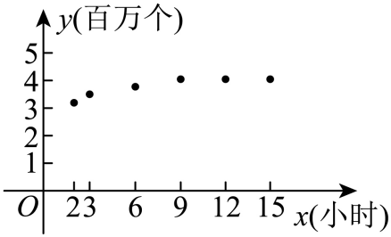

## 讲解

### 是什么

函数拟合是在给定观测点与候选模型之间求参数、核验误差，选择能合理描述数据及题设规律的函数。它可用于预测，但与从明确数量关系建立精确公式有区别：几个有限点通常只能检验这些点，不能证明整个实际过程精确符合某一函数。

设 x 是输入（如时间或速度），y 是观测输出，函数中的字母是需要确定的参数；单位由题设规定。观测点和预测点必须采用同样的起点、时间单位和输出单位。模型有定义还不够，预测值也要在问题允许的范围内。离散年数应保留正整数域，连续经过时间则按题设区间处理，不能互换。

### 怎么来的

用待定系数求解，是将观测$(x_i,y_i)$代入候选式$f(x_i)$形成方程。未知参数必须有足够独立条件；不同点并不自动意味着独立，不能先除可能为0的差式。解参所用点自然会被拟合式满足，真正额外检验来自没用于解参的剩余点、题设定义域与趋势条件。

等间距指数平移式$y_i=ka^{x_i}+b$，相邻差消掉b，在非零差和等距输入下差值之比可求$a^h$；对数式$y=m\log_ax+n$中两点相减消掉n，真数须正；二次式用三点列方程，但也要核对拐向后的行为。上述都是代入与等价变形，不是由图象视觉比例推出参数。

等间距差值法的来源可逐行看清。设三个输入为 x₀、x₀+h、x₀+2h，间隔 h>0，模型 y=kaˣ+b（a>0）。相邻输出差为
$$d_1=k a^{x_0}(a^h-1),\qquad
d_2=k a^{x_0+h}(a^h-1).$$
两次相减都消去了同一个常量 b；若 d₁≠0，再相除得到 d₂/d₁=aʰ。h=1 时才直接等于 a；时间不等距时不能这样约。若 d₁=0，则不能除，须先分析参数退化或数据是否与所选非恒定指数模型相容。

### 什么时候能用

先统一输入时间、输出单位与测量口径，再排除候选中无定义、方向或变化速度明显违背条件的式子。精确模型应逐点等值核验；近似拟合须记录“预测减观测”的各点差，并用题设允许误差判断，未给误差标准时只能如实比较，不能擅称严格最优。

观测截止10月底与预测同年年末是两个时点；不能把它们当作同一x处残差，也不能静默改表中x。温度常量基准由拟合得出，不等于环境温度已被独立测量。外推到观测区间之外须标明依赖模型仍成立的假设，不能包装为已完成实验验证。

实际目标还可能要求由模型输出再建一个量：每小时耗电量须乘实际行驶小时数才得到一段路的耗电总量，因此“拟合完成”并不等于“最优化目标已经写对”。下面四例分别承担平移指数求参、观测时点与离散输入、每小时量转总量、对数拟合及远期外推的作用。

## 例题

### 原题 10-0

> 来源ID HSMA-B1-C4-Dd89ccae7c4aa-P0476；原件 `专题4.5 函数的应用（二）（举一反三讲义）数学人教A版必修第一册（解析版）.docx`；DOCX正文段落 P0476—P0494；答案与详解 P0495—P0503。年份、地区和试题标签沿原资料记载，未独立核实。

**原资料题干与选项：**

【例10】（24-25高一上·广东佛山·期末）中国茶文化博大精深，茶水的口感与茶叶类型和茶水的温度有关．经验表明，某种绿茶，用一定温度的水泡制，再等到茶水温度降至某一温度时，可以产生最佳口感．某研究员在泡制茶水的过程中，每隔1min测量一次茶水温度，收集到以下数据：

| 时间/min | 0 | 1 | 2 | 3 | 4 | 5 |
| --- | --- | --- | --- | --- | --- | --- |
| 水温/℃ | 85 | 79 | 73.6 | 68.74 | 64.34 | 60.24 |

设茶水温度从85°C开始，经过$t$min后温度为$y$℃，为了刻画茶水温度随时间变化的规律．现有以下两种函数模型供选择：①$y=k{a}^{t}+b$；②$y=a{t}^{2}+bt+c$

(1)选出你认为最符合实际的函数模型，说明理由，并参考表格中前3组数据，求出函数模型的解析式；

(2)若茶水温度降至55°C时饮用，可以产生最佳口感，根据（1）中的函数模型，刚泡好的茶水大约需要放置多长时间才能达到最佳饮用口感？

（参考数据：$\lg 2\approx 0.30,\lg 3\approx 0.48$）

**原资料答案与详解（完整保留，公式转写为LaTeX）：**

【答案】(1)因为随着时间的变化（变大），茶的温度越来越低，且不再升高，所以选择模型①$y=k{a}^{t}+b$；解析式为$y=60\times {0.9}^{t}+25$

(2)$7.5 \min $.

【解题思路】（1）根据表中数据变化情况可知选用模型①符合，代入前三组数据，用待定系数法求得$k\text{、}a\text{、}b$的值，即可得解析式；

（2）根据（1）的解析式，将$y=55$代入解析式求$t$的值即可.

【解答过程】（1）由表中数据知，随着时间的变化（变大），茶的温度越来越低，但温度最多低至室内温度后，不再下降，也不再升高，因此选用模型①，代入前三组数据

$$\left\{ \begin{aligned}k+b=85\\ka+b=79\\k{a}^{2}+b=73.6\end{aligned}\right.$$

解得

$$\left\{ \begin{aligned}k=60\\b=25\\a=0.9\end{aligned}\right.$$

，所以函数模型解析式为$y=60\times {0.9}^{t}+25$.

（2）由（1）知$55=60\times {0.9}^{t}+25$，即${0.9}^{t}=0.5$，所以$t={\log }_{0.9}0.5$，

$t={\log }_{0.9}0.5=\frac{\lg \frac{1}{2}}{\lg \frac{9}{10}}=\frac{\lg 2}{1-2\lg 3}\approx 7.5$，

所以刚泡好的茶水大约需要放置7.5分钟才能达到最佳饮用口感.

**展开解析与核验（依据原详解补足，勘误另标）：**

（1）先比较候选及数据，不凭“递减”就断言唯一。按前三点，指数式满足$k+b=85$、$ka+b=79$、$ka^2+b=73.6$。后两相邻差分别为−6、−5.4；若$k\ne0,a\ne1$，相除得到$a=(-5.4)/(-6)=0.9$。再由$k(a-1)=-6$得$k=60$，$b=25$，故$y=60(0.9)^t+25$。它对$t\ge0$持续下降并趋近25，符合恒定环境下逐渐冷却的解释。

同样用前三点拟合二次式，得到$y=0.3t^2-6.3t+85$；其对称轴$t=10.5$，之后升温，不能描述长期趋向环境温度的冷却。指数候选较合理，但25是拟合得到的基准，原题没有独立测出室温。

**余下数据核验：** 指数预测$t=3,4,5$时为68.74、64.366、60.4294；原表为68.74、64.34、60.24。后两点差0.026、0.1894，并非都能解释为保留两位小数；不能称六点完全吻合。二次候选对应68.8、64.6、61.0，偏差更大。有限数据和候选比较支持采用指数近似，未证明无穷时间范围内精确规律。

（2）$55=60(0.9)^t+25\iff(0.9)^t=1/2$。两端正，取常用对数：$t\lg0.9=-\lg2$，$\lg0.9=2\lg3-1<0$，故$t=\lg2/(1-2\lg3)$。**用原题指定粗参考数**$\lg2\approx0.30,\lg3\approx0.48$得$t\approx0.30/0.04=7.5$分钟，与原答案一致。但两近似数相减放大误差；用精确对数，模型的阈值是$t\approx6.5788135$分钟，约6.6分钟。不能将7.5说成高精度模型计算的真实阈值；它只是使用所给粗参考值的结果。两问均覆盖，原答案及原数据保留。

### 原题 10-1

> 来源ID HSMA-B1-C4-Dd89ccae7c4aa-P0504；原件 `专题4.5 函数的应用（二）（举一反三讲义）数学人教A版必修第一册（解析版）.docx`；DOCX正文段落 P0504—P0517；答案与详解 P0518—P0529。年份、地区和试题标签沿原资料记载，未独立核实。

**原资料题干与选项：**

【变式10-1】（24-25高一上·江西·期末）近几年，直播平台逐渐被越来越多的人们关注和喜爱．某平台从2021年初建立开始，得到了很多网民的关注，会员人数逐年增加．已知从2021到2024年，该平台会员每年年．末的人数如下表所示：（注：第4年数据为截止至2024年10月底的数据）

| 建立平台第$x$年 | 1 | 2 | 3 | 4 |
| --- | --- | --- | --- | --- |
| 会员人数$y$（千人） | 16 | 28 | 52 | 86 |

(1)请根据表格中的数据，从下列三个模型中选择一个恰当的模型估算建立该平台$x\left( x\in {N}^{∗}\right)$年后平台会员人数$y$（千人），求出你所选择模型的解析式，并预测2024年年末会员人数：

①$y=\frac{b}{x}+c(b>0)$，②$y=d{\log }_{r}x+e(r>0$且$r\ne 1)$，③$y=t{a}^{x}+s(a>0$且$a\ne 1)$；

(2)为了更好的维护管理平台，该平台规定会员人数不能超过$k\cdot {4}^{x}(k>0)$千人，请根据（1）中你选择的函数模型求$k$的最小值．

**原资料答案与详解（完整保留，公式转写为LaTeX）：**

【答案】(1)选择模型③，$y=6\cdot {2}^{x}+4\left( x\in {N}^{∗}\right)$，100千人．

(2)4．

【解题思路】（1）根据表格中的数据可选择模型③，将表格中的数据代入函数模型解析式，求出三个参数的值，即可得出函数模型解析式，再将$x=4$代入函数模型解析式，即可得解；（2）由已知可得出$6\cdot {2}^{x}+4\le k\cdot {4}^{x}$，令$\mu ={\left( \frac{1}{2}\right)}^{x}$，则$k\ge 4{\mu }^{2}+6\mu $，令$f\left( \mu \right)=4{\mu }^{2}+6\mu $，求出函数在区间上的最大值，即可得实数k的最小值.

【解答过程】（1）由表格中的数据可知，函数是一个增函数，且函数增长得越来越快，故选择模型③较为合适，

由表格中的数据可得

$$\left\{ \begin{aligned}ta+s=16\\t{a}^{2}+s=28\\t{a}^{3}+s=52\end{aligned}\right.$$

，解得

$$\left\{ \begin{aligned}t=6\\a=2,\\s=4\end{aligned}\right.$$

所以，函数模型的解析式为$y=6\cdot {2}^{x}+4\left( x\in {N}^{∗}\right)$，

令$x=4,y=6\cdot {2}^{4}+4=100$，预测2024年年末的会员人数为100千人．

（2）由题意可得$6\cdot {2}^{x}+4\le k\cdot {4}^{x}$，

令$\mu ={\left( \frac{1}{2}\right)}^{x}\in \left\{ \frac{1}{2},\frac{1}{4},\frac{1}{8},\cdots ,\frac{1}{{2}^{n}},\cdots \right\}$，则$k\ge 4{\mu }^{2}+6\mu $，

令$f\left( \mu \right)=4{\mu }^{2}+6\mu $，$\mu \in \left\{ \frac{1}{2},\frac{1}{4},\frac{1}{8},\cdot \cdot \cdot ,\frac{1}{{2}^{n}},\cdot \cdot \cdot \right\}$，则函数$f\left( \mu \right)$的定义域上单调递增，

又$\mu $关于$x$在定义域上单调递减，根据复合函数的单调性，$f{\left( \mu \right)}_{\max }=f\left( \frac{1}{2}\right)=4$，

即$k\ge 4$．所以$k$的最小值为4．

**展开解析与核验（依据原详解补足，勘误另标）：**

（1）等距年份输出差为12、24；第三段从52到86只统计到当年10月底，时间口径不同，不能当作完整一年的差。候选①在正整数域严格递减（b>0），与人数上升不合。候选②若要递增，等距增量反而变小：可写$C\ln x+e$且$C>0$，相邻增量$C\ln((x+1)/x)$随x变小，不能吻合前两年的差从12增至24。候选③可描述增长增量加大。

用前三个完整年末点：$ta+s=16$、$ta^2+s=28$、$ta^3+s=52$，相减得$ta(a-1)=12$、$ta^2(a-1)=24$，除以非零的前式得$a=2$。$2t=12$得$t=6$，$s=4$。模型$y=6\cdot2^x+4$，在$x=4$预测年末100千人。10月底86千人不等于模型年末100，但两者时间口径不同，不是同一个时点的拟合残差；原题引导用前三组点，不能声称第四组也在整数4处精确吻合。

（2）$6\cdot2^x+4\le k4^x$，除以$4^x>0$得$k\ge6\cdot2^{-x}+4\cdot4^{-x}$。令$\mu=2^{-x}$，$x\in\mathbb N^*$，所以$\mu\in\{1/2,1/4,1/8,\ldots\}$，最大值1/2确实取得。对$0<u<v$，$(4v^2+6v)-(4u^2+6u)=(v-u)[4(v+u)+6]>0$，故右端在此离散域的最大值$4(1/2)^2+6(1/2)=4$。必要性由$x=1$得到$k\ge4$；充分性由上述全域上界得到k=4能满足所有正整数年数。所以最小值4。两问、三个候选及离散取等均已核对。

### 原题 10-2

> 来源ID HSMA-B1-C4-Dd89ccae7c4aa-P0530；原件 `专题4.5 函数的应用（二）（举一反三讲义）数学人教A版必修第一册（解析版）.docx`；DOCX正文段落 P0530—P0543；答案与详解 P0544—P0560。年份、地区和试题标签沿原资料记载，未独立核实。

**原资料题干与选项：**

【变式10-2】（24-25高一上·贵州安顺·期末）正值安顺市创建全国文明城市之际，某单位积极倡导“环保生活，低碳出行”，其中电动汽车正成为人们购车的热门选择.某型号电动汽车，在一段平坦的国道进行测试，国道限速$60km/h$.经多次测试得到该汽车每小时耗电量$M$（单位：$Wh$）与速度$v$（单位：$\frac{km}{h}$）的数据如表所示：

| $v$ | $0$ | $20$ | $30$ | $40$ |
| --- | --- | --- | --- | --- |
| $M$ | $0$ | $2400$ | $3375$ | $4400$ |

为了描述国道上该汽车每小时耗电量与速度的关系，现有以下三种函数模型供选择：$M\left( v\right)=\frac{1}{40}{v}^{3}+b{v}^{2}+cv$，$M\left( v\right)=1000{\left( \frac{2}{3}\right)}^{v}+a$，$M\left( v\right)=300{\log }_{a}v+b$.

(1)当$0\le v\le 60$时，请选出你认为最符合表格所列数据的函数模型，并求出相应的函数解析式；

(2)现有一辆该型号汽车从$A$地驶到$B$地，前一段是$40km$的国道，后一段是$50km$的高速路，若已知高速路上该汽车每小时耗电量$N$（单位：$Wh$）与速度$v$（单位：$km/h$）的关系是：$N\left( v\right)={v}^{2}-60v+6400\left( 60<v\le 120\right)$，则如何行驶才能使得总耗电量最少，最少为多少?

**原资料答案与详解（完整保留，公式转写为LaTeX）：**

【答案】(1)选择$M\left( v\right)=\frac{1}{40}{v}^{3}+b{v}^{2}+cv$，$M\left( v\right)=\frac{1}{40}{v}^{3}-2{v}^{2}+150v$

(2)当这辆车在国道上的行驶速度为$40km/h$，在高速路上的行驶速度为$80km/h$时，该车从$A$地到$B$地的总耗电量最少，最少为$9400Wh$

【解题思路】（1）根据表格提供数据选出符合的函数模型，并利用待定系数法求得函数的解析式；

（2）先求得耗电量的表达式，然后根据二次函数的性质求得正确答案.

【解答过程】（1）对于$M\left( v\right)=300{\log }_{a}v+b$，当$v=0$时，它无意义，所以不合题意，

对于$M\left( v\right)=1000{\left( \frac{2}{3}\right)}^{v}+a$，易知$M\left( v\right)=1000{\left( \frac{2}{3}\right)}^{v}+a$是减函数，由图表知，$M$随着$v$的增大而增大，所以不合题意，

所以选$M\left( v\right)=\frac{1}{40}{v}^{3}+b{v}^{2}+cv$，由表中数据可得

$$\left\{ \begin{aligned}\frac{1}{40}\times {20}^{3}+b\times {20}^{2}+c\times 20=2400\\\frac{1}{40}\times {40}^{3}+b\times {40}^{2}+c\times 40=4400\end{aligned}\right.$$

，

解得$c=150$，$b=-2$，所以当$0\le v\le 60$时，$M\left( v\right)=\frac{1}{40}{v}^{3}-2{v}^{2}+150v$.

（2）国道路段长为$40km$，所用时间为$\frac{40}{v}h$，

所耗电量为$f\left( v\right)=\frac{40}{v}\cdot M\left( v\right)=\frac{40}{v}\cdot \left( 0.025{v}^{3}-2{v}^{2}+150v\right)={v}^{2}-80v+6000={\left( v-40\right)}^{2}+4400$，

因为$0\le v\le 60$，当$v=40$时，$f{\left( v\right)}_{\min }=4400Wh$；

高速路段长为$50km$，所用时间为$\frac{50}{v}h$，

所耗电量为$g\left( v\right)=\frac{50}{v}\cdot N\left( v\right)=\frac{50}{v}\cdot \left( {v}^{2}-60v+6400\right)=50\times \left( v+\frac{6400}{v}-60\right)$ $\ge 50\times \left( 2\sqrt{v\cdot \frac{6400}{v}}-60\right)=5000$，

当且仅当$v=\frac{6400}{v}$即$v=80$时等号成立.

所以$g{\left( v\right)}_{\min }=g\left( 80\right)=5000Wh$：

故当这辆车在国道上的行驶速度为$40km/h$，在高速路上的行驶速度为$80km/h$时，

该车从$A$地到$B$地的总耗电量最少，最少为$4400+5000=9400Wh$.

**展开解析与核验（依据原详解补足，勘误另标）：**

（1）模型必须覆盖$v=0$：对数候选在0无定义，排除。指数候选系数1000为正、底2/3小于1，随速度递减，与原表递增不合。选三次候选，代$v=20,40$：
$$200+400b+20c=2400,\qquad1600+1600b+40c=4400.$$
各除20、40得$20b+c=110$、$40b+c=70$，相减得$20b=-40$，所以$b=-2,c=150$。式子$M(v)=v^3/40-2v^2+150v$；回验未用于求参的$v=30$得$675-1800+4500=3375$，$v=0$得0，全部四点吻合。

（2）用不同符号u、v表示两段行驶速度，不强制相同。国道真正行驶须$0<u\le60$；**原解析写$0\le u\le60$却使用40/u，漏排除0，应修正可行域。** 耗电总量是每小时耗电量乘时间：
$$E_1(u)=\frac{40}{u}M(u)=u^2-80u+6000=(u-40)^2+4400.$$
所以$E_1\ge4400$，在合法$u=40$取得。高速$60<v\le120$：
$$E_2(v)=\frac{50}{v}N(v)=50\left(v+\frac{6400}{v}-60\right).$$
两项$v,6400/v$均正，用基本不等式得和至少$2\sqrt{6400}=160$，故$E_2\ge5000$。取等需$v=6400/v$，正根$v=80$落在高速可行域。

两段速度可分别选择，两处最优条件同时可实施，所以总量最小$4400+5000=9400$Wh，国道40km/h、高速80km/h。不能只把每小时耗电量最小当作全程耗电最小；也不能仅分别得到下界却不检查能否同时取到。

### 原题 10-3

> 来源ID HSMA-B1-C4-Dd89ccae7c4aa-P0561；原件 `专题4.5 函数的应用（二）（举一反三讲义）数学人教A版必修第一册（解析版）.docx`；DOCX正文段落 P0561—P0580；答案与详解 P0581—P0593。年份、地区和试题标签沿原资料记载，未独立核实。

**原资料题干与选项：**

【变式10-3】（24-25高一上·云南大理·期末）在密闭培养环境中，某类细菌的繁殖在初期会较快，随着单位体积内细菌数量的增加，繁殖速度又会减慢.在一次实验中，检测到这类细菌在培养皿中的数量$y$（单位：百万个）与培养时间$x$（单位：$t$小时）的关系如下表：

| $x$ | 2 | 3 | 6 | 9 | 12 | 15 |
| --- | --- | --- | --- | --- | --- | --- |
| $y$ | 3.2 | 3.5 | 3.8 | 4 | 4.1 | 4.2 |

根据表格中的数据画出散点图如下：

为了描述从第2小时开始细菌数量随时间变化的关系，现有以下三种函数模型供选择：①$y=m{\log }_{3}x+n$；②$y=m\sqrt{x-4}+n$；③$y={3}^{x-m}+n$.

(1)选出你认为最符合实际的函数模型，并说明理由；

(2)请选取表格中的$\left( 3,3.5\right)$，$\left( 9,4\right)$两组数据，求出你选择的函数模型的解析式，并预测至少培养多少个小时，细菌数量达到5百万个.

**原资料答案与详解（完整保留，公式转写为LaTeX）：**

【答案】(1)模型①，理由见解析

(2)$y=0.5{\log }_{3}x+3$，81个小时

【解题思路】（1）根据题意，函数解析式需满足函数在$\left[ 2,+\infty \right)$有定义，且随着单位体积内细菌数量的增加，繁殖速度增长缓慢，故只有函数模型①$y=m{\log }_{3}x+n$符合；

（2）将数据带入即可计算出$m,n$，则当$y=5$时即可求出答案.

【解答过程】（1）最符合实际的函数模型为①$y=m{\log }_{3}x+n$，理由如下：

根据图象知函数解析式需满足函数在$\left[ 2,+\infty \right)$有定义，所以②$y=m\sqrt{x-4}+n$不满足；

又随着单位体积内细菌数量的增加，繁殖速度增长缓慢，所以③$y={3}^{x-m}+n$不符合，

只有①$y=m{\log }_{3}x+n$满足，故$y=m{\log }_{3}x+n$最符合.

（2）将$\left( 3,3.5\right)$，$\left( 9,4\right)$代入$y=m{\log }_{3}x+n$，

得

$$\left\{ \begin{aligned}3.5=m{\log }_{3}3+n\\4=m{\log }_{3}9+n\end{aligned}\right.$$

，即

$$\left\{ \begin{aligned}3.5=m+n\\4=2m+n\end{aligned}\right.$$

，解得

$$\left\{ \begin{aligned}m=0.5\\n=3\end{aligned}\right.$$

.

则$y=0.5{\log }_{3}x+3$.

当$y=5$时，$0.5{\log }_{3}x+3=5$，即${\log }_{3}x=4$，解得$x=81$.

所以可预测至少需培养81个小时，细菌数量达到5百万个.

**展开解析与核验（依据原详解补足，勘误另标）：**

（1）题设从第2小时开始，候选须在所有$x\ge2$有定义。②根式$x-4$在$2\le x<4$为负，排除。③可写$3^{-m}3^x+n$，系数始终正；同长时间增量按3的幂增大，与题给增长逐渐减缓不合。①若拟合得到$m>0$，则递增且等长增量$m\log_3((x+h)/x)$随x增大而减小，符合候选内的趋势判断。

（2）指定点(3,3.5)、(9,4)分别给$m+n=3.5$、$2m+n=4$，相减得$m=0.5$，代回$n=3$。模型$y=0.5\log_3x+3$。回验其他点：x=2预测约3.3155，原表3.2；x=6约3.8155，原表3.8；x=12约4.1309，原表4.1；x=15约4.2325，原表4.2。后面三个可符合一位小数舍入，x=2的差约0.1155却不符合普通一位小数舍入，故“近似拟合”，不能说全表精确满足。

阈值要求$0.5\log_3x+3\ge5$，等价于$\log_3x\ge4$，因底3>1，等价于$x\ge3^4=81$。等号在81取得，按题给模型至少81小时，两个小问均已覆盖。原表只测至15小时，81小时属于模型外推而非已验证实验事实；原背景也未给保证细菌在整个外推时段始终遵循该式。原图只用于核对点的坐标与趋势，不能按示意比例补新条件。

## 易错

以两点求参后宣称全表一致；忽略单位和时点不同；把增长方向相同当成增长速度也符合；由短时数据推无限期规律。茶水与细菌原题的不吻合点已逐项列出，原数据没有静默替换。
