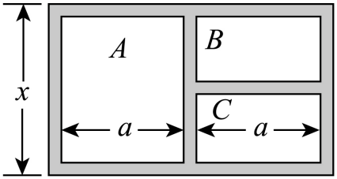

## 讲解

### 判据

题目给矩形面积、道路宽度或内部若干种植区，要求建立面积、造价等函数。入口不是直接猜函数形状，而是分清内边、外边，按每个方向数清占用的路带与分割块。

图用来定位标记。等宽、全等、等角须来自题设或明确标注，不能从示意图的比例推断。

### 流程

1. **标明变量代表哪条边。**若矩形总面积为$A$，所选边为$x>0$，另一边由$xy=A$得到$y=A/x$。这一步消去一个变量，并保留分母非零与两边为正的条件。
2. **分别数两个方向的路带。**外围每端各有宽$w$的路，外边应为$x+2w$。内部分成两块或三块时，各方向经过的道路条数可能不同，不能看到“宽度都一样”便使用相同减量。
3. **建立每块的真实尺寸。**用总边长减道路宽度，再按全等关系分配剩余长度。每个种植区都要有正宽、正高，这些条件共同构成可行域；只检查外矩形为正还不够。
4. **先分块计面积，再消元。**矩形面积为长乘宽，三角形还要有对应的底、高。相加时交叉处只算一次；从总面积扣路面积时，也不能将交叉部分扣两次。造价则是各块面积乘各自单位价格后相加。
5. **求最值并回到几何方案。**可用配方或基本不等式，但须检查取等边长在可行域内，再回代其他边长、各块尺寸与总面积。一个不允许的退化图形不能实现数学下界。

下面两道原题分别展示内部道路分割与外围道路增宽，它们使用同一计数原则，但不能套用同一条边长减量。

## 例题

### 原题 5-2

> 来源ID HSMA-B1-C3-D9d1c86634e46-P0290；原件 `专题3.5 函数的应用（一）（举一反三讲义）数学人教A版必修第一册（解析版）.docx`；DOCX正文段落 P0290—P0293；答案与详解 P0294—P0305。年份、地区和试题标签沿原资料记载，未独立核实。

**原资料题干与选项：**

【变式5-2】（24-25高二下·北京房山·期中）某公园为了美化游园环境，计划修建一个如图所示的总面积为$750{m}^{2}$的矩形花园.图中阴影部分是宽度为1m的小路，中间$A$，$B$，$C$三个矩形区域将种植牡丹、郁金香、月季（其中$B$，$C$区域的形状、大小完全相同）.设矩形花园的一条边长为$xm$，鲜花种植的总面积为$S{m}^{2}$.

(1)用含有$x$的代数式表示$a$；

(2)当$x$的值为多少时，才能使鲜花种植的总面积最大？

**原资料答案与详解（完整保留，公式转写为LaTeX）：**

【答案】(1)$a=\frac{375}{x}-\frac{3}{2},3<x<250$

(2)$25$

【解题思路】（1）设矩形花园的长为$ym$，结合$xy=750$，进而求得$a$关于$x$的关系式；

（2）由（1）知$a=\frac{375}{x}-\frac{3}{2}$，得到$S=\frac{1515}{2}-(3x+\frac{1875}{x})$，结合基本不等式，即可求解.

【解答过程】（1）解：设矩形花园的长为$ym$，

因为矩形花园的总面积为$750{m}^{2}$，所以$xy=750$，可得$y=\frac{750}{x}$，

又因为阴影部分是宽度为1m的小路，可得$2a+3=\frac{750}{x}$，可得$a=\frac{375}{x}-\frac{3}{2}$，

即$a$关于$x$的关系式为$a=\frac{375}{x}-\frac{3}{2},3<x<250$.

（2）解：由（1）知，$a=\frac{375}{x}-\frac{3}{2}$，

则$S=(x-2)a+(x-3)a=(2x-5)a=(2x-5)\times (\frac{375}{x}-\frac{3}{2})=\frac{1515}{2}-(3x+\frac{1875}{x})$

$\le \frac{1515}{2}-2\sqrt{3x\cdot \frac{1875}{x}}=\frac{1215}{2}$，当且仅当$3x=\frac{1875}{x}$时，即$x=25$时，等号成立，

所以当$x=25m$时，才能使鲜花种植的总面积最大，最大面积为$\frac{1215}{2}{m}^{2}$.

**展开解析与核验（依据原详解补足，勘误另标）：**

（1）x为外矩形竖边，另一外边记y，面积给$xy=750$、$y=750/x$。横向两块被标a的宽加三条1米道路，故$2a+3=y$，得$a=375/x-3/2$。A高度$x-2$，B、C之间还多一条横路，共三条，B、C各高$(x-3)/2$；须$x>3$及$a>0$，后者在x正时等价$x<250$，故$3<x<250$。

（2）种植面积是A一块加B、C两块，$S=a(x-2)+2a(x-3)/2=a(2x-5)$。代入后各项为$750-1875/x-3x+15/2$，即
$$S=1515/2-(3x+1875/x)\le1515/2-2\sqrt{5625}=1215/2.$$
取等$3x=1875/x$给$x^{2}=625$，$x>0$得$x=25$，属于可行域。回代外另一边30米、$a=13.5$米，A高23、$B/C$各高11，都正，外面积750、种植面积607.5平方米，故最大真实可实现。几何等宽与全等使用原标记和题设，不靠示意比例推断。

### 原题 6-2

> 来源ID HSMA-B1-C3-D9d1c86634e46-P0358；原件 `专题3.5 函数的应用（一）（举一反三讲义）数学人教A版必修第一册（解析版）.docx`；DOCX正文段落 P0358—P0361；答案与详解 P0362—P0371。年份、地区和试题标签沿原资料记载，未独立核实。

**原资料题干与选项：**

【变式6-2】（24-25高一上·辽宁锦州·期末）某广场欲建一块$2500$ ${m}^{2}$的矩形绿地，在绿地的四周铺设2$m$宽的人行道，如图所示．设矩形绿地的长为$x$ $m$，绿地与人行道一共占地$y$ ${m}^{2}$．

(1)试写出$y$关于$x$的函数关系式；

(2)求$x$为何值时，占地面积$y$最小．

**原资料答案与详解（完整保留，公式转写为LaTeX）：**

【答案】(1)$y=\frac{10000}{x}+4x+2516$，$x\in (0,+\infty )$

(2)$x=50$

【解题思路】（1）由矩形绿地的长，求出宽，得到绿地与人行道的总长与总宽，由面积公式写出$y$关于$x$的函数关系式；

（2）利用基本不等式求最小值.

【解答过程】（1）由题意，易知绿地与人行道的长为$(x+4)$ $m$，宽为$\left( \frac{2500}{x}+4\right)$ $m$，

故$y=\left( x+4\right)\left( \frac{2500}{x}+4\right)=\frac{10000}{x}+4x+2516$，$x\in (0,+\infty )$；

（2）由基本不等式可知，

$y=\frac{10000}{x}+4x+2516\ge 2\sqrt{\frac{10000}{x}\cdot 4x}+2516=2916$，

当且仅当$\frac{10000}{x}=4x$时，即$x=50$时，等号成立，

故$x=50$m时，占地面积$y$的最小值为2916${m}^{2}$.

**展开解析与核验（依据原详解补足，勘误另标）：**

（1）内绿地边长x、$2500/x$，两边须正。外围2米路在每个方向的两端各加2米，外边是$x+4$、$2500/x+4$，故
$$y=(x+4)(2500/x+4)=2500+4x+10000/x+16.$$
即$y=2516+4x+10000/x$，原将“长”理解为指定边时$x>0$；若坚持它是较长边，则再要求$x\ge2500/x$即$x\ge 50$，不影响最优结论。

（2）两正项乘积40000，所以$y\ge2516+2\sqrt{40000}=2916$。取等$4x=10000/x$、x正得$x=50$，此时内绿地50×50，外边54×54，面积2916平方米。在上述两种边名口径都合法。不能只给$x=50$而不检查道路在两个方向的增宽。

## 易错

- 外围2米的路在一条边的两端各加2米，合计加4米；只加2米会漏掉另一端。
- 内部两小块之间还有道路，不能把两小块总高度直接写成大块高度；应按该方向的实际路带条数相减。
- 最值取等后仍须检查全部内部尺寸。面积式有定义，不代表每个种植区都存在。
