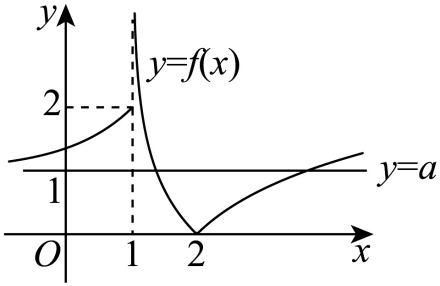
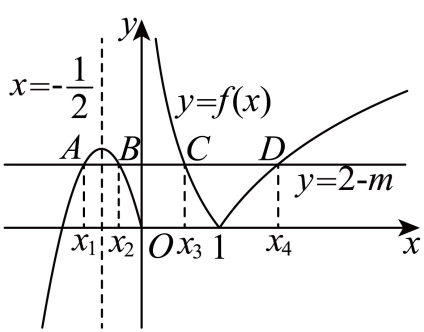

## 讲解

### 判据

题问$P(f(x))=0$的不同实根数，P是可因式分解的低次多项式，或问$f(x)+a=0$有几根。适合先求目标函数值，再数原函数在各高度的合法原像。对未证明结构的任意图，不能凭示意线交点直接下结论。

### 流程

1. 暂记$z=f(x)$，在z层因式分解或求根。保留参数退化情况，列不同实目标值，而不是重复计算代数重根。
2. 在x层求每个分支的值域与各高度的原像数，绝对值最低点、抛物线顶点、开端极限和闭端值均会改变数量，逐档列出。
3. 对每个不同目标值，将各分支合法原像合并。分段公共边界只计一次；若目标值根本不在值域，贡献0。
4. 两个不同目标值的原像互不重合，因为同一输入只有一个输出；目标值相等时整组输入只算一次。用这一点检查参数特殊值。
5. 将各高度档的总数与题问比较，反求参数并回验每个等号端点、0值、目标重合值和递归复制端点。
6. 若题问根的和或积，在已确定的原像分组内用韦达、互倒或对称关系，再保留换元真实范围求所问界。

可以把计数压缩成一个高度表：先记 N(r) 为原函数取值等于 r 的不同输入个数，再记录顶点高度、闭端点高度和不取得的开端极限。高度越过这些临界值时，合法交点数才可能改变；每个临界高度本身也须独立核对，不能用邻近一档替代。

若外层方程只有两个不同目标 u、v，总根数是 N(u)+N(v)，理由是同一输入不可能同时输出两个不同数；若 u=v，总数是 N(u)。把“不同目标”和“不同输入”依次处理后再求参数，才不会把外层二次式的重根误当成新的输入。原例的图提供分支结构，表中开闭端点与数量仍由解析式和输入域确认。

## 例题

### 原题 4-0

> 来源ID HSMA-B1-C4-Dd89ccae7c4aa-P0151；原件 `专题4.5 函数的应用（二）（举一反三讲义）数学人教A版必修第一册（解析版）.docx`；DOCX正文段落 P0151—P0152；答案与详解 P0153—P0160。年份、地区和试题标签沿原资料记载，未独立核实。

**原资料题干与选项：**

【例4】（25-26高三上·安徽·阶段练习）函数

$$f\left( x\right)=\left\{ \begin{aligned}f\left( x-1\right),2<x\le 5\\\left| {2}^{x}-1\right|,x\le 2\end{aligned}\right.$$

，若$f\left( x\right)+a=0$有2个零点，则实数$a$的取值范围为（    ）

A．$\left( -1,0\right)$  B．$\left[ -1,0\right)$  C．$\left( 0,1\right)$  D．$\left( 0,1\right]$

**原资料答案与详解（完整保留，公式转写为LaTeX）：**

【答案】A

【解题思路】将$f\left( x\right)+a=0$有2个零点转化为函数$y=-a$与$y=f\left( x\right)$有2个交点的问题，再数形结合即可求解.

【解答过程】

$$\because f\left( x\right)=\left\{ \begin{aligned}f\left( x-1\right),2<x\le 5\\\left| {2}^{x}-1\right|,x\le 2\end{aligned}\right.$$

，$\therefore y=f\left( x\right)$图象如下：

  

又$f\left( x\right)+a=0$有2个零点相当于$y=-a$与$y=f\left( x\right)$有2个交点，

根据图象可得$0<-a<1$，故$-1<a<0$，

则实数$a$的取值范围为$\left( -1,0\right)$.

故选：A.

**展开解析与核验（依据原详解补足，勘误另标）：**

把$f(x)+a=0$转成水平线$f(x)=r$，其中$r=-a$。基础段$x\le2$上$f(x)=|2^x-1|$：负半轴值域$(0,1)$、0处值0、正段$(0,2]$值域$(0,3]$。递归段$2<x\le5$须反复减1，直到落回$(1,2]$，所以三个复制段$(2,3],(3,4],(4,5]$的值域都是$(1,3]$，不是从0开始复制。

按高度计数：$r<0$无根；$r=0$仅0；$0<r<1$有$x=\log_2(1-r)<0$及$x=\log_2(1+r)\in(0,1)$两根，复制段没有根；$r=1$仅基础段$x=1$（负侧趋近1却不取到，复制段左端不收）；$1<r\le3$基础段一根加三个复制根共4根；$r>3$无根。故恰好两根等价于$0<-a<1$，即$-1<a<0$。

A正确；B加上$a=-1$时只有1根；C、D给$a>0$使水平线在负高度，无根。原图用于看复制结构，端点必须由分段条件核实。

### 原题 4-1

> 来源ID HSMA-B1-C4-Dd89ccae7c4aa-P0161；原件 `专题4.5 函数的应用（二）（举一反三讲义）数学人教A版必修第一册（解析版）.docx`；DOCX正文段落 P0161—P0163；答案与详解 P0164—P0172。年份、地区和试题标签沿原资料记载，未独立核实。

**原资料题干与选项：**

【变式4-1】（24-25高一上·广东清远·期末）已知函数

$$f\left( x\right)=\left\{ \begin{aligned}{e}^{x-1}+1,x\le 1\\\left| \ln \left( x-1\right)\right|,x>1\end{aligned}\right.$$

，若关于$x$的方程$2{\left[ f\left( x\right)\right]}^{2}-\left( 2a+5\right)f\left( x\right)+5a=0$有5个不同的实数根，则实数$a$的取值范围为（   ）

A．$\left( 0,1\right]\cup \left( 2,+\infty \right)$  B．$\left( 1,2\right)$

C．$\left( 0,1\right)\cup \left( 2,+\infty \right)$  D．$\left( 1,2\right]$

**原资料答案与详解（完整保留，公式转写为LaTeX）：**

【答案】D

【解题思路】因为$2{\left[ f\left( x\right)\right]}^{2}-\left( 2a+5\right)f\left( x\right)+5a=0$，所以$f\left( x\right)=\frac{5}{2}$或$f\left( x\right)=a,$只需$f\left( x\right)$的图象与直线$y=a$有3个交点，利用数形结合即可得

【解答过程】因为$2{\left[ f\left( x\right)\right]}^{2}-\left( 2a+5\right)f\left( x\right)+5a=0$，所以$f\left( x\right)=\frac{5}{2}$或$f\left( x\right)=a,$

因为关于$x$的方程$2{\left[ f\left( x\right)\right]}^{2}-\left( 2a+5\right)f\left( x\right)+5a=0$共有5个不同的实数根．

所以$f\left( x\right)$的图象与直线$y=\frac{5}{2}$和直线$y=a$共有5个不同的交点．

如图，$f\left( x\right)$的图象与直线$y=\frac{5}{2}$有2个交点，

所以只需$f\left( x\right)$的图象与直线$y=a$有3个交点，所以$a\in \left( 1,2\right]$．

故选：D．

**展开解析与核验（依据原详解补足，勘误另标）：**

令$z=f(x)$，原方程因式分解：
$$2z^2-(2a+5)z+5a=(2z-5)(z-a)=0.$$
目标值是$5/2$和$a$；两值相同须合并，不能按代数重数重复算输入。

左支$x\le1$，$e^{x-1}+1$严格递增，值域$(1,2]$；右支$x>1$，令$t=x-1>0$，$|\ln t|$的最小值0在$t=1$取得，任何正高度有$t=e^r,e^{-r}$两点。所以同一高度r的原像数：$r<0$为0；$r=0$为1；$0<r\le1$为2；$1<r\le2$为3；$r>2$为2。

$5/2$提供2根。要总计5个不同输入，$a$须提供3根且不同于$5/2$，恰为$1<a\le2$。D正确；A、C将参数放在$(0,1]$或$(2,+\infty)$等档，此时高度a一般只有2个原像，无法总计5个；B的$(1,2)$漏合法端点2。若$a=5/2$，两目标值重合，仅2根。

### 原题 4-2

> 来源ID HSMA-B1-C4-Dd89ccae7c4aa-P0173；原件 `专题4.5 函数的应用（二）（举一反三讲义）数学人教A版必修第一册（解析版）.docx`；DOCX正文段落 P0173—P0174；答案与详解 P0175—P0187。年份、地区和试题标签沿原资料记载，未独立核实。

**原资料题干与选项：**

【变式4-2】（24-25高一上·北京密云·期末）已知函数

$$f(x)=\left\{ \begin{aligned}|{\log }_{2}x|,x>0,\\-4{x}^{2}-4x,x\le 0,\end{aligned}\right.$$

函数$g(x)=f(x)+m-2$．若$g(x)$有四个不同的零点${x}_{1},{x}_{2},{x}_{3},{x}_{4}$，则${x}_{1}+{x}_{2}+{x}_{3}+{x}_{4}$的取值范围为（   ）

A．$(1,\frac{3}{2})$   B．$(1,2)$  C．$(\frac{3}{2},2)$  D．$(2,+\infty )$

**原资料答案与详解（完整保留，公式转写为LaTeX）：**

【答案】A

【解题思路】利用函数与方程的思想，将$g(x)$有四个不同的零点转化为函数$y=f(x)$与$y=2-m$有四个不同的交点$A,B,C,D$，作出图象，求得$m\in (1,2)$，利用对称性得${x}_{1}+{x}_{2}=-1$，根据函数$|{\log }_{2}x|$的图象特征可得${x}_{3}{x}_{4}=1$，$\frac{1}{2}<{x}_{3}<1$，借助于对勾函数的单调性即可求得${x}_{1}+{x}_{2}+{x}_{3}+{x}_{4}$的取值范围.

【解答过程】

由函数$g(x)=f(x)+m-2$有四个不同的零点${x}_{1},{x}_{2},{x}_{3},{x}_{4}$，可知函数$y=f(x)$与$y=2-m$有四个不同的交点$A,B,C,D$，

设这四个交点的横坐标从小到大依次为${x}_{1},{x}_{2},{x}_{3},{x}_{4}$，如图所示，则$0<2-m<1$，可得$m\in (1,2)$，

因点$A,B$关于直线$x=-\frac{1}{2}$对称，故${x}_{1}+{x}_{2}=-1$；

由$0<{y}_{C}={y}_{D}<1$可得$0<-{\log }_{2}{x}_{3}={\log }_{2}{x}_{4}<1$，

则有$\frac{1}{2}<{x}_{3}<1$，且${\log }_{2}{x}_{3}+{\log }_{2}{x}_{4}={\log }_{2}({x}_{3}{x}_{4})=0$，即得${x}_{3}{x}_{4}=1$，

于是，${x}_{1}+{x}_{2}+{x}_{3}+{x}_{4}=-1+{x}_{3}+\frac{1}{{x}_{3}}$，

因函数$y=x+\frac{1}{x}$在$(\frac{1}{2},1)$上单调递减，故可得$2<{x}_{3}+\frac{1}{{x}_{3}}<\frac{5}{2}$，

则${x}_{1}+{x}_{2}+{x}_{3}+{x}_{4}$的取值范围为$(1, \frac{3}{2})$.

故选：A.

**展开解析与核验（依据原详解补足，勘误另标）：**

令$r=2-m$，原方程等价于$f(x)=r$。负及零支
$$-4x^2-4x=1-4(x+1/2)^2,\quad x\le0,$$
最高值1在−1/2取得。正支$|\log_2x|$在$x=1$取最小值0，任何正高度有$x=2^{-r},2^r$两点。

逐档计数：$r<0$负支1根、正支0根，共1；$r=0$负支−1、0两根加正支1，共3；$0<r<1$两支各2根共4；$r=1$负支顶点1根加正支2，共3；$r>1$负支0根加正支2，共2。于是四根条件是$0<r<1$，即$1<m<2$。

四根中负支两根由韦达定理和为−1，正支两根互为倒数。令$t=2^{-r}\in(1/2,1)$，所求和$S=-1+t+1/t$。若$1/2<u<v<1$，$(v+1/v)-(u+1/u)=(v-u)(1-1/(uv))<0$，故$S$严格递减，连续映射整个开区间得到$1<S<3/2$，两端均不取。A正确；B、C、D均不符合所得端点。

## 易错

每条水平线有几根凭图猜；目标重合仍相加；复制区间左开右闭被忽略；变形后忘记f的合法输入。
