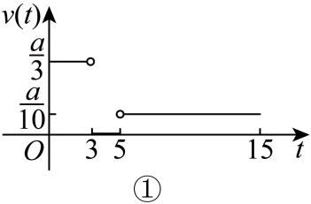
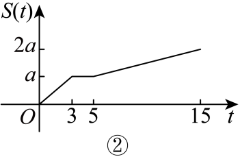
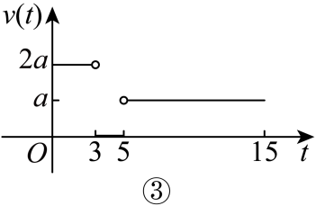
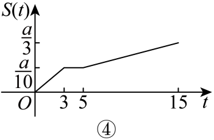

## 讲解

### 判据

题目按若干段匀速行进和停留，求累计路程与自出发时间的关系。累计量从前段终值继续增长，本段只使用本段经过时间；后续段不能再次把总时间当成本段时长。

### 流程

1. **明确所求量和计时起点。**$t$是自出发计时，$S(t)$是累计行进路程。它不同于距出发地的距离和带方向的位移：返程时累计路程继续增加，距出发地的距离却可能减小。
2. **列每段起止时刻与速率。**由本段距离除本段持续时间求速率$v$，单位应与$t$一致。停留段为0；若所画的是速率，返程仍非负，不能因方向相反改负。
3. **从本段起点建立公式。**起点时刻$t_0$、起点累计值$S_0$，本段经过时间为$t-t_0$。由匀速路程公式得到

   $$S(t)=S_0+v(t-t_0).$$

   只有从0时刻和0路程开始的第一段，才能直接写$vt$。停留时公式保持为$S_0$。
4. **前段终值接到后段。**将每段终点代入，结果成为下一段起点值。累计路程在理想瞬时变速处不会突然跳跃；速率却可以按题设切换。
5. **用图象和总量双重核对。**每段斜率为该段速率，停留段水平；最终累计路程等于各行进段距离之和。往返同一路线的原题终值是两倍单程距离，不能读成回到原点就为0。

若每段并非匀速，又没有足够信息确定行进规律，本条的常速乘时间公式不能直接使用。

## 例题

### 原题 P0049

> 来源ID HSMA-B1-C3-D68c0d5655331-P0049；原件 `第三章 函数的概念与性质（举一反三单元测试·培优卷）数学人教A版必修第一册（解析版）.docx`；DOCX正文段落 P0049—P0052；答案与详解 P0053—P0058。年份、地区和试题标签沿原资料记载，未独立核实。

**原资料题干与选项：**

5．（5分）（24-25高一上·江苏南京·期中）学校宿舍与办公室相距$am$.某同学有重要材料要送交给老师，从宿舍出发，先匀速跑步$3\min $来到办公室，停留$2\min $，然后匀速步行$10\min $返回宿含.在这个过程中，这位同学行进的速度$v\left( t\right)$和行走的路程$S\left( t\right)$都是时间$t$的函数，则速度函数和路程函数的示意图分别是下面四个图象中的（    ）

        

        

A．①②  B．③④  C．①④  D．②③

**原资料答案与详解（完整保留，公式转写为LaTeX）：**

【答案】A

【解题思路】根据题意写出函数解析式，利用解析式即可得出图象.

【解答过程】设行进的速度为 $v$m/min，行走的路程为S m，

则

$$v=\left\{ \begin{aligned}\frac{a}{3},0<t<3\\0,3\le t\le 5\\\frac{a}{10},5<t\le 15\end{aligned}\right.$$

，且

$$S=\left\{ \begin{aligned}\frac{a}{3}t,0<t<3\\a,3\le t\le 5\\a+\frac{at}{10},5<t\le 15\end{aligned}\right.$$

，

由速度函数及路程函数的解析式可知，其图象分别为①②.

故选：A.

**展开解析与核验（依据原详解补足，勘误另标）：**

按题中图与原解，v表示行进速率，返程仍取非负大小；S表示累计路程，不是到宿舍的距离。正距离$a>0$，去程每分钟$a/3$，停留为0，返程每分钟$a/10$，故速度图①。累计量去程从0增到a，停留保持a，返程再增加a，到15分钟为2a，图②。A①②正确；B的③返程速率大于去程且④累计终值不合；C的④累计终值和第一段都不合；D的②纵轴是S、③也不是符合数据的速率图。

**原路程解析式勘误：** 原末段写$a+at/10$，把自出发的总时间t当作返程持续时间。返程在5分钟开始，应为$a+(a/10)(t-5)$；这样在5分钟接a，在15分钟得2a，与原图②一致。写原速度的切换点归属时沿原理想分段约定；累计路程则在接点唯一且连续，正确模型可写
$$S(t)=\begin{cases}(a/3)t,&0\le t\le3,\\a,&3<t\le5,\\a+(a/10)(t-5),&5<t\le15.\end{cases}$$
这项纠正不改变原选择答案，不把原错误公式静默换掉。

## 易错

- 用总时间$t$计算返程，会多算返程开始前的时间；应减去返程起点时刻。
- 累计路程、离出发地的距离与位移不是同一个输出，图象的升降先由量的定义判断。
- 切换点的速率归属按题设约定；累计路程的接缝应符合已走路程，不能凭任选公式制造跳跃。
