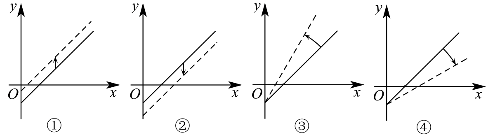

## 讲解

### 判据

每增加一个单位输入，输出就增加或减少固定数量；或者题设用固定单价收入减固定支出。这时可建立一次模型$y=kx+b$。如果单位变化率本身随输入改变，就不能凭两个数据拟合成功而断言全程都是一次关系。

### 流程

1. **标明量、单位和基准。**$k$表示每单位输入引起的输出变化，单位为“输出单位/输入单位”；$b$表示零输入时模型输出。零输入不一定实际允许，截距仍可作为表达式的固定项解释。
2. **先从数量关系写式。**剩余量＝初始量−已消耗量；收支差额＝单价×数量−固定支出。初始量进入常数项，单位变化量进入$x$的系数，不把起购数量误作单价。
3. **数据定参时使用两个不同输入。**由两式相减，得到

   $$k=\frac{y_2-y_1}{x_2-x_1},\qquad b=y_1-kx_1.$$

   相减消去$b$，除以非零输入差才得到单位变化率。其余数据还需代回核验。
4. **同时写实际范围。**最低采购量、现金上限、输入非负及整数性分别来自相应条件。“不少于”“不超过”允许等号；质量等连续量与人数等离散量不能混同。
5. **参数变化分别解释。**保持单价而减少固定支出，斜率不变、负截距上移；保持支出而提高单价，截距不变、斜率增大。判断图象来自式中哪个量变化，不能靠示意直线角度猜具体数值。

最后用原数量和单位回答，确认模型的最优点或端点确实属于允许范围。

## 例题

### 原题 1-0

> 来源ID HSMA-B1-C3-D9d1c86634e46-P0023；原件 `专题3.5 函数的应用（一）（举一反三讲义）数学人教A版必修第一册（解析版）.docx`；DOCX正文段落 P0023—P0027；答案与详解 P0028—P0033。年份、地区和试题标签沿原资料记载，未独立核实。

**原资料题干与选项：**

【例1】（24-25高一上·北京·期中）果蔬批发市场批发某种水果，不少于$100$千克时，批发价为每千克$2.5$元，小王携带现金3000元到市场采购这种水果，并以此批发价买进，如果购买的水果为$x$千克，小王付款后剩余现金为$y$元，则$x$与$y$之间的函数关系为（    ）

A．$y=3000-100x   (100<x<1200)$

B．$y=3000-100x   (100\le x\le 1200)$

C．$y=3000-2.5x   (100\le x\le 1200)$

D．$y=3000-2.5x   (100<x<1200)$

**原资料答案与详解（完整保留，公式转写为LaTeX）：**

【答案】C

【解题思路】根据题意，直接列式，根据题意求x的最小值和最大值，得到x的取值范围.

【解答过程】由题意可知函数关系式是$y=3000-2.5x$，

由题意可知最少买$100$千克，最多买$\frac{3000}{2.5}=1200$千克，所以函数的定义域是$\left[ 100,1200\right]$.

故$y=3000-2.5x$；$x\in \left[ 100,1200\right]$

故选:C.

**展开解析与核验（依据原详解补足，勘误另标）：**

单价2.5元/千克乘质量x千克，购买费用是2.5x元；剩余现金为$y=3000-2.5x$。享用该批发价要求$x\ge100$，现金足够要求$3000-2.5x\ge0$即$x\le1200$。质量可按连续量，两个端点都允许：买100千克符合“不少于”，买1200千克后剩0元也合法。因此C正确。A、B把100千克的起购量当作元/千克单价，计量及公式都错；D的式对但漏两个合法端点。

### 原题 1-3

> 来源ID HSMA-B1-C3-D9d1c86634e46-P0076；原件 `专题3.5 函数的应用（一）（举一反三讲义）数学人教A版必修第一册（解析版）.docx`；DOCX正文段落 P0076—P0081；答案与详解 P0082—P0089。年份、地区和试题标签沿原资料记载，未独立核实。

**原资料题干与选项：**

【变式1-3】（2025高一·全国·专题练习）南通至通州的某条公共汽车线路收支差额y与乘客量x的函数关系如图所示（收支差额＝车票收入一支出费用）．由于目前本条线路亏损，公司有关人员提出了两条建议：建议（Ⅰ）不改变车票价格，减少支出费用；建议（Ⅱ）不改变支出费用，提高车票价格．下面给出的四个图形中，实线虚线分别表示目前和建议后的函数关系，则（    ）

A．①反映了建议（Ⅰ），②反映了建议（Ⅱ）

B．②反映了建议（Ⅰ），④反映了建议（Ⅱ）

C．①反映了建议（Ⅰ），③反映了建议（Ⅱ）

D．④反映了建议（Ⅰ），②反映了建议（Ⅱ）

**原资料答案与详解（完整保留，公式转写为LaTeX）：**

【答案】C

【解题思路】根据题意，利用一次函数的性质判断不同方案下参数的变化对图象的影响，即可确定正确选项.

【解答过程】设目前车票价格为${k}_{1}$，支出费用为${b}_{1}$，则$y={k}_{1}x-{b}_{1}$，

对于建议（I），设建议后的支出费用为${b}_{2}$（${b}_{2}$＜${b}_{1}$），则$y={k}_{1}x-{b}_{2}$，

显然建议后，直线斜率不变，在y轴上的截距变大，故图象①反映了建议（I）；

对于建议（II），设建议后的车票价格为${k}_{2}$（${k}_{2}$＞${k}_{1}$），则$y={k}_{2}x-{b}_{1}$，

显然建议后，直线斜率变大，在y轴上的截距不变，故图象③反映了建议（II）．

故选：C．

**展开解析与核验（依据原详解补足，勘误另标）：**

设原单价k、支出B，则$y=kx-B$。建议Ⅰ保持k，支出改为$B'<B$，同一x下新差额比原差额增加$B-B'>0$；故斜率相同且整条直线向上，原图①符合，②向下不符合。建议Ⅱ保持B、改$k'>k$，两线截距同为−B，新直线在正x侧更陡、输出更大；图③符合，④方向相反不符合。

A的第二图②不符合Ⅱ；B两图②④都错；C给①③，正确；D的Ⅰ图④与Ⅱ图②均不符。图象结论来自式中固定与改变的参数，不凭画线角度猜新的具体价格。

## 易错

- 起购100千克约束输入，2.5元/千克才是费用系数；二者单位不同，不能交换。
- 花尽现金仍可合法，若题目没有要求留下余额，不应排除剩余0元的边界。
- 减少固定支出使负截距变大；提高单价改变斜率。先说明保持不变的量，再判断图象。
