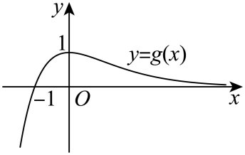

## 错法

从 aU(x)+V(x)=0直接除 U；从指数方程直接写1/a；在不等式中除一个尚不知道正负的式子，沿用原不等号。常因追求一个整齐的固定函数，忘了等价变形的条件。

## 正解

除法前列出分母为0的支：U=0且V=0的点是固定根，U=0但V≠0不是根。非零支才能分离为 a=−V/U。除参数也先检参数0是否原题允许；原题明确 a>0才可直接进入倒数变换。

分段原例 x=0对所有k都是零点，随后在负半轴x<0除x是合法的，但不能将先登记的0丢掉。负半轴所得根还须<0；正半轴得到的范围也须按x>0研究。方程除一个非零负数不改变等式；不等式除负数却须反号，二者不能混同。

分离为倒数或对数高度后，还原参数范围时依据该变换的单调性。只有每一步可逆且保留原定义域，才可以用所得交点数替代原方程根数。

知识与分类依据：`HSMA-B4-C5-Dee15d199b365-P0015-P0022`（《专题5.4 导数在研究函数中的应用【八大题型】（举一反三）（人教A版2019选择性必修第二册）（解析版）.docx》）。原资料口径、补条件与勘误分别说明。

## 例题

### 原例：分段函数三零点与必有的零点

来源：`HSMA-B4-C5-Dee15d199b365-P0111-P0122`；原件《专题5.4 导数在研究函数中的应用【八大题型】（举一反三）（人教A版2019选择性必修第二册）（解析版）.docx》。题号、学年及地区按讲义原标注，未另作来源核验。

以下完整保留原题、原答案与原详解（仅统一等价公式排版及配图路径）：

【例2】（23-24高三上·天津·期中）已知函数$f\left( x\right)=\left\{ \begin{aligned}-{x}^{2}+\frac{1}{2}x,x<0\\\ln \left( x+1\right),x\ge 0\end{aligned}\right.$，若函数$y=f\left( x\right)-kx$有且只有3个零点，则实数$k$的取值范围为（    ）

A．$\left( 0,\frac{1}{2}\right)$  B．$\left( \frac{1}{2},1\right)$  C．$\left( 1,+\infty \right)$  D．$\left( \frac{1}{4},1\right)$

【解题思路】根据题意，得到$x=0$是$y=f\left( x\right)-kx$的一个零点，转化为$x>0$和$x<0$时，分别有一个零点，分类讨论，结合二次函数的性质，以及利用导数的几何意义，即可求解.

【解答过程】解：由函数$f\left( x\right)=\left\{ \begin{aligned}-{x}^{2}+\frac{1}{2}x,x<0\\\ln \left( x+1\right),x\ge 0\end{aligned}\right.$，若$y=f\left( x\right)-kx$有且只有3个零点，

当$x=0$时，可得$f\left( 0\right)=\ln 1=0$，可得$x=0$是$y=f\left( x\right)-kx$的一个零点，

当$x<0$时，由$-{x}^{2}+\frac{1}{2}x=kx$，可得$x=\frac{1}{2}-k<0$，解得$k>\frac{1}{2}$；

当$x>0$时，$f\left( x\right)=\ln \left( x+1\right)$，可得${f}^{\prime }\left( x\right)=\frac{1}{x+1}$，可得${f}^{\prime }\left( 0\right)=1$，

要使得函数$y=f\left( x\right)-kx$在$x>0$上有一个零点，

即函数$y=f\left( x\right)$与$y=kx$的图象有一个公共点，则满足$0<k<1$，

综上可得：$\frac{1}{2}<k<1$，即函数$f\left( x\right)-kx$有三个零点时，实数$k$的范围为$(\frac{1}{2},1)$

故选：B.

#### 补充讲解

x=0属于右段且 f(0)−k·0=0，对每个 k 都是一个不同零点。先单独登记它，再处理两侧，才不会因除 x 丢根。

负半轴原式 −x²+(1/2−k)x=0 可写成 x(−x+1/2−k)=0。这里 x<0，故只能取 x=1/2−k；严格落在负半轴等价于 k>1/2。k=1/2时这个代数根回到0，不能再计一次。

正半轴令 H(x)=ln(1+x)−kx。若 k≤0，H'(x)=1/(1+x)−k>0且 H(0)=0，所以没有正零点；若 k≥1，则 x>0时 H'<0，也没有正零点。若 0<k<1，H'先正后负，先从0升为正，随后 H(x)→−∞，所以下降支恰有一个正零点。也可令 h(x)=ln(1+x)/x，证明其严格下降且值域为 (0,1)。于是需要 k>1/2与0<k<1同时成立，答案 B。端点 k=1并不因直线在0相切就出现额外正零点。

### 原例：指数函数零点的参数分界与相切

来源：`HSMA-B4-C5-Dee15d199b365-P0076-P0109`；原件《专题5.4 导数在研究函数中的应用【八大题型】（举一反三）（人教A版2019选择性必修第二册）（解析版）.docx》。题号、学年及地区按讲义原标注，未另作来源核验。

以下完整保留原题、原答案与原详解（仅统一等价公式排版及配图路径）：

【变式1-3】（24-25高三上·福建福州·阶段练习）已知函数$f(x)={e}^{x}-a(x+1),a\in R$．

(1)讨论$f\left( x\right)$的单调性；

(2)若$a=1$，求曲线$f\left( x\right)$在$x=1$处的切线方程；

(3)当$a>0$时，试讨论函数$f\left( x\right)$的零点个数．

【解题思路】（1）分$a\le 0$，$a>0$两种情况，讨论${f}^{\prime }(x)$的正负性可得$f\left( x\right)$单调性；

（2）由题可得：${f}^{\prime }(1)=e-1,f(1)=e-2$，后由点斜式可得切线方程；

（3）将$f(x)$的零点个数可看作直线$y=\frac{1}{a}$与曲线$y=\frac{x+1}{{e}^{x}}$的交点个数，后由导数知识研究函数

$g(x)=\frac{x+1}{{e}^{x}}$的单调性，画出$g(x)$的大致图象，即可得答案；

【解答过程】（1）${f}^{\prime }(x)={e}^{x}-a$，

当$a\le 0$时，${f}^{\prime }(x)>0$恒成立，故$f(x)$在$R$上单调递增，

当$a>0$时，令${f}^{\prime }(x)=0$，解得$x=\ln a$，

所以当$x\in (\ln a,+\infty )$时，${f}^{\prime }(x)>0,f(x)$单调递增；

当$x\in (-\infty ,\ln a)$时，${f}^{\prime }(x)<0,f(x)$单调递减；

综上，当$a\le 0$时，$f(x)$在$R$上单调递增；

当$a>0$时，$f(x)$在$(\ln a,+\infty )$上单调递增，在$(-\infty ,\ln a)$上单调递减；

（2）由$a=1$，则$f(x)={e}^{x}-(x+1)$，得${f}^{\prime }(x)={e}^{x}-1$，

曲线$f(x)$在$x=1$处的切线的斜率为${f}^{\prime }(1)=e-1,f(1)=e-2$

故曲线$f(x)$在$x=1$处的切线的方程为$y-e+2=(e-1)(x-1)$，

即$(e-1)x-y-1=0$；

（3）由于$f(x)=0$，即${e}^{x}-a(x+1)=0,\therefore \frac{1}{a}=\frac{x+1}{{e}^{x}}$，

即$f(x)$的零点个数可看作直线$y=\frac{1}{a}$与曲线$y=\frac{x+1}{{e}^{x}}$的交点个数问题；

令$g(x)=\frac{x+1}{{e}^{x}}$，则${g}^{\prime }(x)=\frac{-x}{{e}^{x}}$，

当$x<0$时，${g}^{\prime }(x)>0,g(x)$在$(-\infty ,0)$上单调递增，

当$x>0$时，${g}^{\prime }(x)<0,g(x)$在$(0,+\infty )$上单调递减，

故$g{(x)}_{\max }=g(0)=1$，

当$x<-1$时，$g(x)<0$，当$x>-1$时，$g(x)>0$，

当$x$趋向于负无穷时，$g\left( x\right)$趋向于负无穷，当$x$趋向于正无穷时，$g\left( x\right)$趋向于$0$，

作出函数$g\left( x\right)$的图象如图：

当$0<\frac{1}{a}<1$，即$a>1$时，直线$y=\frac{1}{a}$与曲线$y=\frac{x+1}{{e}^{x}}$中的有$2$个交点，

当$\frac{1}{a}=1$，即$a=1$时，直线$y=\frac{1}{a}$与曲线$y=\frac{x+1}{{e}^{x}}$的有$1$个交点，

当$\frac{1}{a}>1$，即$0<a<1$时，直线$y=\frac{1}{a}$与曲线$y=\frac{x+1}{{e}^{x}}$中的无交点，

故$a>1$时，函数$f(x)$的零点个数是$2$；$a=1$时，函数$f(x)$的零点个数是$1$；

$0<a<1$时，函数$f(x)$的零点个数是$0$；

#### 补充讲解

三个小问都保留。第一问由 eˣ>0，a≤0时导数恒正；a>0时，eˣ=a 的唯一解是 ln a，左负右正。第二问切点是 (1,e−2)，斜率是 e−1，故 y−(e−2)=(e−1)(x−1)，展开才得原直线。

第三问已明确 a>0，才能除 a；eˣ 永不为0。因此 f(x)=0 与 1/a=(x+1)e⁻ˣ 完全等价。g 的正值部分在 (−1,0] 从0升至1，在 [0,+∞) 从1降向0；右侧只趋近0，并不取得0。水平线 1/a>0 恰有两交点、一个交点、无交点，分别对应 a>1、a=1、0<a<1。原图表达趋势，存在与唯一的根据仍是连续性和严格单调性。

a=1时 f(0)=f'(0)=0，图像在原点相切，仍只有一个不同零点。若扩看第一问的 a=0支，原方程是 eˣ=0，无解，不能沿用 1/a。a<0时 f 严格递增，左端趋向−∞、右端趋向+∞，另有一个零点；这属于补充边界，第三问原答案的范围不包含这一支。
