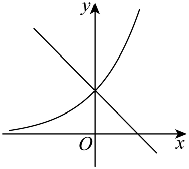
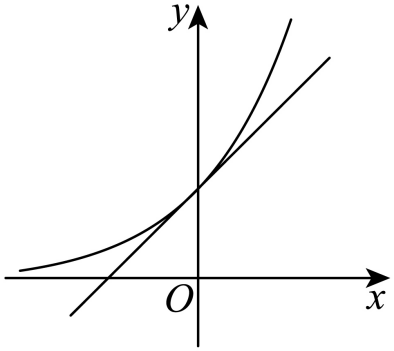
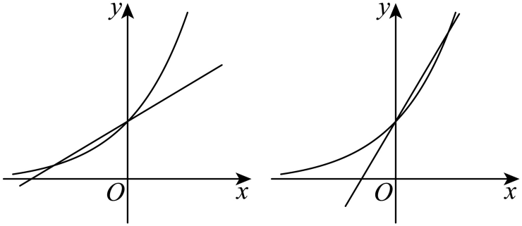

## 错法

解f''=0后每个根都计拐点；把题内特殊定义推广成一般定义；声称不可导就必须改变函数使可导才能研究原曲线。

## 正解

这是拓展，考试可用。通常拐点看连续图像在该点两侧凹凸转变。若可用二阶导数判凹凸，先列零点及必要的二阶不可导候选，再核两侧符号。偶数重根可能不变号；二阶为0不是普遍充分条件。题干若另外约定“f''=0叫拐点”，只按该题内部口径执行并注明区别。

原完整例题f''=12x²(x+1)的0在两侧同正，没有通常拐点；−1处变号，有拐点。第二问a=1时eˣ−x−1仅0处为0且两侧均正，也没有通常拐点。这些实际原题已提供边界反例。改函数改变了研究对象，不能声称原题已解决；中心对称也须另证恒等式，不能由二阶零点对任何函数外推。

## 例题

### 原例：HSMA-B4-C5-Db4e8ed8c42a8-P1129–P1155

**原题、原答案、原思路与原详解**（原次序保留，仅作等价符号及原图路径规范）：

39．（23-24高二下·河北邢台·期末）设函数$f(x)$的导函数为${f}^{\prime}\left( x\right)$，${f}^{\prime}\left( x\right)$的导函数为${f}^{\prime\prime}\left( x\right)$，${f}^{\prime\prime}\left( x\right)$的导函数为${f}^{\prime\prime\prime}\left( x\right)$．若${f}^{\prime\prime}\left( {x}_{0}\right)=0$，且${f}^{\prime\prime\prime}\left( {x}_{0}\right)\ne 0$，则点$\left( {x}_{0},f\left( {x}_{0}\right)\right)$为曲线$y=f(x)$的拐点．

(1)已知函数$f(x)=\frac{3}{5}{x}^{5}+{x}^{4}$，求曲线$y=f(x)$的拐点；

(2)已知函数$g(x)={e}^{x}-\frac{1}{6}a{x}^{3}-\frac{1}{2}{x}^{2}$，讨论曲线$y=g(x)$的拐点个数．

【解题思路】（1）根据拐点的定义求解即可；、

（2）对函数二次求导后，可知${g}^{\prime\prime}(0)=0$，由${g}^{\prime\prime}(x)=0$可得${g}^{\prime\prime}\left( x\right)$的零点个数等于函数$h(x)={e}^{x}$的图象与直线$y=ax+1$的交点个数，函数$h(x)={e}^{x}$的图象与直线$y=ax+1$均经过点$(0,1)$，然后按$a\le 0$，$a=1$和$0<a<1$或$a>1$分析讨论即可.

【解答过程】（1）由题意得${f}^{\prime}\left( x\right)=3{x}^{4}+4{x}^{3}$，${f}^{\prime\prime}(x)=12{x}^{3}+12{x}^{2}$，${f}^{\prime\prime\prime}(x)=36{x}^{2}+24x$．

由${f}^{\prime\prime}(x)=12{x}^{3}+12{x}^{2}=0$，得$x=0$或$-1$．

因为${f}^{\prime\prime\prime}(0)=0$，${f}^{\prime\prime\prime}(-1)=12\ne 0$，$f(-1)=\frac{2}{5}$，

所以点$\left( -1,\frac{2}{5}\right)$为曲线$y=f(x)$的拐点．

（2）由题意得${g}^{\prime}(x)={e}^{x}-\frac{1}{2}a{x}^{2}-x$，${g}^{\prime\prime}(x)={e}^{x}-ax-1$，${g}^{\prime\prime\prime}(x)={e}^{x}-a$．易得${g}^{\prime\prime}(0)=0$．

令${g}^{\prime\prime}(x)={e}^{x}-ax-1=0$，得${e}^{x}=ax+1$，则${g}^{\prime\prime}\left( x\right)$的零点个数等于函数$h(x)={e}^{x}$的图象与直线$y=ax+1$的交点个数，

易知函数$h(x)={e}^{x}$的图象与直线$y=ax+1$均经过点$(0,1)$．

①如图，当$a\le 0$时，函数$h(x)={e}^{x}$的图象与直线$y=ax+1$只有一个交点$(0,1)$，

因为${g}^{\prime\prime}(0)=0$，${g}^{\prime\prime\prime}(0)=1-a>0$，所以点$\left( 0,g(0)\right)$为曲线$y=g(x)$的拐点．

②如图，当$a=1$时，直线$y=ax+1$与函数$h(x)={e}^{x}$的图象相切，只有一个交点$(0,1)$，

因为${g}^{\prime\prime}(0)=0$，${g}^{\prime\prime\prime}(0)=0$，所以曲线$y=g(x)$没有拐点．

③如图，当$0<a<1$或$a>1$时，直线$y=ax+1$与函数$h(x)={e}^{x}$的图象有两个交点，其中一个交点为$(0,1)$，

设另外一个交点的横坐标为${x}_{0}\left( {x}_{0}\ne 0\right)$，则${e}^{{x}_{0}}=a{x}_{0}+1$，即$a=\frac{{e}^{{x}_{0}}-1}{{x}_{0}}$．

${g}^{\prime\prime}(0)=0$，${g}^{\prime\prime\prime}(0)=1-a\ne 0$，所以点$(0,g(0))$为曲线$y=g(x)$的拐点．

${g}^{\prime\prime}\left( {x}_{0}\right)=0$，${g}^{\prime\prime\prime}\left( {x}_{0}\right)={e}^{{x}_{0}}-a={e}^{{x}_{0}}-\frac{{e}^{{x}_{0}}-1}{{x}_{0}}=\frac{\left( {x}_{0}-1\right){e}^{{x}_{0}}+1}{{x}_{0}}$，

设函数$u(x)=(x-1){e}^{x}+1$，则${u}^{\prime}(x)=x{e}^{x}$，当$x<0$时，${u}^{\prime}(x)<0$，$u(x)$单调递减，

当$x>0$时，${u}^{\prime}(x)>0$，$u(x)$单调递增，

则$u(x)\ge u(0)=0$，得$\left( {x}_{0}-1\right){e}^{{x}_{0}}+1>0$，即${g}^{\prime\prime\prime}\left( {x}_{0}\right)=\frac{\left( {x}_{0}-1\right){e}^{{x}_{0}}+1}{{x}_{0}}\ne 0$，

所以点$\left( {x}_{0},g\left( {x}_{0}\right)\right)$为曲线$y=g(x)$的拐点．

综上所述，当$a\le 0$时，曲线$y=g(x)$的拐点个数为1；当$a=1$时，曲线$y=g(x)$的拐点个数为0；当$0<a<1$或$a>1$时，曲线$y=g(x)$的拐点个数为2．

**补讲与核验**

这是拓展，考试可用。本题第一问的f''=12x²(x+1)，候选0、−1。0两侧x²>0且x+1>0，f''同为正，凹凸没有转变，不能因为二阶导数为0就称通常意义的拐点。−1两侧x²>0而x+1变号，确有凹凸转变，函数值f(−1)=−3/5+1=2/5。

第二问令h=g''=eˣ−ax−1，h'=eˣ−a。a≤0时h严格增，h(0)=0为唯一简单根，g''变号，恰一个拐点。a=1时h≥0且仅0处为0，左右不变号，没有拐点。a>0且a≠1时h在ln a取唯一最小值a−a ln a−1<0，左右端都正，恰有两简单根，各处变号，故两拐点。最小值严格小于0可由k(a)=a−a ln a−1导数−ln a及k(1)=0说明。第二问实际按凹凸转变判断，而非凡h=0都计点。

这些分类及第一问的两个零点符号，已由主侧一般证明和附核执行；本组完整读回原解并复用该项，不计新测试。图只帮助展示已证明的符号，不能用三幅示意图代替全参数分类。

## 资料疑点与勘误

资料P0039–P0049关于不光滑、多个极值和调整函数使可导的描述条件不足，原概述全文在《知识-二阶导数拐点与三次函数中心对称》的资料疑点段保留。本卡按原函数凹凸变化解释，不用改函数后的结论替代原题。

## 来源

原件：专题5.8 极值点偏移与拐点偏移必考七类问题（举一反三）（人教A版2019选择性必修第二册）（解析版）.docx。

知识与分类口径：HSMA-B4-C5-Db4e8ed8c42a8-P0033–P0049；完整原例定位见各例。

原件：专题5.8 极值点偏移与拐点偏移必考七类问题（举一反三）（人教A版2019选择性必修第二册）（解析版）.docx。

知识与分类口径：HSMA-B4-C5-Db4e8ed8c42a8-P1129–P1155；完整原例定位见各例。
